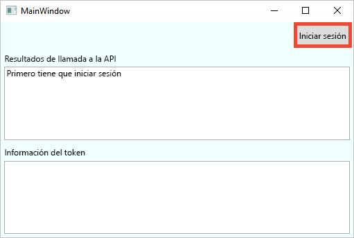
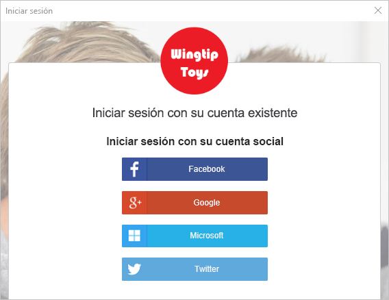

# <a name="quickstart-set-up-sign-in-for-a-desktop-app-using-azure-active-directory-b2c"></a>Guía de inicio rápido: Configuración del inicio de sesión en una aplicación de escritorio mediante Azure Active Directory B2C 

Azure Active Directory (Azure AD) B2C proporciona administración de identidades en la nube para mantener la protección de su aplicación, empresa y clientes. Azure AD B2C permite que las aplicaciones puedan autenticarse con cuentas de redes sociales y cuentas de empresa mediante protocolos estándar abiertos.

En esta guía de inicio rápido, se utiliza una aplicación de escritorio de Windows Presentation Foundation (WPF) de ejemplo habilitada para Azure AD B2C para iniciar sesión mediante un proveedor de identidades de redes sociales y llamar a una API web protegida por Azure AD B2C.

[!INCLUDE [quickstarts-free-trial-note](../../includes/quickstarts-free-trial-note.md)]

## <a name="prerequisites"></a>requisitos previos

* [Visual Studio 2017](https://www.visualstudio.com/downloads/) con la carga de trabajo de **ASP.NET y desarrollo web**. 
* Una cuenta de redes sociales de Facebook, Google, Microsoft o Twitter.

## <a name="download-the-sample"></a>Descarga del ejemplo

[Descargue un archivo zip](https://github.com/Azure-Samples/active-directory-b2c-dotnet-desktop/archive/master.zip) o clone la aplicación web de ejemplo desde GitHub.

```
git clone https://github.com/Azure-Samples/active-directory-b2c-dotnet-desktop.git
```

## <a name="run-the-app-in-visual-studio"></a>Ejecución de una aplicación en Visual Studio

En la carpeta de proyecto de la aplicación de ejemplo, abra la solución `active-directory-b2c-wpf.sln` en Visual Studio.

Presione **F5** para depurar la aplicación.

## <a name="create-an-account"></a>Crear una cuenta

Haga clic en el botón **Sign in** (Iniciar sesión) para iniciar el flujo de trabajo **Sign Up or Sign In** (Registrarse o iniciar sesión) basado en una directiva de Azure AD B2C.



El ejemplo admite varias opciones de registro: usar un proveedor de identidades de redes sociales o crear una cuenta local con una dirección de correo electrónico. Para este tutorial rápido, use una cuenta de proveedor de identidades sociales de Facebook, Google, Microsoft o Twitter. 

### <a name="sign-up-using-a-social-identity-provider"></a>Registro con un proveedor de identidades de redes sociales

Azure AD B2C presenta una página de inicio de sesión personalizada para una marca ficticia llamada Wingtip Toys para la aplicación web de ejemplo. 

1. Para registrarse con un proveedor de identidades de redes sociales, haga clic en el botón del proveedor de identidades que desee usar. 

    

    Debe autenticarse (iniciar sesión) con las credenciales de su cuenta de redes sociales y autorizar a la aplicación para que lea la información de su cuenta de redes sociales. Al conceder acceso, la aplicación puede recuperar la información del perfil de la cuenta de redes sociales como el nombre y la ciudad. 

2. Finalice el proceso de inicio de sesión para el proveedor de identidades. Por ejemplo, si elige Twitter, escriba sus credenciales de Twitter y haga clic en **Iniciar sesión**.

    

    Los detalles del perfil de la cuenta nueva se rellenan automáticamente con la información de su cuenta de redes sociales. 

3. Modifique los detalles si lo desea y haga clic en **Continuar**. Los valores que especifique se usan para el perfil de cuenta de usuario de Azure AD B2C.

    

    Ha creado correctamente una nueva cuenta de usuario de Azure AD B2C que usa un proveedor de identidades. Después del inicio de sesión, el token de acceso se muestra en el cuadro de texto *Información del token*. El token de acceso se usa al acceder al recurso de la API.

## <a name="edit-your-profile"></a>Edición del perfil

Azure Active Directory B2C proporciona funcionalidad para permitir a los usuarios actualizar sus perfiles.  La aplicación web de ejemplo usa una directiva de perfil de edición de Azure AD B2C para el flujo de trabajo. 

1. Haga clic en **Editar perfil** para editar el perfil que ha creado.

    

2. Elija el proveedor de identidades asociado con la cuenta que ha creado. Por ejemplo, si ha usado Twitter como proveedor de identidades cuando creó su cuenta, elija Twitter para modificar los detalles del perfil asociado.

3. Cambie los valores de **Display name** (Nombre para mostrar) o **City** (Ciudad) y haga clic en **Continue** (Continuar).

    Se muestra un nuevo token de acceso en el cuadro de texto *Información de token*. Si desea comprobar los cambios en el perfil, copie y pegue el token de acceso en el descodificador de token https://jwt.ms.

## <a name="access-a-protected-web-api-resource"></a>Acceso a un recurso de API web protegido

Haga clic en **Llamada a la API** para realizar una solicitud al recurso seguro de Azure AD B2C. 


La aplicación incluye el token de acceso de Azure AD en la solicitud al recurso de API web protegido. La API web devuelve el nombre para mostrar contenido en el token de acceso.

Ha utilizado correctamente su cuenta de usuario de Azure AD B2C para realizar una llamada autorizada a una API web de Azure AD B2C protegida.

## <a name="clean-up-resources"></a>Limpieza de recursos

Puede usar el inquilino de Azure AD B2C si tiene previsto leer otros tutoriales o guías de inicio rápido de Azure AD B2C. Cuando ya no sea necesario, puede [eliminar el inquilino de Azure AD B2C](active-directory-b2c-faqs.md#how-do-i-delete-my-azure-ad-b2c-tenant).

## <a name="next-steps"></a>Pasos siguientes

El siguiente paso es crear su propio inquilino de Azure AD B2C y configurar el ejemplo para la ejecución utilizando el inquilino. 

> [!div class="nextstepaction"]
> [Creación de un inquilino de Azure Active Directory B2C en Azure Portal](tutorial-create-tenant.md)
