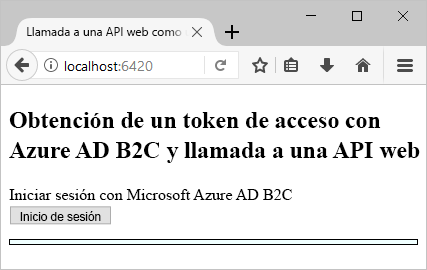
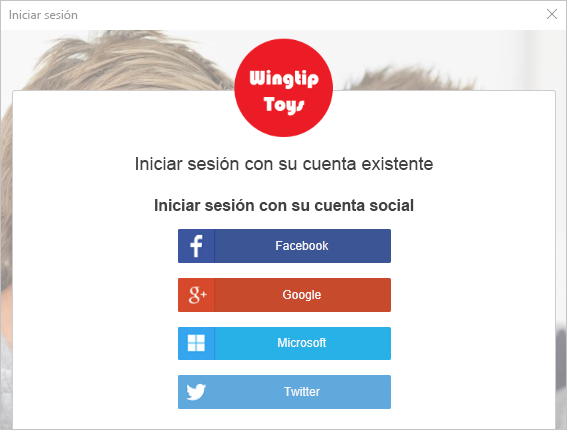

# <a name="test-drive-a-single-page-application-configured-with-azure-ad-b2c"></a>Versión de prueba de una aplicación de una sola página configurada con Azure AD B2C

## <a name="about-this-sample"></a>Acerca de este ejemplo

Azure Active Directory B2C proporciona administración de identidades en la nube para mantener la protección de su aplicación, empresa y clientes.  Esta guía de inicio rápido usa una aplicación de ejemplo de una sola página para mostrar lo siguiente:

* Mediante la directiva de **registro o inicio de sesión** para crear o iniciar sesión con un proveedor de identidades sociales o una cuenta local con una dirección de correo electrónico. 
* **Llamando a una API** para recuperar el nombre para mostrar de un recurso asegurado de Azure AD B2C.

## <a name="prerequisites"></a>Requisitos previos

* Instalar [Visual Studio 2017](https://www.visualstudio.com/downloads/) con las cargas de trabajo siguientes:
    - **ASP.NET y desarrollo web**

* Instalar [Node.js](https://nodejs.org/en/download/)

* Una cuenta de redes sociales de Facebook, Google, Microsoft o Twitter. Si no dispone de una cuenta de redes sociales, se requiere una dirección de correo electrónico válida.

[!INCLUDE [quickstarts-free-trial-note](../../includes/quickstarts-free-trial-note.md)]

## <a name="download-the-sample"></a>Descarga del ejemplo

[Descargue o clone la aplicación de ejemplo](https://github.com/Azure-Samples/active-directory-b2c-javascript-msal-singlepageapp) desde GitHub.

## <a name="run-the-sample-application"></a>Ejecutar la aplicación de ejemplo

Para ejecutar este ejemplo desde el símbolo del sistema de Node.js, realice el siguiente procedimiento: 

```
cd active-directory-b2c-javascript-msal-singlepageapp
npm install && npm update
node server.js
```

La ventana de la consola muestra el número de puerto para la aplicación web que se ejecuta en el equipo.

```
Listening on port 6420...
```

Abra `http://localhost:6420` en un explorador web para acceder a la aplicación web.




## <a name="create-an-account"></a>Crear una cuenta

Haga clic en el botón de **inicio de sesión** para iniciar el flujo de trabajo de **registro o inicio de sesión** de Azure AD B2C. Al crear una cuenta, puede usar una cuenta de proveedor de identidades de redes sociales existente o una cuenta de correo electrónico.

### <a name="sign-up-using-a-social-identity-provider"></a>Registrarse con un proveedor de identidades de redes sociales

Para registrarse con un proveedor de identidades de redes sociales, haga clic en el botón del proveedor de identidades que desee usar. Si prefiere usar una dirección de correo electrónico, vaya a la sección [Registro con una dirección de correo electrónico](#sign-up-using-an-email-address).



Debe autenticarse (iniciar sesión) con sus credenciales de cuenta de redes sociales y autorizar a la aplicación a leer información de su cuenta de redes sociales. Al conceder acceso, la aplicación puede recuperar la información del perfil de la cuenta de redes sociales como el nombre y la ciudad. 


Los detalles del perfil de la cuenta nueva se rellenan automáticamente con la información de su cuenta de redes sociales. 


Actualice los campos de nombre para mostrar, puesto que ocupa y ciudad y haga clic en **Continuar**.  Los valores que especifique se usan para el perfil de cuenta de usuario de Azure AD B2C.

Ha creado correctamente una nueva cuenta de usuario de Azure AD B2C que usa un proveedor de identidades. 

Siguiente paso: sección [Llamada a un recurso](#call-a-resource).

### <a name="sign-up-using-an-email-address"></a>Registro con una dirección de correo electrónico

Si decide no utilizar una cuenta de redes sociales para proporcionar la autenticación, puede crear una cuenta de usuario de Azure AD B2C mediante una dirección de correo electrónico válida. Una cuenta de usuario local de Azure AD B2C usa Azure Active Directory como proveedor de identidades. Para usar su dirección de correo electrónico, haga clic en el vínculo **¿No tiene una cuenta? Regístrese ahora**.


Especifique una dirección de correo electrónico válida y haga clic en **Enviar código de verificación**. Se requiere una dirección de correo electrónico válida para recibir el código de verificación de Azure AD B2C. 

Especifique el código de verificación que reciba en el correo electrónico y haga clic en **Comprobar código**.

Agregue la información del perfil y haga clic en **Crear**.


Ha creado correctamente una nueva cuenta de usuario local de Azure AD B2C.

## <a name="call-a-resource"></a>Llamada de un recurso

Una vez que haya iniciado sesión, haga clic en el botón **Llamar a API web** para que se devuelva el nombre para mostrar desde la llamada de API web como un objeto JSON. 


## <a name="next-steps"></a>Pasos siguientes

El siguiente paso es crear su propio inquilino de Azure AD B2C y configurar el ejemplo para la ejecución utilizando el inquilino. 

> [!div class="nextstepaction"]
> [Creación de un inquilino de Azure Active Directory B2C en Azure Portal](active-directory-b2c-get-started.md)