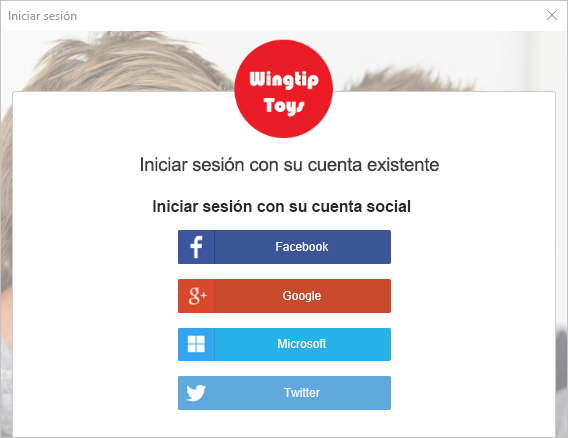
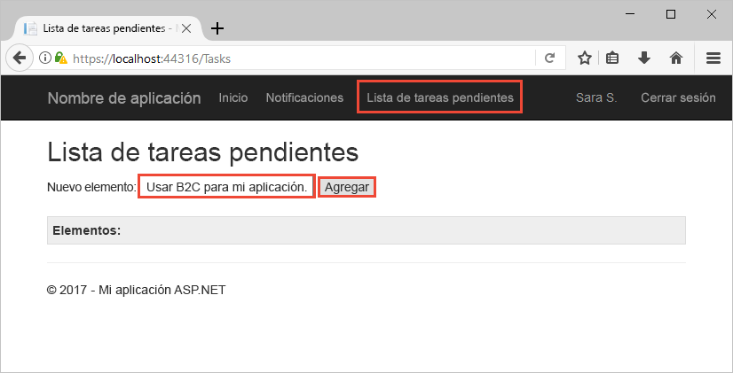

# Versión de prueba de una aplicación web configurada con Azure AD B2C

Azure Active Directory B2C proporciona administración de identidades en la nube para mantener la protección de su aplicación, empresa y clientes.  Esta guía de inicio rápido usa una aplicación de lista de tareas pendientes de ejemplo para mostrar lo siguiente:

* Mediante la directiva de **registro o inicio de sesión** para crear o iniciar sesión con un proveedor de identidades sociales o una cuenta local con una dirección de correo electrónico. 
* Llamando a una API protegida por Azure AD B2C para crear y editar elementos pendientes.

## Requisitos previos

* Instalar [Visual Studio 2017](https://www.visualstudio.com/downloads/) con las cargas de trabajo siguientes:
    - **ASP.NET y desarrollo web**

* Una cuenta de redes sociales de Facebook, Google, Microsoft o Twitter. Si no dispone de una cuenta de redes sociales, se requiere una dirección de correo electrónico válida.

[!INCLUDE [quickstarts-free-trial-note](../../includes/quickstarts-free-trial-note.md)]

## Descarga del ejemplo

[Descargue o clone la aplicación de ejemplo](https://github.com/Azure-Samples/active-directory-b2c-dotnet-webapp-and-webapi) desde GitHub.

## Ejecución de una aplicación en Visual Studio

En la carpeta de proyecto de la aplicación de ejemplo, abra la solución `B2C-WebAPI-DotNet.sln` en Visual Studio. 

La solución consta de dos proyectos:

* **TaskWebApp**: una aplicación web de ASP.NET MVC donde un usuario puede administrar sus elementos de la lista de tareas pendientes.  
* **TaskService**: back-end de una API web de ASP.NET que administra todas las operaciones CRUD realizadas en elementos de la lista de tareas pendientes de un usuario. La aplicación web llama a esta API y muestra los resultados.

Para esta guía de inicio rápido, debe ejecutar los proyectos `TaskWebApp` y `TaskService` al mismo tiempo. 

1. En el Explorador de soluciones, haga clic con el botón derecho en la solución y seleccione **Establecer proyectos de inicio**. 
2. Seleccione el botón de radio **Proyectos de inicio múltiples**.
3. Cambie la **Acción** de ambos proyectos a **Iniciar**. Haga clic en **Aceptar**.

Seleccione **Depurar > Iniciar depuración** para compilar y ejecutar ambas aplicaciones. Cada aplicación se abre en su propia pestaña del explorador:

* `https://localhost:44316/`: esta página es la aplicación web ASP.NET. Interactúe directamente con esta aplicación en la guía de inicio rápido.
* `https://localhost:44332/`: esta página es la API web a la que llama la aplicación web ASP.NET.

## Crear una cuenta

Haga clic en el vínculo de **registro/inicio de sesión** en la aplicación web ASP.NET para iniciar el flujo de trabajo de **registro/inicio de sesión**. Al crear una cuenta, puede usar una cuenta de proveedor de identidades de redes sociales existente o una cuenta de correo electrónico.

### Registrarse con un proveedor de identidades de redes sociales

Para registrarse con un proveedor de identidades de redes sociales, haga clic en el botón del proveedor de identidades que desee usar. Si prefiere usar una dirección de correo electrónico, vaya a la sección [Registro con una dirección de correo electrónico](#sign-up-using-an-email-address).

Debe autenticarse (iniciar sesión) con sus credenciales de cuenta de redes sociales y autorizar a la aplicación a leer información de su cuenta de redes sociales. Al conceder acceso, la aplicación puede recuperar la información del perfil de la cuenta de redes sociales como el nombre y la ciudad. 

Finalice el proceso de inicio de sesión para el proveedor de identidades. Por ejemplo, haga clic en el botón **Iniciar sesión** de Twitter.

Los detalles del perfil de la cuenta nueva se rellenan automáticamente con la información de su cuenta de redes sociales.

Actualice los campos de nombre para mostrar, puesto que ocupa y ciudad y haga clic en **Continuar**.  Los valores que especifique se usan para el perfil de cuenta de usuario de Azure AD B2C.

Ha creado correctamente una nueva cuenta de usuario de Azure AD B2C que usa un proveedor de identidades. 

Siguiente paso: sección [Salto para ver sus notificaciones](#view-your-claims).

### Registro con una dirección de correo electrónico

Si decide no utilizar una cuenta de redes sociales para proporcionar la autenticación, puede crear una cuenta de usuario de Azure AD B2C mediante una dirección de correo electrónico válida. Una cuenta de usuario local de Azure AD B2C usa Azure Active Directory como proveedor de identidades. Para usar su dirección de correo electrónico, haga clic en el vínculo **¿No tiene una cuenta? Regístrese ahora**.

Especifique una dirección de correo electrónico válida y haga clic en **Enviar código de verificación**. Se requiere una dirección de correo electrónico válida para recibir el código de verificación de Azure AD B2C. 

Especifique el código de verificación que reciba en el correo electrónico y haga clic en **Comprobar código**.

Agregue la información del perfil y haga clic en **Crear**.

Ha creado correctamente una nueva cuenta de usuario local de Azure AD B2C.

## Restablecimiento de la contraseña

Si ha creado una cuenta mediante una dirección de correo electrónico, Azure AD B2C tiene la funcionalidad de permitir a los usuarios restablecer su contraseña. Para editar el perfil que creó, haga clic en el nombre de perfil en la barra de menús y seleccione **Restablecer contraseña**.

Compruebe su dirección de correo electrónico. Para ello, escríbala y haga clic en **Enviar código de verificación**. Un código de verificación se envía a la dirección de correo electrónico.

Especifique el código de verificación que reciba en el correo electrónico y haga clic en **Comprobar código**.

Después de comprobar su dirección de correo electrónico, haga clic en **Continuar**.

Escriba la contraseña nueva y haga clic en **Continuar**.

## Visualización de sus notificaciones

Haga clic en **Notificaciones** en la barra de menú de aplicaciones web para ver las notificaciones asociadas con su última acción. 

En este ejemplo, se produjo la última acción para la experiencia de *inicio de sesión o registro*. Tenga en cuenta que el **tipo de notificación** `http://schemas.microsoft.com/claims/authnclassreference` es `b2c_1_susi`, que indica que la última acción fue la de registro o inicio de sesión. Si la última acción fue el restablecimiento de la contraseña, el **tipo de notificación** sería `b2c_1_reset`.

## Edición del perfil

Azure Active Directory B2C proporciona funcionalidad para permitir a los usuarios actualizar sus perfiles. En la barra de menú de la aplicación web, haga clic en el nombre de perfil y seleccione **Editar perfil** para editar el perfil que ha creado.

Cambie el **nombre para mostrar** y la **ciudad**.  Haga clic en **Continuar** para actualizar su perfil.

Tenga en cuenta las actualizaciones del nombre para mostrar en la parte superior derecha de la página después de cambiar su nombre. 

Haga clic en **Notificaciones**. Los cambios realizados en el **nombre para mostrar** y la **ciudad** aparecen en las notificaciones.

 Observe que el **tipo de notificación** `http://schemas.microsoft.com/claims/authnclassreference` se ha actualizado a `b2c_1_edit_profile`, que indica que la última acción realizada fue una edición de perfil. También tenga en cuenta que el nombre y la ciudad son los nuevos valores *Sara S.* y *Seattle*.

## Acceso a un recurso

Haga clic en la **lista de tareas pendientes** para escribir y modificar los elementos de la lista de tareas pendientes. La aplicación web ASP.NET incluye un token de acceso en la solicitud de permiso de solicitud de recurso de la API web para realizar operaciones en los elementos de la lista de tareas pendientes del usuario. 

Especifique el texto en el cuadro de texto **Nuevo elemento**. Haga clic en **Agregar** para llamar a la API web protegida de Azure AD B2C que agrega un elemento de la lista de tareas pendientes.

## Otros escenarios

Otros escenarios para la versión de prueba son los siguientes:

* Cierre la sesión de la aplicación y haga clic en **Lista de tareas pendientes**. Observe que se le pedirá que inicie sesión y se conservarán los elementos de la lista. 
* Cree una nueva cuenta con un tipo de cuenta diferente. Por ejemplo, puede usar un proveedor de identidades de redes sociales si ha creado una cuenta con una dirección de correo electrónico previamente.

## Pasos siguientes

El siguiente paso es crear su propio inquilino de Azure AD B2C y configurar el ejemplo para la ejecución utilizando el inquilino. 

> [!div class="nextstepaction"]
> [Creación de un inquilino de Azure Active Directory B2C en Azure Portal](active-directory-b2c-get-started.md)