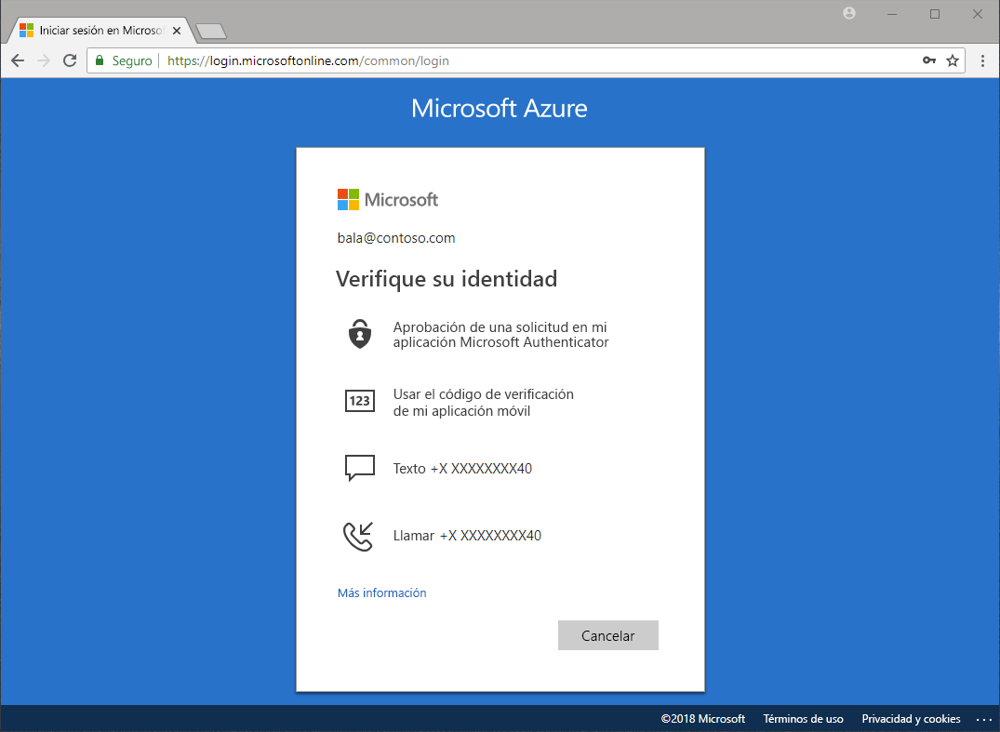

# ¿Qué métodos están disponibles para la autenticación?

Escuchamos en las noticias que las contraseñas se roban y las identidades se ponen en peligro. Requerir un segundo factor además de una contraseña aumenta de forma inmediata la seguridad de una organización. Microsoft Azure Active Directory (Azure AD) incluye funciones, como Azure Multi-factor Authentication (Azure MFA) y el autoservicio de restablecimiento de contraseñas (SSPR) de Azure AD, para ayudar a los administradores a proteger las organizaciones y a los usuarios con métodos de autenticación adicionales.

Cuando un usuario necesita tener acceso a una aplicación confidencial, restablece su contraseña o habilita Windows Hello, puede que se le pida que proporcione una prueba adicional de que realmente es quien pretende.

La comprobación adicional puede producirse en forma de algún método de autenticación, como es:

* Con un código proporcionado en un mensaje de texto o correo electrónico
* Con una llamada de teléfono
* Con una notificación o código en su teléfono
* Respondiendo a sus preguntas de seguridad

El autoservicio del restablecimiento de contraseñas de Azure AD y Azure MFA proporcionan a los administradores control sobre la configuración de directivas, la supervisión y los informes empleando Azure AD y Azure Portal para proteger las organizaciones.

## Restablecimiento de la contraseña de autoservicio

El autoservicio de restablecimiento de contraseñas proporciona a los usuarios la capacidad de restablecer sus contraseñas, sin intervención de ningún administrador, en el momento y el lugar donde se precisa.

> [!VIDEO https://www.youtube.com/embed/hc97Yx5PJiM]

El autoservicio de restablecimiento de contraseñas incluye:

* **Cambio de contraseña:** conozco mi contraseña, pero deseo cambiarla.
* **Restablecimiento de contraseña:** no puedo iniciar sesión y deseo restablecer la contraseña mediante uno o varios métodos de autenticación aprobados.
* **Desbloqueo de cuenta:** no puedo iniciar sesión porque mi cuenta está bloqueada y deseo desbloquearla con uno o varios métodos de autenticación aprobados.

## Multi-Factor Authentication

Azure Multi-Factor Authentication (MFA) es la solución de Microsoft de comprobación de dos pasos. El uso de métodos de autenticación aprobados por un administrador permite a Azure MFA ayudar a proteger el acceso a los datos y las aplicaciones, además de satisfacer la exigencia de un proceso de inicio de sesión simple.

## Pasos siguientes

El siguiente paso es profundizar en el autoservicio de restablecimiento de contraseñas y en Azure Multi-factor Authentication, y configurarlos.

Para empezar a trabajar con el autoservicio de restablecimiento de contraseñas, consulte el [artículo sobre el inicio rápido para habilitar SSPR](quickstart-sspr.md).

Para más información sobre el autoservicio de restablecimiento de contraseñas, lea el artículo sobre su [funcionamiento en Azure AD](concept-sspr-howitworks.md)

Más información sobre Azure Multi-factor Authentication en el artículo [Funcionamiento de Azure Multi-factor Authentication](concept-mfa-howitworks.md)