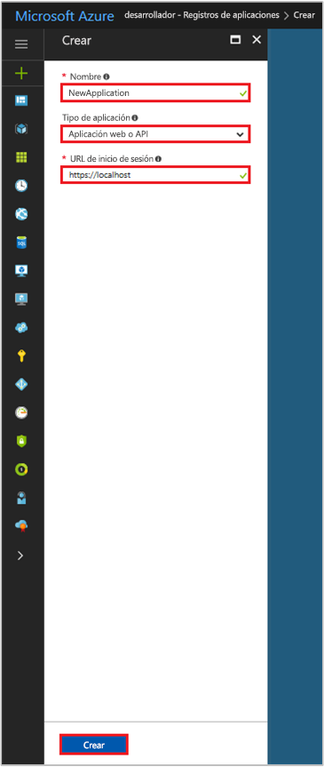

# Inicio rápido: Registro de una aplicación con el punto de conexión de Azure Active Directory v1.0

[!INCLUDE [active-directory-develop-applies-v1](../../../includes/active-directory-develop-applies-v1.md)]

Los desarrolladores de la empresa y los proveedores de software como servicio (SaaS) pueden desarrollar aplicaciones de línea de negocio o servicios comerciales en la nube que se pueden integrar con Azure Active Directory (Azure AD) para ofrecer inicio de sesión seguro y autorización para los servicios. Para integrar una aplicación o un servicio con Azure AD, el desarrollador debe registrar primero la aplicación en Azure AD.

Cualquier aplicación que quiera usar las funciones de Azure AD debe registrarse primero en un inquilino de Azure AD. Este proceso de registro implica proporcionar los detalles de Azure AD sobre la aplicación, como la dirección URL donde se encuentra, la dirección URL para enviar respuestas cuando un usuario está autenticado, el URI que identifica la aplicación y así sucesivamente.

En esta guía de inicio rápido se muestra cómo agregar y registrar una aplicación en Azure AD.

## Requisitos previos

Para comenzar, asegúrese de que tiene un inquilino de Azure AD que puede usar para registrar las aplicaciones. Si aún no tiene un inquilino, [descubra cómo conseguir uno](quickstart-create-new-tenant.md).

## Registro de una aplicación nueva mediante Azure Portal

1. Inicie sesión en el [Azure Portal](https://portal.azure.com).
1. Si la cuenta proporciona acceso a más de uno, haga clic en la cuenta en la esquina superior derecha y establezca la sesión del portal en el inquilino de Azure AD deseado.
1. En el panel de navegación izquierdo, seleccione el servicio **Azure Active Directory**.
1. Seleccione **Registros de aplicaciones** y, luego, **Nuevo registro de aplicaciones**.

    

1. Cuando aparece la página **Crear**, escriba la información de registro de la aplicación: 

    - **Nombre:** Escriba un nombre de aplicación significativo
    - **Tipo de aplicación:**
      - Seleccione **Nativo** para las [aplicaciones cliente](developer-glossary.md#client-application) que están instaladas localmente en un dispositivo. Esta configuración se utiliza para [clientes nativos](developer-glossary.md#native-client) públicos de OAuth.
      - Seleccione **Aplicación Web o API** para las [aplicaciones cliente](developer-glossary.md#client-application) y las [aplicaciones de recursos/API](developer-glossary.md#resource-server) que están instaladas en un servidor seguro. Esta configuración se utiliza para [clientes web](developer-glossary.md#web-client) confidenciales de OAuth y [clientes basados en agente de usuario](developer-glossary.md#user-agent-based-client) públicos. La misma aplicación también puede exponer tanto un cliente como un recurso o API.
    - **URL de inicio de sesión:** Para aplicaciones "Aplicación Web / API", proporcione la dirección URL base de la aplicación. Por ejemplo, `http://localhost:31544` podría ser la dirección URL de una aplicación web que se ejecuta en la máquina local. Los usuarios utilizan esta dirección URL para iniciar sesión en una aplicación cliente web. 
    - **URI de redireccionamiento:** para aplicaciones "Nativas", proporcione el identificador URI usado por Azure AD para devolver las respuestas de los tokens. Escriba un valor específico para la aplicación, por ejemplo, `http://MyFirstAADApp`

      

    Si quiere ejemplos específicos de aplicaciones web o nativas, consulte las **guías de inicio rápido** en nuestra documentación.

1. Cuando haya terminado, seleccione **Crear**.

    Azure AD le asigna un identificador de aplicación único a la aplicación y le lleva a la página de registro principal de la aplicación. En función de que se trate de una aplicación web o nativa, se proporcionan opciones diferentes para agregar funcionalidades adicionales a la aplicación.

      > [!NOTE]
      > De forma predeterminada, una aplicación web recién registrada está configurada para permitir **solo** el inicio de sesión en la aplicación a los usuarios del mismo inquilino.

## Pasos siguientes

- Consulte [Marco de consentimiento de Azure AD](consent-framework.md) para obtener información general acerca del consentimiento.
- Para habilitar características de configuración adicionales en el registro de la aplicación, como credenciales, permisos o la habilitación del inicio de sesión para usuarios de otros inquilinos, consulte [Update an application in Azure AD](quickstart-v1-update-azure-ad-app.md) (Actualización de una aplicación en Azure AD).
- Para obtener más información acerca de los dos objetos de Azure AD que representan una aplicación registrada y la relación entre ellos, consulte [Objetos de aplicación y de entidad de servicio](app-objects-and-service-principals.md).
- Para obtener más información acerca de las directrices de personalización de marca que hay que usar al desarrollar aplicaciones con Azure Active Directory, consulte [Directrices de personalización de marca para aplicaciones](howto-add-branding-in-azure-ad-apps.md).
