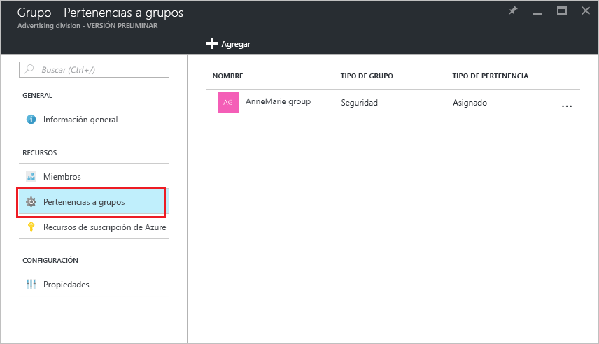

# Administración de los grupos a los que pertenece un grupo en el inquilino de Azure Active Directory
Los grupos pueden contener otros grupos en Azure Active Directory. Aquí se muestra cómo administrar las pertenencias a grupos.

## ¿Cómo puedo encontrar los grupos de los que es miembro mi grupo?
1. Inicie sesión en el [Centro de administración de Azure AD](https://aad.portal.azure.com) con una cuenta que tenga el rol de administrador global en el directorio.
2. Seleccione **Usuarios y grupos**.

   
1. Seleccione **Todos los grupos**.

   
1. Seleccione un grupo.
2. Seleccione **Pertenencia a grupos**.

   
1. Para agregar un grupo como miembro de otro grupo, en la hoja **Grupo - Pertenencia a grupos** seleccione el comando **Agregar** comando.
2. Seleccione un grupo de la hoja **Seleccionar grupo** y, después, haga clic en el botón **Seleccionar** situado en la parte inferior de dicha hoja. Solo se pueden agregar grupos a otros grupos de uno en uno. El cuadro **Usuario** filtra la visualización en función de si coincide lo que ha escrito con cualquier parte del nombre de un usuario o dispositivo. No se aceptan caracteres comodín en el cuadro.

   
8. Para quitar un grupo como miembro de otro grupo, en la hoja **Grupo - Pertenencia a grupos** , seleccione uno.
9. Seleccione el comando **Quitar** y confirme la elección en el símbolo del sistema.

   
10. Cuando termine de cambiar las pertenencias a grupos de su grupo, seleccione **Guardar**.

## Información adicional
Estos artículos proporcionan información adicional sobre Azure Active Directory.

* [Ver los grupos existentes](active-directory-groups-view-azure-portal.md)
* [Crear un nuevo grupo y agregar miembros](active-directory-groups-create-azure-portal.md)
* [Administración de la configuración de un grupo](active-directory-groups-settings-azure-portal.md)
* [Administrar miembros de un grupo](active-directory-groups-members-azure-portal.md)
* [Administrar reglas dinámicas de los usuarios de un grupo](../users-groups-roles/groups-dynamic-membership.md)
