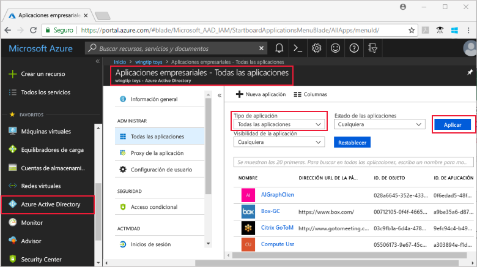

# Visualización de todas las aplicaciones empresariales que se pueden administrar en Azure Active Directory
Puede administrar las aplicaciones empresariales en Azure Active Directory (Azure AD). Podrá ver las aplicaciones que pueden administrarse, asignar usuarios o grupos a una aplicación, mantener las propiedades de la aplicación, como el nombre y logotipo, e incluso deshabilitar una aplicación para que ningún usuario pueda iniciar sesión en ella.

## ¿Cómo puedo ver todas mis aplicaciones?
1. Inicie sesión en [Azure Portal](https://portal.azure.com) con una cuenta que tenga el rol de administrador global en el directorio.
2. Seleccione **Todos los servicios**, escriba **Azure Active Directory** en el cuadro de texto y, después, seleccione **Entrar**.
3. En el panel **Azure Active Directory -**  ***nombreDelDirectorio*** (es decir, el panel de Azure AD del directorio que está administrando), seleccione **Aplicaciones empresariales**.

    
4. En el panel **Aplicaciones empresariales**, seleccione **Todas las aplicaciones**. En este panel puede seleccionar aplicaciones para administrarlas, cambiar las columnas mostradas o filtrar la lista para encontrar la que quiera (por ejemplo, para ver solo las aplicaciones deshabilitadas).

## Pasos siguientes
* [Asignar un usuario o grupo a una aplicación empresarial](assign-user-or-group-access-portal.md)
* [Eliminación de asignaciones de usuario o grupo de una aplicación empresarial](remove-user-or-group-access-portal.md)
* [Deshabilitar los inicios de sesión de los usuarios de una aplicación empresarial](disable-user-sign-in-portal.md)
* [Cambio del nombre o el logotipo de una aplicación empresarial](change-name-or-logo-portal.md)
