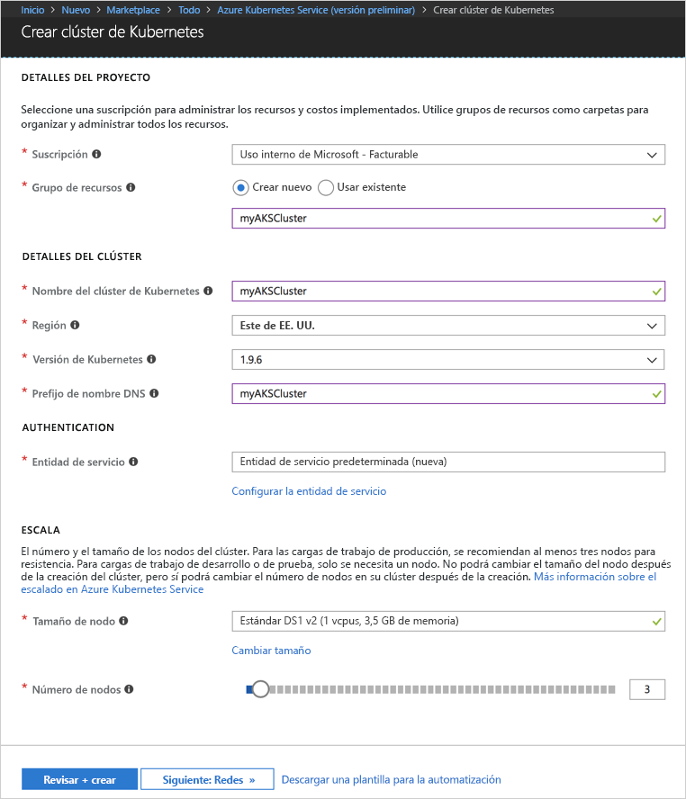
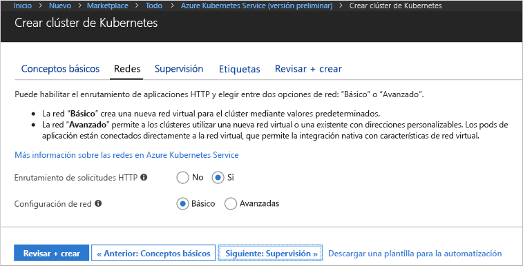
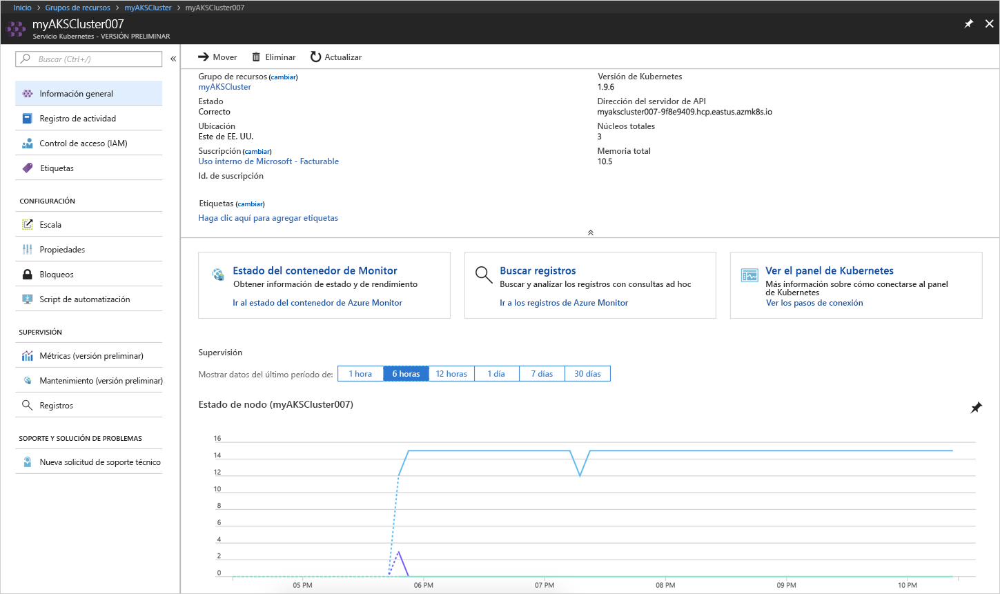
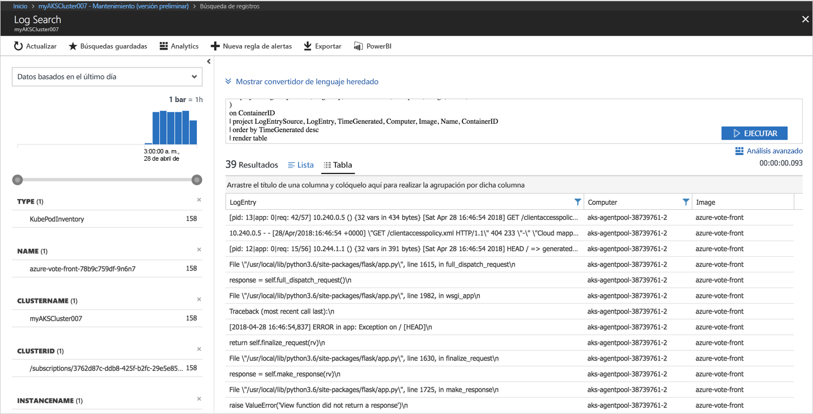

# <a name="quickstart-deploy-an-azure-kubernetes-service-aks-cluster"></a>Guía de inicio rápido: Implementación de un clúster de Azure Kubernetes Service (AKS)

En esta guía rápida, implementará un clúster de AKS mediante Azure Portal. A continuación, se ejecuta en el clúster una aplicación de varios contenedores que consta de un front-end web y una instancia de Redis. Una vez finalizado el proceso, la aplicación es accesible a través de Internet.


En esta guía rápida se presupone un conocimiento básico de los conceptos de Kubernetes. Para obtener información detallada sobre Kubernetes, consulte la [documentación correspondiente][kubernetes-documentation].

## <a name="sign-in-to-azure"></a>Inicio de sesión en Azure

Inicie sesión en Azure Portal en http://portal.azure.com.


## <a name="create-aks-cluster"></a>Creación de un clúster de AKS

Elija **Crear un recurso** > busque **Kubernetes** > seleccione **Azure Kubernetes Service (preview)** (Azure Kubernetes Service (versión preliminar))  > **Crear**.

Complete los pasos siguientes en cada encabezado del formulario de creación del clúster de AKS.

- **DETALLES DEL PROYECTO**: seleccione una suscripción de Azure y un grupo de recursos de Azure nuevo o existente.
- **DETALLES DEL CLÚSTER**: escriba un nombre, la región, la versión y el prefijo del nombre DNS para el clúster de AKS.
- **AUTENTICACIÓN**: cree una entidad de servicio o utilice una existente. Al usar un SPN existente, debe proporcionar el identificador de cliente SPN y el secreto.
- **ESCALA**: seleccione un tamaño de VM para los nodos de AKS. El tamaño de VM **no** puede cambiarse una vez que se ha implementado un clúster de AKS. Además, seleccione el número de nodos que se va a implementar en el clúster. El número de nodos **puede** ajustarse después de implementar el clúster.

Seleccione **Next: Networking** (Siguiente: redes) cuando haya terminado.



Configure las siguientes opciones de red:

- **Http application routing** (Enrutamiento de aplicación http): configura un controlador de entrada integrado con creación de nombre DNS público automática. Para obtener más información sobre el enrutamiento de http, consulte [AKS HTTP routing and DNS][http-routing] (Enrutamiento HTTP y DNS de AKS).
- **Configuración de red**: elija entre la configuración de red básica con el complemento de Kubernetes [kubenet][kubenet], o la configuración de red avanzada con [Azure CNI][azure-cni]. Para obtener más información sobre las opciones de red, consulte la [introducción a las redes de AKS][aks-network].

Seleccione **Next: Monitoring** (Siguiente: supervisión) cuando haya terminado.



Al implementar un clúster de AKS, Azure Container Insights puede configurarse para supervisar el estado del clúster de AKS y los pods que se ejecutan en el clúster. Para obtener más información sobre la supervisión del estado de los contenedores, consulte [Monitor Azure Kubernetes Service health][aks-monitor] (Supervisión del estado de Azure Kubernetes Service).

Seleccione **Sí** para habilitar la supervisión de contenedores y seleccione un área de trabajo de Log Analytics existente o cree una.

Seleccione **Review + create** (Revisar y crear) y, a continuación, **Create** cuando haya terminado.


Tras una breve espera, el clúster de ASK es implementa y está listo para usarse. Busque el grupo de recursos del clúster de AKS, seleccione el recurso de AKS y debería ver el panel de clústeres de AKS.



## <a name="connect-to-the-cluster"></a>Conexión al clúster

Para administrar un clúster de Kubernetes, use [kubectl][kubectl], el cliente de línea de comandos de Kubernetes. El cliente kubectl viene preinstalado en Azure Cloud Shell.

Abra Cloud Shell mediante el botón de la esquina superior derecha de Azure Portal.


Use el comando [az aks get-credentials][az-aks-get-credentials] para configurar kubectl para conectarse a su clúster de Kubernetes.

Copie y pegue el siguiente comando en Cloud Shell. Si es necesario, modifique el nombre del clúster y del grupo de recursos.

```azurecli-interactive
az aks get-credentials --resource-group myAKSCluster --name myAKSCluster
```

Para comprobar la conexión con el clúster, use el comando [kubectl get][kubectl-get] para que devuelva una lista de los nodos del clúster.

```azurecli-interactive
kubectl get nodes
```

Salida:

```
NAME                       STATUS    ROLES     AGE       VERSION
aks-agentpool-11482510-0   Ready     agent     9m        v1.9.6
aks-agentpool-11482510-1   Ready     agent     8m        v1.9.6
aks-agentpool-11482510-2   Ready     agent     9m        v1.9.6
```

## <a name="run-the-application"></a>Ejecución de la aplicación

Los archivos de manifiesto de Kubernetes definen un estado deseado para un clúster, por ejemplo, qué imágenes de contenedor se deben ejecutar. En este ejemplo, se usa un manifiesto para crear todos los objetos necesarios para ejecutar la aplicación Azure Vote. Estos objetos incluyen dos [implementaciones de Kubernetes][kubernetes-deployment], una para las aplicaciones el front-end de Azure Vote y otra para una instancia de Redis. Además, se crean dos [servicios de Kubernetes][kubernetes-service], un servicio interno para la instancia de Redis y un servicio externo para acceder a la aplicación Azure Vote desde Internet.

Cree un archivo denominado `azure-vote.yaml` y copie el siguiente código YAML. Si está trabajando en Azure Cloud Shell, cree el archivo mediante vi o Nano, como si trabajara en un sistema físico o virtual.

```yaml
apiVersion: apps/v1beta1
kind: Deployment
metadata:
  name: azure-vote-back
spec:
  replicas: 1
  template:
    metadata:
      labels:
        app: azure-vote-back
    spec:
      containers:
      - name: azure-vote-back
        image: redis
        ports:
        - containerPort: 6379
          name: redis
---
apiVersion: v1
kind: Service
metadata:
  name: azure-vote-back
spec:
  ports:
  - port: 6379
  selector:
    app: azure-vote-back
---
apiVersion: apps/v1beta1
kind: Deployment
metadata:
  name: azure-vote-front
spec:
  replicas: 1
  template:
    metadata:
      labels:
        app: azure-vote-front
    spec:
      containers:
      - name: azure-vote-front
        image: microsoft/azure-vote-front:v1
        ports:
        - containerPort: 80
        env:
        - name: REDIS
          value: "azure-vote-back"
---
apiVersion: v1
kind: Service
metadata:
  name: azure-vote-front
spec:
  type: LoadBalancer
  ports:
  - port: 80
  selector:
    app: azure-vote-front
```

Use el comando [kubectl create][kubectl-create] para ejecutar la aplicación.

```azurecli-interactive
kubectl create -f azure-vote.yaml
```

Salida:

```
deployment "azure-vote-back" created
service "azure-vote-back" created
deployment "azure-vote-front" created
service "azure-vote-front" created
```

## <a name="test-the-application"></a>Prueba de la aplicación

Cuando se ejecuta la aplicación, se crea un [servicio de Kubernetes][kubernetes-service] que expone la aplicación a Internet. Este proceso puede tardar unos minutos en completarse.

Para supervisar el progreso, utilice el comando [kubectl get service][kubectl-get] con el argumento `--watch`.

```azurecli-interactive
kubectl get service azure-vote-front --watch
```

En un primer momento, el parámetro *EXTERNAL-IP* del servicio *azure-vote-front* aparece como *pendiente*.

```
NAME               TYPE           CLUSTER-IP   EXTERNAL-IP   PORT(S)        AGE
azure-vote-front   LoadBalancer   10.0.37.27   <pending>     80:30572/TCP   6s
```

Una vez que la dirección *EXTERNAL-IP* haya cambiado de *pendiente* a una *dirección IP*, use `CTRL-C` para detener el proceso de inspección de kubectl.

```
azure-vote-front   LoadBalancer   10.0.37.27   52.179.23.131   80:30572/TCP   2m
```

Ahora, vaya a la dirección IP externa para ver la aplicación Azure Vote.


## <a name="monitor-health-and-logs"></a>Supervisión de estado y registros

Si se ha habilitado la supervisión de la información del contenedor, en el panel de clústeres de AKS hay disponibles métricas de mantenimiento para el clúster de AKS y los pods que se ejecutan en el clúster. Para obtener más información sobre la supervisión del estado de los contenedores, consulte [Monitor Azure Kubernetes Service health][aks-monitor] (Supervisión del estado de Azure Kubernetes Service).

Para ver el estado actual, el tiempo de actividad y el uso de recursos para los pods de Azure Vote, vuelva al recurso de AKS, seleccione **Monitor Container Health** (Supervisar estado del contenedor) > seleccione el espacio de nombres **predeterminado** > y seleccione **Contenedores**. Estos datos pueden tardar unos minutos en rellenarse en Azure Portal.


Para ver los registros del pod `azure-vote-front`, seleccione el vínculo **Ver registros**. Estos registros incluyen los flujos stdout y stderr del contenedor.



## <a name="delete-cluster"></a>Eliminación de clúster

Cuando el clúster ya no sea necesario, elimine el recurso del clúster, lo que elimina todos los recursos asociados. Esta operación se puede realizar en Azure Portal; para ello, seleccione el botón Eliminar en el panel de clústeres de AKS. Como alternativa, el comando [az aks delete][az-aks-delete] se puede usar en Cloud Shell.

```azurecli-interactive
az aks delete --resource-group myAKSCluster --name myAKSCluster --no-wait
```

## <a name="get-the-code"></a>Obtención del código

En esta guía de inicio rápido, se han usado imágenes de un contenedor creado previamente para crear una implementación de Kubernetes. El código de la aplicación relacionada, Dockerfile, y el archivo de manifiesto de Kubernetes están disponibles en GitHub.

[https://github.com/Azure-Samples/azure-voting-app-redis][azure-vote-app]

## <a name="next-steps"></a>Pasos siguientes

En esta guía de inicio rápido, ha implementado un clúster de Kubernetes y una aplicación de varios contenedores en él.

Para obtener más información sobre AKS y un ejemplo completo desde el código hasta la implementación, continúe con el tutorial del clúster de Kubernetes.

> [!div class="nextstepaction"]
> [Tutorial de AKS][aks-tutorial]

<!-- LINKS - external -->
[azure-vote-app]: https://github.com/Azure-Samples/azure-voting-app-redis.git
[azure-cni]: https://github.com/Azure/azure-container-networking/blob/master/docs/cni.md
[kubectl]: https://kubernetes.io/docs/user-guide/kubectl/
[kubectl-create]: https://kubernetes.io/docs/reference/generated/kubectl/kubectl-commands#create
[kubectl-get]: https://kubernetes.io/docs/reference/generated/kubectl/kubectl-commands#get
[kubenet]: https://kubernetes.io/docs/concepts/cluster-administration/network-plugins/#kubenet
[kubernetes-deployment]: https://kubernetes.io/docs/concepts/workloads/controllers/deployment/
[kubernetes-documentation]: https://kubernetes.io/docs/home/
[kubernetes-service]: https://kubernetes.io/docs/concepts/services-networking/service/

<!-- LINKS - internal -->
[az-aks-get-credentials]: /cli/azure/aks?view=azure-cli-latest#az_aks_get_credentials
[az-aks-delete]: /cli/azure/aks#az-aks-delete
[aks-monitor]: ../log-analytics/log-analytics-containers.md
[aks-network]: ./networking-overview.md
[aks-tutorial]: ./tutorial-kubernetes-prepare-app.md
[http-routing]: ./http-application-routing.md