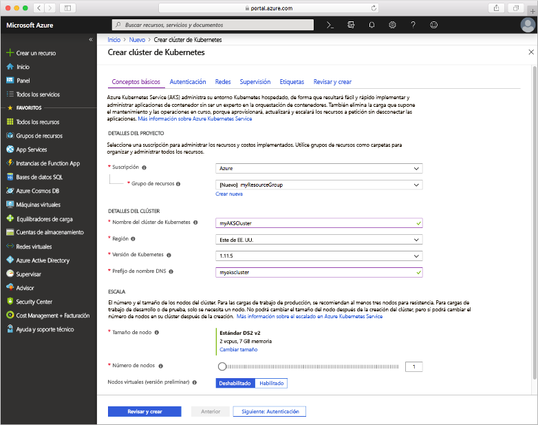
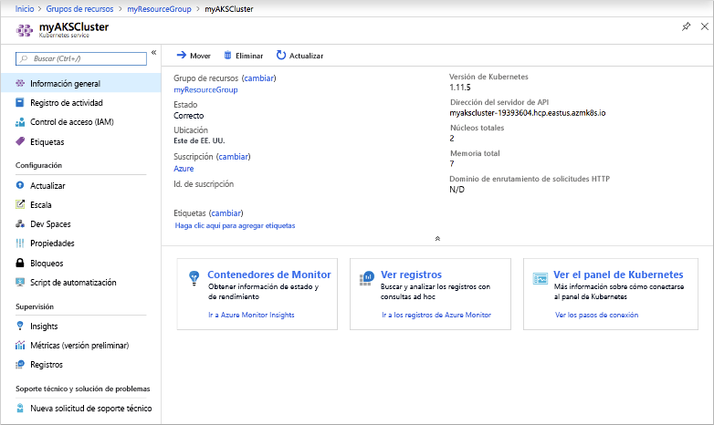
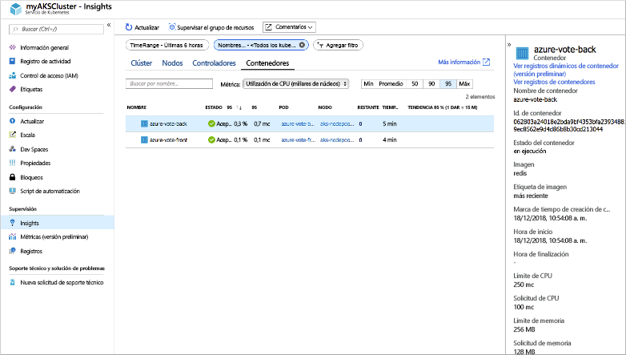

# <a name="quickstart-deploy-an-azure-kubernetes-service-aks-cluster"></a>Guía de inicio rápido: Implementación de un clúster de Azure Kubernetes Service (AKS)

En esta guía rápida, implementará un clúster de AKS mediante Azure Portal. A continuación, se ejecuta en el clúster una aplicación de varios contenedores que consta de un front-end web y una instancia de Redis. Una vez finalizado el proceso, la aplicación es accesible a través de Internet.


En esta guía rápida se presupone un conocimiento básico de los conceptos de Kubernetes. Para obtener información detallada sobre Kubernetes, consulte la [documentación correspondiente][kubernetes-documentation].

## <a name="sign-in-to-azure"></a>Inicio de sesión en Azure

Inicie sesión en Azure Portal en http://portal.azure.com.

## <a name="create-an-aks-cluster"></a>Creación de un clúster de AKS

En la esquina superior izquierda de Azure Portal, seleccione **Crear un recurso** > **Kubernetes Service**.

Para crear un clúster de AKS, realice los siguientes pasos:

1. **Datos básicos**. Configure las siguientes opciones:
    - *DETALLES DEL PROYECTO*: seleccione una suscripción de Azure y, a continuación, seleccione o cree un grupo de recursos de Azure, como *myResourceGroup*. Escriba un **Nombre del clúster de Kubernetes**, como *myAKSCluster*.
    - *DETALLES DEL CLÚSTER*: seleccione la región, la versión de Kubernetes y el prefijo del nombre DNS para el clúster de AKS.
    - *ESCALA*: seleccione un tamaño de máquina virtual para los nodos de AKS. El tamaño de VM **no** puede cambiarse una vez que se ha implementado un clúster de AKS.
        - Seleccione el número de nodos que se van a implementar en el clúster. En esta guía de inicio rápido, establezca **Número de nodos** en *1*. El número de nodos **puede** ajustarse después de implementar el clúster.
    
    

    Seleccione **Siguiente: autenticación** cuando haya terminado.

1. **Autenticación**. Configure las siguientes opciones:
    - Cree una entidad de servicio o haga clic en *Configurar* para usar una existente. Al usar un SPN existente, debe proporcionar el identificador de cliente SPN y el secreto.
    - Habilite la opción para los controles de acceso basado en roles (RBAC) de Kubernetes. Estos controles proporcionan un control más minucioso sobre el acceso a los recursos de Kubernetes implementado en el clúster de AKS.

    Seleccione **Next: Networking** (Siguiente: redes) cuando haya terminado.

1. **Redes**: configure las siguientes opciones de red, que se deben establecer como predeterminadas.
    
    - **Enrutamiento de solicitudes HTTP**: seleccione **Sí** para configurar un controlador de entrada integrado con la creación de nombres DNS públicos automática. Para obtener más información sobre el enrutamiento de http, consulte [AKS HTTP routing and DNS][http-routing] (Enrutamiento HTTP y DNS de AKS).
    - **Configuración de red**: seleccione la configuración de red **Básica** con el complemento de Kubernetes [kubenet][kubenet], en lugar de con la configuración de red avanzada mediante [Azure CNI][azure-cni]. Para obtener más información sobre las opciones de red, consulte la [introducción a las redes de AKS][aks-network].
    
    Seleccione **Next: Monitoring** (Siguiente: supervisión) cuando haya terminado.

1. Al implementar un clúster de AKS, Azure Monitor se puede configurar para supervisar el estado del clúster de AKS y los pods que se ejecutan en el clúster. Para obtener más información sobre la supervisión del estado de los contenedores, consulte [Monitor Azure Kubernetes Service health][aks-monitor] (Supervisión del estado de Azure Kubernetes Service).

    Seleccione **Sí** para habilitar la supervisión de contenedores y seleccione un área de trabajo de Log Analytics existente o cree una.
    
    Seleccione **Review + create** (Revisar y crear) y, a continuación, **Create** cuando esté preparado.

Se tardan unos minutos en crear el clúster de AKS y en prepararlo para usarlo. Vaya al grupo de recursos de clúster de AKS, como *myResourceGroup* y seleccione el recurso de AKS, como *myAKSCluster*. Se muestra el panel del clúster de AKS, como se muestra en la siguiente captura de pantalla de ejemplo:



## <a name="connect-to-the-cluster"></a>Conexión al clúster

Para administrar un clúster de Kubernetes, use [kubectl][kubectl], el cliente de línea de comandos de Kubernetes. El cliente `kubectl` viene preinstalado en Azure Cloud Shell.

Abra Cloud Shell mediante el botón de la esquina superior derecha de Azure Portal.


Use el comando [az aks get-credentials][az-aks-get-credentials] para configurar `kubectl` para conectarse a su clúster de Kubernetes. En el ejemplo siguiente se obtienen credenciales para el nombre de clúster *myAKSCluster* del grupo de recursos denominado *myResourceGroup*:

```azurecli-interactive
az aks get-credentials --resource-group myResourceGroup --name myAKSCluster
```

Para comprobar la conexión con el clúster, use el comando [kubectl get][kubectl-get] para que devuelva una lista de los nodos del clúster.

```azurecli-interactive
kubectl get nodes
```

La salida del ejemplo siguiente muestra el nodo único creado en los pasos anteriores.

```
NAME                       STATUS    ROLES     AGE       VERSION
aks-agentpool-14693408-0   Ready     agent     10m       v1.11.2
```

## <a name="run-the-application"></a>Ejecución de la aplicación

Los archivos de manifiesto de Kubernetes definen un estado deseado para un clúster, por ejemplo, qué imágenes de contenedor se deben ejecutar. En esta guía de inicio rápido, se usa un manifiesto para crear todos los objetos necesarios para ejecutar una aplicación Voto de Azure de ejemplo. Estos objetos incluyen dos [implementaciones de Kubernetes][kubernetes-deployment], una para la aplicación front-end Voto de Azure y otra para una instancia de Redis. Además, se crean dos servicios [Kubernetes Services][kubernetes-service], uno interno para la instancia de Redis y otro externo para acceder a la aplicación Voto de Azure desde Internet.

Cree un archivo denominado `azure-vote.yaml` y copie el siguiente código YAML. Si está trabajando en Azure Cloud Shell, cree el archivo mediante `vi` o `Nano`, como si trabajara en un sistema físico o virtual.

```yaml
apiVersion: apps/v1beta1
kind: Deployment
metadata:
  name: azure-vote-back
spec:
  replicas: 1
  template:
    metadata:
      labels:
        app: azure-vote-back
    spec:
      containers:
      - name: azure-vote-back
        image: redis
        resources:
          requests:
            cpu: 100m
            memory: 128Mi
          limits:
            cpu: 250m
            memory: 256Mi
        ports:
        - containerPort: 6379
          name: redis
---
apiVersion: v1
kind: Service
metadata:
  name: azure-vote-back
spec:
  ports:
  - port: 6379
  selector:
    app: azure-vote-back
---
apiVersion: apps/v1beta1
kind: Deployment
metadata:
  name: azure-vote-front
spec:
  replicas: 1
  template:
    metadata:
      labels:
        app: azure-vote-front
    spec:
      containers:
      - name: azure-vote-front
        image: microsoft/azure-vote-front:v1
        resources:
          requests:
            cpu: 100m
            memory: 128Mi
          limits:
            cpu: 250m
            memory: 256Mi
        ports:
        - containerPort: 80
        env:
        - name: REDIS
          value: "azure-vote-back"
---
apiVersion: v1
kind: Service
metadata:
  name: azure-vote-front
spec:
  type: LoadBalancer
  ports:
  - port: 80
  selector:
    app: azure-vote-front
```

Use el comando [kubectl apply][kubectl-apply] para ejecutar la aplicación.

```azurecli-interactive
kubectl create -f azure-vote.yaml
```

La salida de ejemplo siguiente muestra los recursos de Kubernetes creados en el clúster de AKS:

```
deployment "azure-vote-back" created
service "azure-vote-back" created
deployment "azure-vote-front" created
service "azure-vote-front" created
```

## <a name="test-the-application"></a>Prueba de la aplicación

Cuando se ejecuta la aplicación, se crea un [servicio de Kubernetes][kubernetes-service] que expone la aplicación a Internet. Este proceso puede tardar unos minutos en completarse.

Para supervisar el progreso, utilice el comando [kubectl get service][kubectl-get] con el argumento `--watch`.

```azurecli-interactive
kubectl get service azure-vote-front --watch
```

En un primer momento, el parámetro *EXTERNAL-IP* del servicio *azure-vote-front* aparece como *pendiente*.

```
NAME               TYPE           CLUSTER-IP   EXTERNAL-IP   PORT(S)        AGE
azure-vote-front   LoadBalancer   10.0.37.27   <pending>     80:30572/TCP   6s
```

Una vez que la dirección *EXTERNAL-IP* haya cambiado de *pendiente* a una *dirección IP*, use `CTRL-C` para detener el proceso de inspección de kubectl.

```
azure-vote-front   LoadBalancer   10.0.37.27   52.179.23.131   80:30572/TCP   2m
```

Abra en un explorador Web la dirección IP externa del servicio para ver la aplicación Voto de Azure, tal como se muestra en el ejemplo siguiente:


## <a name="monitor-health-and-logs"></a>Supervisión de estado y registros

Al crear el clúster, se ha habilitado la información del contenedor. Esta característica de supervisión proporciona métricas de estado para el clúster de AKS y los pods que se ejecutan en el clúster. Para obtener más información sobre la supervisión del estado de los contenedores, consulte [Monitor Azure Kubernetes Service health][aks-monitor] (Supervisión del estado de Azure Kubernetes Service).

Estos datos pueden tardar unos minutos en rellenarse en Azure Portal. Para ver el estado actual, el tiempo de actividad y el uso de recursos para los pods de Voto de Azure, vaya al recurso de AKS en Azure Portal, como *myAKSCluster*. Luego puede acceder al estado de mantenimiento como se indica a continuación:

1. En la opción **Supervisión** de la izquierda, elija **Insights (versión preliminar)**
1. En la parte superior, elija **+ Agregar filtro**
1. Seleccione *Namespace* como propiedad y, después, elija *\<All but kube-system\>*
1. Elija ver los **contenedores**.

Se muestran los contenedores *azure-vote-back* y *azure-vote-front*, como aparece en el ejemplo siguiente:



Para ver los registros del pod `azure-vote-front`, seleccione el vínculo **View container logs** (Ver registros del contenedor) a la derecha de la lista de contenedores. Estos registros incluyen los flujos *stdout* y *stderr* del contenedor.


## <a name="delete-cluster"></a>Eliminación de clúster

Cuando el clúster ya no sea necesario, elimine el recurso del clúster, lo que elimina todos los recursos asociados. Esta operación se puede realizar en Azure Portal; para ello, seleccione el botón **Eliminar** en el panel de clústeres de AKS. Como alternativa, se puede usar el comando [az aks delete][az-aks-delete] en Cloud Shell:

```azurecli-interactive
az aks delete --resource-group myResourceGroup --name myAKSCluster --no-wait
```

> [!NOTE]
> Cuando elimina el clúster, la entidad de servicio Azure Active Directory que utiliza el clúster de AKS no se quita. Para conocer los pasos que hay que realizar para quitar la entidad de servicio, consulte [Consideraciones principales y eliminación de AKS][sp-delete].

## <a name="get-the-code"></a>Obtención del código

En esta guía de inicio rápido, se han usado imágenes de un contenedor creado previamente para crear una implementación de Kubernetes. El código de la aplicación relacionada, Dockerfile, y el archivo de manifiesto de Kubernetes están disponibles en GitHub.

[https://github.com/Azure-Samples/azure-voting-app-redis][azure-vote-app]

## <a name="next-steps"></a>Pasos siguientes

En esta guía de inicio rápido, ha implementado un clúster de Kubernetes y una aplicación de varios contenedores en él.

Para obtener más información sobre AKS y un ejemplo completo desde el código hasta la implementación, continúe con el tutorial del clúster de Kubernetes.

> [!div class="nextstepaction"]
> [Tutorial de AKS][aks-tutorial]

<!-- LINKS - external -->
[azure-vote-app]: https://github.com/Azure-Samples/azure-voting-app-redis.git
[azure-cni]: https://github.com/Azure/azure-container-networking/blob/master/docs/cni.md
[kubectl]: https://kubernetes.io/docs/user-guide/kubectl/
[kubectl-apply]: https://kubernetes.io/docs/reference/generated/kubectl/kubectl-commands#apply
[kubectl-get]: https://kubernetes.io/docs/reference/generated/kubectl/kubectl-commands#get
[kubenet]: https://kubernetes.io/docs/concepts/cluster-administration/network-plugins/#kubenet
[kubernetes-deployment]: https://kubernetes.io/docs/concepts/workloads/controllers/deployment/
[kubernetes-documentation]: https://kubernetes.io/docs/home/
[kubernetes-service]: https://kubernetes.io/docs/concepts/services-networking/service/

<!-- LINKS - internal -->
[az-aks-get-credentials]: /cli/azure/aks?view=azure-cli-latest#az-aks-get-credentials
[az-aks-delete]: /cli/azure/aks#az-aks-delete
[aks-monitor]: ../monitoring/monitoring-container-health.md
[aks-network]: ./networking-overview.md
[aks-tutorial]: ./tutorial-kubernetes-prepare-app.md
[http-routing]: ./http-application-routing.md
[sp-delete]: kubernetes-service-principal.md#additional-considerations
