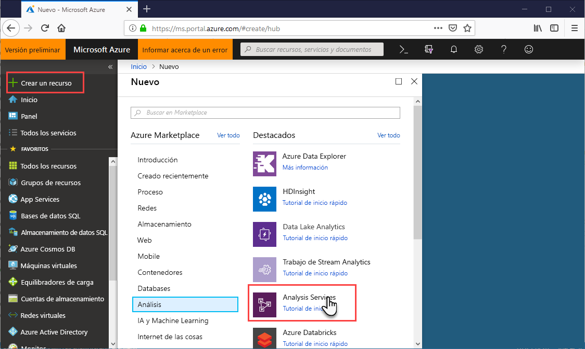
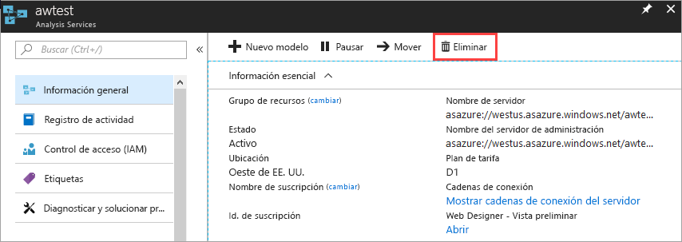

# Creación de un servidor de Analysis Services en Azure Portal
Este artículo lo guiará por la creación de un recurso de servidor de Analysis Services en la suscripción de Azure.

Antes de comenzar, necesitará lo siguiente: 

* **Suscripción de Azure**: visite [Evaluación gratuita de Azure](https://azure.microsoft.com/offers/ms-azr-0044p/) para crear una cuenta.
* **Azure Active Directory**: la suscripción debe estar asociada a un inquilino de Azure Active Directory. Además, debe estar conectado en Azure con una cuenta en ese Azure Active Directory. Para más información, consulte [Permisos de usuario y autenticación](analysis-services-manage-users.md).

## Iniciar sesión en Azure Portal 

Inicie sesión en el [Azure Portal](https://portal.azure.com)

## Creación de un servidor

1. Haga clic en **+ Crear un recurso** > **Datos y análisis** > **Analysis Services**.

    

2. En **Analysis Services**, rellene los campos obligatorios y, a continuación, presione **Crear**.
   
    
   
   * **Nombre del servidor**: escriba un nombre único que se pueda utilizar para hacer referencia al servidor.
   * **Suscripción**: seleccione la suscripción a la que este servidor se asociará.
   * **Grupo de recursos**: cree un nuevo grupo de recursos o, si ya tiene uno, selecciónelo. Los grupos de recursos están diseñados para ayudarlo a administrar una colección de recursos de Azure. Para más información, consulte [grupos de recursos](../azure-resource-manager/resource-group-overview.md).
   * **Ubicación**: esta ubicación del centro de datos de Azure hospeda el servidor. Elija una ubicación más cercana a su base de usuarios más grande.
   * **Plan de tarifa**: seleccione un plan de tarifa. Si está probando y va a instalar la base de datos modelo de ejemplo, seleccione el nivel **D1** gratuito. Para obtener más información, consulte los [precios de Azure Analysis Services](https://azure.microsoft.com/pricing/details/analysis-services/). 
    * **Administrador**: de forma predeterminada, se trata de la cuenta en que ha iniciado sesión. Puede elegir otra cuenta de Azure Active Directory.
    * **Configuración de almacenamiento de copia de seguridad**: opcional. Si ya tiene una [cuenta de almacenamiento](../storage/common/storage-introduction.md), puede especificarla como valor predeterminado para la copia de seguridad de la base de datos modelo. También puede especificar la configuración de [copia de seguridad y restauración](analysis-services-backup.md) más adelante.
    * **Caducidad de clave de almacenamiento**: opcional. Especifique un período de expiración de la clave de almacenamiento.
3. Haga clic en **Create**(Crear).

La creación suele tardar menos de un minuto. Si seleccionó **Add to Portal** (Agregar al portal), desplácese hasta el portal para ver el nuevo servidor. O bien, vaya a **Todos los servicios** > **Analysis Services** para ver si el servidor está listo.

## Limpieza de recursos
Cuando ya no lo necesite, elimine el servidor. En la **Información general** del servidor, haga clic en **Eliminar**. 

 

## Pasos siguientes

[Agregue un modelo de datos de ejemplo](analysis-services-create-sample-model.md) a su servidor.  
[Instale una puerta de enlace de datos local](analysis-services-gateway-install.md) si el modelo de datos se conecta a orígenes de datos locales.  
[Implemente un proyecto de modelo tabular](analysis-services-deploy.md) desde Visual Studio.   

