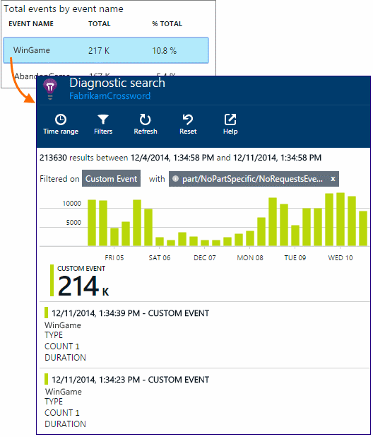
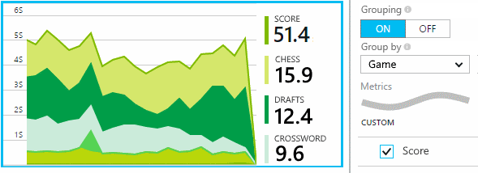
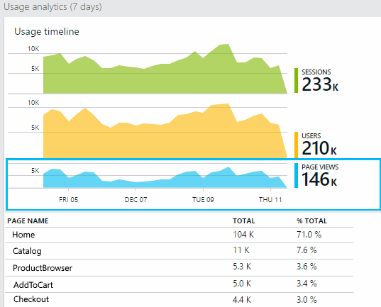

<properties 
	pageTitle="API de Application Insights para eventos y métricas personalizados" 
	description="Inserte unas cuantas líneas de código en su aplicación de dispositivo o de escritorio, página o servicio web, para realizar el seguimiento del uso y diagnosticar problemas." 
	services="application-insights"
    documentationCenter="" 
	authors="alancameronwills" 
	manager="ronmart"/>
 
<tags 
	ms.service="application-insights" 
	ms.workload="tbd" 
	ms.tgt_pltfrm="ibiza" 
	ms.devlang="na" 
	ms.topic="article" 
	ms.date="04/28/2015" 
	ms.author="awills"/>

# API de Application Insights para eventos y métricas personalizados 

*Application Insights se encuentra en su versión de vista previa.*

Inserte unas cuantas líneas de código en la aplicación para averiguar qué uso hacen de ella los usuarios, o para ayudarle a diagnosticar problemas. Puede enviar datos de telemetría desde aplicaciones de escritorio y de dispositivo y desde clientes y servidores web.

Los recopiladores de datos de Application Insights usan esta API para enviar datos de telemetría estándar como vistas de página e informes de excepciones, pero también puede usarla para enviar sus propios datos de telemetría personalizados.

## API summary

La API es uniforme en todas las plataformas, excepto por algunas pequeñas variaciones.

Método | Usado para
---|---
[`TrackPageView`](#page-views) | Páginas, pantallas, hojas o formularios
[`TrackEvent`](#track-event) | Acciones de usuario y otros eventos Se usa para realizar el seguimiento del comportamiento de los usuarios o para supervisar el rendimiento.
[`TrackMetric`](#track-metric) | Las medidas de rendimiento como las longitudes de cola no están relacionadas con eventos específicos.
[`TrackException`](#track-exception)|Excepciones de registro para diagnóstico Permite realizar el seguimiento del lugar donde se producen en relación con otros eventos y examinar los seguimientos de pila.
[`TrackRequest`](#track-request)| Permite registrar la frecuencia y duración de las solicitudes de servidor para el análisis de rendimiento.
[`TrackTrace`](#track-trace)|Mensajes de registro de diagnóstico También puede capturar registros de terceros.

Puede [adjuntar propiedades y métricas](#properties) a la mayoría de estas llamadas de telemetría.

## Antes de comenzar

Si no ha hecho esto aún:

* Agregue el SDK de Application Insights a su proyecto:
 * [Proyecto de ASP.NET][greenbrown]
 * [Proyecto de Windows][windows]
 * [Proyecto de Java][java] 
 * [JavaScript en cada página web][client]   

* En el código de servidor web o de dispositivo, incluya:

    *C#:* `using Microsoft.ApplicationInsights;`

    *VB:* `Imports Microsoft.ApplicationInsights`

    *Java:* `import com.microsoft.applicationinsights.TelemetryClient;`

## Construcción de una instancia de TelemetryClient

Construya una instancia de TelemetryClient (excepto en JavaScript en páginas web):

*C#:*

    private TelemetryClient telemetry = new TelemetryClient();

*VB:*

    Private Dim telemetry As New TelemetryClient

*Java*

    private TelemetryClient telemetry = new TelemetryClient();

Se recomienda usar una instancia de `TelemetryClient` para cada solicitud en una aplicación web, o para cada sesión en otras aplicaciones. Puede establecer propiedades tales como `TelemetryClient.Context.User.Id` para realizar el seguimiento de los usuarios y de las sesiones. Esta información se adjunta a todos los eventos enviados por la instancia.

TelemetryClient es seguro para subprocesos.

## Seguimiento de eventos

Los eventos se pueden mostrar en el [Explorador de métricas][metrics] como un recuento agregado, y también se pueden mostrar las repeticiones individuales en [Búsqueda de diagnóstico][diagnostic].

Inserte eventos en el código para contabilizar la frecuencia con que usan una determinada característica, la frecuencia con que consiguen unos determinados objetivos o la frecuencia con que realizan unas determinadas elecciones.

Por ejemplo, en una aplicación de juego, envíe un evento cada vez que un usuario gane el juego:

*JavaScript*

    appInsights.trackEvent("WinGame");

*C#*
    
    telemetry.TrackEvent("WinGame");

*VB*

    telemetry.TrackEvent("WinGame")

*Java*

    telemetry.trackEvent("WinGame");

Haga clic en el icono Eventos personalizados en la hoja de información general:

Siga haciendo clic hasta ver un gráfico de información general y una lista completa.

Seleccione el gráfico y segméntelo por el nombre de evento con el fin de ver las contribuciones relativas de los eventos más importantes.

En la lista de debajo del gráfico, seleccione un nombre de evento. Siga haciendo clic hasta ver las repeticiones individuales del evento.

Haga clic en cualquier repetición para ver más información.

## Filtrado, búsqueda y segmentación de los datos con propiedades

Puede asociar propiedades y medidas a los eventos (y también a las métricas, vistas de página y otros datos de telemetría).

Las **propiedades** son valores de cadena que se pueden usar para filtrar los datos de telemetría en los informes de uso. Por ejemplo, si su aplicación proporciona varios juegos, querrá adjuntar el nombre del juego a cada evento para así poder ver cuáles son los juegos más populares.

Hay un límite de aproximadamente 1 KB en la longitud de cadena. (Si quiere enviar fragmentos grandes de datos, use el parámetro de mensaje de [TrackTrace](#track-trace)).

Las **métricas** son valores numéricos que se pueden presentar de forma gráfica. Por ejemplo, puede que quiera ver si hay un aumento gradual en las puntuaciones que alcanzan sus jugadores. Los gráficos se pueden segmentar por las propiedades enviadas con el evento, así que podría separar o apilar los gráficos para diferentes juegos.

Los valores de métrica deben ser > = 0 para que se muestren correctamente.

*JavaScript*

    appInsights.trackEvent // or trackPageView, trackMetric, ...
      ("WinGame",
         // String properties:
         {Game: currentGame.name, Difficulty: currentGame.difficulty},
         // Numeric metrics:
         {Score: currentGame.score, Opponents: currentGame.opponentCount}
         );

*C#*

    // Set up some properties and metrics:
    var properties = new Dictionary <string, string> 
       {{"game", currentGame.Name}, {"difficulty", currentGame.Difficulty}};
    var metrics = new Dictionary <string, double>
       {{"Score", currentGame.Score}, {"Opponents", currentGame.OpponentCount}};

    // Send the event:
    telemetry.TrackEvent("WinGame", properties, metrics);

*VB*

    ' Set up some properties:
    Dim properties = New Dictionary (Of String, String)
    properties.Add("game", currentGame.Name)
    properties.Add("difficulty", currentGame.Difficulty)

    Dim metrics = New Dictionary (Of String, Double)
    metrics.Add("Score", currentGame.Score)
    metrics.Add("Opponents", currentGame.OpponentCount)

    ' Send the event:
    telemetry.TrackEvent("WinGame", properties, metrics)

*Java*
    
    Map<String, String> properties = new HashMap<String, String>();
    properties.put("game", currentGame.getName());
    properties.put("difficulty", currentGame.getDifficulty());
    
    Map<String, Double> metrics = new HashMap<String, Double>();
    metrics.put("Score", currentGame.getScore());
    metrics.put("Opponents", currentGame.getOpponentCount());
    
    telemetry.trackEvent("WinGame", properties, metrics2/7/2015 12:05:25 AM );

> [AZURE.NOTE]Tenga cuidado de no registrar información de identificación personal en las propiedades.

**Si utilizó métricas**, abra el Explorador de métricas y seleccione la métrica del grupo Personalizada:

*Si no aparece su métrica, cierre la hoja de selección, espere unos instantes y haga clic en Actualizar.*

**Si usó propiedades y métricas**, segmente la métrica por la propiedad:

**En Búsqueda de diagnóstico**, puede ver las propiedades y las métricas de repeticiones individuales de un evento.

Utilice el campo de búsqueda para ver las apariciones del evento con un valor de propiedad concreto.

[Más información sobre las cadenas de búsqueda][diagnostic]

#### Método alternativo para establecer propiedades y métricas

Si le resulta más cómodo, puede recopilar los parámetros de un evento en un objeto independiente:

    var event = new EventTelemetry();

    event.Name = "WinGame";
    event.Metrics["processingTime"] = stopwatch.Elapsed.TotalMilliseconds;
    event.Properties["game"] = currentGame.Name;
    event.Properties["difficulty"] = currentGame.Difficulty;
    event.Metrics["Score"] = currentGame.Score;
    event.Metrics["Opponents"] = currentGame.Opponents.Length;

    telemetry.TrackEvent(event);

##  Eventos cronometrados

Seguro que en ocasiones le gustaría representar el tiempo que se tarda en realizar alguna acción. Por ejemplo, puede que quiera saber cuánto tiempo tardan los usuarios en considerar las opciones de un juego.

Puede asociar datos de tiempo a eventos. En el cliente web, en lugar de llamar a trackEvent, use estas llamadas:

*JavaScript en el cliente web*

    // At the start of the game:
    appInsights.startTrackEvent(game.id);

    // At the end of the game:
    appInsights.stopTrackEvent(game.id, {GameName: game.name}, {Score: game.score});

Use la misma cadena como primer parámetro en las llamadas inicial y final.

Esta característica no está integrada en los demás SDK. Pero puede escribir su propio código, como éste:

*C#*

    var stopwatch = System.Diagnostics.Stopwatch.StartNew();

    // ... perform the timed action ...

    stopwatch.Stop();

    var metrics = new Dictionary <string, double>
       {{"processingTime", stopwatch.Elapsed.TotalMilliseconds}};

    // Set up some properties:
    var properties = new Dictionary <string, string> 
       {{"signalSource", currentSignalSource.Name}};

    // Send the event:
    telemetry.TrackEvent("SignalProcessed", properties, metrics);

## Seguimiento de métricas

Use TrackMetric para enviar métricas que no están asociadas a eventos concretos. Por ejemplo, puede supervisar una longitud de cola a intervalos regulares.

Las métricas se muestran como gráficos estadísticos en el Explorador de métricas, pero a diferencia de los eventos, no puede buscar repeticiones individuales en Búsqueda de diagnóstico.

Los valores de métrica deben ser > = 0 para que se muestren correctamente.

*JavaScript*

    appInsights.trackMetric("Queue", queue.Length);

*C#*

    telemetry.TrackMetric("Queue", queue.Length);

*VB*

    telemetry.TrackMetric("Queue", queue.Length)

*Java*

    telemetry.trackMetric("Queue", queue.Length);

De hecho, puede realizar esta operación en un subproceso en segundo plano:

*C#*

    private void Run() {
     var appInsights = new TelemetryClient();
     while (true) {
      Thread.Sleep(60000);
      appInsights.TrackMetric("Queue", queue.Length);
     }
    }

Para ver los resultados, abra el Explorador de métricas y agregue un nuevo gráfico. Configúrelo para que muestre su métrica.

## Vistas de página

En una aplicación de dispositivo o de página web, se envían datos de telemetría de la vista de página de forma predeterminada cuando se carga cada pantalla o página. Sin embargo, puede cambiar esta frecuencia para que se realice el seguimiento de las vistas de página en momentos diferentes o adicionales. Por ejemplo, en una aplicación que muestra pestañas u hojas, quizás quiera realizar el seguimiento de una "página" siempre que el usuario abra una nueva hoja.

Los datos de usuario y de sesión se envían como propiedades junto con las vistas de página, así que los gráficos de usuario y de sesión se activan cuando hay datos de telemetría de vistas de página.

#### Vistas de página personalizadas

*JavaScript*

    appInsights.trackPageView("tab1");

*C#*

    telemetry.TrackPageView("GameReviewPage");

*VB*

    telemetry.TrackPageView("GameReviewPage")

Si tiene varias fichas dentro de páginas HTML diferentes, puede especificar también la dirección URL:

    appInsights.trackPageView("tab1", "http://fabrikam.com/page1.htm");

#### Vistas de página cronometradas

Mediante el uso de estas dos llamadas a método de trackPageView, puede analizar cuánto tiempo permanecen los usuarios en sus páginas.

    // At the start of a page view:
    appInsights.startTrackPage(myPage.name);

    // At the completion of a page view:
    appInsights.stopTrackPage(myPage.name, "http://fabrikam.com/page", properties, measurements);

Use la misma cadena como primer parámetro en las llamadas inicial y final.

Examine la métrica de Duración de la página en el [Explorador de métricas][metrics].

## Seguimiento de solicitudes

Este método lo usa el SDK del servidor para registrar las solicitudes HTTP.

También puede llamarlo usted mismo si quiere simular solicitudes en un contexto en el que no se está ejecutando el módulo de servicio web.

*C#*

    // At start of processing this request:

    // Operation Id is attached to all telemetry and helps you identify
    // telemetry associated with one request:
    telemetry.Context.Operation.Id = Guid.NewGuid().ToString();
    
    var stopwatch = System.Diagnostics.Stopwatch.StartNew();

    // ... process the request ...

    stopwatch.Stop();
    telemetryClient.TrackRequest(requestName, DateTime.Now,
       stopwatch.Elapsed, 
       "200", true);  // Response code, success

## Seguimiento de excepciones

Envíe excepciones a Application Insights para [contabilizarlas][metrics], como una indicación de la frecuencia de un problema y para [examinar todas las repeticiones individuales][diagnostic].

*C#*

    try
    {
        ...
    }
    catch (Exception ex)
    {
       telemetry.TrackException(ex);
    }

En las aplicaciones móviles de Windows, el SDK detecta las excepciones no controladas, así que no tiene que registrarlas.

## Seguimiento de seguimientos 

Use este método para ayudar a diagnosticar problemas mediante el envío de una ’ruta de exploración’ a Application Insights. Puede enviar fragmentos de datos de diagnóstico e inspeccionarlos en [Búsqueda de diagnóstico][diagnostic].

 

Los [adaptadores de registro][trace] usan esta API para enviar registros de terceros al portal.

*C#*

    telemetry.TrackTrace(message, SeverityLevel.Warning, properties);

El límite de tamaño en `message` es mucho mayor que el límite en propiedades. Puede buscar en el contenido del mensaje, pero (a diferencia de los valores de propiedad) no puede filtrar por él.

## Establecimiento de las propiedades predeterminadas para todos los datos de telemetría

Puede configurar un inicializador universal para que todos los TelemetryClients nuevos usen automáticamente el contexto.

Aquí se incluyen los datos de telemetría estándar enviados por los módulos de telemetría específicos de la plataforma, como el seguimiento de solicitudes de servidor web.

*C#*

    // Telemetry initializer class
    public class MyTelemetryInitializer : IContextInitializer
    {
        public void Initialize (TelemetryContext context)
        {
            context.Properties["AppVersion"] = "v2.1";
        }
    }

    // In the app initializer such as Global.asax.cs:

    protected void Application_Start()
    {
        // ...
        TelemetryConfiguration.Active.ContextInitializers
        .Add(new MyTelemetryInitializer());
    }

*Java*

    import com.microsoft.applicationinsights.extensibility.ContextInitializer;
    import com.microsoft.applicationinsights.telemetry.TelemetryContext;

    public class MyTelemetryInitializer implements ContextInitializer {
      @Override
      public void initialize(TelemetryContext context) {
        context.getProperties().put("AppVersion", "2.1");
      }
    }

    // load the context initializer
    TelemetryConfiguration.getActive().getContextInitializers().add(new MyTelemetryInitializer());

## Establecimiento de la clave de instrumentación en el código para todos los datos de telemetría

En lugar de obtener la clave de instrumentación del archivo de configuración, puede establecerla en el código. Se recomienda hacer esto para, por ejemplo, enviar datos de telemetría de instalaciones de prueba a un recurso de Application Insights diferente al de los datos de telemetría de la aplicación activa.

Establezca la clave en un método de inicialización, como global.aspx.cs en un servicio de ASP.NET:

*C#*

    protected void Application_Start()
    {
      Microsoft.ApplicationInsights.Extensibility.
        TelemetryConfiguration.Active.InstrumentationKey = 
          // - for example -
          WebConfigurationManager.Settings["ikey"];
      ...

*JavaScript*

    appInsights.config.instrumentationKey = myKey; 

En páginas web, podría configurarla a partir del estado del servidor web, en lugar de codificarla literalmente en el script. Por ejemplo, en una página web generada en una aplicación ASP.NET:

*JavaScript en Razor*

    <script type="text/javascript">
    // Standard Application Insights web page script:
    var appInsights = window.appInsights || function(config){ ...
    // Modify this part:
    }({instrumentationKey:  
      // Generate from server property:
      @Microsoft.ApplicationInsights.Extensibility.
         TelemetryConfiguration.Active.InstrumentationKey"
    }) // ...

## Establecimiento de valores predeterminados para los datos de telemetría personalizados seleccionados

Si quiere establecer valores de propiedad predeterminados para algunos de los eventos personalizados que escriba, puede hacerlo en una instancia de TelemetryClient. Se adjuntarán a cada elemento de telemetría enviado desde ese cliente.

*C#*

    using Microsoft.ApplicationInsights.DataContracts;

    var gameTelemetry = new TelemetryClient();
    gameTelemetry.Context.Properties["Game"] = currentGame.Name;
    // Now all telemetry will automatically be sent with the context property:
    gameTelemetry.TrackEvent("WinGame");
    
*VB*

    Dim gameTelemetry = New TelemetryClient()
    gameTelemetry.Context.Properties("Game") = currentGame.Name
    ' Now all telemetry will automatically be sent with the context property:
    gameTelemetry.TrackEvent("WinGame")

*Java*

    import com.microsoft.applicationinsights.TelemetryClient;
    import com.microsoft.applicationinsights.TelemetryContext;
    ...

    TelemetryClient gameTelemetry = new TelemetryClient();
    TelemetryContext context = gameTelemetry.getContext();
    context.getProperties().put("Game", currentGame.Name);
    
    gameTelemetry.TrackEvent("WinGame");
    
Las llamadas de telemetría individuales pueden invalidar los valores predeterminados en los diccionarios de propiedad.

##  Establecimiento de la clave de instrumentación para datos de telemetría personalizados seleccionados

*C#*
    
    var telemetry = new TelemetryClient();
    telemetry.Context.InstrumentationKey = "---my key---";
    // ...

## Deshabilitación de los datos de telemetría estándar

También puede [deshabilitar partes seleccionadas de los datos de telemetría estándar][config] editando `ApplicationInsights.config`. Podría hacer esto, por ejemplo, si quiere enviar sus propios datos de TrackRequest.

[Más información][config].

## Modo de programador

Durante la depuración, resulta útil enviar los datos de telemetría por la canalización para así poder ver los resultados inmediatamente. También puede recibir mensajes adicionales que le ayuden a realizar el seguimiento de los posibles problemas con la telemetría. Desactívelo en producción, ya que puede ralentizar la aplicación.

*C#*
    
    TelemetryConfiguration.Active.TelemetryChannel.DeveloperMode = true;

*VB*

    TelemetryConfiguration.Active.TelemetryChannel.DeveloperMode = True

## Documentos de referencia

* [Referencia de ASP.NET](https://msdn.microsoft.com/library/dn817570.aspx)
* [Referencia de Java](http://dl.windowsazure.com/applicationinsights/javadoc/)

* *P: ¿Hay una API de REST?*

    Sí, pero aún no está publicada.

## Pasos siguientes

[Búsqueda de eventos y registros][diagnostic]

[Solución de problemas][qna]

<!--Link references-->

[client]: app-insights-javascript.md
[config]: app-insights-configuration-with-applicationinsights-config.md
[diagnostic]: app-insights-diagnostic-search.md
[greenbrown]: app-insights-start-monitoring-app-health-usage.md
[java]: app-insights-java-get-started.md
[metrics]: app-insights-metrics-explorer.md
[qna]: app-insights-troubleshoot-faq.md
[trace]: app-insights-search-diagnostic-logs.md
[windows]: app-insights-windows-get-started.md

<!---HONumber=58-->