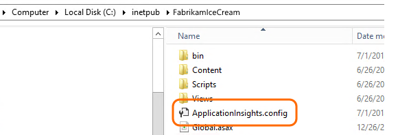

<properties 
	pageTitle="Diagnostique problemas de rendimiento en un sitio web en ejecución" 
	description="Supervise el rendimiento de un sitio web sin volver a implementarlo. Uso independiente o con el SDK de Application Insights" 
	services="application-insights" 
	authors="alancameronwills" 
	manager="kamrani"/>

<tags 
	ms.service="application-insights" 
	ms.workload="tbd" 
	ms.tgt_pltfrm="ibiza" 
	ms.devlang="na" 
	ms.topic="article" 
	ms.date="2015-01-23" 
	ms.author="awills"/>
 

# Supervisión inmediata del rendimiento en un sitio web activo

*Application Insights se encuentra en su versión de vista previa.*

¿La aplicación web se comporta de manera errónea? Diagnostique con rapidez las excepciones y los problemas de rendimiento sin volver a crearla o implementarla. Instale el agente Application Insights en el servidor y podrá encontrar cuellos de botella de rendimiento y obtener seguimientos de la pila para todas las excepciones. 

#### ¿Cuándo debo utilizar este método para configurar Application Insights?

Este método se utiliza fundamentalmente para diagnosticar rápidamente los problemas de rendimiento en un sitio web activo de IIS.

Solo instale un agente en el servidor y consulte los datos de rendimiento en Application Insights.

- Puede aplicarlo a una aplicación ASP .NET hospedada en un servidor de IIS.

- Necesita una [cuenta de Microsoft Azure](http://azure.com) para ver los datos.

- Necesitará acceso de administrador en el servidor donde se está ejecutando la aplicación web. 

- *No* necesita el código de la aplicación web y no tiene que volver a crear o implementar la aplicación. 

- Este método instrumenta la aplicación web actual. No introduzca código de seguimiento o de registro. (Pero puede hacerlo en otro momento si lo desea).

Si desea insertar seguimientos de registro o diagnóstico, no continúe aquí; en su lugar, [agregue Application Insights al proyecto][greenbrown] y vuelva a implementarlo. Para la gama completa de opciones, lea la [introducción de Application Insights][start].

## Instalación del agente Application Insights en el servidor web

1. En el servidor web, inicie sesión con las credenciales de administrador.

2. Asegúrese de que cuenta con la versión 5.0 o posterior del [instalador de la plataforma web](http://www.microsoft.com/web/downloads/platform.aspx).
3. Instale el agente Application Insights, utilizando el instalador de la plataforma web.

    
4. En el asistente de instalación, inicie sesión en Microsoft Azure.

    
5. Seleccione la aplicación web instalada o sitio web que desea supervisar y, a continuación, configure el nombre bajo el cual desea ver los resultados del portal Application Insights. Finalmente, haga clic en el botón "Agregar".

    

    Normalmente, debe elegir crear un nuevo recurso.

    Puede usar un recurso existente si, por ejemplo, ya ha configurado [pruebas web][availability] para el sitio.  

6. Tenga en cuenta que ApplicationInsights.config se ha insertado en los sitios web que desea supervisar.

    

   También hay algunos cambios en web.config.

### ¿Desea (volver a) configurarlo después?

Una vez completado el asistente, puede volver a configurar el agente siempre que lo desee. También puede utilizarlo si ha instalado el agente pero hay algún problema con la configuración inicial.

## Consulta de los datos

Abra su cuenta en Azure, busque Application Insights y abra los recursos que ha creado

Verá los datos en Estado de la aplicación.

#### ¿No hay datos?

  * Utilice su sitio para generar algunos datos.
  * Espere unos minutos para dejar que lleguen los datos.
  * Asegúrese de que el firewall del servidor permite el tráfico saliente en el puerto 443 a dc.services.visualstudio.com 

#### ¿Qué puedo hacer con los informes de estado de la aplicación?
 * [Comprender los datos y configurar los iconos][perf]

## Pasos siguientes

[Consulta de datos][perf]

[Buscar registros de diagnóstico][diagnostic]

[Pruebas web][availability]

[Configuración de la supervisión de uso][start]

[Solución de problemas][qna]

[AZURE.INCLUDE [app-insights-learn-more](../includes/app-insights-learn-more.md)]

<!--HONumber=46--> 

<!--HONumber=46--> 
