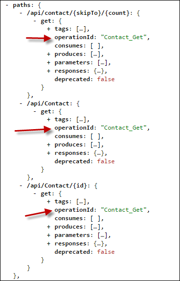

<properties 
	pageTitle="Personalización de los identificadores de operación generados por Swashbuckle" 
	description="Aprenda a personalizar los identificadores de operación de Swagger generados por Swashbuckle para una aplicación de API del Servicio de aplicaciones de Azure." 
	services="app-service\api" 
	documentationCenter=".net" 
	authors="bradygaster" 
	manager="wpickett" 
	editor="jimbe"/>

<tags 
	ms.service="app-service-api" 
	ms.workload="web" 
	ms.tgt_pltfrm="dotnet" 
	ms.devlang="na" 
	ms.topic="article" 
	ms.date="05/16/2015" 
	ms.author="bradyg"/>

# Personalización de los identificadores de operación generados por Swashbuckle 

## Información general

Swashbuckle genera identificadores de operación de Swagger concatenando el nombre del controlador y el nombre del método. Este patrón ocasiona un problema cuando se tienen varias sobrecargas de un método: Swashbuckle genera identificadores de operación duplicados, lo cual supone un JSON de Swagger no válido.

Por ejemplo, el siguiente código de controlador hace que Swashbuckle genere tres identificadores de operación Contact_Get.

Puede solucionar el problema manualmente proporcionando a los métodos nombres únicos, como el siguiente en este ejemplo:

* Obtener
* GetById
* GetPage

La alternativa es ampliar Swashbuckle para que genere automáticamente identificadores de operación únicos. En este artículo se muestra cómo hacerlo.

## Ampliación de Swashbuckle 

Los pasos siguientes muestran cómo personalizar Swashbuckle mediante el archivo *SwaggerConfig.cs*, que se incluye en el proyecto, usando la plantilla de proyecto de vista previa de aplicaciones de API de Visual Studio. También puede personalizar Swashbuckle en un proyecto  de API web que configure para implementarlo como una aplicación de API.

1. Creación de una implementación de `IOperationFilter` personalizada 

	La interfaz de `IOperationFilter` proporciona un punto de extensibilidad para los usuarios de Swashbuckle que quieran personalizar varios aspectos del proceso de metadatos de Swagger. El código siguiente demuestra un método para cambiar el comportamiento de generación de identificadores de operación. El código anexa los nombres de parámetro al nombre de identificador de operación.

		using Swashbuckle.Swagger;
		using System.Web.Http.Description;
		
		namespace ContactsList
		{
		    public class MultipleOperationsWithSameVerbFilter : IOperationFilter
		    {
		        public void Apply(
		            Operation operation,
		            SchemaRegistry schemaRegistry,
		            ApiDescription apiDescription)
		        {
		            if (operation.parameters != null)
		            {
		                operation.operationId += "By";
		                foreach (var parm in operation.parameters)
		                {
		                    operation.operationId += string.Format("{0}",parm.name);
		                }
		            }
		        }
		    }
		}

2. En el archivo *App_Start\SwaggerConfig.cs*, llame al método `OperationFilter` para hacer que Swashbuckle use la nueva implementación de `IOperationFilter`.

		c.OperationFilter<MultipleOperationsWithSameVerbFilter>();

	

	El archivo *SwaggerConfig.cs* que incluye el paquete NuGet de Swashbuckle contiene muchos ejemplos comentados de puntos de extensibilidad. Aquí no se muestran los comentarios adicionales.

	Después de realizar este cambio, se usa su implementación de `IOperationFilter` y da lugar a que se generen identificadores de operación únicos.
 
	

## Pasos siguientes

En este artículo se ha mostrado cómo personalizar Swashbuckle para hacer que genere identificadores de operación únicos. Para obtener más información, consulte [Swashbuckle en GitHub](https://github.com/domaindrivendev/Swashbuckle).

<!---HONumber=58-->