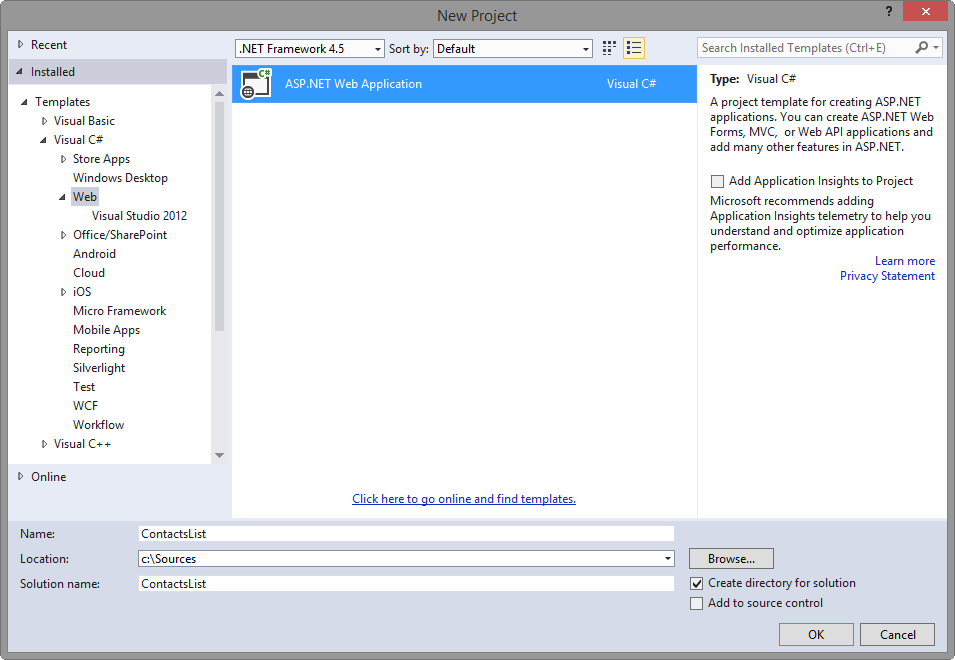

<properties 
	pageTitle="Creación de una aplicación de API del Servicio de aplicaciones de Azure" 
	description="En este artículo se muestra cómo usar Visual Studio 2013 para crear una aplicación de API del Servicio de aplicaciones de Azure." 
	services="app-service\api" 
	documentationCenter=".net" 
	authors="bradygaster" 
	manager="wpickett" 
	editor="jimbe"/>

<tags 
	ms.service="app-service-api" 
	ms.workload="web" 
	ms.tgt_pltfrm="dotnet" 
	ms.devlang="na" 
	ms.topic="article" 
	ms.date="02/19/2015" 
	ms.author="bradyg;tarcher"/>

# Crear una aplicación de API en el Servicio de aplicaciones de Azure

## Información general

Este es el primer tutorial de una serie de tres, que le permitirán empezar a trabajar con aplicaciones de API en el Servicio de aplicaciones de Azure.

1. En este tutorial, creará una nueva aplicación de API y la preparará para implementarla en su suscripción de Azure. 
* En [Implementación de una aplicación de API](app-service-dotnet-create-api-app.md), se implementa la aplicación de API en la suscripción de Azure.
* En [Depuración de una aplicación de API](app-service-dotnet-remotely-debug-api-app.md), se usa Visual Studio para depurar el código de forma remota mientras se ejecuta en Azure.

[AZURE.INCLUDE [install-sdk-2013-only](../includes/install-sdk-2013-only.md)]

## Creación de la primera aplicación de API ##

Abra Visual Studio 2013 y seleccione **Archivo > Nuevo proyecto**. Seleccione la plantilla **Aplicación Web ASP.NET**,  asigne el nombre *ContactsList* al proyecto y haga clic en **Aceptar**.

Seleccione la plantilla del proyecto **Aplicación de API de Azure** y haga clic en **Aceptar**.

Haga clic con el botón secundario en la carpeta **Modelos** del proyecto de API y, a continuación, en el menú contextual, seleccione **Agregar > Clase**. 

 

Asigne el nombre *Contact.cs* al nuevo archivo y haga clic en **Agregar**. 

 

Reemplace todo el contenido del archivo con el código siguiente. 

	namespace ContactsList.Models
	{
		public class Contact
		{
			public int Id { get; set; }
			public string Name { get; set; }
			public string EmailAddress { get; set; }
		}
	}

Haga clic con el botón secundario en la carpeta **Controladores** y, a continuación, en el menú contextual, seleccione **Agregar > Controlador**. 

En el cuadro de diálogo **Agregar scaffold**, seleccione la opción **Controlador de Web API 2: Vacío** y haga clic en **Agregar**. 

Asigne el nombre **ContactsController** al controlador y haga clic en **Agregar**. 

Reemplace el código de este archivo con el código siguiente. 

	using ContactsList.Models;
	using System;
	using System.Collections.Generic;
	using System.Linq;
	using System.Net;
	using System.Net.Http;
	using System.Threading.Tasks;
	using System.Web.Http;
	
	namespace ContactsList.Controllers
	{
	    public class ContactsController : ApiController
	    {
	        [HttpGet]
	        public IEnumerable<Contact> Get()
	        {
	            return new Contact[]{
					new Contact { Id = 1, EmailAddress = "barney@contoso.com", Name = "Barney Poland"},
					new Contact { Id = 2, EmailAddress = "lacy@contoso.com", Name = "Lacy Barrera"},
                	new Contact { Id = 3, EmailAddress = "lora@microsoft.com", Name = "Lora Riggs"}
	            };
	        }
	    }
	}

Los proyectos de aplicaciones de API están habilitados con la generación automática de metadatos [Swagger](http://swagger.io/ "Official Swagger information") y una página de prueba de API. De forma predeterminada, la página de prueba de API está deshabilitada. Para habilitarla, abra el archivo *App_Start/SwaggerConfig.cs*. Busque **EnableSwaggerUI**:

Quite la marca de comentario de las líneas de código siguientes:

        })
    .EnableSwaggerUi(c =>
        {

Cuando termine, el archivo debería tener el aspecto siguiente en Visual Studio 2013.

Para ver la página de prueba de API, ejecute la aplicación localmente y vaya a `/swagger`. 

Haga clic en el botón **Try it out** (Probarlo). Verá que la API funciona y devuelve el resultado esperado. 

## Pasos siguientes

La aplicación de API ya está lista para implementarse. Para ello, puede seguir el tutorial [Implementación de una aplicación de API](app-service-dotnet-deploy-api-app.md).

Para obtener más información, consulte [¿Qué son las aplicaciones de API?](app-service-api-apps-why-best-platform.md)

<!--HONumber=49-->