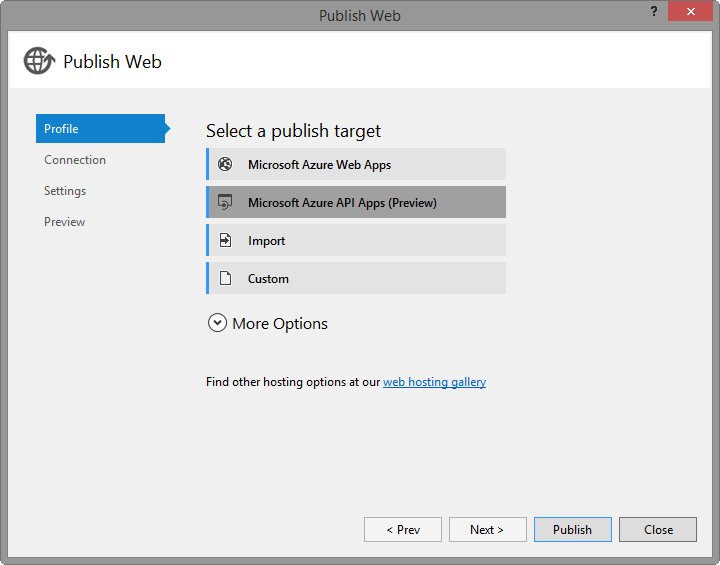
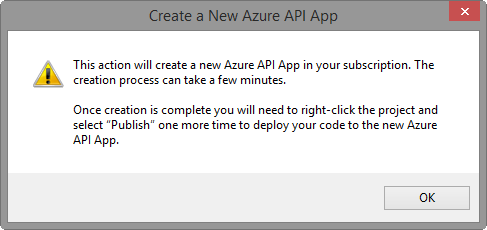
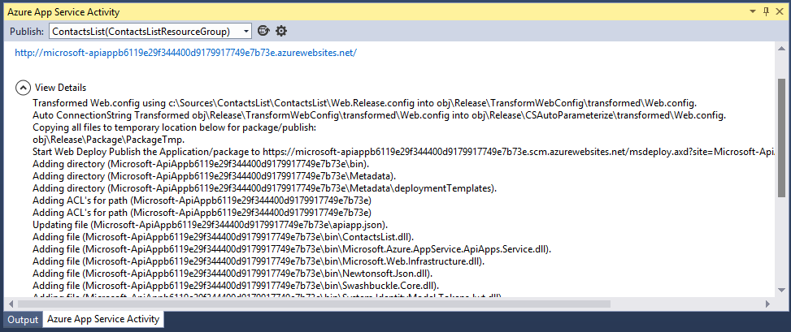
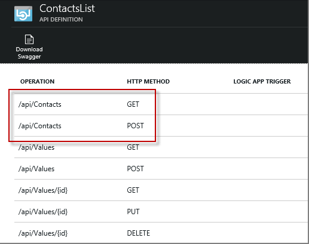

<properties 
	pageTitle="Implementación de una aplicación de API del Servicio de aplicaciones de Azure" 
	description="Aprenda a implementar un proyecto de aplicación de API en su suscripción de Azure." 
	services="app-service\api" 
	documentationCenter=".net" 
	authors="bradygaster" 
	manager="wpickett" 
	editor="jimbe"/>

<tags 
	ms.service="app-service-api" 
	ms.workload="web" 
	ms.tgt_pltfrm="dotnet" 
	ms.devlang="na" 
	ms.topic="article" 
	ms.date="02/19/2015" 
	ms.author="bradyg;tarcher"/>

# Implementación de una aplicación de API del Servicio de aplicaciones de Azure

## Información general

Si está desarrollando activamente su propia aplicación de API con Visual Studio y necesita probar la API en la nube, puede crear una nueva aplicación de API en su suscripción de Azure e implementar el código con las cómodas características de implementación del Servicio de aplicaciones de Visual Studio. 

Este es el segundo tutorial de una serie de tres:

1. En [Creación de una API de aplicación](app-service-dotnet-create-api-app.md) creó un proyecto de aplicación de API. 
* En este tutorial, implementará la aplicación de API en su suscripción de Azure.
* En [Depuración de una aplicación de API](app-service-dotnet-remotely-debug-api-app.md), usará Visual Studio para depurar el código de forma remota mientras se ejecuta en Azure.

## Implementación de aplicaciones de API 

En **el Explorador de soluciones**, haga clic en el proyecto (no la solución) y en **Publicar...**. 

Haga clic en la pestaña **Perfil** y en **Aplicaciones de API de Microsoft Azure (vista previa)**. 

Haga clic en **Nuevo** para aprovisionar una nueva aplicación de API en su suscripción de Azure.

En el cuadro de diálogo **Crear una aplicación de API**, escriba lo siguiente:

- En **Nombre de la aplicación de API**, escriba un nombre para la aplicación. 
- Si tiene varias suscripciones de Azure, seleccione la que desee usar.
-En el Plan del Servicio de aplicaciones, seleccione de entre los planes del Servicio de aplicaciones o elija **Crear nuevo plan del Servicio de aplicaciones** y escriba el nombre de un nuevo plan. 
- En **Grupo de recursos**, seleccione de entre los grupos de recursos existentes o elija **Crear nuevo grupo de recursos** y escriba un nombre. El nombre debe ser único; considere la posibilidad de usar el nombre de la aplicación como un prefijo y anexe información personal como el identificador de Microsoft (sin el signo @).  
- En **Nivel de acceso**, seleccione **Disponible para cualquier persona**. Con esta opción, la API será totalmente pública, lo cual está bien para este tutorial. Puede restringir el acceso más adelante a través del Portal de Azure.
- Seleccione una región.  

Haga clic en **Aceptar** para crear la aplicación de API en su suscripción. El proceso puede tardar unos minutos, por lo que Visual Studio muestra un cuadro de diálogo que le notifica que se ha iniciado el proceso. 

El proceso de aprovisionamiento crea el grupo de recursos y la aplicación de API en su suscripción de Azure. Visual Studio muestra el progreso en la ventana **Actividad del Servicio de aplicaciones de Azure**. 

Una vez que se ha aprovisionado la aplicación de API, haga clic con el botón secundario en el proyecto en el Explorador de soluciones y seleccione **Publicar** para volver a abrir el cuadro de diálogo de publicación. El perfil de publicación que creó en el paso anterior debe estar preseleccionado. Haga clic en **Publicar** para comenzar el proceso de implementación. 

La ventana **Actividad del Servicio de aplicaciones de Azure** muestra el progreso de la implementación. 

## Visualización de aplicaciones en el Portal de Azure

En esta sección, se desplazará al portal para ver la configuración básica disponible para las aplicaciones de API y realizar cambios iterativos en su aplicación de API. Con cada implementación, el portal reflejará los cambios que está realizando en la aplicación de API. 

En el explorador, vaya al [Portal de Azure](https://portal.azure.com). 

Haga clic en el botón **Examinar** de la barra lateral y seleccione **Aplicaciones de API**.

Seleccione la API que creó en la lista de aplicaciones de API de su suscripción.

Haga clic en **Definición de API**. La hoja **Definición de API** de la aplicación muestra la lista de operaciones de API que definió al crear la aplicación. 

Ahora vuelva al proyecto en Visual Studio. Agregue el siguiente código al archivo **ContactsController.cs**.  

	[HttpPost]
	public HttpResponseMessage Post([FromBody] Contact contact)
	{
		// todo: save the contact somewhere
		return Request.CreateResponse(HttpStatusCode.Created);
	}

Este código agrega un método **Post** que se puede usar para registrar nuevas instancias de `Contacto` en la API. 

En el **Explorador de soluciones**, haga clic con el botón secundario en el proyecto y, a continuación, seleccione **Publicar**. 

Seleccione la configuración **Depurar** del menú desplegable **Configuración** y haga clic en **Publicar** para volver a implementar la aplicación de API. 

En la pestaña **Vista previa** del asistente **Publicación web**, haga clic en **Publicar**.  

Cuando haya completado el proceso de publicación, vuelva al portal y cierre y vuelva a abrir la hoja **Definición de API**. Verá el nuevo extremo de API que acaba de crear e implementar directamente en su suscripción de Azure.

## Pasos siguientes

Ha visto cómo las capacidades de implementación directa en Visual Studio facilitan la iteración y la implementación rápida y prueban que la API funcione correctamente. En el [siguiente tutorial](app-service-dotnet-remotely-debug-api-app.md), aprenderá a depurar la aplicación de API mientras se ejecuta en Azure.

<!--HONumber=49-->