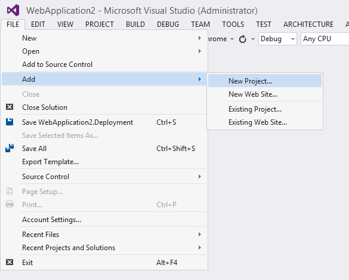
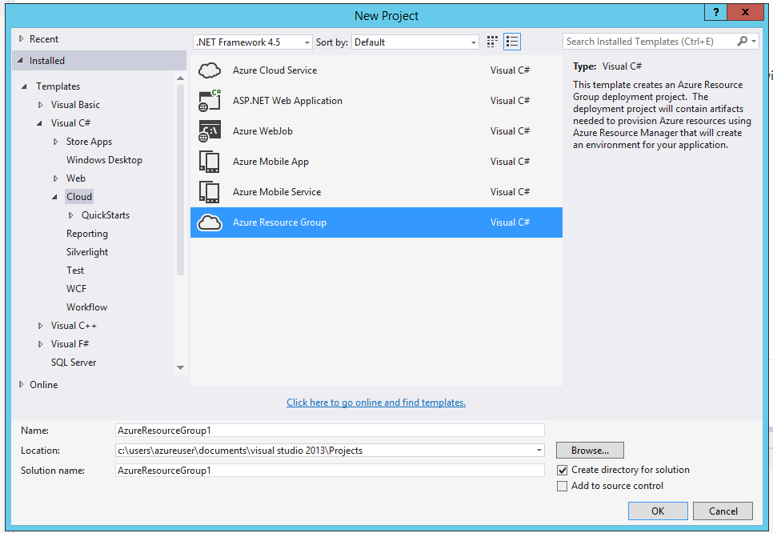
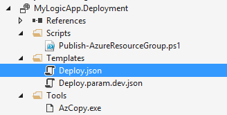
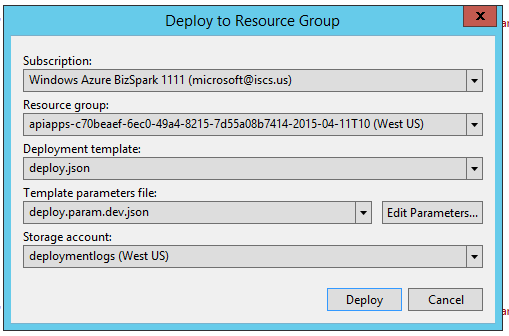

<properties 
	pageTitle="Implementación desde Visual Studio" 
	description="Cree un proyecto de Visual Studio para administrar la aplicación lógica." 
	authors="stepsic-microsoft-com" 
	manager="dwrede" 
	editor="" 
	services="app-service\logic" 
	documentationCenter=""/>

<tags
	ms.service="app-service-logic"
	ms.workload="integration"
	ms.tgt_pltfrm="na"
	ms.devlang="na"
	ms.topic="article"
	ms.date="04/26/2015"
	ms.author="stepsic"/>
	
# Implementación desde Visual Studio

Aunque el [Portal de Azure](https://portal.azure.com) le ofrece una excelente manera de diseñar y administrar las aplicaciones lógicas, es posible que también desee implementar la aplicación lógica desde Visual Studio. Hay un par de capacidades clave que lo habilitan:

- Almacene la aplicación lógica junto con los demás recursos de la solución, de manea que pueda contener todos los aspectos de la aplicación.
- Mantenga la definición de aplicación lógica protegida en el control de código fuente para poder usar TFS o Git para realizar revisiones en la aplicación 

Debe tener el SDK de Azure 2.6 instalado para seguir los pasos que se describen a continuación. Busque [el último SDK para VS](http://azure.microsoft.com/downloads/) aquí.

## Creación de un proyecto

1. Vaya al menú **Archivo** y seleccione **Nuevo** \> **Proyecto** \(o bien, vaya a **Agregar** y, a continuación, seleccione **Nuevo proyecto** para agregarlo a una solución existente\). 

2. En el cuadro de diálogo, busque **Nube** y, a continuación, seleccione **Grupo de recursos de Azure**. Escriba un **nombre** y, a continuación, haga clic en **Aceptar**. 

3. Ahora debe seleccionar si desea una **Aplicación lógica** o **Aplicación lógica + Aplicación de API**. Seleccionar **aplicación lógica** requiere que apunte a la API existente. Si selecciona **Aplicación lógica + Aplicación de API**, también puede crear una aplicación de API nueva y vacía al mismo tiempo. 

4. Una vez haya seleccionado la **Plantilla**, elija **Aceptar**.

Ahora el proyecto de aplicación lógica se agregará a la solución. Debería ver la implementación en el Explorador de soluciones: 

## Configuración de la aplicación lógica

Una vez que tenga un proyecto, puede modificar la definición de la aplicación lógica en VS. Haga clic en el archivo JSON en el Explorador de soluciones. Verá una definición de marcador de posición que puede rellenar con lógica de la aplicación.

Se recomienda que use **parámetros** en la definición. Esto es útil si desea implementar un entorno de desarrollo y uno de producción. En ese caso, debe colocar la configuración específica del entorno en el `.param` archivo y los parámetros en lugar de las cadenas reales.

En la actualidad, Visual Studio no tiene un diseñador integrado, por lo que si desea usar una interfaz gráfica \(en lugar de escribir JSON\), deberá usar el Portal de Azure.

Si previamente ha creado una aplicación lógica en el Portal de Azure y ahora desea protegerla en el control de código fuente, puede: - Ir a **vista código** en el portal y copiar la definición. - Usar las [API de REST](https://msdn.microsoft.com/library/azure/dn948510.aspx) de las aplicaciones lógicas para obtener la definición. - Usar [Powershell del Administrador de recursos de Azure](powershell-azure-resource-manager.md), concretamente el [`Get-AzureResource` comando](https://msdn.microsoft.com/library/dn654579.aspx) para descargar la definición.

## Implementación de la aplicación lógica

Finalmente, después de configurar la aplicación, puede realizar la implementación directamente desde Visual Studio en un par de pasos.

1. Haga doble clic en la implementación en el Explorador de soluciones y vaya a **Implementar** \> **Nueva implementación...** 

2. Se le indicará que inicie sesión en sus suscripciones de Azure.

3. Ahora debe elegir los detalles del grupo de recursos en los que desea implementar la aplicación lógica. 

    Asegúrese de seleccionar los archivos de plantilla y parámetros correctos para el grupo de recursos \(por ejemplo, si va a realizar la implementación en un entorno de producción, elegirá el archivo de parámetros de producción\).
    
4. Aparecerá el estado de la implementación en la ventana **Salida** \(puede que deba elegir **Aprovisionamiento de Azure**. 

En el futuro puede revisar la aplicación lógica en el control de código fuente y usar Visual Studio para implementar versiones nuevas. Tenga en cuenta que si modifica directamente la definición en el Portal de Azure, la próxima vez que realice la implementación desde Visual Studio, estos cambios se invalidarán.

Si no desea usar Visual Studio, pero desea tener herramientas para implementar la aplicación lógica del control de código fuente, siempre puede usar la [API](https://msdn.microsoft.com/library/azure/dn948510.aspx) o [Powershell](powershell-azure-resource-manager.md) para automatizar directamente las implementaciones.
<!--HONumber=54-->