# <a name="create-an-aspnet-framework-web-app-in-azure"></a>Creación de una aplicación web de ASP.NET Framework en Azure

[Azure Web Apps](app-service-web-overview.md) proporciona un servicio de hospedaje web muy escalable y con aplicación de revisiones de un modo automático.  Esta guía de inicio rápido muestra cómo implementar su primera aplicación web ASP.NET en Azure Web Apps. Cuando haya terminado, tendrá un grupo de recursos que consta de un plan de App Service y una aplicación web de Azure con una aplicación web implementada.

Vea el vídeo para ver este inicio rápido en acción y, a continuación, siga los pasos para publicar su primera aplicación de .NET en Azure.

> [!VIDEO https://channel9.msdn.com/Shows/Azure-for-NET-Developers/Create-a-NET-app-in-Azure-Quickstart/player]

[!INCLUDE [quickstarts-free-trial-note](../../includes/quickstarts-free-trial-note.md)]

## <a name="prerequisites"></a>requisitos previos

Para completar este tutorial:

* Instalar <a href="https://www.visualstudio.com/downloads/" target="_blank">Visual Studio 2017</a> con las cargas de trabajo siguientes:
    - **ASP.NET y desarrollo web**
    - **Desarrollo de Azure**

    

Si ya ha instalado Visual Studio, agregue las cargas de trabajo en Visual Studio, para lo que debe hacer clic en **Herramientas** > **Get Tools and Features** (Obtener herramientas y características).

## <a name="create-an-aspnet-web-app"></a>Creación de una aplicación web de ASP.NET

Cree un proyecto nuevo en Visual Studio seleccionando **Archivo > Nuevo > Proyecto**. 

En el cuadro de diálogo **Nuevo proyecto**, seleccione **Visual C# > Web > Aplicación web ASP.NET (.NET Framework)**.

Asigne a la aplicación el nombre _myFirstAzureWebApp_ y seleccione **Aceptar**.
   
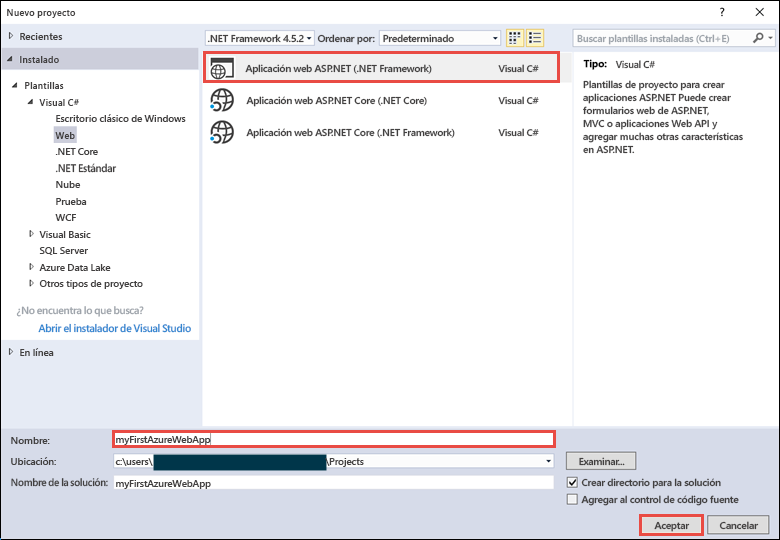

Puede implementar cualquier tipo de aplicación web de ASP.NET en Azure. Para esta guía de inicio rápido, seleccione la plantilla **MVC** y asegúrese de que la autenticación se establece en **Sin autenticación**.
      
Seleccione **Aceptar**.

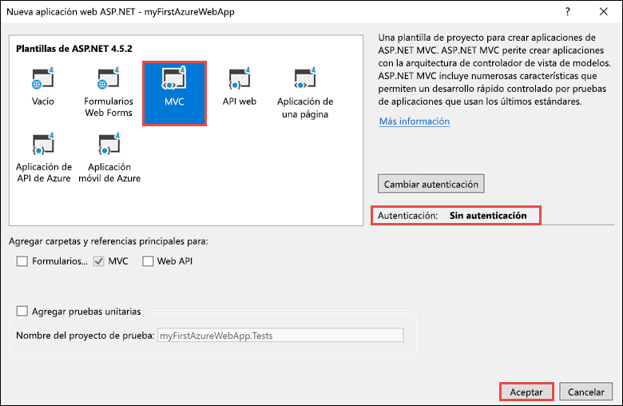

En el menú, seleccione **Depurar > Iniciar sin depurar** para ejecutar la aplicación web localmente.

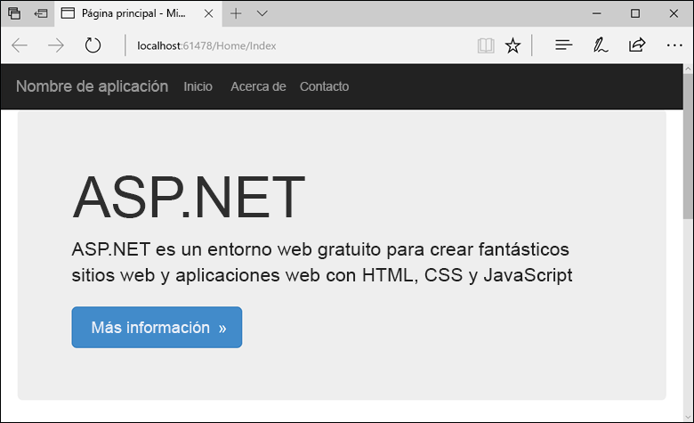

## <a name="publish-to-azure"></a>Publicación en Azure

En el **Explorador de soluciones**, haga clic con el botón derecho en el proyecto **myFirstAzureWebApp** y seleccione **Publicar**.

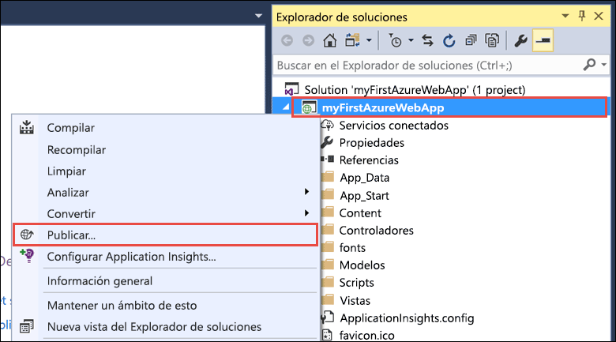

Asegúrese de que **Microsoft Azure App Service** está seleccionado y seleccione **Publicar**.

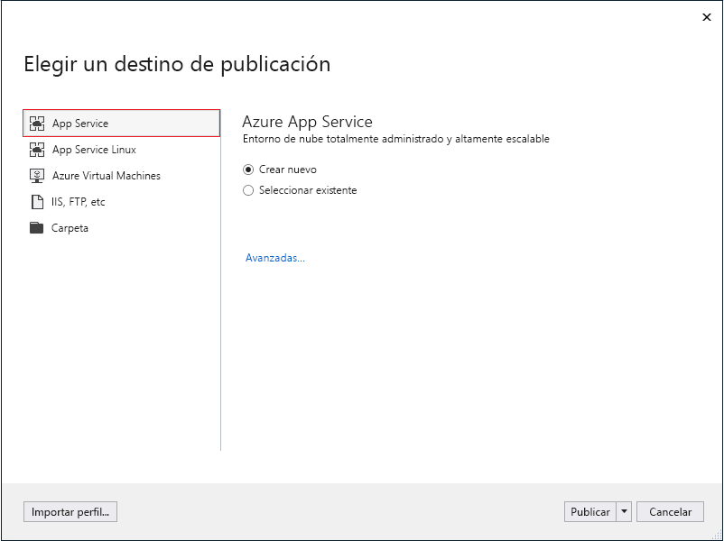

Con ello se abrirá el cuadro de diálogo **Crear App Service** que le ayudará a crear todos los recursos de Azure necesarios para ejecutar la aplicación web de ASP.NET en Azure.

## <a name="sign-in-to-azure"></a>Inicio de sesión en Azure

En el cuadro de diálogo **Crear App Service**, haga clic en **Agregar una cuenta** e inicie sesión en su suscripción de Azure. Si ya ha iniciado sesión, seleccione la cuenta que contiene la suscripción deseada en la lista desplegable.

> [!NOTE]
> Si ya ha iniciado sesión, no seleccione **Crear** todavía.
>
>
   
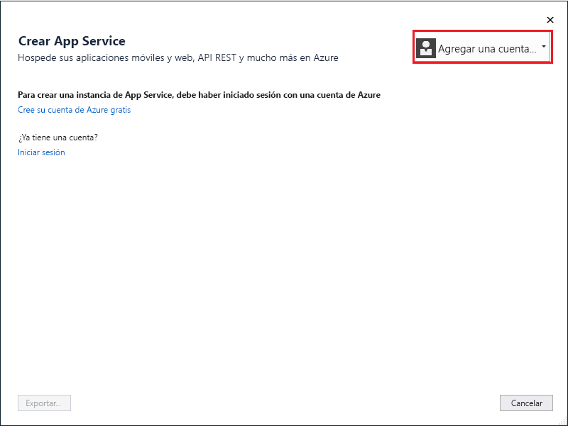

## <a name="create-a-resource-group"></a>Crear un grupo de recursos

[!INCLUDE [resource group intro text](../../includes/resource-group.md)]

Junto a **Grupo de recursos**, seleccione **Nuevo**.

Asigne el nombre **myResourceGroup** al grupo de recursos y seleccione **Aceptar**.

## <a name="create-an-app-service-plan"></a>Creación de un plan de App Service

[!INCLUDE [app-service-plan](../../includes/app-service-plan.md)]

Junto a **Plan de App Service**, seleccione **Nuevo**. 

En el cuadro de diálogo **Configurar plan de App Service**, use la configuración de la tabla que sigue a la captura de pantalla.

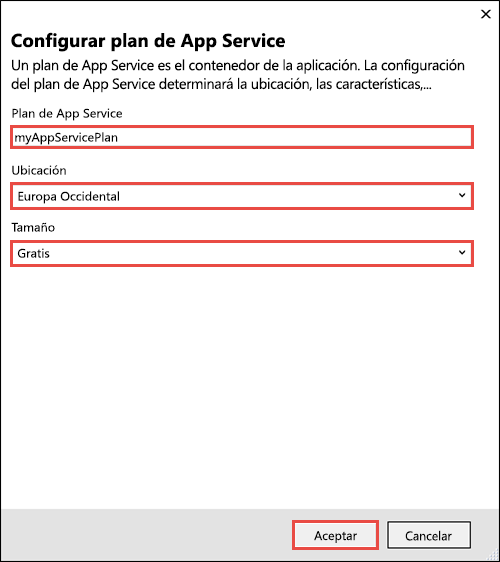

| Configuración | Valor sugerido | DESCRIPCIÓN |
|-|-|-|
|Plan de App Service| myAppServicePlan | Nombre del plan de App Service. |
| Ubicación | Europa occidental | El centro de datos donde se hospeda la aplicación web. |
| Tamaño | Gratuito | [Plan de tarifa](https://azure.microsoft.com/pricing/details/app-service/?ref=microsoft.com&utm_source=microsoft.com&utm_medium=docs&utm_campaign=visualstudio) determina las características de hospedaje. |

Seleccione **Aceptar**.

## <a name="create-and-publish-the-web-app"></a>Creación y publicación de la aplicación web

En **Web App Name** (Nombre de aplicación web), escriba un nombre único de aplicación (los caracteres válidos son `a-z`, `0-9` y `-`) o acepte el nombre único generado automáticamente. La dirección URL de la aplicación web es `http://<app_name>.azurewebsites.net`, donde `<app_name>` es el nombre de la aplicación web.

Seleccione **Crear** para comenzar a crear los recursos de Azure.

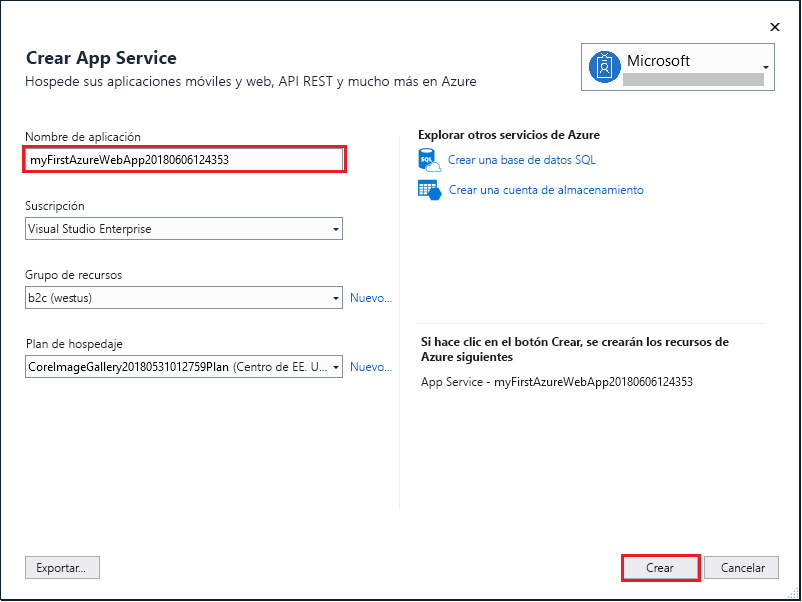

Una vez completado el asistente, publica la aplicación web ASP.NET en Azure y, a continuación, inicia la aplicación en el explorador predeterminado.

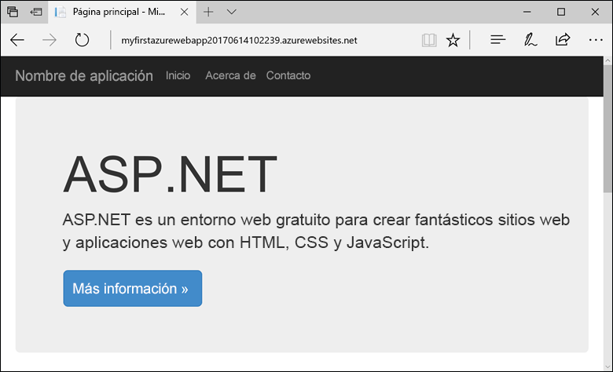

El nombre de aplicación web especificado en el [paso de creación y publicación](#create-and-publish-the-web-app) se usa como el prefijo de dirección URL en el formato `http://<app_name>.azurewebsites.net`.

Su aplicación web ASP.NET se está ejecutando en vivo en Azure App Service.

## <a name="update-the-app-and-redeploy"></a>Actualización de la aplicación y nueva implementación

Desde el **Explorador de soluciones**, abra _Views\Home\Index.cshtml_.

Busque la etiqueta HTML `<div class="jumbotron">` en la parte superior y reemplace el elemento entero por el código siguiente:

```HTML
<div class="jumbotron">
    <h1>ASP.NET in Azure!</h1>
    <p class="lead">This is a simple app that we’ve built that demonstrates how to deploy a .NET app to Azure App Service.</p>
</div>
```

Para volver a implementar en Azure, haga clic con el botón derecho en el proyecto **myFirstAzureWebApp**, en el **Explorador de soluciones** y seleccione **Publicar**.

En la página de publicación, seleccione **Publicar**.

Cuando se completa la publicación, Visual Studio inicia un explorador en la dirección URL de la aplicación web.


## <a name="manage-the-azure-web-app"></a>Administración de la aplicación web de Azure

Vaya a <a href="https://portal.azure.com" target="_blank">Azure Portal</a> para administrar la aplicación web.

En el menú izquierdo, seleccione **App Services** y, después, el nombre de la aplicación web de Azure.

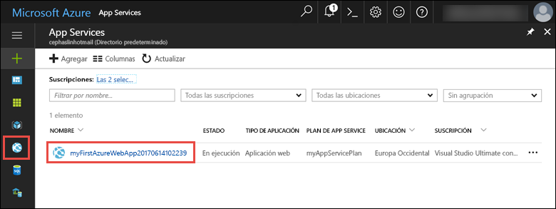

Podrá ver la página de información general de la aplicación web. En este caso, puede realizar tareas de administración básicas como examinar, detener, iniciar, reiniciar y eliminar. 

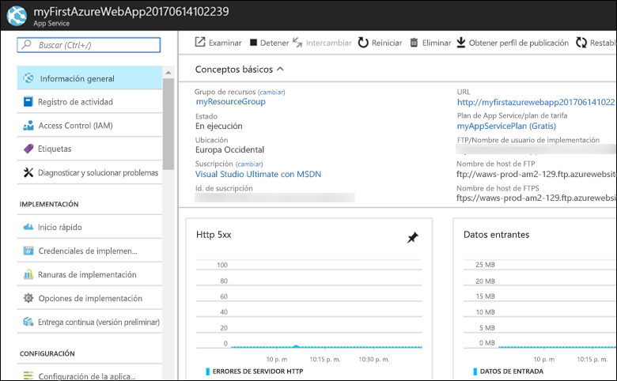

El menú izquierdo proporciona distintas páginas para configurar la aplicación. 

[!INCLUDE [Clean-up section](../../includes/clean-up-section-portal.md)]

## <a name="next-steps"></a>Pasos siguientes

> [!div class="nextstepaction"]
> [ASP.NET con SQL Database](app-service-web-tutorial-dotnet-sqldatabase.md)
