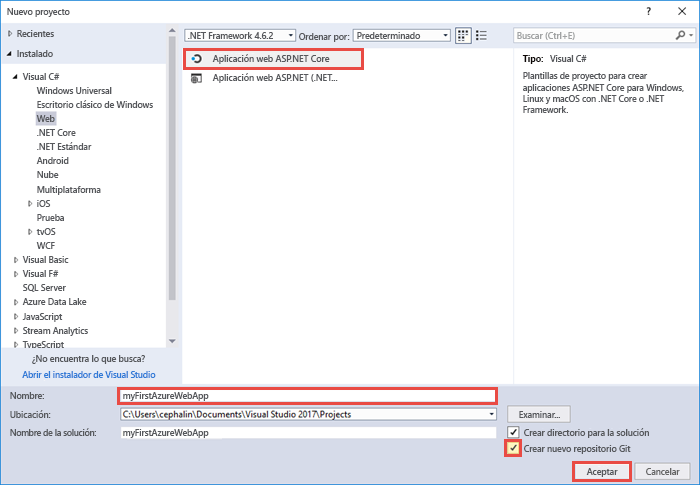
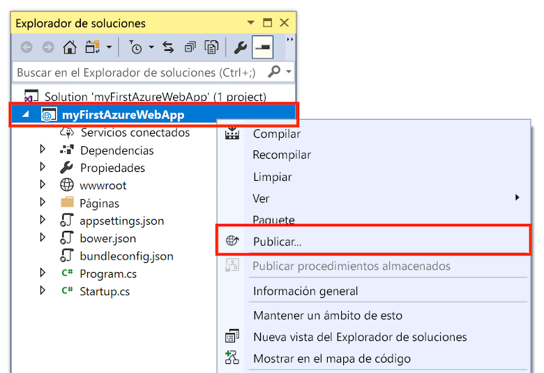
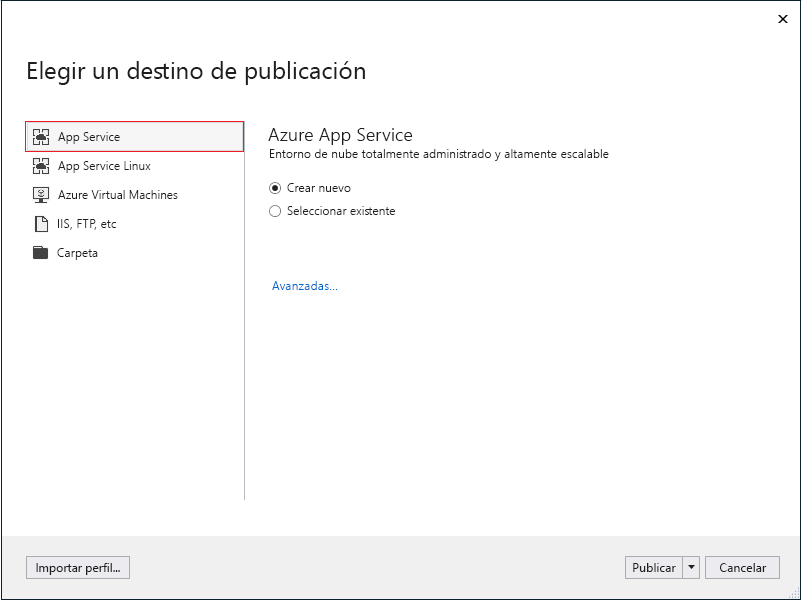
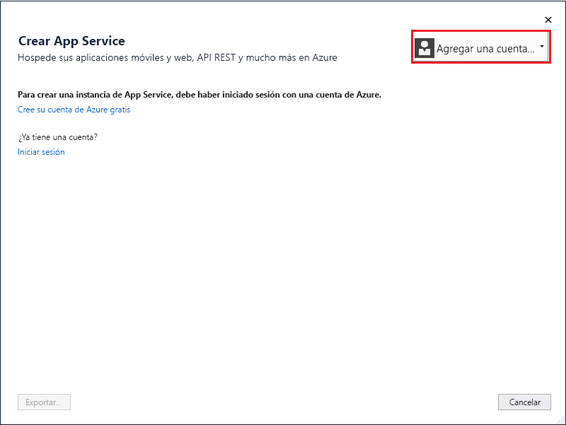
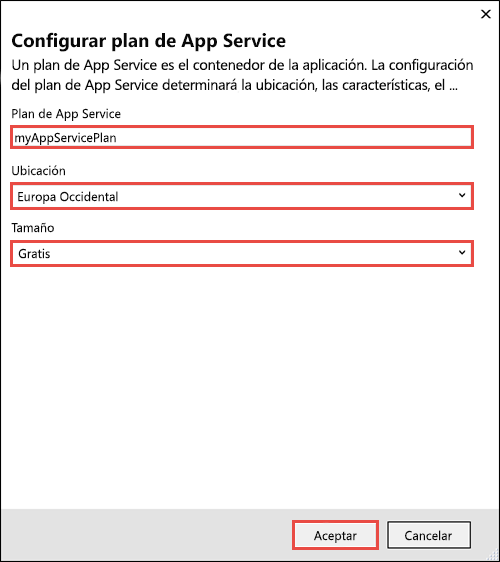
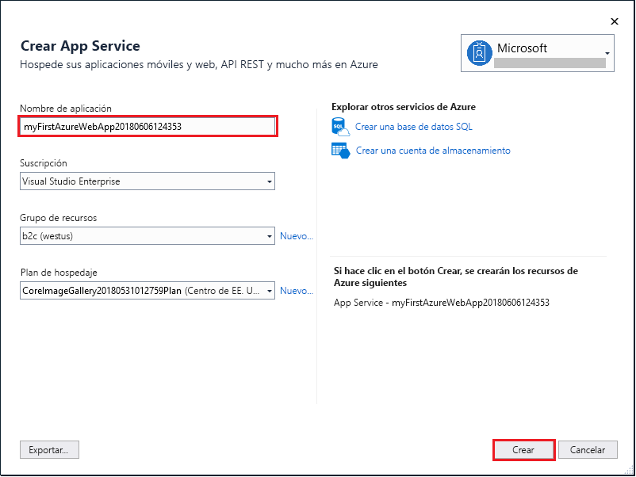
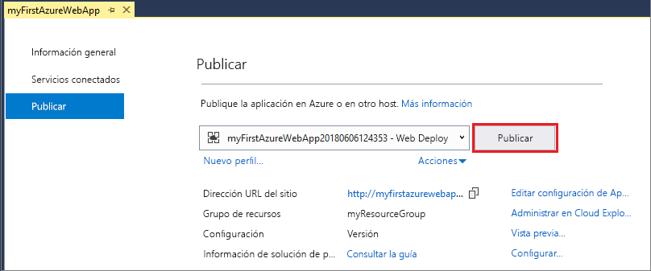
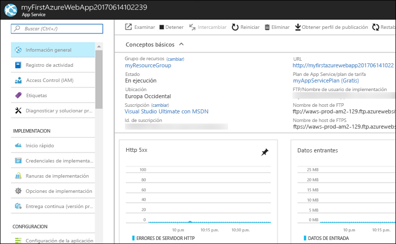

# <a name="create-an-aspnet-core-web-app-in-azure"></a>Creación de una aplicación web ASP.NET Core en Azure

> [!NOTE]
> En este artículo se implementa una aplicación en App Service en Windows. Para realizar implementaciones en App Service en _Linux_, consulte [Creación de una aplicación web de .NET Core en App Service en Linux](./containers/quickstart-dotnetcore.md). 
>

[Azure App Service](overview.md) proporciona un servicio de hospedaje web muy escalable y con aplicación de revisiones de un modo automático.  En este inicio rápido se muestra cómo implementar su primera aplicación web ASP.NET Core en Azure App Service. Cuando haya terminado, tendrá un grupo de recursos que consta de un plan de App Service y una aplicación de App Service con una aplicación web implementada.


[!INCLUDE [quickstarts-free-trial-note](../../includes/quickstarts-free-trial-note.md)]

## <a name="prerequisites"></a>Requisitos previos

Para completar este tutorial, instale <a href="https://www.visualstudio.com/downloads/" target="_blank">Visual Studio 2017</a> con la carga de trabajo de **ASP.NET y desarrollo web**.

Si ya ha instalado Visual Studio 2017:

- Para instalar las actualizaciones más recientes de Visual Studio, haga clic en **Ayuda** > **Buscar actualizaciones**.
- Para agregar la carga de trabajo, haga clic en **Herramientas** > **Obtener herramientas y características**.

## <a name="create-an-aspnet-core-web-app"></a>Cree una aplicación web ASP.NET Core

Cree un proyecto nuevo en Visual Studio seleccionando **Archivo > Nuevo > Proyecto**. 

En el cuadro de diálogo **Nuevo proyecto**, seleccione **Visual C# > Web > Aplicación web ASP.NET Core**.

Asigne a la aplicación el nombre _myFirstAzureWebApp_ y seleccione **Aceptar**.
   


Puede implementar cualquier tipo de aplicación web ASP.NET Core en Azure. Para esta guía de inicio rápido, seleccione la plantilla **Aplicación web** y asegúrese de que la autenticación se establece en **Sin autenticación** y que no hay ninguna otra opción seleccionada.
      
Seleccione **Aceptar**.


En el menú, seleccione **Depurar > Iniciar sin depurar** para ejecutar la aplicación web localmente.


## <a name="launch-the-publish-wizard"></a>Inicio del Asistente para publicación

En el **Explorador de soluciones**, haga clic con el botón derecho en el proyecto **myFirstAzureWebApp** y seleccione **Publicar**.



El Asistente para publicación se inicia automáticamente. Seleccione **App Service** > **Publicar** para abrir el cuadro de diálogo **Crear servicio de aplicaciones**.



## <a name="sign-in-to-azure"></a>Inicio de sesión en Azure

En el cuadro de diálogo **Crear App Service**, haga clic en **Agregar una cuenta** e inicie sesión en su suscripción de Azure. Si ya ha iniciado sesión, seleccione la cuenta que desee en la lista desplegable.

> [!NOTE]
> Si ya ha iniciado sesión, no seleccione **Crear** todavía.
>
   


## <a name="create-a-resource-group"></a>Crear un grupo de recursos

[!INCLUDE [resource group intro text](../../includes/resource-group.md)]

Junto a **Grupo de recursos**, seleccione **Nuevo**.

Asigne el nombre **myResourceGroup** al grupo de recursos y seleccione **Aceptar**.

## <a name="create-an-app-service-plan"></a>Creación de un plan de App Service

[!INCLUDE [app-service-plan](../../includes/app-service-plan.md)]

Junto a **Plan de hospedaje**, seleccione **Nuevo**. 

En el cuadro de diálogo **Configurar un plan de hospedaje**, use la configuración de la tabla que sigue a la captura de pantalla.



| Configuración | Valor sugerido | DESCRIPCIÓN |
|-|-|-|
|Plan de App Service| myAppServicePlan | Nombre del plan de App Service. |
| Ubicación | Europa occidental | El centro de datos donde se hospeda la aplicación web. |
| Tamaño | Gratuito | [Plan de tarifa](https://azure.microsoft.com/pricing/details/app-service/?ref=microsoft.com&utm_source=microsoft.com&utm_medium=docs&utm_campaign=visualstudio) determina las características de hospedaje. |

Seleccione **Aceptar**.

## <a name="create-and-publish-the-web-app"></a>Creación y publicación de la aplicación web

En **Nombre de la aplicación**, escriba un nombre único de aplicación (los caracteres válidos son `a-z`, `0-9` y `-`) o acepte el nombre único generado automáticamente. La dirección URL de la aplicación web es `http://<app_name>.azurewebsites.net`, donde `<app_name>` es el nombre de la aplicación.

Seleccione **Crear** para comenzar a crear los recursos de Azure.



Una vez completado el asistente, publica la aplicación web ASP.NET Core en Azure e inicia la aplicación en el explorador predeterminado.


El nombre de aplicación especificado en el [paso de creación y publicación](#create-and-publish-the-web-app) se usa como el prefijo de dirección URL en el formato `http://<app_name>.azurewebsites.net`.

Su aplicación web ASP.NET Core se está ejecutando en vivo en Azure App Service.

## <a name="update-the-app-and-redeploy"></a>Actualización de la aplicación y nueva implementación

Desde el **Explorador de soluciones**, abra _Pages/Index.cshtml_.

Reemplace las dos etiquetas `<div>` por el código siguiente:

```HTML
<div class="jumbotron">
    <h1>ASP.NET in Azure!</h1>
    <p class="lead">This is a simple app that we’ve built that demonstrates how to deploy a .NET app to Azure App Service.</p>
</div>
```

Para volver a implementar en Azure, haga clic con el botón derecho en el proyecto **myFirstAzureWebApp**, en el **Explorador de soluciones** y seleccione **Publicar**.

En la página de resumen de publicación, seleccione **Publicar**.


Cuando se completa la publicación, Visual Studio inicia un explorador en la dirección URL de la aplicación web.


## <a name="manage-the-azure-app"></a>Administración de la aplicación de Azure

Vaya a <a href="https://portal.azure.com" target="_blank">Azure Portal</a> para administrar la aplicación web.

En el menú izquierdo, seleccione **App Services** y, después, el nombre de la aplicación de Azure.


Podrá ver la página de información general de la aplicación web. En este caso, puede realizar tareas de administración básicas como examinar, detener, iniciar, reiniciar y eliminar. 



El menú izquierdo proporciona distintas páginas para configurar la aplicación. 

[!INCLUDE [Clean-up section](../../includes/clean-up-section-portal.md)]

## <a name="next-steps"></a>Pasos siguientes

> [!div class="nextstepaction"]
> [ASP.NET Core con SQL Database](app-service-web-tutorial-dotnetcore-sqldb.md)
