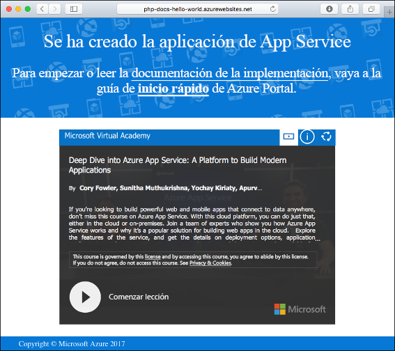
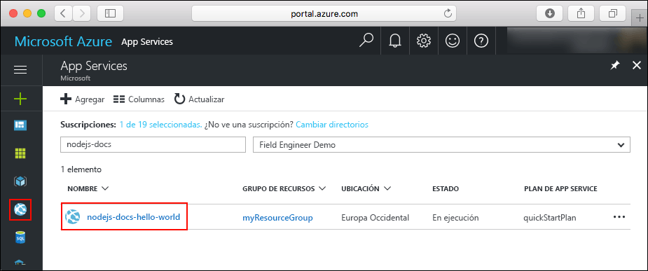
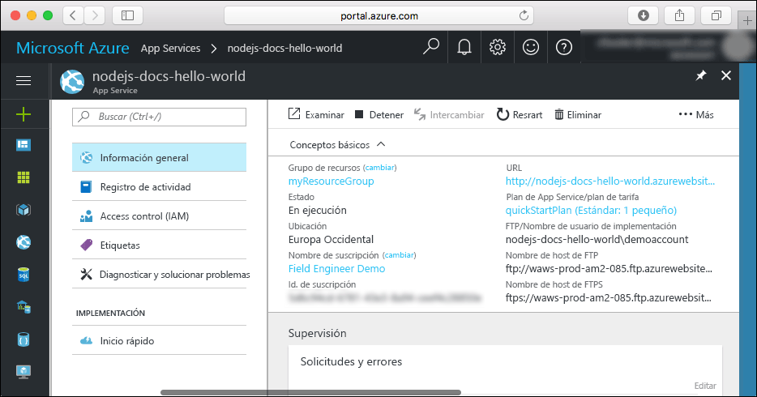

# <a name="create-a-nodejs-web-app-in-azure"></a>Creación de una aplicación web de Node.js en Azure

> [!NOTE]
> En este artículo se implementa una aplicación en App Service en Windows. Para realizar implementaciones en App Service en _Linux_, consulte [Creación de una aplicación web de Node.js en Azure App Service en Linux](./containers/quickstart-nodejs.md).
>

[Azure Web Apps](app-service-web-overview.md) proporciona un servicio de hospedaje web muy escalable y con aplicación de revisiones de un modo automático.  En esta guía de inicio rápido se explica cómo se implementa una aplicación de Node.js en Azure Web Apps. Se crea la aplicación web con la [CLI de Azure](https://docs.microsoft.com/cli/azure/get-started-with-azure-cli) y se usa Git para implementar el código Node.js de ejemplo en la aplicación web.


Estos pasos se pueden realizar en este caso con una máquina Mac, Windows o Linux. Una vez instalados los requisitos previos, tardará aproximadamente cinco minutos en completar los pasos.   

[!INCLUDE [quickstarts-free-trial-note](../../includes/quickstarts-free-trial-note.md)]

## <a name="prerequisites"></a>Requisitos previos

Para completar esta guía de inicio rápido:

* <a href="https://nodejs.org/" target="_blank">Instalación de Node.js y NPM</a>

## <a name="download-the-sample"></a>Descarga del ejemplo

Descargue el proyecto de ejemplo Node.js de [https://github.com/Azure-Samples/nodejs-docs-hello-world/archive/master.zip](https://github.com/Azure-Samples/nodejs-docs-hello-world/archive/master.zip) y extraiga el archivo ZIP.

En una ventana de terminal, vaya al directorio raíz del proyecto de ejemplo de Node.js (el que contiene _index.php_).

## <a name="run-the-app-locally"></a>Ejecución de la aplicación de forma local

Ejecute la aplicación localmente para ver cómo debería ser si se implementara en Azure. Abra una ventana de terminal y use el script `npm start` para iniciar el servidor HTTP de Node.js integrado.

```bash
npm start
```

Abra un explorador web y vaya a la aplicación de ejemplo en `http://localhost:1337`.

Verá el mensaje **Hola mundo** de la aplicación de ejemplo que aparece en la página.


En la ventana de terminal, presione **Ctrl + C** para salir del servidor web.

> [!NOTE]
> En Azure App Service, la aplicación se ejecuta en IIS mediante [iisnode](https://github.com/tjanczuk/iisnode). Para habilitar que la aplicación se ejecute con iisnode, el directorio de la aplicación raíz contiene el archivo web.config. IIS puede leer dicho archivo y la configuración de iisnode se documenta en [el repositorio de GitHub de iisnode](https://github.com/tjanczuk/iisnode/blob/master/src/samples/configuration/web.config).

[!INCLUDE [Create ZIP file](../../includes/app-service-web-create-zip.md)]

[!INCLUDE [cloud-shell-try-it.md](../../includes/cloud-shell-try-it.md)]

[!INCLUDE [Create resource group](../../includes/app-service-web-create-resource-group.md)] 

[!INCLUDE [Create app service plan](../../includes/app-service-web-create-app-service-plan.md)] 

## <a name="create-a-web-app"></a>Creación de una aplicación web

En Cloud Shell, cree una aplicación web en el plan de App Service `myAppServicePlan` con el comando [`az webapp create`](/cli/azure/webapp?view=azure-cli-latest#az-webapp-create). 

En el siguiente ejemplo, reemplace `<app_name>` por un nombre único global de aplicación (los caracteres válidos son `a-z`, `0-9` y `-`). El tiempo de ejecución se establece en `NODE|6.9`. Para ver todos los entornos en tiempo de ejecución admitidos, ejecute [`az webapp list-runtimes`](/cli/azure/webapp?view=azure-cli-latest#az-webapp-list-runtimes). 

```azurecli-interactive
# Bash
az webapp create --resource-group myResourceGroup --plan myAppServicePlan --name <app_name> --runtime "NODE|6.9"
# PowerShell
az --% webapp create --resource-group myResourceGroup --plan myAppServicePlan --name <app_name> --runtime "NODE|6.9"
```

Cuando se haya creado la aplicación web, la CLI de Azure mostrará información similar a la del ejemplo siguiente:

```json
{
  "availabilityState": "Normal",
  "clientAffinityEnabled": true,
  "clientCertEnabled": false,
  "cloningInfo": null,
  "containerSize": 0,
  "dailyMemoryTimeQuota": 0,
  "defaultHostName": "<app_name>.azurewebsites.net",
  "enabled": true,
  < JSON data removed for brevity. >
}
```

Vaya a la aplicación web recién creada. Reemplace  _&lt;nombre de aplicación>_ por un nombre de aplicación único.

```bash
http://<app name>.azurewebsites.net
```

Este es el aspecto que debería tener su nueva aplicación web:



[!INCLUDE [Deploy ZIP file](../../includes/app-service-web-deploy-zip.md)]

## <a name="browse-to-the-app"></a>Navegación hasta la aplicación

Vaya a la aplicación implementada mediante el explorador web.

```
http://<app_name>.azurewebsites.net
```

El código de ejemplo de Node.js se está ejecutando en una aplicación web de Azure App Service.


**¡Enhorabuena!** Ha implementado la primera aplicación de Node.js en App Service.

## <a name="update-and-redeploy-the-code"></a>Actualización del código y nueva implementación

Con un editor de texto, abra el archivo `index.js` en la aplicación de Node.js y realice un pequeño cambio en el texto en la llamada a `response.end`:

```nodejs
response.end("Hello Azure!");
```

En la ventana de terminal local, desplácese al directorio raíz de la aplicación y cree un nuevo archivo ZIP para el proyecto actualizado.

```
# Bash
zip -r myUpdatedAppFiles.zip .

# PowerShell
Compress-Archive -Path * -DestinationPath myUpdatedAppFiles.zip
``` 

Implemente este nuevo archivo ZIP en App Service utilizando los mismos pasos que en [Cargar el archivo ZIP](#upload-the-zip-file).

Vuelva a la ventana del explorador que se abrió en el paso **Navegación hasta la aplicación** y actualice la página.


## <a name="manage-your-new-azure-web-app"></a>Administración de la nueva aplicación web de Azure

Vaya a <a href="https://portal.azure.com" target="_blank">Azure Portal</a> para administrar la aplicación web que ha creado.

En el menú izquierdo, haga clic en **App Services** y, a continuación, haga clic en el nombre de la aplicación web de Azure.



Podrá ver la página de información general de la aplicación web. En este caso, puede realizar tareas de administración básicas como examinar, detener, iniciar, reiniciar y eliminar. 



El menú izquierdo proporciona distintas páginas para configurar la aplicación. 

## <a name="video"></a>Vídeo

En el vídeo puede ver este inicio rápido en acción y, después, siga los pasos para publicar su primera aplicación de Node.js en Azure.

> [!VIDEO https://channel9.msdn.com/Shows/Azure-for-Node-Developers/Create-a-Nodejs-app-in-Azure-Quickstart/player]   

[!INCLUDE [cli-samples-clean-up](../../includes/cli-samples-clean-up.md)]

## <a name="next-steps"></a>Pasos siguientes

> [!div class="nextstepaction"]
> [Node.js con MongoDB](app-service-web-tutorial-nodejs-mongodb-app.md)
