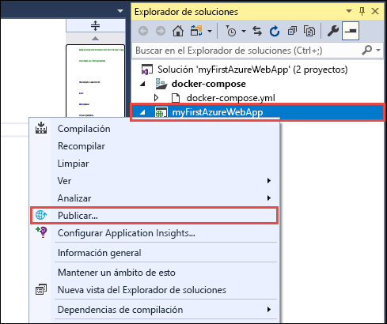
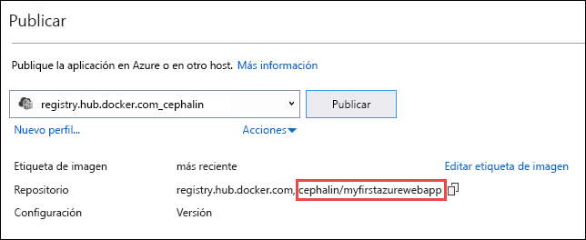
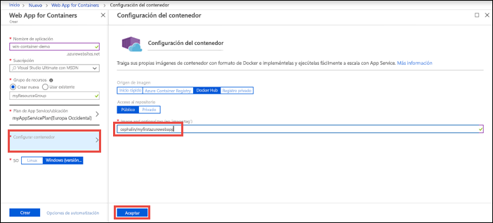

# <a name="run-a-custom-windows-container-in-azure-preview"></a>Ejecución de un contenedor de Windows personalizado en Azure (versión preliminar)

[Azure App Service](app-service-web-overview.md) proporciona las pilas de aplicaciones predefinidas en Windows, como ASP.NET o Node.js, que se ejecutan en IIS. El entorno preconfigurado de Windows bloquea el sistema operativo desde el acceso administrativo, las instalaciones de software, cambios en la caché global de ensamblados, etc (consulte [Funcionalidad del sistema operativo en Azure App Service](operating-system-functionality.md)). Si la aplicación requiere más acceso que el que permite el entorno preconfigurado, puede implementar un contenedor de Windows personalizado en su lugar. En esta guía de inicio rápido se muestra cómo implementar una aplicación ASP.NET en una imagen de Windows en [Docker Hub](https://hub.docker.com/) desde Visual Studio y ejecutarla en un contenedor personalizado en Azure App Service.


## <a name="prerequisites"></a>Requisitos previos

Para completar este tutorial:

- <a href="https://hub.docker.com/" target="_blank">Registrarse para obtener una cuenta de Docker Hub</a>
- Instalar <a href="https://docs.docker.com/docker-for-windows/install/" target="_blank">Docker para Windows</a>.
- <a href="https://docs.microsoft.com/virtualization/windowscontainers/quick-start/quick-start-windows-10#2-switch-to-windows-containers" target="_blank">Cambiar Docker para ejecutar contenedores de Windows</a>.
- <a href="https://www.visualstudio.com/downloads/" target="_blank">Instalar Visual Studio 2017</a> con las cargas de trabajo **ASP.NET y desarrollo web** y **desarrollo de Azure**. Si ya ha instalado Visual Studio 2017:
    - Para instalar las actualizaciones más recientes de Visual Studio, haga clic en **Ayuda** > **Buscar actualizaciones**.
    - Para agregar las cargas de trabajo en Visual Studio, haga clic en **Herramientas** > **Get Tools and Features** (Obtener herramientas y características).

## <a name="create-an-aspnet-web-app"></a>Creación de una aplicación web de ASP.NET

Cree un proyecto nuevo en Visual Studio seleccionando **Archivo > Nuevo > Proyecto**. 

En el cuadro de diálogo **Nuevo proyecto**, seleccione **Visual C# > Web > Aplicación web ASP.NET (.NET Framework)**.

Asigne a la aplicación el nombre _myFirstAzureWebApp_ y seleccione **Aceptar**.
   


Puede implementar cualquier tipo de aplicación web de ASP.NET en Azure. Para esta guía de inicio rápido, seleccione la plantilla **MVC** y asegúrese de que la autenticación se establece en **Sin autenticación**.

Seleccione **Enable Docker Compose support** (Habilitar compatibilidad con Docker Compose).

Seleccione **Aceptar**.


Si el archivo _Dockerfile_ no se abre automáticamente, ábralo desde el **Explorador de soluciones**.

Tiene que usar una [imagen principal compatible](#use-a-different-parent-image). Cambie la imagen primaria reemplazando la línea `FROM` con el código siguiente y guarde el archivo:

```Dockerfile
FROM microsoft/aspnet:4.7.1
```

En el menú, seleccione **Depurar > Iniciar sin depurar** para ejecutar la aplicación web localmente.


## <a name="publish-to-docker-hub"></a>Publicación en Docker Hub

En el **Explorador de soluciones**, haga clic con el botón derecho en el proyecto **myFirstAzureWebApp** y seleccione **Publicar**.



El Asistente para publicación se inicia automáticamente. Seleccione **Container Registry** > **Docker Hub** > **Publicar**.


Proporcione sus credenciales de cuenta de Docker Hub y haga clic en **Guardar**. 

Espere a que la implementación se complete. La página **Publicar** muestra ahora el nombre del repositorio que usará más adelante en App Service.



Copie este nombre de repositorio para su uso posterior.

## <a name="sign-in-to-azure"></a>Inicio de sesión en Azure

Inicie sesión en Azure Portal en https://portal.azure.com.

## <a name="create-a-windows-container-app"></a>Creación de una aplicación de contenedor de Windows

1. Elija **Crear un recurso** en la esquina superior izquierda de Azure Portal.

2. En el cuadro de búsqueda que está encima de la lista de recursos de Azure Marketplace, busque y seleccione **Web App for Containers**.

3. Proporcione un nombre de aplicación como, por ejemplo, *win-container-demo*, acepte los valores predeterminados para crear un nuevo grupo de recursos y haga clic en **Windows (versión preliminar)** en el cuadro **SO**.

    

4. Para crear un plan de App Service, haga clic en **Plan de App Service/Ubicación** > **Crear nuevo**. Asigne un nombre al nuevo plan, acepte los valores predeterminados y haga clic en **Aceptar**.

    

5. Haga clic en **Configurar contenedor**. En **Image and optional tag** (Imagen y etiqueta opcional), utilice el nombre del repositorio que copió en [Publicación en Docker Hub](#publish-to-docker-hub), a continuación, haga clic en **Aceptar**.

    

    Si tiene una imagen personalizada de la aplicación web en otra parte como, por ejemplo, en [Azure Container Registry](/azure/container-registry/) o en cualquier otro repositorio privado, puede configurarla aquí.

6. Haga clic en **Crear** y espere que Azure cree los recursos necesarios.

## <a name="browse-to-the-container-app"></a>Desplazamiento a la aplicación de contenedor

Una vez completada la operación de Azure, se muestra un cuadro de notificación.


1. Haga clic en **Ir al recurso**.

2. En la página de la aplicación, haga clic en el vínculo situado bajo **URL**.

Se abre una nueva página del explorador en la página siguiente:


Espere unos minutos e inténtelo de nuevo, hasta que llegue a la página principal predeterminada de ASP.NET:


**¡Enhorabuena!** Ya está ejecutando el primer contenedor de Windows personalizado en Azure App Service.

## <a name="see-container-start-up-logs"></a>Consulta de los registros de inicio del contenedor

El contenedor de Windows puede tardar un tiempo en cargarse. Para ver el progreso, vaya a la siguiente dirección URL sustituyendo *\<app_name >* por el nombre de la aplicación.
```
https://<app_name>.scm.azurewebsites.net/api/logstream
```

Los registros transmitidos tienen este aspecto:

```
2018-07-27T12:03:11  Welcome, you are now connected to log-streaming service.
27/07/2018 12:04:10.978 INFO - Site: win-container-demo - Start container succeeded. Container: facbf6cb214de86e58557a6d073396f640bbe2fdec88f8368695c8d1331fc94b
27/07/2018 12:04:16.767 INFO - Site: win-container-demo - Container start complete
27/07/2018 12:05:05.017 INFO - Site: win-container-demo - Container start complete
27/07/2018 12:05:05.020 INFO - Site: win-container-demo - Container started successfully
```

## <a name="update-locally-and-redeploy"></a>Actualización local y nueva implementación

Desde el **Explorador de soluciones**, abra _Views\Home\Index.cshtml_.

Busque la etiqueta HTML `<div class="jumbotron">` en la parte superior y reemplace el elemento entero por el código siguiente:

```HTML
<div class="jumbotron">
    <h1>ASP.NET in Azure!</h1>
    <p class="lead">This is a simple app that we’ve built that demonstrates how to deploy a .NET app to Azure App Service.</p>
</div>
```

Para volver a implementar en Azure, haga clic con el botón derecho en el proyecto **myFirstAzureWebApp**, en el **Explorador de soluciones** y seleccione **Publicar**.

En la página de publicación, seleccione **Publicar** y espere hasta que la publicación se complete.

Para indicar a App Service que extraiga la nueva imagen de Docker Hub, reinicie la aplicación. Volviendo a la página de aplicación en el portal, haga clic en **Reiniciar** > **Sí**.


Vuelva a [desplazarse a la aplicación de contenedor](#browse-to-the-container-app). Al actualizar la página web, la aplicación debe volver a la página "Iniciando" al principio y luego volver a mostrar la página web actualizada transcurridos unos minutos.


## <a name="use-a-different-parent-image"></a>Uso de una imagen primaria diferente

Puede usar una imagen personalizada de Docker distinta para ejecutar la aplicación. Sin embargo, debe elegir la [imagen primaria](https://docs.docker.com/develop/develop-images/baseimages/) correcta para la plataforma que desee: 

- Para implementar aplicaciones de .NET Framework, use una imagen primaria basada en la versión del [canal de servicio a largo plazo (LTSC)](https://docs.microsoft.com/windows-server/get-started/semi-annual-channel-overview#long-term-servicing-channel-ltsc) de Windows Server Core 2016. 
- Para implementar aplicaciones de .NET Core, use una imagen primaria basada en la versión del [canal de servicio a largo plazo (LTSC)](https://docs.microsoft.com/windows-server/get-started/semi-annual-channel-overview#long-term-servicing-channel-ltsc) de Windows Server Nano 2016. 

La descarga de una imagen primaria tarda un tiempo en completarse durante el inicio de la aplicación. Sin embargo, puede reducir el tiempo de inicio mediante una de las siguientes imágenes primarias que ya están almacenadas en caché en Azure App Service:

- [microsoft/iis](https://hub.docker.com/r/microsoft/iis/):windowsservercore-ltsc2016, latest
- [microsoft/iis](https://hub.docker.com/r/microsoft/iis/):nanoserver-sac2016
- [microsoft/aspnet](https://hub.docker.com/r/microsoft/aspnet/):4.7.2-windowsservercore-ltsc2016, 4.7.2, latest
- [microsoft/dotnet](https://hub.docker.com/r/microsoft/dotnet/):2.1-aspnetcore-runtime
- [microsoft/dotnet](https://hub.docker.com/r/microsoft/dotnet/):2.1-sdk

## <a name="next-steps"></a>Pasos siguientes

> [!div class="nextstepaction"]
> [Migrar al contenedor de Windows en Azure](app-service-web-tutorial-windows-containers-custom-fonts.md)
