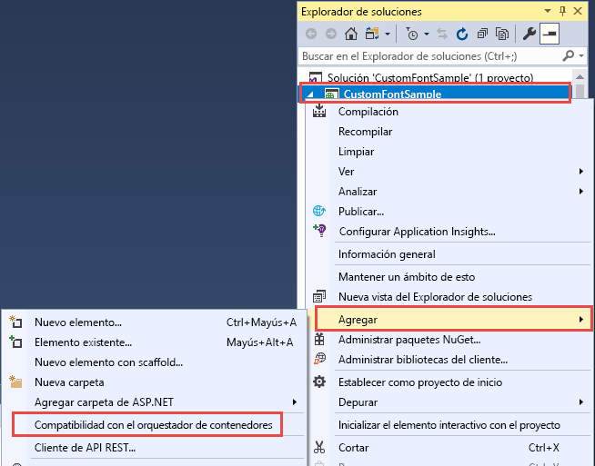
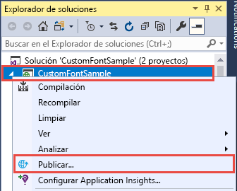
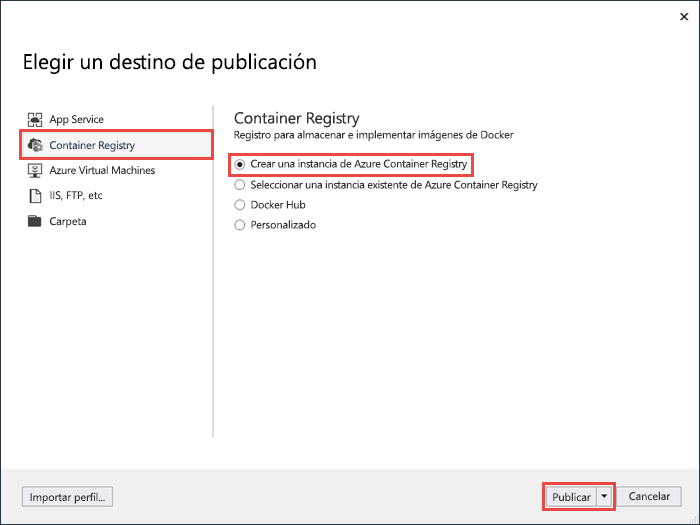
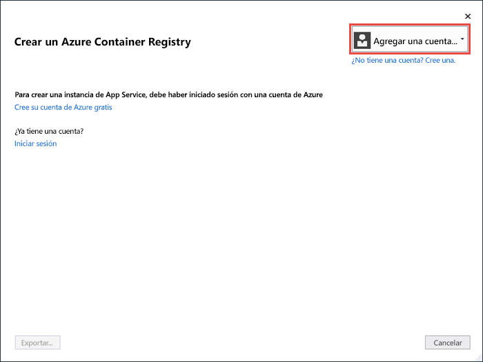
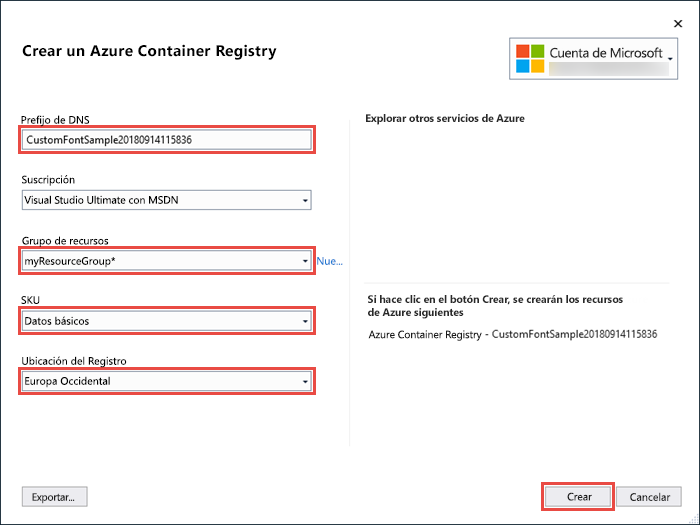
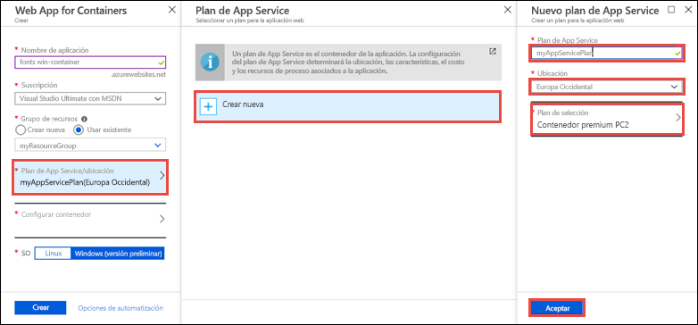
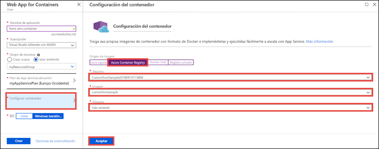

# <a name="migrate-an-aspnet-app-to-azure-app-service-using-a-windows-container-preview"></a>Migración de una aplicación de ASP.NET a Azure App Service con un contenedor de Windows (versión preliminar)

[Azure App Service](app-service-web-overview.md) proporciona las pilas de aplicaciones predefinidas en Windows, como ASP.NET o Node.js, que se ejecutan en IIS. El entorno preconfigurado de Windows bloquea el sistema operativo desde el acceso administrativo, las instalaciones de software, cambios en la caché global de ensamblados, etc (consulte [Funcionalidad del sistema operativo en Azure App Service](operating-system-functionality.md)). Sin embargo, mediante un contenedor de Windows personalizado de App Service se pueden realizar los cambios en el sistema operativo que necesita la aplicación, por lo que es fácil migrar aplicaciones locales que requieran configuración personalizada para el sistema operativo y el software. En este tutorial se muestra cómo migrar a App Service a partir de una aplicación de ASP.NET que utiliza fuentes personalizadas instaladas en la biblioteca de fuentes de Windows. Implemente una imagen de Windows con configuración personalizada de Visual Studio en [Azure Container Registry](https://docs.microsoft.com/azure/container-registry/) y ejecútela en App Service.


## <a name="prerequisites"></a>Requisitos previos

Para completar este tutorial:

- <a href="https://hub.docker.com/" target="_blank">Registrarse para obtener una cuenta de Docker Hub</a>
- Instalar <a href="https://docs.docker.com/docker-for-windows/install/" target="_blank">Docker para Windows</a>.
- <a href="https://docs.microsoft.com/virtualization/windowscontainers/quick-start/quick-start-windows-10#2-switch-to-windows-containers" target="_blank">Cambiar Docker para ejecutar contenedores de Windows</a>.
- <a href="https://www.visualstudio.com/downloads/" target="_blank">Instalar Visual Studio 2017</a> con las cargas de trabajo **ASP.NET y desarrollo web** y **desarrollo de Azure**. Si ya ha instalado Visual Studio 2017:
    - Para instalar las actualizaciones más recientes de Visual Studio, haga clic en **Ayuda** > **Buscar actualizaciones**.
    - Para agregar las cargas de trabajo en Visual Studio, haga clic en **Herramientas** > **Get Tools and Features** (Obtener herramientas y características).

## <a name="set-up-the-app-locally"></a>Instalación local de la aplicación

### <a name="download-the-sample"></a>Descarga del ejemplo

En este paso se configura el proyecto de .NET local.

- [Descarga del proyecto de ejemplo](https://github.com/Azure-Samples/custom-font-win-container/archive/master.zip)
- Extraiga (descomprima) el archivo *custom-font-win-container.zip*.

El proyecto de ejemplo contiene una aplicación de ASP.NET sencilla que usa una fuente personalizada instalada en la biblioteca de fuentes de Windows. No es necesario instalar fuentes, pero es un ejemplo de aplicación integrada con el sistema operativo subyacente. Para migrar este tipo de aplicación a App Service, debe o bien rediseñar el código para quitar la integración o migrarla como está a un contenedor de Windows personalizado.

### <a name="install-the-font"></a>Instalación de la fuente

En el Explorador de Windows, vaya a _custom-font-win-container-master/CustomFontSample_, haga clic con el botón derecho en _FrederickatheGreat Regular.ttf_ y seleccione **Instalar**.

Esta fuente está disponible públicamente en [Google Fonts](https://fonts.google.com/specimen/Fredericka+the+Great).

### <a name="run-the-app"></a>Ejecución de la aplicación

Abra el archivo *custom-font-win-container/CustomFontSample.sln* en Visual Studio. 

Escriba `Ctrl+F5` para ejecutar la aplicación sin depurarla. La aplicación se muestra en el explorador predeterminado. 


Dado que usa una fuente instalada, la aplicación no se puede ejecutar en el espacio aislado de App Service. Sin embargo, puede implementarla mediante un contenedor de Windows en su lugar, ya que puede instalar la fuente en el contenedor de Windows.

### <a name="configure-windows-container"></a>Configuración del contenedor de Windows

En el Explorador de soluciones, haga clic con el botón derecho en el proyecto **CustomFontSample** y seleccione **Agregar** > **Container Orchestration Support** (Compatibilidad con la orquestación de contenedores).



Seleccione **Docker Compose** > **Aceptar**.

El proyecto ahora está configurado para ejecutarse en un contenedor de Windows. _Dockerfile_ se agrega al proyecto **CustomFontSample** y, a la solución, un proyecto **docker-compose**. 

Desde el Explorador de soluciones, abra **Dockerfile**.

Tiene que usar una [imagen principal compatible](app-service-web-get-started-windows-container.md#use-a-different-parent-image). Reemplace la línea `FROM` por el código siguiente para cambiar la imagen primaria:

```Dockerfile
FROM microsoft/aspnet:4.7.1
```

Agregue la siguiente línea al final del archivo y guárdelo:

```Dockerfile
RUN ${source:-obj/Docker/publish/InstallFont.ps1}
```

Puede encontrar _InstallFont.ps1_ en el proyecto **CustomFontSample**. Es un sencillo script que instala la fuente. Puede encontrar una versión más compleja del script en el [Centro de scripts](https://gallery.technet.microsoft.com/scriptcenter/fb742f92-e594-4d0c-8b79-27564c575133).

## <a name="publish-to-azure-container-registry"></a>Publicación en Azure Container Registry

[Azure Container Registry](https://docs.microsoft.com/azure/container-registry/) puede almacenar las imágenes para las implementaciones de contenedor. Puede configurar App Service para usar imágenes hospedadas en Azure Container Registry.

### <a name="open-publish-wizard"></a>Apertura del asistente para publicación

En el Explorador de soluciones, haga clic con el botón derecho en el proyecto **CustomFontSample** y seleccione **Publicar**.



### <a name="create-registry-and-publish"></a>Creación y publicación del registro

En el asistente para publicación, seleccione **Container Registry** > **Crear una instancia de Azure Container Registry** > **Publicar**.



### <a name="sign-in-with-azure-account"></a>Inicio de sesión con la cuenta de Azure

En el cuadro de diálogo **Crear una instancia de Azure Container Registry**, seleccione **Agregar una cuenta** e inicie sesión en su suscripción de Azure. Si ya ha iniciado sesión, seleccione la cuenta que contiene la suscripción deseada en la lista desplegable.



### <a name="configure-the-registry"></a>Configuración del registro

Configure el nuevo registro de contenedor en función de los valores sugeridos en la siguiente tabla. Cuando haya terminado, haga clic en **Crear**.

| Configuración  | Valor sugerido | Para obtener más información |
| ----------------- | ------------ | ----|
|**Prefijo de DNS**| Mantenga el nombre de registro generado o cámbielo por otro nombre único. |  |
|**Grupo de recursos**| Haga clic en **Nuevo**, escriba **myResourceGroup** y haga clic en **Aceptar**. |  |
|**SKU**| Básica | [Planes de tarifa](https://azure.microsoft.com/pricing/details/container-registry/)|
|**Ubicación del registro**| Europa occidental | |



Se abre una ventana de terminal que muestra el progreso de la implementación de la imagen. Espere a que la implementación se complete.

## <a name="sign-in-to-azure"></a>Inicio de sesión en Azure

Inicie sesión en Azure Portal en https://portal.azure.com.

## <a name="create-a-web-app"></a>Creación de una aplicación web

En el menú izquierdo, seleccione **Crear un recurso** > **Web** > **Web App for Containers**.

### <a name="configure-the-new-web-app"></a>Configuración de la nueva aplicación web

En la interfaz de creación, configure las opciones según la siguiente tabla:

| Configuración  | Valor sugerido | Para obtener más información |
| ----------------- | ------------ | ----|
|**Nombre de aplicación**| Escriba un nombre único. | La dirección URL de la aplicación web es `http://<app_name>.azurewebsites.net`, donde `<app_name>` es el nombre de la aplicación. |
|**Grupo de recursos**| Seleccione **Usar existente** y escriba **myResourceGroup**. |  |
|**SISTEMA OPERATIVO**| Windows (versión preliminar) | |

### <a name="configure-app-service-plan"></a>Configuración del plan de App Service

Haga clic en **Plan de App Service/Ubicación** > **Crear nuevo**. Asígnele un nombre al nuevo plan, seleccione **Europa Occidental** com ubicación y haga clic en **Aceptar**.



### <a name="configure-container"></a>Configuración del contenedor

Haga clic en **Configurar contenedor** > **Azure Container Registry**. Seleccione el registro, la imagen y la etiqueta que creó anteriormente en [Publicación en Azure Container Registry](#publish-to-azure-container-registry) y haga clic en **Aceptar**.



### <a name="complete-app-creation"></a>Creación completa de la aplicación

Haga clic en **Crear** y espere que Azure cree los recursos necesarios.

## <a name="browse-to-the-web-app"></a>Navegación hasta la aplicación web

Una vez completada la operación de Azure, se muestra un cuadro de notificación.


1. Haga clic en **Ir al recurso**.

2. En la página de la aplicación, haga clic en el vínculo situado bajo **URL**.

Se abre una nueva página del explorador en la página siguiente:


Espere unos minutos e inténtelo de nuevo hasta que llegue a la página principal con la atractiva fuente esperada:


**¡Enhorabuena!** Ha migrado una aplicación de ASP.NET a Azure App Service en un contenedor de Windows.

## <a name="see-container-start-up-logs"></a>Consulta de los registros de inicio del contenedor

El contenedor de Windows puede tardar un tiempo en cargarse. Para ver el progreso, vaya a la siguiente dirección URL sustituyendo *\<app_name >* por el nombre de la aplicación.
```
https://<app_name>.scm.azurewebsites.net/api/logstream
```

Los registros transmitidos tienen este aspecto:

```
14/09/2018 23:16:19.889 INFO - Site: fonts-win-container - Creating container for image: customfontsample20180914115836.azurecr.io/customfontsample:latest.
14/09/2018 23:16:19.928 INFO - Site: fonts-win-container - Create container for image: customfontsample20180914115836.azurecr.io/customfontsample:latest succeeded. Container Id 329ecfedbe370f1d99857da7352a7633366b878607994ff1334461e44e6f5418
14/09/2018 23:17:23.405 INFO - Site: fonts-win-container - Start container succeeded. Container: 329ecfedbe370f1d99857da7352a7633366b878607994ff1334461e44e6f5418
14/09/2018 23:17:28.637 INFO - Site: fonts-win-container - Container ready
14/09/2018 23:17:28.637 INFO - Site: fonts-win-container - Configuring container
14/09/2018 23:18:03.823 INFO - Site: fonts-win-container - Container ready
14/09/2018 23:18:03.823 INFO - Site: fonts-win-container - Container start-up and configuration completed successfully
```

