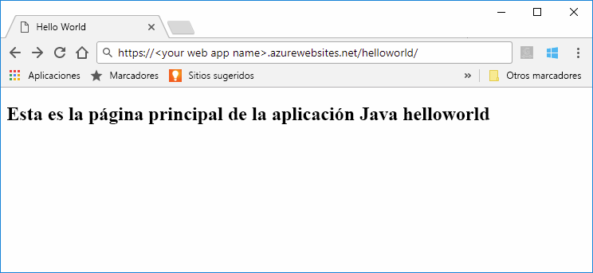

# <a name="quickstart-create-a-java-web-app-in-app-service-on-linux"></a>Guía de inicio rápido: Creación de una aplicación web de Java en App Service en Linux

[App Service en Linux](app-service-linux-intro.md) proporciona un servicio de hospedaje web muy escalable y con aplicación automática de revisiones que usa el sistema operativo Linux. En este inicio rápido se muestra cómo usar la [CLI de Azure](https://docs.microsoft.com/cli/azure/get-started-with-azure-cli) con el [complemento Maven para Azure Web Apps (versión preliminar)](https://github.com/Microsoft/azure-maven-plugins/tree/develop/azure-webapp-maven-plugin) para implementar un archivo de aplicación web (WAR) de Java.


[!INCLUDE [quickstarts-free-trial-note](../../../includes/quickstarts-free-trial-note.md)]

[!INCLUDE [cloud-shell-try-it.md](../../../includes/cloud-shell-try-it.md)]

## <a name="create-a-java-app"></a>Creación de una aplicación Java

Ejecute el siguiente comando de Maven en el símbolo del sistema de Cloud Shell para crear una nueva aplicación web denominada `helloworld`:

```bash
mvn archetype:generate -DgroupId=example.demo -DartifactId=helloworld -DarchetypeArtifactId=maven-archetype-webapp
```

## <a name="configure-the-maven-plugin"></a>Configuración del complemento Maven

Para implementar desde Maven, use el editor de código de Cloud Shell para abrir el archivo de proyecto `pom.xml` en el directorio `helloworld`. 

```bash
code pom.xml
```

Luego agregue la siguiente definición del complemento al elemento `<build>` del archivo `pom.xml`.

```xml
<plugins>
    <!--*************************************************-->
    <!-- Deploy to Tomcat in App Service Linux           -->
    <!--*************************************************-->
      
    <plugin>
        <groupId>com.microsoft.azure</groupId>
        <artifactId>azure-webapp-maven-plugin</artifactId>
        <version>1.4.0</version>
        <configuration>
   
            <!-- Web App information -->
            <resourceGroup>${RESOURCEGROUP_NAME}</resourceGroup>
            <appName>${WEBAPP_NAME}</appName>
            <region>${REGION}</region>
   
            <!-- Java Runtime Stack for Web App on Linux-->
            <linuxRuntime>tomcat 8.5-jre8</linuxRuntime>
   
        </configuration>
    </plugin>
</plugins>
```    


> [!NOTE] 
> En este artículo solo se trabaja con aplicaciones Java empaquetadas en archivos WAR. El complemento también admite aplicaciones web JAR. Use la siguiente definición alternativa del complemento para estas aplicaciones. Esta configuración implementa un archivo JAR compilado por Maven en `${project.build.directory}/${project.build.finalName}.jar` en el sistema de archivos local.
>
>```xml
><plugin>
>            <groupId>com.microsoft.azure</groupId>
>            <artifactId>azure-webapp-maven-plugin</artifactId>
>            <version>1.4.0</version>
>            <configuration>
>                <deploymentType>jar</deploymentType>
>
>           <!-- Web App information -->
>            <resourceGroup>${RESOURCEGROUP_NAME}</resourceGroup>
>            <appName>${WEBAPP_NAME}</appName>
>            <region>${REGION}</region>  
>
>                <!-- Java Runtime Stack for Web App on Linux-->
>                <linuxRuntime>jre8</linuxRuntime>
>            </configuration>
>         </plugin>
>```    


Actualice los siguientes marcadores de posición en la configuración del complemento:

| Placeholder | DESCRIPCIÓN |
| ----------- | ----------- |
| `RESOURCEGROUP_NAME` | Nombre del nuevo grupo de recursos en el que se va a crear la aplicación web. Al colocar todos los recursos de una aplicación en un grupo, puede administrarlos juntos. Por ejemplo, si elimina el grupo de recursos también se eliminarán todos los recursos asociados con la aplicación. Actualice este valor con un nombre único de un nuevo grupo de recursos, por ejemplo, *TestResources*. Este nombre lo utilizará para limpiar todos los recursos de Azure en una sección posterior. |
| `WEBAPP_NAME` | El nombre de la aplicación forma parte del nombre de host de la aplicación web si se ha implementado en Azure (WEBAPP_NAME.azurewebsites.net). Actualice este valor con un nombre único para la nueva aplicación web de Azure, que hospedará la aplicación Java, por ejemplo *contoso*. |
| `REGION` | Una región de Azure donde se hospeda la aplicación web, por ejemplo `westus2`. Puede obtener una lista de regiones en Cloud Shell o la CLI mediante el comando `az account list-locations`. |

## <a name="deploy-the-app"></a>Implementar la aplicación

Implemente la aplicación Java en Azure mediante el siguiente comando:

```bash
mvn package azure-webapp:deploy
```

Una vez que se haya completado la implementación, vaya a la aplicación implementada mediante la siguiente dirección URL en el explorador web, por ejemplo, `http://<webapp>.azurewebsites.net/helloworld`. 



**¡Enhorabuena!** Ha implementado su primera aplicación Java en App Service en Linux.


[!INCLUDE [cli-samples-clean-up](../../../includes/cli-samples-clean-up.md)]


## <a name="next-steps"></a>Pasos siguientes

En este inicio rápido se ha usado Maven para crear una aplicación web Java, se ha configurado el [complemento Maven para Azure Web Apps (versión preliminar)](https://github.com/Microsoft/azure-maven-plugins/tree/develop/azure-webapp-maven-plugin) y luego se ha implementado una aplicación web Java empaquetada de archivo web en App Service en Linux. Para más información acerca del uso de Java con Azure, haga clic en el vínculo.

> [!div class="nextstepaction"]
> [Azure para desarrolladores de Java](https://docs.microsoft.com/java/azure/)

