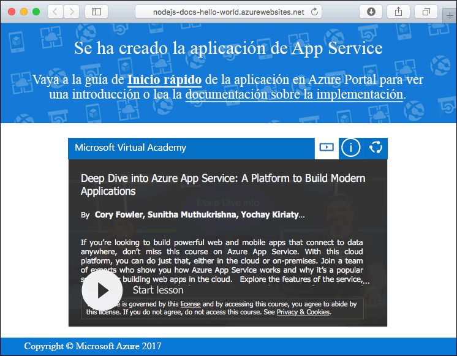
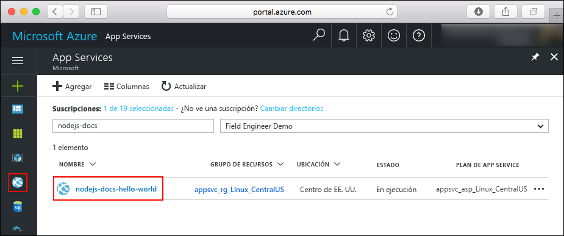
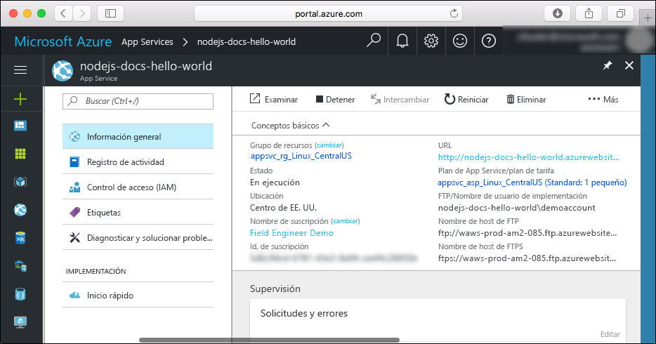

# <a name="create-a-nodejs-web-app-in-azure-app-service-on-linux"></a>Creación de una aplicación web de Node.js en Azure App Service en Linux

[App Service en Linux](app-service-linux-intro.md) proporciona un servicio de hospedaje web muy escalable y con aplicación automática de revisiones utilizando el sistema operativo Linux. En esta guía de inicio rápido se explica cómo se implementa una aplicación de Node.js en App Service en Linux utilizando una imagen integrada. Se crea la aplicación web con la imagen integrada utilizando la [CLI de Azure](https://docs.microsoft.com/cli/azure/get-started-with-azure-cli), y se usa Git para implementar el código Node.js en la aplicación web.


Estos pasos se pueden realizar con un equipo Mac, Windows o Linux.

## <a name="prerequisites"></a>Requisitos previos

Para completar esta guía de inicio rápido:

* [Instalación de Git](https://git-scm.com/)
* [Instalación de Node.js y NPM](https://nodejs.org/)

[!INCLUDE [quickstarts-free-trial-note](../../../includes/quickstarts-free-trial-note.md)]

## <a name="download-the-sample"></a>Descarga del ejemplo

En una ventana del terminal de la máquina, ejecute el siguiente comando para clonar el repositorio de la aplicación de ejemplo en el equipo local.

```bash
git clone https://github.com/Azure-Samples/nodejs-docs-hello-world
```

Utilice esta ventana de terminal para ejecutar todos los comandos de esta guía de inicio rápido.

Cambie al directorio que contiene el código de ejemplo.

```bash
cd nodejs-docs-hello-world
```

## <a name="run-the-app-locally"></a>Ejecución de la aplicación de forma local

Ejecute la aplicación localmente abriendo una ventana de terminal y utilizando el script `npm start` para iniciar el servidor HTTP de Node.js integrado.

```bash
npm start
```

Abra un explorador web y vaya a la aplicación de ejemplo en `http://localhost:1337`.

Verá el mensaje **Hola mundo** de la aplicación de ejemplo que aparece en la página.


En la ventana de terminal, presione **Ctrl + C** para salir del servidor web.

[!INCLUDE [cloud-shell-try-it.md](../../../includes/cloud-shell-try-it.md)]

[!INCLUDE [Configure deployment user](../../../includes/configure-deployment-user.md)]

[!INCLUDE [Create resource group](../../../includes/app-service-web-create-resource-group.md)]

[!INCLUDE [Create app service plan](../../../includes/app-service-web-create-app-service-plan-linux.md)]

## <a name="create-a-web-app-with-built-in-image"></a>Creación de una aplicación web con imagen integrada

[!INCLUDE [Create web app](../../../includes/app-service-web-create-web-app-linux-nodejs-no-h.md)]

Vaya al sitio para ver la aplicación web recién creada con una imagen integrada. Reemplace  _&lt;nombre de aplicación>_ por un nombre de aplicación único.

```bash
http://<app name>.azurewebsites.net
```



[!INCLUDE [Push to Azure](../../../includes/app-service-web-git-push-to-azure.md)]

```bash
Counting objects: 23, done.
Delta compression using up to 4 threads.
Compressing objects: 100% (21/21), done.
Writing objects: 100% (23/23), 3.71 KiB | 0 bytes/s, done.
Total 23 (delta 8), reused 7 (delta 1)
remote: Updating branch 'master'.
remote: Updating submodules.
remote: Preparing deployment for commit id 'bf114df591'.
remote: Generating deployment script.
remote: Generating deployment script for node.js Web Site
remote: Generated deployment script files
remote: Running deployment command...
remote: Handling node.js deployment.
remote: Kudu sync from: '/home/site/repository' to: '/home/site/wwwroot'
remote: Copying file: '.gitignore'
remote: Copying file: 'LICENSE'
remote: Copying file: 'README.md'
remote: Copying file: 'index.js'
remote: Copying file: 'package.json'
remote: Copying file: 'process.json'
remote: Deleting file: 'hostingstart.html'
remote: Ignoring: .git
remote: Using start-up script index.js from package.json.
remote: Node.js versions available on the platform are: 4.4.7, 4.5.0, 6.2.2, 6.6.0, 6.9.1.
remote: Selected node.js version 6.9.1. Use package.json file to choose a different version.
remote: Selected npm version 3.10.8
remote: Finished successfully.
remote: Running post deployment command(s)...
remote: Deployment successful.
To https://<app_name>.scm.azurewebsites.net:443/<app_name>.git
 * [new branch]      master -> master
```

## <a name="browse-to-the-app"></a>Navegación hasta la aplicación

Vaya a la aplicación implementada mediante el explorador web.

```bash
http://<app_name>.azurewebsites.net
```

El código de ejemplo de Node.js se está ejecutando en una aplicación web con una imagen integrada.


**¡Enhorabuena!** Ha implementado su primera aplicación de Node.js en App Service en Linux.

## <a name="update-and-redeploy-the-code"></a>Actualización del código y nueva implementación

Con un editor de texto, abra el archivo `index.js` en la aplicación de Node.js y realice un pequeño cambio en el texto en la llamada a `response.end`:

```nodejs
response.end("Hello Azure!");
```

Confirme los cambios en Git y, después, inserte los cambios de código en Azure.

```bash
git commit -am "updated output"
git push azure master
```

Una vez que la implementación haya finalizado, vuelva a cambiar la ventana del explorador que se abrió en el paso **Navegación hasta la aplicación** y actualice la vista.


## <a name="manage-your-new-azure-web-app"></a>Administración de la nueva aplicación web de Azure

Vaya a <a href="https://portal.azure.com" target="_blank">Azure Portal</a> para administrar la aplicación web que ha creado.

En el menú izquierdo, haga clic en **App Services** y, a continuación, haga clic en el nombre de la aplicación web de Azure.



Podrá ver la página de información general de la aplicación web. En este caso, puede realizar tareas de administración básicas como examinar, detener, iniciar, reiniciar y eliminar. 



El menú izquierdo proporciona distintas páginas para configurar la aplicación. 

[!INCLUDE [cli-samples-clean-up](../../../includes/cli-samples-clean-up.md)]

## <a name="next-steps"></a>Pasos siguientes

> [!div class="nextstepaction"]
> [Node.js con MongoDB](tutorial-nodejs-mongodb-app.md)
