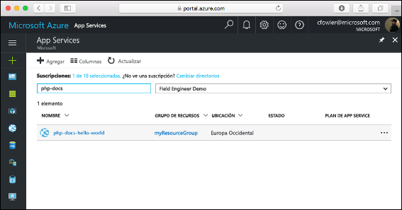

# <a name="create-a-php-web-app-in-app-service-on-linux"></a>Creación de una aplicación web de PHP en App Service en Linux

> [!NOTE]
> En este artículo se implementa una aplicación en App Service en Linux. Para implementar en App Service en _Windows_, consulte [Creación de una aplicación web de PHP en Azure](../app-service-web-get-started-php.md).
>

[App Service en Linux](app-service-linux-intro.md) proporciona un servicio de hospedaje web muy escalable y con aplicación automática de revisiones utilizando el sistema operativo Linux. En esta guía de inicio rápido se explica cómo se implementa una aplicación de PHP en Azure App Service en Linux. Se crea la aplicación web con una imagen integrada utilizando la [CLI de Azure](https://docs.microsoft.com/cli/azure/get-started-with-azure-cli) en Cloud Shell y se usa Git para implementar el código PHP en la aplicación web.


Estos pasos se pueden realizar en este artículo con una máquina Mac, Windows o Linux.

[!INCLUDE [quickstarts-free-trial-note](../../../includes/quickstarts-free-trial-note.md)]

## <a name="prerequisites"></a>requisitos previos

Para completar esta guía de inicio rápido:

* <a href="https://git-scm.com/" target="_blank">Instalación de Git</a>
* <a href="https://php.net" target="_blank">Instalación de PHP</a>

## <a name="download-the-sample"></a>Descarga del ejemplo

En la ventana del terminal, ejecute los siguientes comandos para clonar la aplicación de ejemplo en el equipo local y desplazarse al directorio que contiene el código de ejemplo.

```bash
git clone https://github.com/Azure-Samples/php-docs-hello-world
cd php-docs-hello-world
```

## <a name="run-the-app-locally"></a>Ejecución de la aplicación de forma local

Ejecute la aplicación localmente. Para ello, abra una ventana de terminal y use el comando `php` para iniciar el servidor web de PHP integrado.

```bash
php -S localhost:8080
```

Abra un explorador web y vaya a la aplicación de ejemplo en `http://localhost:8080`.

Verá el mensaje **Hola mundo** desde la aplicación de ejemplo mostrada en la página.


En la ventana de terminal, presione **Ctrl + C** para salir del servidor web.

[!INCLUDE [cloud-shell-try-it.md](../../../includes/cloud-shell-try-it.md)]

[!INCLUDE [Configure deployment user](../../../includes/configure-deployment-user.md)]

[!INCLUDE [Create resource group](../../../includes/app-service-web-create-resource-group-linux.md)]

[!INCLUDE [Create app service plan](../../../includes/app-service-web-create-app-service-plan-linux.md)]

## <a name="create-a-web-app"></a>Creación de una aplicación web

[!INCLUDE [Create web app](../../../includes/app-service-web-create-web-app-php-linux-no-h.md)] 

Vaya al sitio para ver la aplicación web recién creada con una imagen integrada. Reemplace _&lt;app name>_ por el nombre de la aplicación web.

```bash
http://<app_name>.azurewebsites.net
```

Este es el aspecto que debería tener su nueva aplicación web:


[!INCLUDE [Push to Azure](../../../includes/app-service-web-git-push-to-azure.md)] 

```bash
Counting objects: 2, done.
Delta compression using up to 4 threads.
Compressing objects: 100% (2/2), done.
Writing objects: 100% (2/2), 352 bytes | 0 bytes/s, done.
Total 2 (delta 1), reused 0 (delta 0)
remote: Updating branch 'master'.
remote: Updating submodules.
remote: Preparing deployment for commit id '25f18051e9'.
remote: Generating deployment script.
remote: Running deployment command...
remote: Handling Basic Web Site deployment.
remote: Kudu sync from: '/home/site/repository' to: '/home/site/wwwroot'
remote: Copying file: '.gitignore'
remote: Copying file: 'LICENSE'
remote: Copying file: 'README.md'
remote: Copying file: 'index.php'
remote: Ignoring: .git
remote: Finished successfully.
remote: Running post deployment command(s)...
remote: Deployment successful.
To https://<app_name>.scm.azurewebsites.net/<app_name>.git
   cc39b1e..25f1805  master -> master
```

## <a name="browse-to-the-app"></a>Navegación hasta la aplicación

Vaya a la aplicación implementada mediante el explorador web.

```bash
http://<app_name>.azurewebsites.net
```

El código de ejemplo de PHP se está ejecutando en una aplicación web con una imagen integrada.


**¡Enhorabuena!** Ha implementado su primera aplicación PHP en App Service en Linux.

## <a name="update-locally-and-redeploy-the-code"></a>Actualización local y nueva implementación del código

En el directorio local, abra el archivo `index.php` dentro de la aplicación PHP y realice un pequeño cambio en el texto dentro de la cadena situada junto a `echo`:

```php
echo "Hello Azure!";
```

Confirme los cambios en Git y, después, inserte los cambios de código en Azure.

```bash
git commit -am "updated output"
git push azure master
```

Una vez que la implementación haya finalizado, vuelva a la ventana del explorador que abrió en el paso **Navegación hasta la aplicación** y actualice la página.


## <a name="manage-your-new-azure-web-app"></a>Administración de la nueva aplicación web de Azure

Vaya a <a href="https://portal.azure.com" target="_blank">Azure Portal</a> para administrar la aplicación web que ha creado.

En el menú izquierdo, haga clic en **App Services** y, a continuación, haga clic en el nombre de la aplicación web de Azure.



Podrá ver la página de información general de la aplicación web. En este caso, puede realizar tareas de administración básicas como examinar, detener, iniciar, reiniciar y eliminar.


El menú izquierdo proporciona distintas páginas para configurar la aplicación. 

[!INCLUDE [cli-samples-clean-up](../../../includes/cli-samples-clean-up.md)]

## <a name="next-steps"></a>Pasos siguientes

> [!div class="nextstepaction"]
> [PHP con MySQL](tutorial-php-mysql-app.md)
