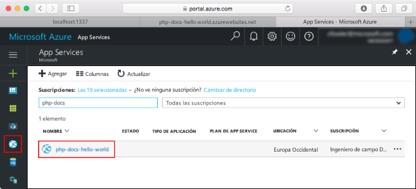
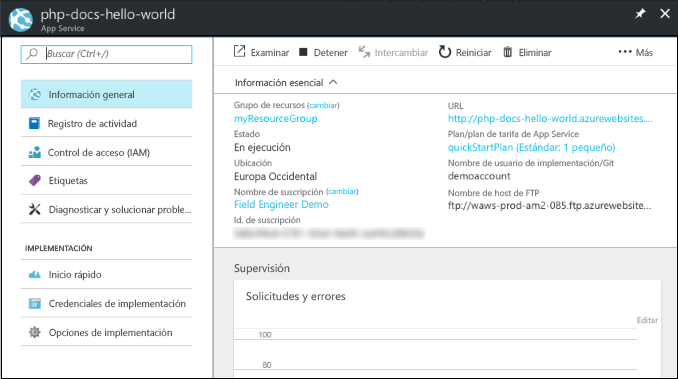

# <a name="deploy-a-python-web-app-in-web-app-for-containers"></a>Implementación de una aplicación web de Python en Web App for Containers

[App Service en Linux](app-service-linux-intro.md) proporciona un servicio de hospedaje web muy escalable y con aplicación automática de revisiones utilizando el sistema operativo Linux. En este inicio rápido se muestra cómo crear una aplicación web e implementar en ella una aplicación Flask sencilla con una imagen personalizada de Docker Hub. Creará la aplicación web con la [CLI de Azure](https://docs.microsoft.com/cli/azure/get-started-with-azure-cli).


[!INCLUDE [quickstarts-free-trial-note](../../../includes/quickstarts-free-trial-note.md)]

## <a name="prerequisites"></a>Requisitos previos

Para completar este tutorial:

* <a href="https://git-scm.com/" target="_blank">Instalación de Git</a>
* <a href="https://www.docker.com/community-edition" target="_blank">Instalación de Docker Community Edition</a>
* <a href="https://hub.docker.com/" target="_blank">Registrarse para obtener una cuenta de Docker Hub</a>

## <a name="download-the-sample"></a>Descarga del ejemplo

En la ventana del terminal, ejecute los siguientes comandos para clonar la aplicación de ejemplo en el equipo local y desplazarse al directorio que contiene el código de ejemplo.

```bash
git clone https://github.com/Azure-Samples/python-docs-hello-world
cd python-docs-hello-world
```

Este repositorio contiene una aplicación Flask sencilla en la carpeta _/app_ y un _Dockerfile_ que especifica tres cosas:

- Use la imagen base [tiangolo/uwsgi-nginx-flask:python3.6-alpine3.7](https://hub.docker.com/r/tiangolo/uwsgi-nginx-flask/).
- El contenedor debe escuchar en el puerto 8000.
- Copie el directorio `/app` en el directorio `/app` del contenedor.

En la configuración se siguen las [instrucciones de la imagen base](https://hub.docker.com/r/tiangolo/uwsgi-nginx-flask/).

## <a name="run-the-app-locally"></a>Ejecución de la aplicación de forma local

Ejecute la aplicación en un contenedor de Docker.

```bash
docker build --rm -t flask-quickstart .
docker run --rm -it -p 8000:8000 flask-quickstart
```

Abra un explorador web y vaya a la aplicación de ejemplo en `http://localhost:8000`.

Puede ver el mensaje **Hola mundo** de la aplicación de ejemplo que aparece en la página.


En la ventana de terminal, presione **Ctrl+C** para detener el contenedor.

## <a name="deploy-image-to-docker-hub"></a>Implementación de la imagen en Docker Hub.

Inicie sesión en su cuenta de Docker Hub. Siga las indicaciones para escribir sus credenciales de Docker Hub.

```bash
docker login
```

Etiquete la imagen e insértela en un nuevo repositorio _público_ para la cuenta de Docker Hub, llamado `flask-quickstart`. Reemplace *\<dockerhub_id>* por el identificador de Docker Hub.

```bash
docker tag flask-quickstart <dockerhub_id>/flask-quickstart
docker push <dockerhub_id>/flask-quickstart
```

> [!NOTE]
> `docker push` crea un repositorio público si no se encuentra el repositorio especificado. En este inicio rápido se da por hecho un repositorio público de Docker Hub. Si prefiere insertarla en un repositorio privado, deberá configurar las credenciales de Docker Hub en Azure App Service más adelante. Consulte [Creación de una aplicación web](#create-a-web-app).

Una vez completada la inserción de la imagen, está listo para usarla en su aplicación web de Azure.

[!INCLUDE [cloud-shell-try-it.md](../../../includes/cloud-shell-try-it.md)]

[!INCLUDE [Create resource group](../../../includes/app-service-web-create-resource-group-linux.md)]

[!INCLUDE [Create app service plan](../../../includes/app-service-web-create-app-service-plan-linux.md)]

## <a name="create-a-web-app"></a>Creación de una aplicación web

Cree una [aplicación web](../app-service-web-overview.md) en el plan de App Service `myAppServicePlan` con el comando [az webapp create](/cli/azure/webapp?view=azure-cli-latest#az_webapp_create). Reemplace *\<nombre de la aplicación>* por un nombre de aplicación globalmente único y reemplace *\<dockerhub_id>* por el identificador de Docker Hub.

```azurecli-interactive
az webapp create --resource-group myResourceGroup --plan myAppServicePlan --name <app name> --deployment-container-image-name <dockerhub_id>/flask-quickstart
```

Cuando se haya creado la aplicación web, la CLI de Azure mostrará información similar a la del ejemplo siguiente:

```json
{
  "availabilityState": "Normal",
  "clientAffinityEnabled": true,
  "clientCertEnabled": false,
  "cloningInfo": null,
  "containerSize": 0,
  "dailyMemoryTimeQuota": 0,
  "defaultHostName": "<app name>.azurewebsites.net",
  "deploymentLocalGitUrl": "https://<username>@<app name>.scm.azurewebsites.net/<app name>.git",
  "enabled": true,
  < JSON data removed for brevity. >
}
```

Si anteriormente la cargó en un repositorio privado, también deberá configurar las credenciales de Docker Hub en App Service. Para más información, consulte [Uso de una imagen personalizada de Docker Hub](tutorial-custom-docker-image.md#use-a-private-image-from-docker-hub-optional).

### <a name="specify-container-port"></a>Especificación del puerto del contenedor

Como se especifica en el _Dockerfile_, el contenedor escucha en el puerto 8000. Para que App Service enrute la solicitud al puerto correcto, debe establecer la configuración de aplicación *WEBSITES_PORT*.

En Cloud Shell, ejecute el comando [`az webapp config appsettings set`](/cli/azure/webapp/config/appsettings?view=azure-cli-latest#az_webapp_config_appsettings_set).


```azurecli-interactive
az webapp config appsettings set --name <app_name> --resource-group myResourceGroup --settings WEBSITES_PORT=8000
```

## <a name="browse-to-the-app"></a>Navegación hasta la aplicación

```bash
http://<app_name>.azurewebsites.net/
```


> [!NOTE]
> La aplicación web tarda algún tiempo en iniciarse porque la imagen de Docker Hub se debe descargar y ejecutar la primera vez que se solicita la aplicación. Si ve un error al principio después de mucho tiempo, actualice la página.

**¡Enhorabuena!** Ha implementado una imagen personalizada de Docker que ejecuta una aplicación Python en Web App for Containers.

## <a name="update-locally-and-redeploy"></a>Actualización local y nueva implementación

Con un editor de texto local, abra el archivo `app/main.py` de la aplicación de Python y realice un pequeño cambio en el texto situado junto a la instrucción `return`:

```python
return 'Hello, Azure!'
```

Vuelva a compilar la imagen e insértela de nuevo en Docker Hub.

```bash
docker build --rm -t flask-quickstart .
docker tag flask-quickstart <dockerhub_id>/flask-quickstart
docker push <dockerhub_id>/flask-quickstart
```

En Cloud Shell, reinicie la aplicación. El reinicio de la aplicación garantiza que se aplican todas las opciones de configuración y que el contenedor más reciente se extrae del registro.

```azurecli-interactive
az webapp restart --resource-group myResourceGroup --name <app_name>
```

Espere unos 15 segundos a que App Service extraiga la imagen actualizada. Vuelva a la ventana del explorador que se abrió en el paso **Navegación hasta la aplicación** y actualice la página.


## <a name="manage-your-azure-web-app"></a>Administración de la aplicación web de Azure

Vaya a [Azure Portal](https://portal.azure.com) para ver la aplicación web que ha creado.

En el menú izquierdo, haga clic en **App Services**, a continuación, haga clic en el nombre de la aplicación web de Azure.



De forma predeterminada, el portal muestra la página **Información general**. Esta página proporciona una visión del funcionamiento de la aplicación. En este caso, también puede realizar tareas de administración básicas como examinar, detener, iniciar, reiniciar y eliminar. Las pestañas del lado izquierdo de la página muestran las diferentes páginas de configuración que puede abrir.



[!INCLUDE [Clean-up section](../../../includes/cli-script-clean-up.md)]

## <a name="next-steps"></a>Pasos siguientes

> [!div class="nextstepaction"]
> [Python con PostgreSQL](tutorial-docker-python-postgresql-app.md)

> [!div class="nextstepaction"]
> [Uso de imágenes personalizadas](tutorial-custom-docker-image.md)