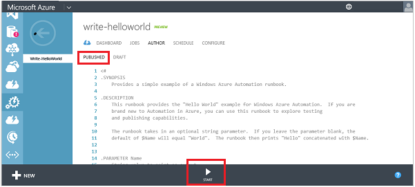

<properties linkid="automation-create-runbook-from-samples" urlDisplayName="Get Started with Azure Automation" pageTitle="Get Started with Azure Automation" metaKeywords="" description="Learn how to import and run an automation job in Azure." metaCanonical="" services="automation" documentationCenter="" title="Get Started with Azure Automation" authors="" solutions="" manager="" editor="" />

Introducción a la automatización de Azure
=========================================

En este tutorial se realizará un recorrido por los pasos para la importación y ejecución de un runbook de automatización en Microsoft Azure.

La automatización de Microsoft Azure ofrece una forma de que los desarrolladores automaticen las tareas manuales, propensas a errores, con una ejecución prolongada y repetidas con frecuencia que se realizan normalmente en un entorno en la nube. Puede crear, supervisar, administrar e implementar recursos en el entorno de Azure mediante runbooks, que son flujos de trabajo de Windows PowerShell que se encuentran incluidos. Para obtener más información acerca de la automatización, consulte la [guía de información general de automatización](http://go.microsoft.com/fwlink/p/?LinkId=392861).

En este tutorial se realiza un recorrido por los pasos para la importación de un runbook de ejemplo en la automatización de Azure, la ejecución de un runbook y, a continuación, la visualización del resultado.

Runbooks de utilidades y ejemplos
---------------------------------

El equipo de automatización de Azure ha creado una serie de ejemplos de runbook para ayudarle a comenzar con la automatización. Estos ejemplos incluyen conceptos de automatización básicos y se han creado para ayudarle a saber cómo escribir sus propios runbooks.

El equipo de automatización también ha creado runbooks de utilidad que puede usar como bloques de compilación para tareas de automatización más grandes.

> [WACOM.NOTE] Es una práctica recomendada escribir runbooks reutilizables, modulares y pequeños. También recomendamos encarecidamente que cree sus propios runbooks de utilidades para escenarios usados frecuentemente después de que se haya familiarizado con la automatización.

Puede ver y descargar los runbooks de utilidades y ejemplos del equipo de automatización en [Recursos de script para profesionales de TI](http://go.microsoft.com/fwlink/p/?LinkId=393029).

Comunidad de automatización y comentarios
-----------------------------------------

Los runbooks de la comunidad y otros equipos de Microsoft también se publican en [Recursos de script para profesionales de TI](http://go.microsoft.com/fwlink/?LinkID=391681).

**Envíenos sus comentarios.** Si está buscando una solución de runbook o módulo de integración de PowerShell, envíe una solicitud de script en el centro de scripts. Si tiene alguna idea de alguna característica nueva para la automatización, publíquela en [User Voice](http://feedback.windowsazure.com/forums/34192--general-feedback).

[WACOM.INCLUDE [create-account-note](../includes/create-account-note.md)]

Descarga de un runbook de ejemplo desde el centro de scripts
------------------------------------------------------------

1.  Diríjase a [Recursos de script para profesionales de TI](http://go.microsoft.com/fwlink/p/?LinkId=393029) y, a continuación, haga clic en **Hello World for Azure Automation**.

2.  Haga clic en el nombre de archivo, **Write-HelloWorld.ps1**, junto a **Download** y, a continuación, guarde el archivo en su equipo.

Importación del runbook de ejemplo en Azure
-------------------------------------------

1.  Inicie sesión en el [Portal de administración de Azure](http://manage.windowsazure.com).

2.  En el Portal de administración, haga clic en **Create an Automation Account**.

    > [WACOM.NOTE] Si ya ha creado una cuenta de automatización, puede pasar al paso 4.

    

3.  En la página **Add a New Automation Account**, especifique un nombre de cuenta y, a continuación, haga clic en la marca de verificación.

    

4.  En la página **Automation**, haga clic en la nueva cuenta que acaba de crear.

    

5.  Haga clic en **RUNBOOKS**.

    

6.  Haga clic en **IMPORT**.

    

7.  Diríjase al script **Write-HelloWorld.ps1** que descargó y, a continuación, haga clic en la marca de verificación.

    

8.  Haga clic en **Write-HelloWorld**.

    

9.  Haga clic en **AUTHOR** y, a continuación, haga clic en **DRAFT**. Para este runbook, no tiene que realizar modificaciones.

    Ahora puede ver el contenido de **Write-HelloWorld.ps1**. Puede modificar el contenido de un runbook en el modo borrador.

    

10. Haga clic en **PUBLISH** para promocionar el runbook de modo que esté listo para el uso de producción.

    

11. Cuando se le solicite guardar y publicar el runbook, haga clic en **Yes**.

    

12. Haga clic en **PUBLISHED** y, a continuación, haga clic en **START**.

    

13. En la página **Specify the runbook parameter values**, escriba un valor para **Name** que se utilizará como parámetro de entrada para el script Write-HelloWorld.ps1 y, a continuación, haga clic en la marca de verificación.

    

14. Haga clic en **JOBS** para comprobar el estado del trabajo de runbook que acaba de iniciar y, a continuación, haga clic en la marca de tiempo en la columna **JOB START** para ver el resumen de trabajos.

    

15. En la página **SUMMARY** puede ver el resumen, los parámetros de entrada y el resultado del trabajo.

    

Otras referencias
-----------------

-   [Automatización](http://go.microsoft.com/fwlink/p/?LinkId=392860)
-   [Authoring Automation Runbooks](http://go.microsoft.com/fwlink/p/?LinkID=301740)
-   [Automation Forum](http://go.microsoft.com/fwlink/p/?LinkId=390561)

