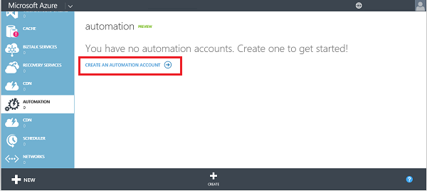
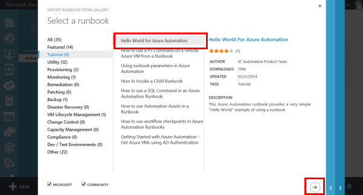

<properties 
	pageTitle="Introducción a la automatización de Azure" 
	description="Vea cómo importar y ejecutar un trabajo de automatización en Azure." 
	services="automation" 
	documentationCenter="" 
	authors="bwren" 
	manager="stevenka" 
	editor=""/>

<tags 
	ms.service="automation" 
	ms.workload="tbd" 
	ms.tgt_pltfrm="na" 
	ms.devlang="na" 
	ms.topic="article" 
	ms.date="1/13/2015" 
	ms.author="bwren"/>

# Introducción a la automatización de Azure

La automatización de Microsoft Azure ofrece una forma de que los desarrolladores automaticen las tareas manuales, propensas a errores, con una ejecución prolongada y repetidas con frecuencia que se realizan normalmente en un entorno en la nube. Puede crear, supervisar, administrar e implementar recursos en el entorno de Azure mediante runbooks, que son flujos de trabajo de Windows PowerShell que se encuentran incluidos. Para obtener más información acerca de la automatización, consulte la [guía de información general de automatización](http://go.microsoft.com/fwlink/p/?LinkId=392861). 

En este tutorial se realiza un recorrido por los pasos para la importación de un runbook "Hello World" de ejemplo en la automatización de Azure, la ejecución de un runbook y, a continuación, la visualización del resultado.

>[WACOM.NOTE] Para obtener información sobre cómo automatizar las operaciones de Azure mediante los [cmdlets PowerShell de Azure](http://msdn.microsoft.com/library/jj156055.aspx), consulte <a href="http://azure.microsoft.com/blog/2014/08/27/azure-automation-authenticating-to-azure-using-azure-active-directory/">Automatización de Azure: Autenticación en Azure mediante Azure Active Directory</a>.

## Runbooks de utilidades y ejemplos

El equipo de automatización de Azure ha creado una serie de ejemplos de runbook para ayudarle a comenzar con la automatización.  Estos ejemplos incluyen conceptos de automatización básicos y se han creado para ayudarle a saber cómo escribir sus propios runbooks.  

El equipo de automatización también ha creado runbooks de utilidad que puede usar como bloques de compilación para tareas de automatización más grandes.  

>[WACOM.NOTE] Es una práctica recomendada escribir runbooks reutilizables, modulares y pequeños. También recomendamos encarecidamente que cree sus propios runbooks de utilidades para escenarios usados frecuentemente después de que se haya familiarizado con la automatización.  

Puede ver y descargar los runbooks de utilidades y ejemplos del equipo de automatización en [Recursos de script para profesionales de TI](http://go.microsoft.com/fwlink/p/?LinkId=393029) o importarlos directamente desde la [Galería de runbooks](http://aka.ms/runbookgallery). 

## Comunidad de automatización y comentarios

Los runbooks de la comunidad y de otros equipos de Microsoft también se publican en [Recursos de script para profesionales de TI](http://go.microsoft.com/fwlink/?LinkID=391681) y en la [Galería de runbooks](http://aka.ms/runbookgallery). 

<strong>Envíenos sus comentarios.</strong>  Si está buscando una solución de runbook o módulo de integración de Automatización, envíe una solicitud de script en el centro de scripts. Si tiene alguna idea de alguna característica nueva para la automatización, publíquela en [User Voice](http://feedback.windowsazure.com/forums/34192--general-feedback).

[WACOM.INCLUDE [create-account-note](../includes/create-account-note.md)]

## Pasos de alto nivel para este tutorial

1. [Creación de una cuenta de automatización](#automationaccount)
2. [Importación de un runbook de la Galería de runbooks](#importrunbook)
3. [Publicación del runbook](#publishrunbook)
4. [Inicio del runbook](#startrunbook)

## Creación de una cuenta de Azure

1.	Inicie sesión en el [Portal de administración de Azure](http://manage.windowsazure.com).

2.	En el Portal de administración, haga clic en **Create an Automation Account**.

	>[WACOM.NOTE] Si ya ha creado una cuenta de automatización, puede pasar al paso 4.

	

3.	En la página **Add a New Automation Account**, especifique un nombre de cuenta y, a continuación, haga clic en la marca de verificación.

	

## Importación de un runbook de la Galería de runbooks
 
4.	En la página **Automation**, haga clic en la nueva cuenta que acaba de crear.
 
	

5.	Haga clic en **RUNBOOKS**.

	
  
6.	Haga clic en **Nuevo** > **Runbook** > **De la galería**.

	

7.  Seleccione la categoría **Tutorial** y después **Hello World for Azure Automation**. Haga clic en el botón de flecha derecha.

	

8.  Revise el contenido del runbook y haga clic en el botón de flecha derecha.

	

8.	Revise el contenido del runbook y haga clic en el botón de marca de verificación.

	

## Publicación del runbook 

9.	Cuando se haya importado el runbook, haga clic en **Write-HelloWorld**.

	

9.	Haga clic en **AUTHOR** y, a continuación, haga clic en **DRAFT**.  

	Puede modificar el contenido de un runbook en el modo borrador. Para este runbook, no tiene que realizar modificaciones.

	  
 
10.	Haga clic en **PUBLISH** para promocionar el runbook de modo que esté listo para el uso de producción.

	
   
11.	Cuando se le solicite guardar y publicar el runbook, haga clic en **Yes**.
 
	

## Inicio del runbook

12.	Con el runbook **Write-HelloWorld** abierto, haga clic en **INICIO**.

	
 
13.	En la página **Specify the runbook parameter values**, escriba un valor para **Name** que se utilizará como parámetro de entrada para el script Write-HelloWorld.ps1 y, a continuación, haga clic en la marca de verificación.

	
  
14.	Haga clic en **JOBS** para comprobar el estado del trabajo de runbook que acaba de iniciar y, a continuación, haga clic en la marca de tiempo en la columna **JOB START** para ver el resumen de trabajos.

	

15.	En la página **SUMMARY** puede ver el resumen, los parámetros de entrada y el resultado del trabajo.
 
	

# Administración de Servicios de Azure desde un runbook 
En el ejemplo anterior se muestra un runbook sencillo que no administra los Servicios de Azure. Los [cmdlets de Azure](http://msdn.microsoft.com/library/jj156055.aspx) requieren la autenticación en Azure. Puede seguir las instrucciones facilitadas en [Automatización de Azure: Autenticación en Azure mediante Azure Active Directory](http://azure.microsoft.com/blog/2014/08/27/azure-automation-authenticating-to-azure-using-azure-active-directory/) para configurar la suscripción a Azure y realizar la administración a través de Automatización de Azure.

# Otras referencias

- [Automatización](http://go.microsoft.com/fwlink/p/?LinkId=392860)
- [Authoring Automation Runbooks](http://go.microsoft.com/fwlink/p/?LinkID=301740)
- [Automation Forum](http://go.microsoft.com/fwlink/p/?LinkId=390561)
- [Automatización de Azure: Autenticación en Azure mediante Azure Active Directory](http://azure.microsoft.com/blog/2014/08/27/azure-automation-authenticating-to-azure-using-azure-active-directory/)

<!--HONumber=35.2-->

<!--HONumber=46--> 

<!--HONumber=46--> 
