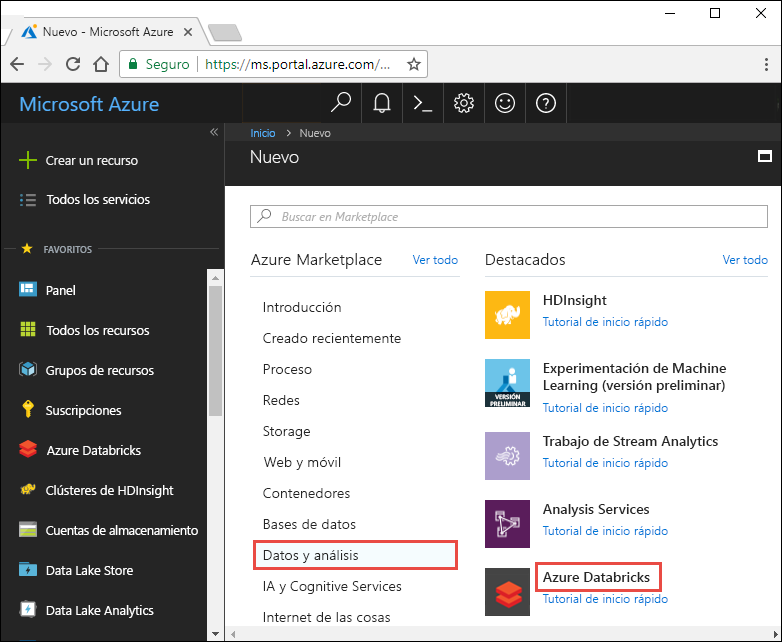
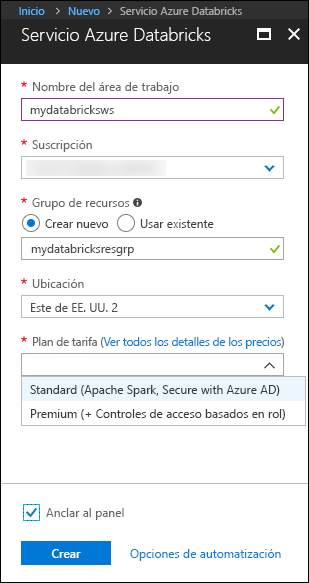
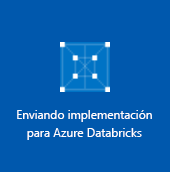
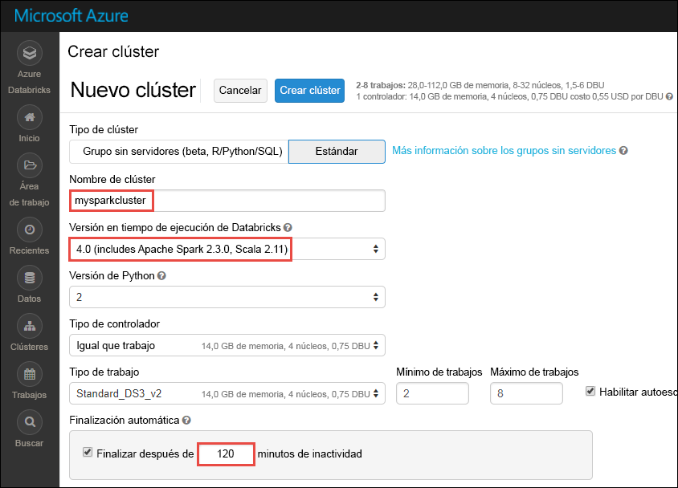
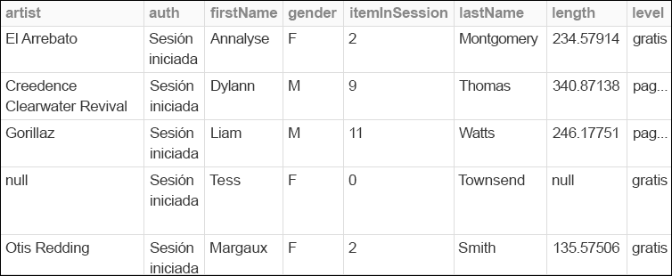
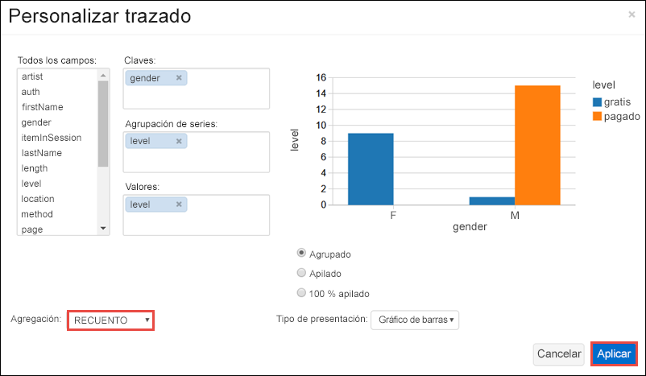
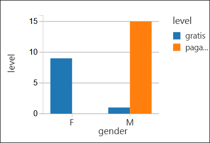

# <a name="quickstart-run-a-spark-job-on-azure-databricks-using-the-azure-portal"></a>Guía de inicio rápido: ejecución de un trabajo de Spark en Azure Databricks con Azure Portal

Esta guía de inicio rápido muestra cómo crear un área de trabajo de Azure Databricks y un clúster de Apache Spark dentro de esa área de trabajo. Por último, aprenderá a ejecutar un trabajo de Spark en el clúster de Databricks. Para obtener más información sobre Azure Databricks, vea [¿Qué es Azure Databricks?](what-is-azure-databricks.md)

En esta guía de inicio rápido, como parte del trabajo de Spark, se analizan los datos de suscripción a un canal de radio para obtener información sobre el uso gratis o de pago basado en datos demográficos. 

Si no tiene una suscripción a Azure, cree una [cuenta gratuita](https://azure.microsoft.com/free/) antes de empezar.

## <a name="log-in-to-the-azure-portal"></a>Iniciar sesión en Azure Portal

Inicie sesión en [Azure Portal](https://portal.azure.com).

## <a name="create-an-azure-databricks-workspace"></a>Creación de un área de trabajo de Azure Databricks

En esta sección, creará un área de trabajo de Azure Databricks mediante Azure Portal. 

1. En Azure Portal, seleccione **Crear un recurso** > **Datos y análisis** > **Azure Databricks**. 

    

2. En **Azure Databricks Service**, proporcione los valores para crear un área de trabajo de Databricks.

    

    Proporcione los valores siguientes: 
     
    |Propiedad  |Descripción  |
    |---------|---------|
    |**Workspace name** (Nombre del área de trabajo)     | Proporcione un nombre para el área de trabajo de Databricks        |
    |**Suscripción**     | En el cuadro desplegable, seleccione la suscripción de Azure.        |
    |**Grupos de recursos**     | Especifique si desea crear un nuevo grupo de recursos o utilizar uno existente. Un grupo de recursos es un contenedor que almacena los recursos relacionados con una solución de Azure. Para más información, consulte [Información general del grupo de recursos de Azure](../azure-resource-manager/resource-group-overview.md). |
    |**Ubicación**     | Seleccione **Este de EE. UU. 2**. Para otras regiones disponibles, consulte [Productos disponibles por región](https://azure.microsoft.com/regions/services/).        |
    |**Plan de tarifa**     |  Elija entre **Standard** o **Premium**. Para más información sobre estos planes, consulte la [página de precios de Databricks](https://azure.microsoft.com/pricing/details/databricks/).       |

    Seleccione **Anclar al panel** y luego haga clic en **Crear**.

4. Se tarda unos minutos en crear el área de trabajo. Durante la creación del área de trabajo, el portal muestra el icono **Enviando implementación para Azure Databricks** a la derecha. Puede que deba desplazarse a la derecha del panel para ver el icono. También hay una barra de progreso que se muestra en la parte superior de la pantalla. Puede ver cualquier área para el progreso.

    

## <a name="create-a-spark-cluster-in-databricks"></a>Creación de un clúster de Spark en Databricks

> [!NOTE] 
> Para usar una cuenta gratuita para crear el clúster de Azure Databricks, antes de crear el clúster, vaya a su perfil y cambie su suscripción a **pago por uso**. Para más información consulte el sitio de [cuentas gratuitas de Azure](https://azure.microsoft.com/free/).  

1. En Azure Portal, vaya al área de trabajo de Databricks que ha creado y, después, haga clic en **Launch Workspace** (Iniciar área de trabajo).

2. Se le redirigirá al portal de Azure Databricks. Desde el portal, haga clic en **Clúster**.

    

3. En la página **Nuevo clúster**, proporcione los valores para crear un clúster.

    

    Acepte los demás valores predeterminados, salvo los siguientes:

    * Escriba un nombre para el clúster.
    * Para este artículo, cree un clúster con el entorno en tiempo de ejecución **4.0**. 
    * Asegúrese de que selecciona la casilla **Terminate after \_\_ minutes of inactivity** (Terminar después de ____ minutos de inactividad). Proporcione una duración (en minutos) para terminar el clúster, si este no se usa.
    
    Seleccione **Create cluster** (Crear clúster). Una vez que el clúster se está ejecutando, puede asociarle notebooks y ejecutar trabajos de Spark. 

Para obtener más información sobre la creación de clústeres, consulte [Create a Spark cluster in Azure Databricks](https://docs.azuredatabricks.net/user-guide/clusters/create.html) (Creación de un clúster de Spark en Azure Databricks).


## <a name="download-a-sample-data-file"></a>Carga de un archivo de datos de ejemplo
Descargue un archivo de datos JSON de ejemplo y guárdelo en Azure Blob Storage.

1. Descargue este archivo de datos JSON de ejemplo [desde Github](https://raw.githubusercontent.com/Azure/usql/master/Examples/Samples/Data/json/radiowebsite/small_radio_json.json) en el equipo local. Haga clic con el botón derecho en él y seleccione Guardar como para guardar el archivo sin formato de forma local. 

2. Si aún no tiene una cuenta de almacenamiento, cree una. 
   - En Azure Portal, haga clic en **Crear un recurso**.  Seleccione la categoría **Almacenamiento** y, después, **Cuentas de almacenamiento**  
   - Proporcione un nombre único para la cuenta de almacenamiento.
   - Seleccione **Tipo de cuenta**: **Blob Storage**.
   - Seleccione un nombre para el **grupo de recursos**. Use el mismo grupo de recursos en el que creó el área de trabajo de Databricks.
   
   Para más información, consulte [Creación de una cuenta de Azure Blob Storage](../storage/common/storage-quickstart-create-account.md). 

3. Cree un contenedor de almacenamiento en la cuenta de Blob Storage y cargue el archivo json de ejemplo en él. También puede usar Azure Portal o el [Explorador de Microsoft Azure Storage](../vs-azure-tools-storage-manage-with-storage-explorer.md) para cargar el archivo.

   - Abra la cuenta de almacenamiento en Azure Portal.
   - Seleccione **Blobs**.
   - Seleccione **+ Contenedor** para crear un nuevo contenedor vacío.
   - Proporcione un **nombre** para el contenedor como, por ejemplo, `databricks`. 
   - Seleccione el nivel de acceso **Privado (acceso no anónimo)**.
   - Una vez creado el contenedor, seleccione el nombre del contenedor.
   - Seleccione el botón **Cargar**.
   - En la página **Archivos**, seleccione el **icono de carpeta** para examinar y seleccionar el archivo de ejemplo `small_radio_json.json` para la carga. 
   - Seleccione **Cargar** para cargar el archivo.
   
   
## <a name="run-a-spark-sql-job"></a>Ejecución de un trabajo de Spark SQL
Realice las tareas siguientes para crear un cuaderno en Databricks, configúrelo para leer los datos de una cuenta de Azure Blob Storage y, a continuación, ejecute un trabajo de Spark SQL en los datos.

1. En el panel izquierdo, haga clic en **Área de trabajo**. Desde la lista desplegable **Área de trabajo**, haga clic en **Crear** y, a continuación, haga clic en **Notebook**.

    

2. En el cuadro de diálogo **Creación de notebook**, escriba un nombre, seleccione **Scala** como lenguaje y seleccione el clúster de Spark que creó anteriormente.

    

    Haga clic en **Create**(Crear).

3. En este paso, asocie la cuenta de Azure Storage con el clúster de Databricks Spark. Hay dos maneras de hacerlo. Puede montar la cuenta de Azure Storage en el sistema de archivos de Databricks (DBFS) o acceder directamente a la cuenta de Azure Storage desde la aplicación que cree.  

    > [!IMPORTANT]
    >En este artículo se utiliza el enfoque para **montar el almacenamiento con DBFS**. Este enfoque garantiza que el almacenamiento montado se asocia con el propio sistema de archivos del clúster. De esa forma, cualquier aplicación que acceda al clúster puede usar también el almacenamiento asociado. El enfoque del acceso directo está limitado a la aplicación desde donde se configura el acceso.
    >
    > Para usar el enfoque del montaje, es preciso crear un clúster de Spark con la versión **4.0** del entorno en tiempo de ejecución de Databricks, que es lo que ha elegido en este artículo.

    En el siguiente fragmento de código, reemplace `{YOUR CONTAINER NAME}`, `{YOUR STORAGE ACCOUNT NAME}` y `{YOUR STORAGE ACCOUNT ACCESS KEY}` por los valores adecuados de su cuenta de Azure Storage. Pegue el fragmento de código siguiente en una celda vacía del notebook y, después, presione MAYÚS + ENTRAR para ejecutar la celda de código.

    * **Montaje de la cuenta de almacenamiento con DBFS (se recomienda)**. En este fragmento de código, la ruta de acceso de la cuenta de Azure Storage se monta en `/mnt/mypath`. Por consiguiente, en todas las futuras ocurrencias en las que acceda a la cuenta de Azure Storage no es preciso que dé la ruta de acceso completa. Puede utilizar `/mnt/mypath`.

          dbutils.fs.mount(
            source = "wasbs://{YOUR CONTAINER NAME}@{YOUR STORAGE ACCOUNT NAME}.blob.core.windows.net/",
            mountPoint = "/mnt/mypath",
            extraConfigs = Map("fs.azure.account.key.{YOUR STORAGE ACCOUNT NAME}.blob.core.windows.net" -> "{YOUR STORAGE ACCOUNT ACCESS KEY}"))

    * **Acceso directo a la cuenta de almacenamiento**

          spark.conf.set("fs.azure.account.key.{YOUR STORAGE ACCOUNT NAME}.blob.core.windows.net", "{YOUR STORAGE ACCOUNT ACCESS KEY}")

    Para obtener instrucciones acerca de cómo recuperar la clave de la cuenta de almacenamiento, consulte [Administración de claves de acceso de almacenamiento](../storage/common/storage-account-manage.md#access-keys).

    > [!NOTE]
    > También puede usar Azure Data Lake Store con un clúster de Spark en Azure Databricks. Para obtener instrucciones, consulte [Use Data Lake Store with Azure Databricks](https://go.microsoft.com/fwlink/?linkid=864084) (Uso de Data Lake Store con Azure Databricks).

4. Ejecute una instrucción SQL para crear una tabla temporal con datos desde el archivo de datos JSON de ejemplo, **small_radio_json.json**. En el siguiente fragmento de código, reemplace los valores del marcador de posición con el nombre del contenedor y el nombre de la cuenta de almacenamiento. Pegue el fragmento de código en una celda vacía del notebook y, después, presione MAYÚS + ENTRAR. En el fragmento de código, `path` indica la ubicación del archivo JSON de ejemplo que cargó en su cuenta de Azure Storage.

    ```sql
    %sql 
    DROP TABLE IF EXISTS radio_sample_data;
    CREATE TABLE radio_sample_data
    USING json
    OPTIONS (
     path "/mnt/mypath/small_radio_json.json"
    )
    ```

    Una vez que el comando se completa correctamente, tiene todos los datos desde el archivo JSON como una tabla en el clúster de Databricks.

    El comando mágico del lenguaje `%sql` le permite ejecutar un código SQL desde el notebook, aunque este sea de otro tipo. Para obtener más información, consulte [Combinación de lenguajes en un notebook](https://docs.azuredatabricks.net/user-guide/notebooks/index.html#mixing-languages-in-a-notebook).

5. Echemos un vistazo a una instantánea de los datos JSON de ejemplo para entender mejor la consulta que se ejecuta. Pegue el siguiente fragmento de código en una celda vacía y presione **MAYÚS + ENTRAR**.

    ```sql
    %sql 
    SELECT * from radio_sample_data
    ```

6. Verá un resultado tabular como se muestra en la siguiente captura de pantalla (solo se ven algunas columnas):

    

    Entre otros detalles, los datos de ejemplo capturan el género de la audiencia de un canal de radio (nombre de columna, **género**) y si su suscripción es gratis o de pago (nombre de columna, **nivel**).

7. Ahora cree una representación visual de estos datos para mostrar para cada género, cuántos usuarios tienen cuentas gratis y cuántas son de suscriptores pagados. En la parte inferior de la salida tabular, haga clic en el icono **Gráfico de barras** y, a continuación, haga clic en **Opciones de trazado**.

    

8. En **Personalizar trazado**, arrastre y coloque los valores como se muestra en la captura de pantalla.

    

    * Establezca **Claves** en **gender** (género).
    * Establezca **Agrupaciones de serie** en **level** (nivel).
    * Establezca **Valores** en **level** (nivel).
    * Establezca **Agregación** en **COUNT** (recuento).

    Haga clic en **Aplicar**.

9. El resultado muestra la representación visual, como se describe en la siguiente captura de pantalla:

     

## <a name="clean-up-resources"></a>Limpieza de recursos

Cuando haya terminado el artículo, puede finalizar el clúster. Para ello, desde el área de trabajo de Azure Databricks, en el panel izquierdo, seleccione **Clusters** (Clústeres). En el clúster que desea finalizar, mueva el cursor sobre el botón de puntos suspensivos en la columna **Actions** (Acciones) y seleccione el icono **Terminate** (Finalizar).


Si no finaliza manualmente el clúster, este se detendrá automáticamente si seleccionó la casilla **Terminate after __ minutes of inactivity** (Finalizar después de __ minutos de inactividad) al crear el clúster. En tal caso, el clúster se detiene automáticamente si ha estado inactivo durante el tiempo especificado.

## <a name="next-steps"></a>Pasos siguientes

En este artículo, creó un clúster de Spark en Azure Databricks y ejecutó un trabajo de Spark utilizando los datos de Azure Storage. También puede mirar [Spark data sources](https://docs.azuredatabricks.net/spark/latest/data-sources/index.html) (Orígenes de datos de Spark) para aprender a importar datos desde otros orígenes de datos en Azure Databricks. Vaya al siguiente artículo para aprender cómo realizar una operación ETL (extraer, transformar y cargar datos) mediante Azure Databricks.

> [!div class="nextstepaction"]
>[Extracción, transformación y carga de datos mediante Azure Databricks](databricks-extract-load-sql-data-warehouse.md)
