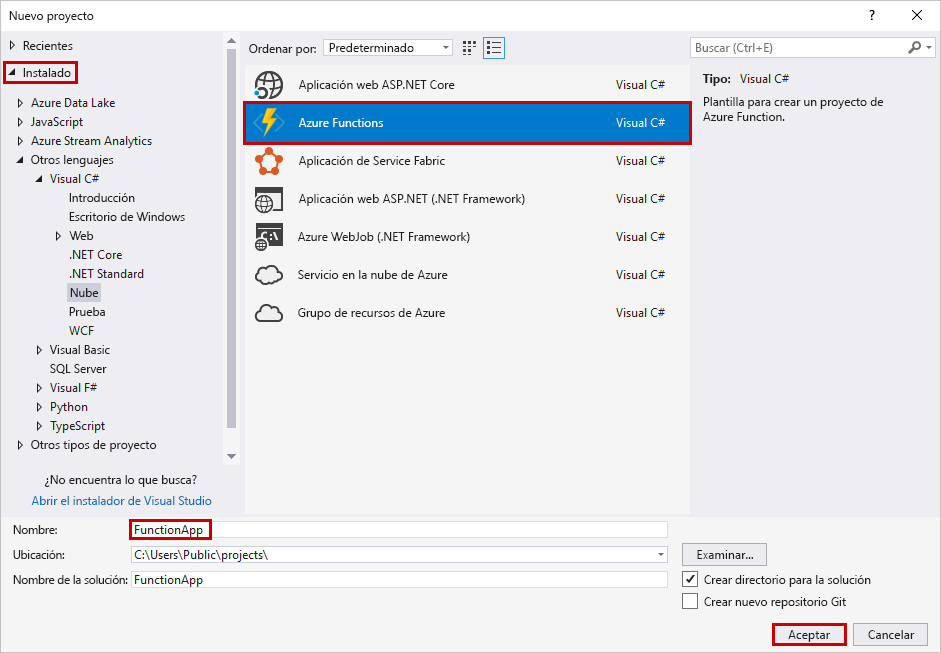
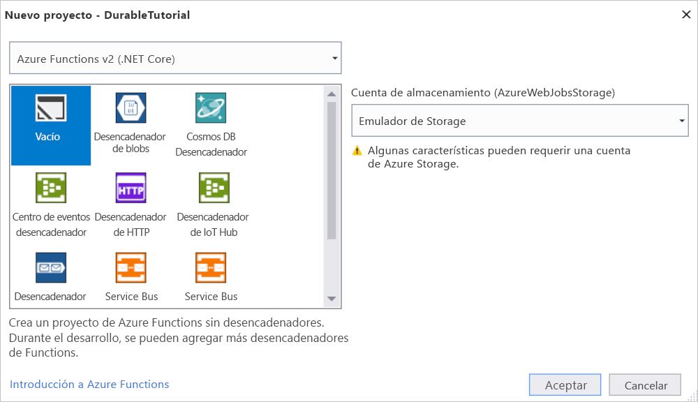
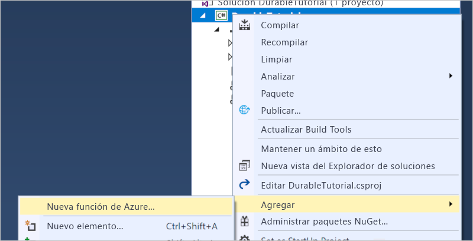
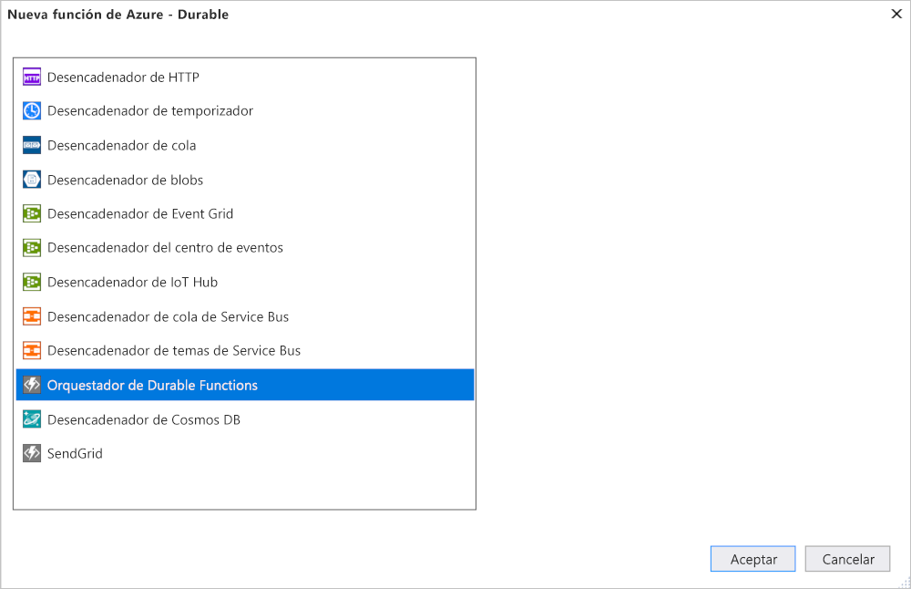

# <a name="create-your-first-durable-function-in-c"></a>Creación de su primera función durable en C\#

*Durable Functions* es una extensión de [Azure Functions](../functions-overview.md) que le permite escribir funciones con estado en un entorno sin servidor. La extensión administra el estado, establece puntos de control y reinicia en su nombre.

En este artículo, aprenderá a usar las herramientas de Visual Studio 2017 para Azure Functions con el fin de crear y probar localmente una función durable "Hola mundo".  Esta función organiza y encadena llamadas a otras funciones. Luego, publicará el código de función en Azure. Estas herramientas están disponibles como parte de la carga de trabajo de desarrollo de Azure en Visual Studio 2017.


## <a name="prerequisites"></a>Requisitos previos

Para completar este tutorial:

* Instalación de [Visual Studio 2017](https://azure.microsoft.com/downloads/). Asegúrese de que la carga de trabajo de **Desarrollo de Azure** también está instalada.

* Asegúrese de que tiene las [herramientas de Azure Functions más recientes](../functions-develop-vs.md#check-your-tools-version).

* Compruebe que tiene el [Emulador de Azure Storage](../../storage/common/storage-use-emulator.md) instalado y ejecutándose.

[!INCLUDE [quickstarts-free-trial-note](../../../includes/quickstarts-free-trial-note.md)]

## <a name="create-a-function-app-project"></a>Creación de un proyecto de aplicación de función

La plantilla de Azure Functions crea un proyecto que se puede publicar en una aplicación de función en Azure. Una aplicación de función permite agrupar funciones como una unidad lógica para la administración, la implementación y el uso compartido de recursos.

1. En Visual Studio, seleccione **Nuevo** > **proyecto** en el menú **Archivo**.

2. En el cuadro de diálogo **Nuevo proyecto**, seleccione **Instalado**, expanda **Visual C#** > **Nube**, seleccione **Azure Functions**, escriba un **nombre** para el proyecto y haga clic en **Aceptar**. El nombre de la aplicación de función debe ser válido como espacio de nombres de C#, por lo que no debe usar guiones bajos, guiones u otros caracteres no alfanuméricos.

    

3. Use la configuración especificada en la tabla que aparece después de la imagen.

    

    | Configuración      | Valor sugerido  | DESCRIPCIÓN                      |
    | ------------ |  ------- |----------------------------------------- |
    | **Versión** | Azure Functions 2.x <br />(.NET Core) | Crea un proyecto de función que usa la versión 2.x del entorno de ejecución de Azure Functions, que es compatible con .NET Core. Azure Functions 1.x admite .NET Framework. Para más información, consulte [Cómo seleccionar un destino para versiones en tiempo de ejecución de Azure Functions](../functions-versions.md).   |
    | **Plantilla** | Vacío | De esta forma se crea una aplicación de función vacía. |
    | **Cuenta de almacenamiento**  | Emulador de Storage | Es necesaria una cuenta de almacenamiento para la administración del estado de función durable. |

4. Haga clic en **Aceptar** para crear un proyecto de función vacía. Este proyecto tiene los archivos de configuración básica necesarios para ejecutar las funciones.

## <a name="add-functions-to-the-app"></a>Incorporación de funciones a la aplicación

En los pasos siguientes se usa una plantilla para crear el código de Durable Functions en el proyecto.

1. Haga clic con el botón derecho en el proyecto en Visual Studio y seleccione **Agregar** > **Nueva función de Azure**.

    

2. Compruebe que **Función de Azure** está seleccionado en el menú Agregar y dele un nombre al archivo C#.  Presione **Agregar**.

3. Seleccione la plantilla **Durable Functions Orchestrator** y haga clic en **Aceptar**

      

Una nueva función Durable Functions se agregará a la aplicación.  Abra el nuevo archivo .cs para ver el contenido. Esta función Durable Functions es un ejemplo de una función sencilla de encadenamiento con los métodos siguientes:  

| Método | FunctionName | DESCRIPCIÓN |
| -----  | ------------ | ----------- |
| **`RunOrchestrator`** | `<file-name>` | Administra la orquestación de Durable Functions. En este caso, la orquestación se inicia, crea una lista y le agrega el resultado de tres llamadas a funciones.  Una vez completadas las tres llamadas a funciones, devuelve la lista. |
| **`SayHello`** | `<file-name>_Hello` | Por ejemplo, la función devuelve un saludo. Se trata de la función que contiene la lógica de negocios que se organiza. |
| **`HttpStart`** | `<file-name>_HttpStart` | Una [función desencadenada por HTTP](../functions-bindings-http-webhook.md) que inicia una instancia de la orquestación y devuelve una respuesta de comprobación de estado. |

Ahora que ha creado un proyecto de función y una función durable, puede probarla en el equipo local.

## <a name="test-the-function-locally"></a>Prueba local de la función

Azure Functions Core Tools le permite ejecutar un proyecto de Azure Functions en el equipo de desarrollo local. Se le solicita que instale estas herramientas la primera vez que inicie una función de Visual Studio.

1. Para probar la función, presione F5. Si se le solicita, acepte la solicitud de Visual Studio para descargar e instalar las herramientas de Azure Functions Core (CLI). También es preciso que habilite una excepción de firewall para que las herramientas para controlen las solicitudes de HTTP.

2. Copie la dirección URL de la función de los resultados del runtime de Azure Functions.

    

3. Pegue la dirección URL de la solicitud HTTP en la barra de direcciones del explorador y ejecútela. A continuación se muestra la respuesta en el explorador para la solicitud GET local devuelta por la función:

    

    La respuesta es el resultado inicial de la función HTTP que informa de que la orquestación durable se ha iniciado correctamente.  No es aún el resultado final de la orquestación.  La respuesta incluye algunas direcciones URL útiles.  De momento, vamos a consultar el estado de la orquestación.

4. Copie el valor de la URL para `statusQueryGetUri`, péguelo en la barra de direcciones del explorador y ejecute la solicitud.

    La solicitud consultará la instancia de orquestación sobre el estado. Obtendrá una respuesta posible similar a la siguiente.  Esto nos muestra que la instancia se ha completado, e incluye las salidas o resultados de la función durable.

    ```json
    {
        "instanceId": "d495cb0ac10d4e13b22729c37e335190",
        "runtimeStatus": "Completed",
        "input": null,
        "customStatus": null,
        "output": [
            "Hello Tokyo!",
            "Hello Seattle!",
            "Hello London!"
        ],
        "createdTime": "2018-11-08T07:07:40Z",
        "lastUpdatedTime": "2018-11-08T07:07:52Z"
    }
    ```

5. Para detener la depuración, presione **Mayús + F5**.

Después de comprobar que la función se ejecuta correctamente en el equipo local es el momento de publicar el proyecto en Azure.

## <a name="publish-the-project-to-azure"></a>Publicar el proyecto en Azure

Debe tener una aplicación de función en la suscripción de Azure para poder publicar el proyecto. Las aplicaciones de función se pueden crear directamente desde Visual Studio.

[!INCLUDE [Publish the project to Azure](../../../includes/functions-vstools-publish.md)]

## <a name="test-your-function-in-azure"></a>Prueba de una función en Azure

1. Copie la URL base de la aplicación de función de la página de perfil de publicación. Reemplace la parte `localhost:port` de la dirección URL que usó al probar la función localmente por la nueva URL base.

    La dirección URL que llama al desencadenador HTTP de la función durable debería tener el formato siguiente:

        http://<APP_NAME>.azurewebsites.net/api/<FUNCTION_NAME>_HttpStart

2. Pegue la dirección URL de la solicitud HTTP en la barra de direcciones del explorador. Debe obtener la misma respuesta de estado que antes cuando se usó la aplicación publicada.

## <a name="next-steps"></a>Pasos siguientes

Ha usado Visual Studio para crear y publicar una aplicación de función durable con C#.

> [!div class="nextstepaction"]
> [Obtenga información acerca de los patrones comunes de funciones durables.](durable-functions-concepts.md)
