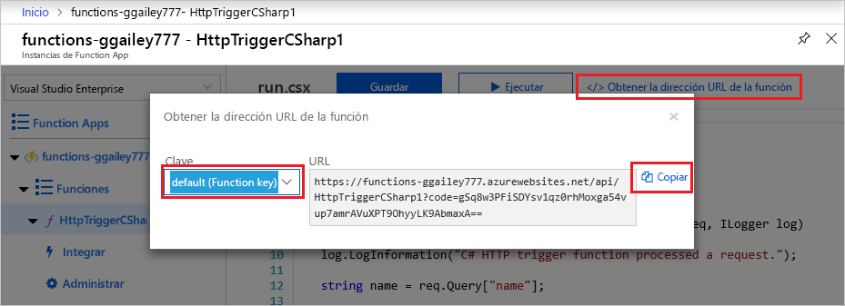

# Creación de su primera función en Azure Portal

En este tema se muestra cómo usar Azure Functions para crear una función "Hola mundo", invocada por una solicitud HTTP. Antes de poder crear una función en Azure Portal, debe crear una instancia de Function App para hospedar la ejecución sin servidor de la función.

Para completar este inicio rápido, debe tener una cuenta de Azure. Hay disponibles [cuentas gratuitas](https://azure.microsoft.com/free/). También puede [probar Azure Functions](https://azure.microsoft.com/try/app-service/functions/) sin tener que registrarse en Azure.

## Inicie sesión en Azure.

Inicie sesión en [Azure Portal](https://portal.azure.com/).

## Creación de una aplicación de función

[!INCLUDE [functions-create-function-app-portal](../../includes/functions-create-function-app-portal.md)]

Para más información, consulte [Creación de una instancia de Function App desde Azure Portal](functions-create-function-app-portal.md).

## Creación de una función
Mediante estos pasos se crea una función en la nueva instancia de Function App si se usa el inicio rápido de Azure Functions.

1. Haga clic en el botón **Nuevo**, después, en **Webhook y API**, elija un lenguaje para su función y haga clic en **Crear una función**. Se crea una función en el lenguaje elegido mediante la plantilla de función desencadenada por HTTP.  
   
    

Después de crear la función, puede probarla mediante el envío de una solicitud HTTP.

## Prueba de la función

Puesto que las plantillas de función contienen código de trabajo, puede probar inmediatamente la nueva función directamente en el portal.

1. En Function App, haga clic en la nueva función y revise el código de la plantilla. Observe que la función espera una solicitud HTTP con un valor de *name* en el cuerpo del mensaje o en una cadena de consulta. Cuando se ejecuta la función, este valor se devuelve en el mensaje de respuesta. El ejemplo que se muestra es una función de JavaScript.
   
2. Haga clic en **Ejecutar** para ejecutar la función. Se ve que la ejecución la desencadena una solicitud HTTP de prueba, la información se escribe en los registros y la respuesta "hello..." se muestra en **Salida** en la pestaña **Prueba**.
 
    

3. En el cuadro de texto **Cuerpo de la solicitud**, cambie el valor de la propiedad *name* a su nombre y haga clic en **Ejecutar** otra vez. Esta vez, la respuesta de la **salida** contiene su nombre.   

4. Para desencadenar la ejecución de la misma función desde una herramienta de prueba de HTTP o desde otra ventana del explorador, haga clic en **</> Obtener la dirección URL de la función**, copie la dirección URL de la solicitud y péguela en la barra de direcciones de la herramienta o del explorador. Agregue el valor de la cadena de consulta `&name=yourname` a la dirección URL y ejecute la solicitud. La misma información se escribe en los registros y la misma cadena se encuentra en el cuerpo del mensaje de respuesta.

    

## Pasos siguientes
[!INCLUDE [Functions quickstart next steps](../../includes/functions-quickstart-next-steps.md)]

[!INCLUDE [Getting Started Note](../../includes/functions-get-help.md)]

