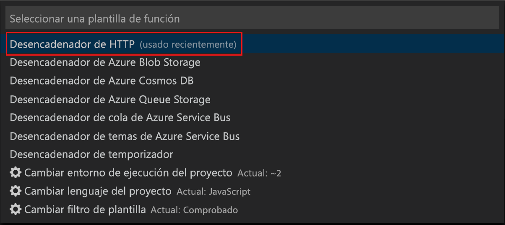

# Creación de la primera función mediante Visual Studio Code

Azure Functions permite ejecutar el código en un entorno [sin servidor](https://azure.microsoft.com/solutions/serverless/) sin necesidad de crear una máquina virtual o publicar una aplicación web.

En este artículo aprenderá a usar la [extensión de Azure Functions para Visual Studio Code] para crear y probar una función "hola mundo" en su equipo local mediante Microsoft Visual Studio Code. Posteriormente, puede publicar el código de la función en Azure desde Visual Studio Code.

La extensión admite actualmente funciones de C#, JavaScript y Java. Los pasos descritos en este artículo pueden variar según el lenguaje que elija para el proyecto de Azure Functions. Actualmente, la extensión se encuentra en versión preliminar. Para más información, consulte la página de la [extensión de Azure Functions para Visual Studio Code].

## Requisitos previos

Para completar esta guía de inicio rápido:

* Instale [Visual Studio Code](https://code.visualstudio.com/) en una de las [plataformas compatibles](https://code.visualstudio.com/docs/supporting/requirements#_platforms). Este artículo se ha desarrollado y probado en un dispositivo que ejecutaba macOS (High Sierra).

* Instale la versión 2.x de [Azure Functions Core Tools](functions-run-local.md#v2), que se encuentra aún en versión preliminar.

* Instale los requisitos específicos para el lenguaje elegido:

    | Idioma | Extensión |
    | -------- | --------- |
    | **C#** | [C# para Visual Studio Code](https://marketplace.visualstudio.com/items?itemName=ms-vscode.csharp) [Herramientas de la CLI de .NET Core](https://docs.microsoft.com/dotnet/core/tools/?tabs=netcore2x)*   |
    | **Java** | [Depurador para Java](https://marketplace.visualstudio.com/items?itemName=vscjava.vscode-java-debug) [Java 8](https://aka.ms/azure-jdks) [Maven 3+](https://maven.apache.org/) |
    | **JavaScript** | [Node 8.0+](https://nodejs.org/)  |

    \* Core Tools también lo requiere.

[!INCLUDE [quickstarts-free-trial-note](../../includes/quickstarts-free-trial-note.md)]

[!INCLUDE [functions-install-vs-code-extension](../../includes/functions-install-vs-code-extension.md)]

[!INCLUDE [functions-create-function-app-vs-code](../../includes/functions-create-function-app-vs-code.md)]

## Crear una función desencadenada mediante HTTP

1. En **Azure: Functions**, elija el icono Crear función.

    

1. Seleccione la carpeta con el proyecto de la aplicación de función y seleccione la plantilla de función del **desencadenador HTTP**.

    

1. Escriba `HTTPTrigger` como nombre de la función y presione ENTRAR y, a continuación, seleccione la opción de autenticación **Anónimo**.

    

    Se crea una función en el lenguaje elegido mediante la plantilla para una función desencadenada por HTTP.

    

Puede agregar enlaces de entrada y salida a la función modificando el archivo function.json. Para más información, consulte [Conceptos básicos sobre los enlaces y desencadenadores de Azure Functions](functions-triggers-bindings.md).

Ahora que ha creado un proyecto de función y una función desencadenada por HTTP, puede probarla en el equipo local.

## Prueba local de la función

Azure Functions Core Tools le permite ejecutar un proyecto de Azure Functions en el equipo de desarrollo local. Se le solicita que instale estas herramientas la primera vez que inicie una función de Visual Studio Code.  

1. Para probar la función, establezca un punto de interrupción en el código de la función y presione F5 para iniciar el proyecto de la aplicación de función. La salida de Core Tools aparece en el panel **Terminal**.

1. En el panel **Terminal**, copie el punto de conexión de la dirección URL de la función desencadenada por HTTP.

    

1. Pegue la dirección URL de la solicitud HTTP en la barra de direcciones del explorador. Agregue la cadena de consulta `?name=<yourname>` a esta dirección URL y ejecute la solicitud. La ejecución se pone en pausa cuando se alcanza el punto de interrupción.

    

1. Si continúa la ejecución, aquí se muestra la respuesta en el explorador a la solicitud GET:

    

1. Para detener la depuración, presione Mayús + F1.

Después de comprobar que la función se ejecuta correctamente en el equipo local es el momento de publicar el proyecto en Azure.

[!INCLUDE [functions-sign-in-vs-code](../../includes/functions-sign-in-vs-code.md)]

[!INCLUDE [functions-publish-project-vscode](../../includes/functions-publish-project-vscode.md)]

## Prueba de una función en Azure

1. Copie la dirección URL del desencadenador HTTP del panel **Salida**. Como antes, asegúrese de que agrega la cadena de consulta `?name=<yourname>` al final de esta dirección URL y ejecute la solicitud.

    La dirección URL que llama a la función desencadenada por HTTP debería tener el formato siguiente:

        http://<functionappname>.azurewebsites.net/api/<functionname>?name=<yourname> 

1. Pegue la dirección URL de la solicitud HTTP en la barra de direcciones del explorador. A continuación se muestra la respuesta en el explorador para la solicitud GET remota devuelta por la función: 

    

## Pasos siguientes

Ha usado Visual Studio Code para crear una aplicación de función con una función simple desencadenada por HTTP. Para más información sobre el desarrollo de funciones en un lenguaje específico, consulte las guías de referencia de lenguaje para [JavaScript](functions-reference-node.md), [.NET](functions-dotnet-class-library.md) o [Java](functions-reference-java.md).

A continuación, puede que desee más información sobre la prueba y depuración local desde el terminal o el símbolo del sistema mediante Azure Functions Core Tools.

> [!div class="nextstepaction"]
> [Codificación y pruebas locales](functions-run-local.md)

[Azure Functions Core Tools]: functions-run-local.md
[Extensión de Azure Functions para Visual Studio Code]: https://marketplace.visualstudio.com/items?itemName=ms-azuretools.vscode-azurefunctions
