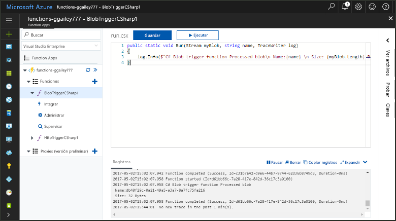
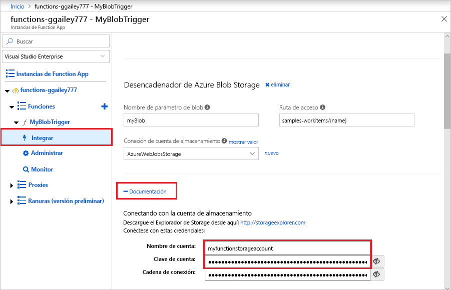
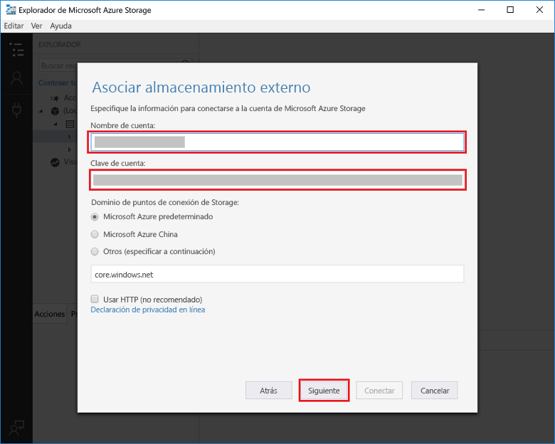
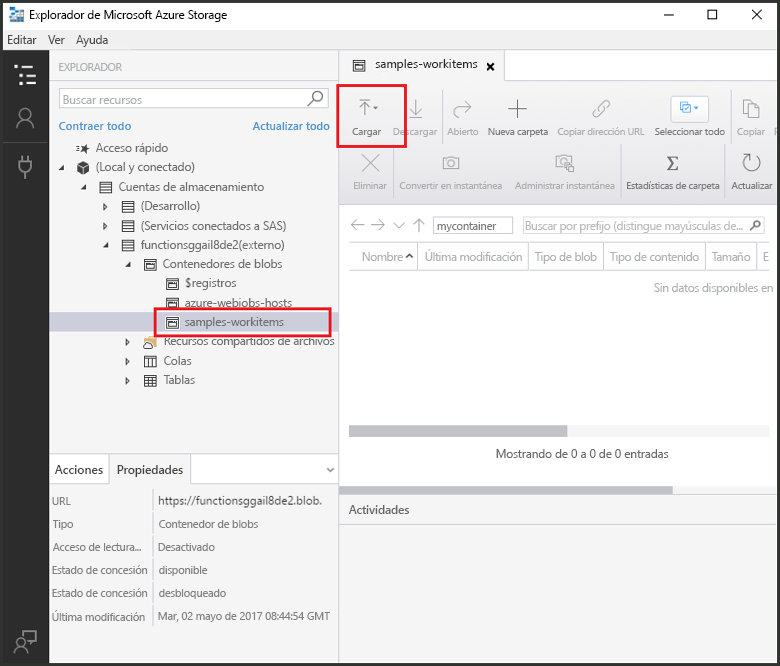

# Crear una función desencadenada por Azure Blob Storage

Obtenga información sobre cómo crear una función que se desencadena cuando se cargan o se actualizan archivos en Azure Blob Storage.  

Debería tardar menos de cinco minutos en completar todos los pasos de este tema.

## Requisitos previos

[!INCLUDE [Previous quickstart note](../../includes/functions-quickstart-previous-topics.md)]

También debe descargar e instalar el [Explorador de Microsoft Azure Storage](http://storageexplorer.com/). 

[!INCLUDE [functions-portal-favorite-function-apps](../../includes/functions-portal-favorite-function-apps.md)] 

## Crear una función desencadenada por Blob Storage

Expanda la Function App, haga clic en el botón **+** situado junto a **Funciones** y haga clic en la plantilla **BlobTrigger** para el idioma que quiera. Después, use la configuración especificada en la tabla y haga clic en **Crear**.

    
| Configuración      |  Valor sugerido   | Descripción                                        |
| ------------ |  ----------------- | -------------------------------------------------- |
| **Ruta de acceso**   | mycontainer/{name}    | Ubicación de Blob Storage que se está supervisando. El nombre de archivo del blob se pasa en el enlace como parámetro _name_.  |
| **Conexión de cuenta de Storage** | AzureWebJobStorage | Puede usar la conexión de cuenta de almacenamiento que ya usa la Function App o crear una.  |
| **Asigne un nombre a la función** | Único en la Function App | Nombre de la función desencadenada por la cola. | 

Después, conéctese a su cuenta de Azure Storage y cree el contenedor **mycontainer**.

## Cree el contenedor.

1. En la función, haga clic en **Integrar**, expanda **Documentación** y copie los dos valores de **Nombre de cuenta** y **Clave de cuenta**. Use estas credenciales para conectarse a la cuenta de almacenamiento. Si ya se ha conectado a la cuenta de almacenamiento, vaya al paso 4.
 
    

2. Ejecute la herramienta [Explorador de Microsoft Azure Storage](http://storageexplorer.com/), haga clic en el icono de conexión situado a la izquierda, seleccione **Use a storage account name and key** (Usar el nombre y la clave de una cuenta de almacenamiento) y haga clic en **Siguiente**.

    
    
3. Escriba los valores de **Nombre de cuenta** y **Clave de cuenta** del paso 1, haga clic en **Siguiente** y, después, en **Conectar**. 
  
    

4. Expanda la cuenta de almacenamiento asociada, haga clic con el botón derecho en **Contenedores de blobs**, haga clic en **Crear contenedor de blobs**, escriba `mycontainer` y, después, presione ENTRAR.
 
    

Ahora que tiene un contenedor de blobs, puede probar la función. Para ello, cargue un archivo en el contenedor.  

## Prueba de la función

1. De nuevo en Azure Portal, vaya a la función. Expanda **Registros** en la parte inferior de la página y asegúrese de que el streaming de registros no está en pausa.

2. En el Explorador de almacenamiento, expanda la cuenta de almacenamiento, **Contenedores de blobs** y **mycontainer**. Haga clic en **Cargar** y en **Cargar archivos…**

    

2. En el cuadro de diálogo **Cargar archivos**, haga clic en el campo **Archivos**. Busque un archivo en el equipo local, como un archivo de imagen, selecciónelo y haga clic en **Abrir** y, después, en **Cargar**.   
 
3. Vuelva a sus registros de función y compruebe que se ha leído el blob. 

   

    >[!NOTE]
    > Cuando la Function App se ejecuta en el plan de consumo predeterminado, puede haber un retraso de hasta varios minutos entre el momento en que se agrega o se actualiza el blob y el momento en que se desencadena la función. Si necesita una latencia baja en las funciones desencadenadas por el blob, considere la posibilidad de ejecutar la Function App en un plan de App Service. 

## Limpieza de recursos

[!INCLUDE [Next steps note](../../includes/functions-quickstart-cleanup.md)]

## Pasos siguientes

Ha creado una función que se ejecuta cuando se agrega o se actualiza un blob en Blob Storage. 

[!INCLUDE [Next steps note](../../includes/functions-quickstart-next-steps.md)]

Para obtener más información sobre los desencadenadores de Blob Storage, vea [Enlaces de Blob Storage en Azure Functions](functions-bindings-storage-blob.md). 

