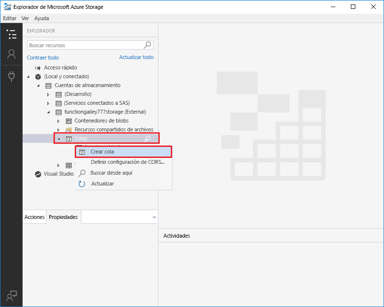
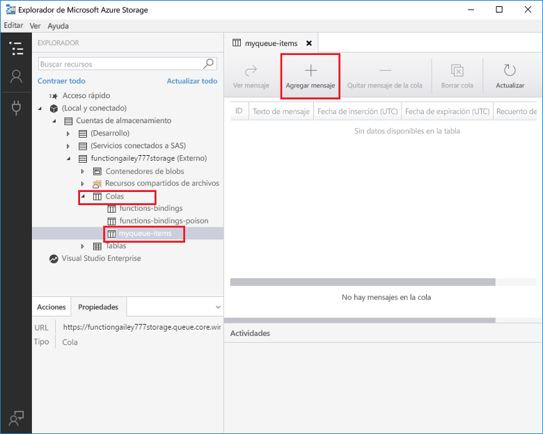

# Crear una función desencadenada por Azure Queue Storage

Obtenga información sobre cómo crear una función que se desencadena cuando se envían mensajes a una cola de Azure Storage.

## Requisitos previos

- Descargue e instale el [Explorador de Microsoft Azure Storage](http://storageexplorer.com/).

- Una suscripción de Azure. Si no tiene una, cree una [cuenta gratuita](https://azure.microsoft.com/free/?WT.mc_id=A261C142F) antes de empezar.

[!INCLUDE [functions-portal-favorite-function-apps](../../includes/functions-portal-favorite-function-apps.md)]

## Creación de una Function App de Azure

[!INCLUDE [Create function app Azure portal](../../includes/functions-create-function-app-portal.md)]

Después, cree una función en la nueva Function App.

## Creación de una función desencadenada por el servicio Queue

1. Expanda su instancia de Function App y haga clic en el botón **+**, que se encuentra junto a **Functions**. Si se trata de la primera función de Function App, seleccione **Función personalizada**. Se muestra el conjunto completo de plantillas de funciones.

    

2. Seleccione la plantilla **QueueTrigger** de idioma que desee y use la configuración que se especifica en la tabla.

    
    
    | Configuración | Valor sugerido | Descripción |
    |---|---|---|
    | **Nombre de la cola**   | myqueue-items    | Nombre de la cola a la que se va a conectar en la cuenta de almacenamiento. |
    | **Conexión de cuenta de Storage** | AzureWebJobStorage | Puede usar la conexión de cuenta de almacenamiento que ya usa la Function App o crear una.  |
    | **Asigne un nombre a la función** | Único en la Function App | Nombre de la función desencadenada por la cola. |

3. Haga clic en **Crear** para crear la función.

Después, conéctese a su cuenta de Azure Storage y cree la cola de almacenamiento **myqueue-items**.

## Creación de la cola

1. En la función, haga clic en **Integrar**, expanda **Documentación** y copie los dos valores de **Nombre de cuenta** y **Clave de cuenta**. Use estas credenciales para conectarse a la cuenta de almacenamiento. Si ya se ha conectado a la cuenta de almacenamiento, vaya al paso 4.

    v

1. Ejecute la herramienta [Explorador de Microsoft Azure Storage](http://storageexplorer.com/), haga clic en el icono de conexión situado a la izquierda, seleccione **Use a storage account name and key** (Usar el nombre y la clave de una cuenta de almacenamiento) y haga clic en **Siguiente**.

    

1. Escriba los valores de **Nombre de cuenta** y **Clave de cuenta** del paso 1, haga clic en **Siguiente** y, después, en **Conectar**.

    

1. Expanda la cuenta de almacenamiento asociada, haga clic con el botón derecho en **Colas**, haga clic en **Crear cola**, escriba `myqueue-items` y, después, presione ENTRAR.

    

Ahora que tiene una cola de almacenamiento, puede probar la función. Para ello, agregue un mensaje a la cola.

## Prueba de la función

1. De nuevo en Azure Portal, vaya a la función. Expanda **Registros** en la parte inferior de la página y asegúrese de que el streaming de registros no está en pausa.

1. En el Explorador de almacenamiento, expanda la cuenta de almacenamiento, **Colas** y **myqueue-items** y, después, haga clic en **Agregar mensaje**.

    

1. Escriba su mensaje "Hola mundo" en **Texto del mensaje** y haga clic en **Aceptar**.

1. Espere unos segundos y, después, vuelva a los registros de función para comprobar que se ha leído el mensaje nuevo de la cola.

    

1. En el Explorador de almacenamiento, haga clic en **Actualizar** y compruebe que el mensaje se ha procesado y ya no está en la cola.

## Limpieza de recursos

[!INCLUDE [Next steps note](../../includes/functions-quickstart-cleanup.md)]

## Pasos siguientes

Ha creado una función que se ejecuta cuando se agrega un mensaje a una cola de almacenamiento.

[!INCLUDE [Next steps note](../../includes/functions-quickstart-next-steps.md)]

Para obtener más información sobre los desencadenadores de Queue Storage, vea [Enlaces de colas de Storage en Azure Functions](functions-bindings-storage-queue.md).
