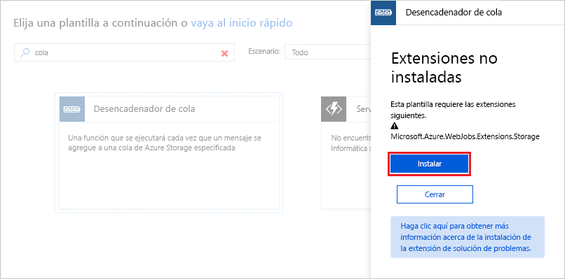
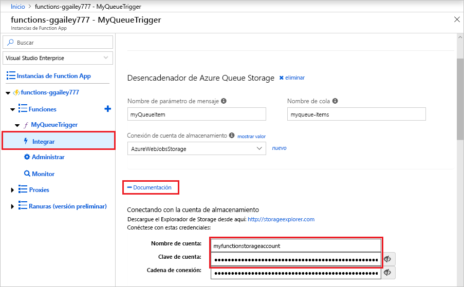
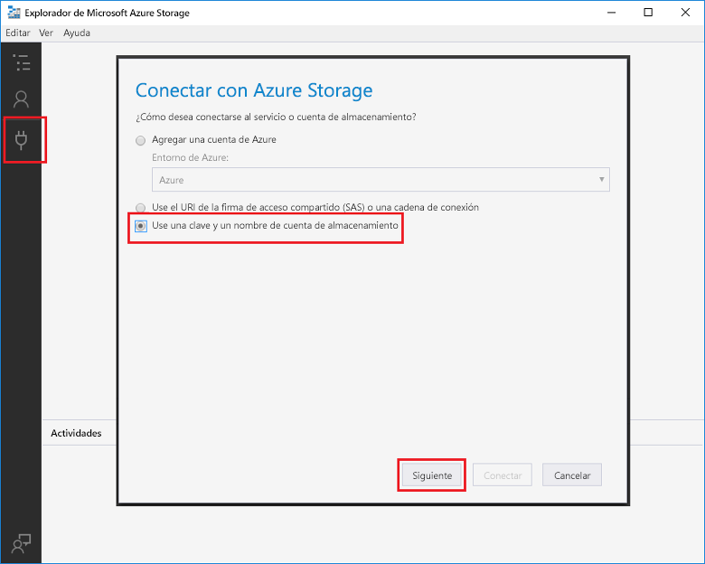
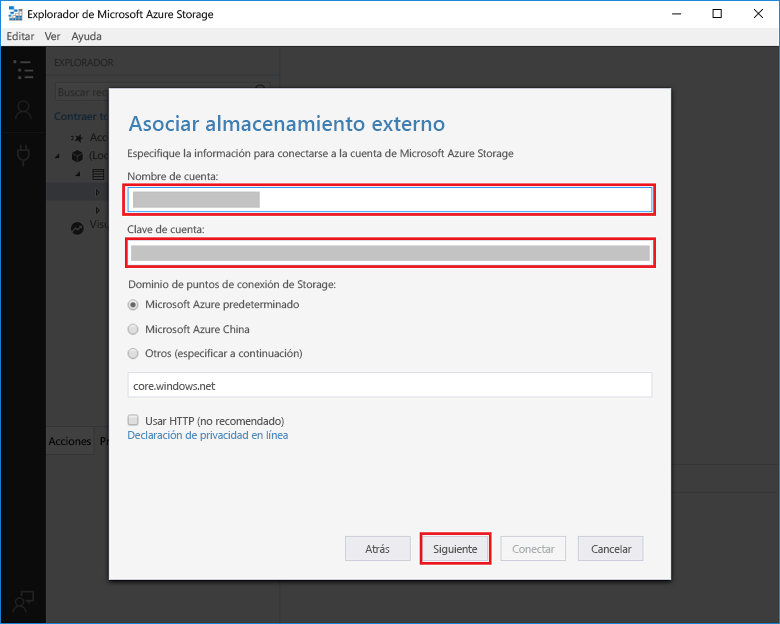

# Crear una función desencadenada por Azure Queue Storage

Obtenga información sobre cómo crear una función que se desencadena cuando se envían mensajes a una cola de Azure Storage.  

Debería tardar menos de cinco minutos en completar todos los pasos de este tema.

## Requisitos previos

[!INCLUDE [Previous quickstart note](../../includes/functions-quickstart-previous-topics.md)]

También debe descargar e instalar el [Explorador de Microsoft Azure Storage](http://storageexplorer.com/). 

[!INCLUDE [functions-portal-favorite-function-apps](../../includes/functions-portal-favorite-function-apps.md)] 

## Crear una función desencadenada por la cola

Expanda la Function App, haga clic en el botón **+** situado junto a **Funciones** y haga clic en la plantilla **QueueTrigger** para el idioma que quiera. Después, use la configuración especificada en la tabla y haga clic en **Crear**.

    
| Configuración      |  Valor sugerido   | Descripción                                        |
| ------------ |  ----------------- | -------------------------------------------------- |
| **Nombre de la cola**   | myqueue-items    | Nombre de la cola a la que se va a conectar en la cuenta de almacenamiento. |
| **Conexión de cuenta de Storage** | AzureWebJobStorage | Puede usar la conexión de cuenta de almacenamiento que ya usa la Function App o crear una.  |
| **Asigne un nombre a la función** | Único en la Function App | Nombre de la función desencadenada por la cola. |  

Después, conéctese a su cuenta de Azure Storage y cree la cola de almacenamiento **myqueue-items**.

## Creación de la cola

1. En la función, haga clic en **Integrar**, expanda **Documentación** y copie los dos valores de **Nombre de cuenta** y **Clave de cuenta**. Use estas credenciales para conectarse a la cuenta de almacenamiento. Si ya se ha conectado a la cuenta de almacenamiento, vaya al paso 4.
 
    v

2. Ejecute la herramienta [Explorador de Microsoft Azure Storage](http://storageexplorer.com/), haga clic en el icono de conexión situado a la izquierda, seleccione **Use a storage account name and key** (Usar el nombre y la clave de una cuenta de almacenamiento) y haga clic en **Siguiente**.

    
    
3. Escriba los valores de **Nombre de cuenta** y **Clave de cuenta** del paso 1, haga clic en **Siguiente** y, después, en **Conectar**. 
  
    

4. Expanda la cuenta de almacenamiento asociada, haga clic con el botón derecho en **Colas**, haga clic en **Crear cola**, escriba `myqueue-items` y, después, presione ENTRAR.
 
    

Ahora que tiene una cola de almacenamiento, puede probar la función. Para ello, agregue un mensaje a la cola.  

## Prueba de la función

1. De nuevo en Azure Portal, vaya a la función. Expanda **Registros** en la parte inferior de la página y asegúrese de que el streaming de registros no está en pausa.

2. En el Explorador de almacenamiento, expanda la cuenta de almacenamiento, **Colas** y **myqueue-items** y, después, haga clic en **Agregar mensaje**. 

    

2. Escriba su mensaje "Hola mundo" en **Texto del mensaje** y haga clic en **Aceptar**.
 
3. Espere unos segundos y, después, vuelva a los registros de función para comprobar que se ha leído el mensaje nuevo de la cola. 

    

4. En el Explorador de almacenamiento, haga clic en **Actualizar** y compruebe que el mensaje se ha procesado y ya no está en la cola.

## Limpieza de recursos

[!INCLUDE [Next steps note](../../includes/functions-quickstart-cleanup.md)]

## Pasos siguientes

Ha creado una función que se ejecuta cuando se agrega un mensaje a una cola de almacenamiento. 

[!INCLUDE [Next steps note](../../includes/functions-quickstart-next-steps.md)]

Para obtener más información sobre los desencadenadores de Queue Storage, vea [Enlaces de colas de Storage en Azure Functions](functions-bindings-storage-queue.md). 

