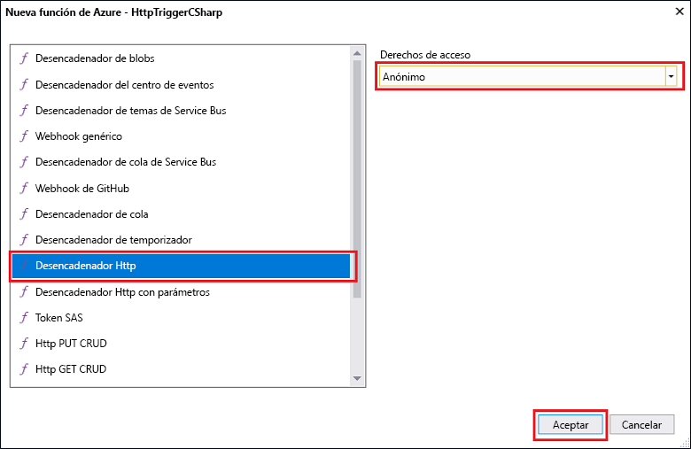
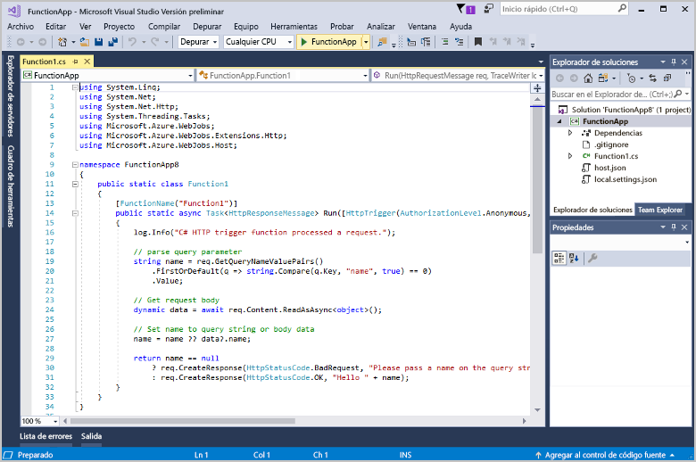

# Creación de la primera función mediante Visual Studio

Azure Functions permite ejecutar el código en un entorno sin servidor sin necesidad de crear una máquina virtual o publicar una aplicación web.

En este tema, aprenderá a usar las herramientas de Visual Studio 2017 para Azure Functions con el fin de crear y probar una función de "Hola mundo" localmente. Luego publicará el código de función en Azure. Estas herramientas están disponibles como parte de la carga de trabajo de desarrollo de Azure en Visual Studio 2017 (versión 15.3 o posteriores).

## Requisitos previos

Para completar este tutorial, instale:

* [Versión 15.3 de Visual Studio 2017](https://www.visualstudio.com/vs/preview/), con la carga de trabajo **Desarrollo de Azure**.

    
    
    >[!NOTE]  
    >Después de instalar Visual Studio 2017 versión 15.3 o actualizar a esta versión, también debe actualizar manualmente las herramientas de Visual Studio 2017 para Azure Functions. Puede actualizar las herramientas del menú **Herramientas** situado bajo **Extensiones y actualizaciones...**  > **Actualizaciones** > **Visual Studio Marketplace** > **Herramientas de Azure Functions y Web Jobs** > **Actualizar**. 

[!INCLUDE [quickstarts-free-trial-note](../../includes/quickstarts-free-trial-note.md)] 

## Creación de un proyecto de Azure Functions en Visual Studio

[!INCLUDE [Create a project using the Azure Functions template](../../includes/functions-vstools-create.md)]

Ahora que ha creado el proyecto, puede crear la primera función.

## Creación de la función

1. En el **Explorador de soluciones**, haga clic con el botón derecho en el nodo del proyecto y seleccione **Agregar** > **Nuevo elemento**. Seleccione **Función de Azure** y haga clic en **Agregar**.

2. Seleccione **HttpTrigger**, escriba un **nombre de función**, seleccione **Anónimo** en **Derechos de acceso**y haga clic en **Crear**. Cualquier cliente puede acceder a la función que se crea mediante una solicitud HTTP. 

    

    Un archivo de código se agrega al proyecto que contiene una clase que implementa el código de función. Este código se basa en una plantilla, que recibe un valor de nombre y lo transmite de nuevo. El atributo **FunctionName** establece el nombre de la función. El atributo **HttpTrigger** indica el mensaje que desencadena la función. 

    

Ahora que ha creado una función desencadenada por HTTP, puede probarla en el equipo local.

## Prueba local de la función

Azure Functions Core Tools le permite ejecutar un proyecto de Azure Functions en el equipo de desarrollo local. Se le solicita que instale estas herramientas la primera vez que inicie una función de Visual Studio.  

1. Para probar la función, presione F5. Si se le solicita, acepte la solicitud de Visual Studio para descargar e instalar las herramientas de Azure Functions Core (CLI).  También es preciso que habilite una excepción de firewall para que las herramientas para controlen las solicitudes de HTTP.

2. Copie la dirección URL de la función de los resultados del runtime de Azure Functions.  

    

3. Pegue la dirección URL de la solicitud HTTP en la barra de direcciones del explorador. Agregue la cadena de consulta `?name=<yourname>` a esta dirección URL y ejecute la solicitud. A continuación se muestra la respuesta en el explorador para la solicitud GET local devuelta por la función: 

    

4. Para detener la depuración, haga clic en el botón **Detener** de la barra de herramientas de Visual Studio.

Después de comprobar que la función se ejecuta correctamente en el equipo local es el momento de publicar el proyecto en Azure.

## Publicar el proyecto en Azure

Debe tener una aplicación de función en la suscripción de Azure para poder publicar el proyecto. Las aplicaciones de función se pueden crear directamente desde Visual Studio.

[!INCLUDE [Publish the project to Azure](../../includes/functions-vstools-publish.md)]

## Prueba de una función en Azure

1. Copie la URL base de la aplicación de función de la página de perfil de publicación. Reemplace la parte `localhost:port` de la dirección URL que usó al probar la función localmente por la nueva URL base. Como antes, asegúrese de que agrega la cadena de consulta `?name=<yourname>` a esta dirección URL y ejecute la solicitud.

    La dirección URL que llama a la función desencadenada por HTTP es similar a la siguiente:

        http://<functionappname>.azurewebsites.net/api/<functionname>?name=<yourname> 

2. Pegue la dirección URL de la solicitud HTTP en la barra de direcciones del explorador. A continuación se muestra la respuesta en el explorador para la solicitud GET remota devuelta por la función: 

    
 
## Pasos siguientes

Ha usado Visual Studio para crear una aplicación de función en C# con una función simple desencadenada por HTTP. 

+ Para aprender a configurar su proyecto para que admita otros tipos de desencadenadores y enlaces, consulte la sección [Configuración del proyecto para el desarrollo local](functions-develop-vs.md#configure-the-project-for-local-development) de [Herramientas de Azure Functions para Visual Studio](functions-develop-vs.md).
+ Para más información acerca de la realización de pruebas y la depuración locales mediante Azure Functions Core Tools, consulte [Codificación y comprobación de las funciones de Azure en un entorno local](functions-run-local.md). 
+ Para más información sobre el desarrollo de funciones como bibliotecas de clases .NET, consulte [Utilizar bibliotecas de clases de .NET con Azure Functions](functions-dotnet-class-library.md). 

