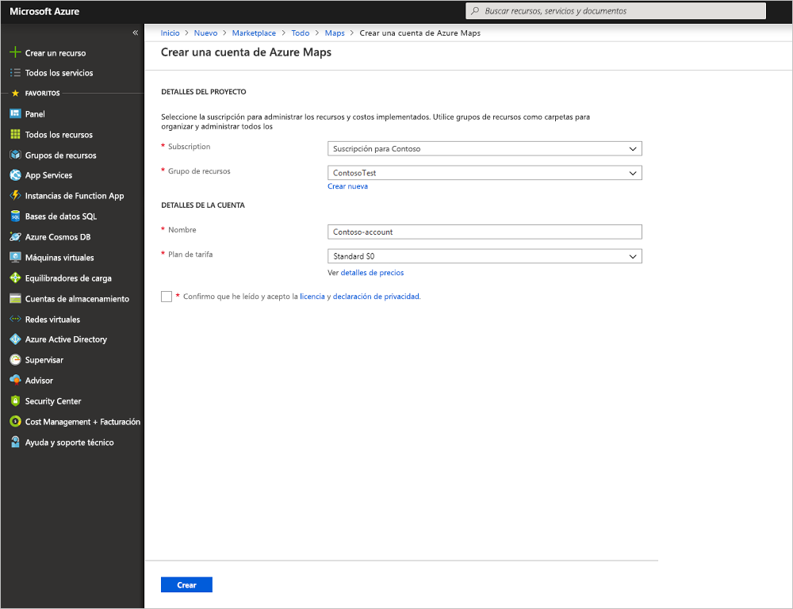
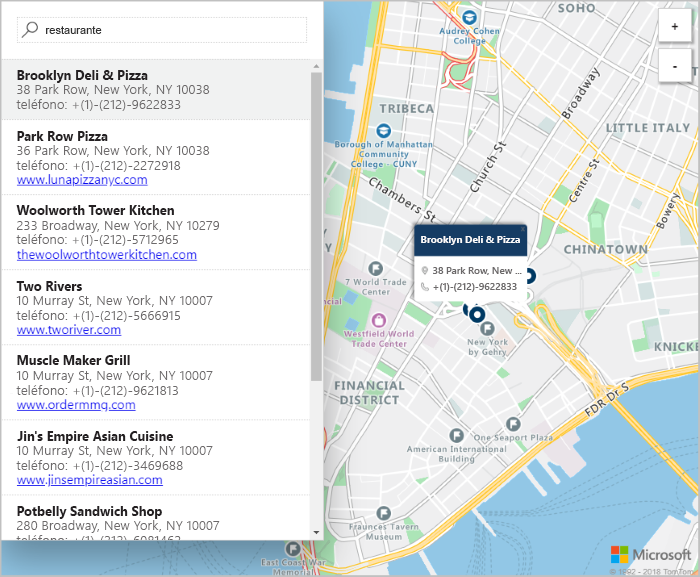

# Inicio de un mapa de búsqueda interactiva mediante Azure Maps

En este artículo se muestran las funcionalidades de Azure Maps para crear un mapa que dé a los usuarios una experiencia de búsqueda interactiva. Le guía por los pasos básicos para crear su propia cuenta de Maps y obtener la clave de la cuenta para usarla en la aplicación web de demostración.

Si no tiene una suscripción a Azure, cree una [cuenta gratuita](https://azure.microsoft.com/free/?WT.mc_id=A261C142F) antes de empezar.

## Iniciar sesión en Azure Portal

Inicie sesión en [Azure Portal](https://portal.azure.com/).

## Creación de una cuenta y obtención de la clave

1. En la esquina superior izquierda de [Azure Portal](https://portal.azure.com), haga clic en **Crear un recurso**.
2. En el campo *Buscar en el Marketplace*, escriba **Maps**.
3. En *Resultados*, seleccione **Maps**. Haga clic en el botón **Crear** que aparece debajo del mapa.
4. En la página **Create Maps Account** (Crear una cuenta de Azure Maps), escriba los siguientes valores:
    - El *nombre* de la nueva cuenta.
    - La *suscripción* que quiere usar para esta cuenta.
    - El *Grupo de recursos* para esta cuenta. Puede elegir *Crear nuevo* o *Usar existente* para el grupo de recursos.
    - Seleccione *Ubicación del grupo de recursos*.
    - Lea la *licencia* y la *declaración de privacidad* y active la casilla para aceptar los términos.
    - Finalmente, haga clic en el botón **Crear**.

    

5. Una vez que la cuenta se haya creado correctamente, ábrala y vaya a la sección de configuración del menú de la cuenta. Haga clic en **Claves** para ver las claves principal y secundaria de la cuenta de Azure Maps. Copie el valor de la **clave principal** en el Portapapeles local para usarlo en la sección siguiente.

## Descarga de la aplicación

1. Descargue o copie el contenido del archivo [interactiveSearch.html](https://github.com/Azure-Samples/azure-maps-samples/blob/master/src/interactiveSearch.html).
2. Guarde el contenido de este archivo de manera local como **AzureMapDemo.html** y ábralo en un editor de texto.
3. Busque la cadena `<insert-key>` y reemplácela por el valor de la **clave principal** que se obtuvo en la sección anterior.

## Inicie la aplicación.

1. Abra el archivo **AzureMapDemo.html** en un explorador de su preferencia.
2. Observe el mapa que se muestra de Los Ángeles. Acerque y aleje para ver de qué manera el mapa se representa automáticamente con más o menos información según el nivel de zoom. 
3. Cambie el centro predeterminado del mapa. En el archivo **AzureMapDemo.html**, busque la variable denominada **center**. Reemplace el par de valores de longitud y latitud de esta variable con los nuevos valores **[-74.0060, 40.7128]**. Guarde el archivo y actualice el explorador.
4. Pruebe la experiencia de búsqueda interactiva. En el cuadro de búsqueda en la esquina superior izquierda de la aplicación web de demostración, busque **restaurants**.
5. Mueva el mouse sobre la lista de direcciones o ubicaciones que aparecen debajo del cuadro de búsqueda y observe cómo el marcador correspondiente en el mapa despliega información sobre la ubicación en un mensaje emergente. Para proteger la privacidad de empresas privadas, se muestran nombres y direcciones ficticios.

    

## Limpieza de recursos

Los tutoriales incluyen detalles sobre cómo usar y configurar Maps con la cuenta. Si tiene pensado seguir con los tutoriales, no elimine los recursos que se crearon con esta guía de inicio rápido. Si no va a continuar, use el siguiente comando para eliminar todos los recursos creados.

1. Cierre el explorador donde se ejecuta la aplicación web **AzureMapDemo.html**.
2. En el menú de la izquierda de Azure Portal, haga clic en **Todos los recursos** y seleccione la cuenta de Maps. En la parte superior de la hoja **Todos los recursos**, haga clic en **Eliminar**.

## Pasos siguientes

En esta guía de inicio rápido, creó una cuenta de Maps e inició una aplicación de demostración. Para obtener información sobre cómo crear su propia aplicación con las API de Maps, pase al tutorial siguiente.

> [!div class="nextstepaction"]
> [Búsqueda de puntos de interés con Maps](./tutorial-search-location.md)

Para ver más ejemplos de código y obtener una experiencia de codificación interactiva, consulte a continuación las guías de procedimientos.

> [!div class="nextstepaction"]
> [Procedimiento para buscar una dirección mediante las API REST de Azure Maps](./how-to-search-for-address.md)

> [!div class="nextstepaction"]
> [Cómo usar el Control de mapa de Azure Maps](./how-to-use-map-control.md)
