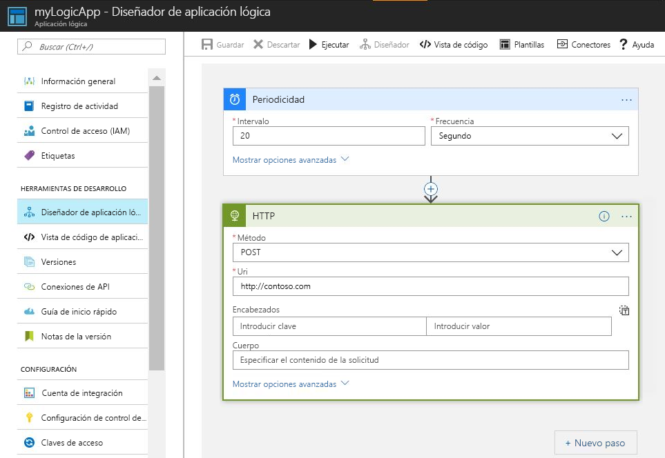
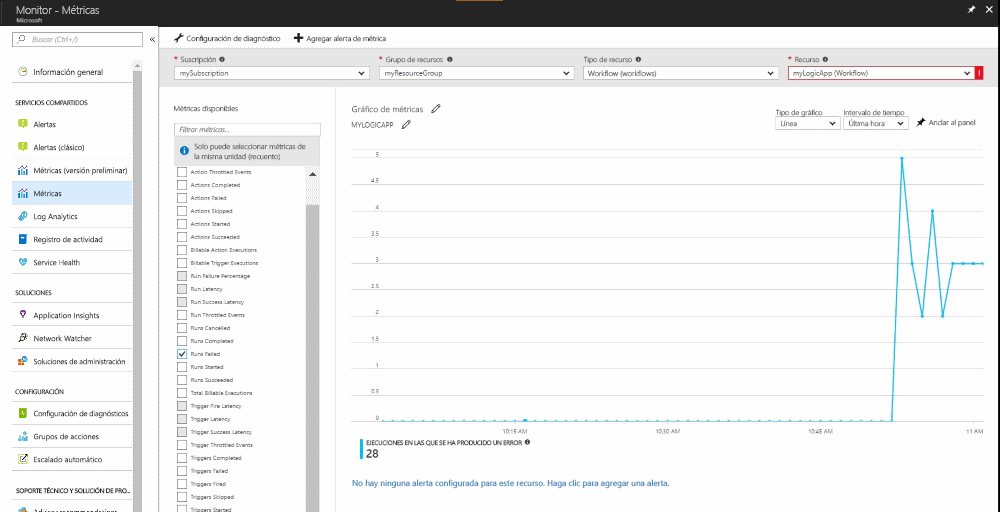
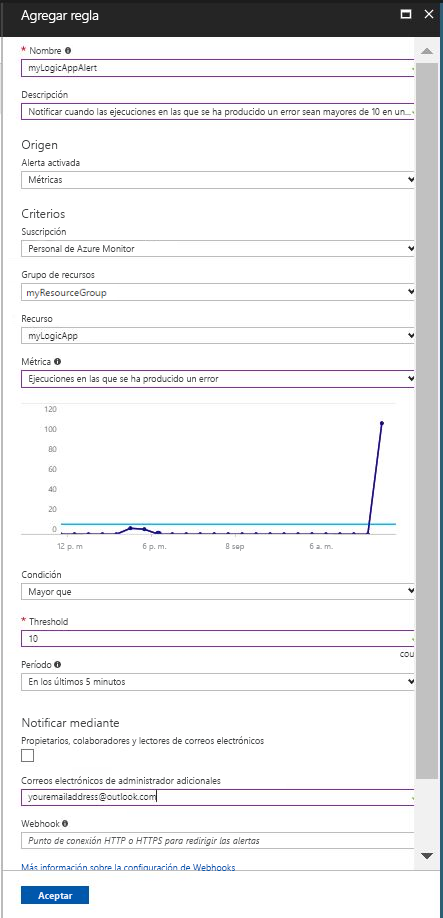

# Recibir una notificación cuando el valor de una métrica cumple una condición

Azure Monitor pone las métricas a disposición de muchos recursos de Azure. Estas métricas transmiten el rendimiento y el estado de esos recursos. En muchos casos, los valores de las métricas pueden apuntar a algo erróneo de un recurso. Puede crear alertas de métricas para supervisar el comportamiento anómalo y recibir notificaciones si se produce alguno. Este inicio rápido aborda la creación de una aplicación lógica, la creación de un trabajo y la visualización de las métricas para la aplicación lógica. Luego, trata sobre la creación de una alerta y la recepción de una notificación para una métrica para el recurso de la aplicación lógica.

Para obtener más información sobre las métricas y las alertas de métricas, consulte [Azure Monitor metrics overview](../../azure-monitor/platform/data-collection.md) (Información general sobre las métricas de Azure Monitor) e [Azure Monitor alerts overview](./alerts-overview.md) (Información general sobre las alertas en Azure Monitor). 

Si no tiene una suscripción a Azure, cree una cuenta [gratuita](https://azure.microsoft.com/free/) antes de empezar.

## Inicio de sesión en Azure Portal

Inicie sesión en el [Azure Portal](https://portal.azure.com/).

## Crear una aplicación lógica

1. Haga clic en el botón **Crear un recurso** de la esquina superior izquierda de Azure Portal.

2. Busque y seleccione **Aplicación lógica**. Haga clic en el botón **Crear**.

3. Escriba el nombre myLogicApp y el grupo de recursos myResourceGroup. Use su suscripción.  Use la ubicación predeterminada. Seleccione la opción **Anclar al panel**.  Cuando haya terminado, haga clic en **Cerrar**. 

      

4. La aplicación lógica debe anclarse al panel. Haga clic en la aplicación lógica para navegar a ella.

5. En el panel Aplicación lógica, seleccione la opción **Diseñador de aplicación lógica**.

       

6. Configure los valores tal como se muestra en el diagrama siguiente.

     

7. En el diseñador, seleccione el desencadenador **Periodicidad**.

8. Establezca un intervalo de 20 y una frecuencia de un segundo para asegurarse de que la aplicación lógica se desencadene cada 20 segundos.

9. Haga clic en el botón **Nuevo paso** y seleccione **Agregar una acción**.

10. Elija la opción **HTTP** y seleccione **HTTP-HTTP**.

11. Establezca el **Método** como POST y el **URI** en una dirección web de su elección.

12. Haga clic en **Save**(Guardar).

13. Puede tardar hasta 5 minutos en que se produzcan las acciones ejecutadas de la aplicación lógica.  

## Visualización de las métricas de la aplicación lógica

1. Haga clic en la opción **Monitor** en el panel de navegación izquierdo.

2. Seleccione la pestaña **Métricas**, rellene la información de **Suscripción**, **Grupo de recursos**, **Tipo de recurso** y **Recursos** de la aplicación lógica.

3. En la lista de métricas, elija **Ejecuciones en las que se ha producido un error**.

4. Modifique la opción **Intervalo de tiempo** del gráfico para mostrar los datos de la última hora.

5. Ahora debería ver un gráfico en el que se traza el número total de ejecuciones que ha iniciado su aplicación lógica durante la última hora. Si no sucede nada, asegúrese de que han transcurrido al menos 5 minutos desde el paso anterior. A continuación, actualice el explorador. 

    

## Creación de una alerta de métricas para la aplicación lógica

1.  En la parte superior derecha del panel de las métricas, haga clic en el botón **Agregar alerta de métrica**.

2. Asigne el nombre “myLogicAppAlert” a la alerta de métricas y escriba una breve descripción de la alerta.

3. Establezca la **Condición** para la alerta de métricas en “Mayor que”, establezca el **Umbral** en 10 y establezca el **Período** en “En los últimos 5 minutos”.

4. Por último, en **Correos electrónicos adicionales del administrador**, escriba su dirección de correo electrónico. Esta alerta le garantiza que recibirá un correo electrónico en caso de que la aplicación lógica tenga más de 10 ejecuciones erróneas dentro de un período de 5 minutos.

    

## Recepción de notificaciones de alerta de métricas para la aplicación lógica
1. A los pocos instantes, debería recibir un correo electrónico de “Microsoft Azure Alerts” que le informe de que la alerta se ha “activado”.

2. Vuelva a la aplicación lógica y modifique el desencadenador de periodicidad a un intervalo de 1 y una frecuencia de una hora.

3. A los pocos minutos, debería recibir un correo electrónico de “Microsoft Azure Alerts” que le informe de que la alerta se ha “resuelto”.

## Limpieza de recursos

Otras guías de inicio rápido de esta colección se basan en los valores de esta. Si tiene previsto seguir trabajando con las siguientes guías de inicio rápido o tutoriales, no elimine los recursos creados en esta guía de inicio rápido. Si no tiene previsto continuar, siga estos pasos para eliminar todos los recursos creados en esta guía de inicio rápido en Azure Portal.

1. En el menú izquierdo de Azure Portal, haga clic en **Monitor**.

2. Seleccione la pestaña **Alertas**, busque la alerta que creó en esta guía de inicio rápido y haga clic en ella.

3. En el panel de alerta de métricas, haga clic en **Eliminar**.

4. En el menú izquierdo de Azure Portal, busque **Aplicación lógica** y haga clic en **Aplicaciones lógicas**.

5. En el panel, haga clic en la aplicación lógica que creó en este inicio rápido en el cuadro de texto y, a continuación, haga clic en **Eliminar**.

## Pasos siguientes

En este inicio rápido, ha visto cómo crear una alerta de métricas para los recursos. Para obtener más información sobre las alertas de métricas, vaya hasta la información general sobre las alertas.

> [!div class="nextstepaction"]
> [Alertas de acción de suscripción a Azure Monitor](./../../azure-monitor/platform/quick-audit-notify-action-subscription.md )
