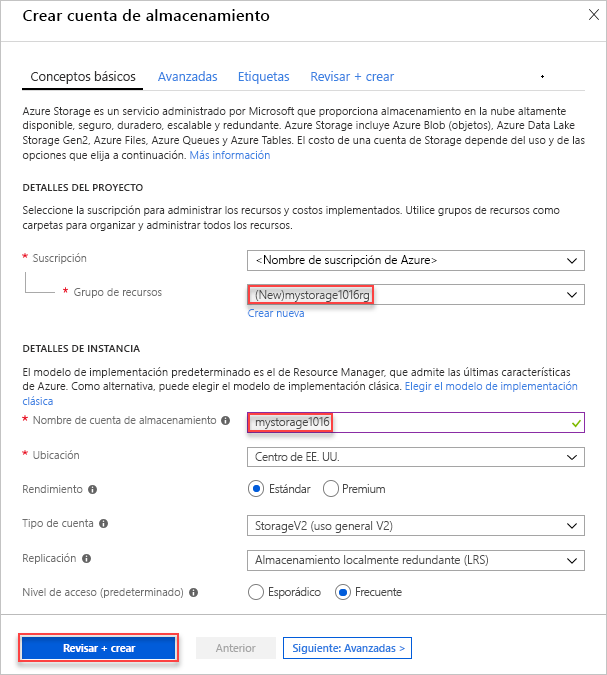
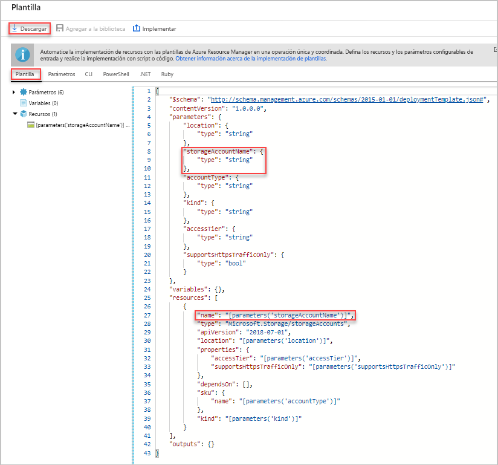
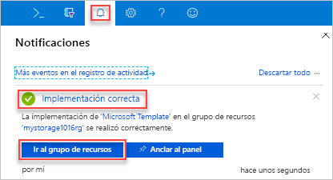

# <a name="quickstart-create-and-deploy-azure-resource-manager-templates-by-using-the-azure-portal"></a>Guía de inicio rápido: Creación e implementación de plantillas de Azure Resource Manager mediante Azure Portal

Aprenda cómo crear su primera plantilla de Azure Resource Manager al generar una con Azure Portal, así como el proceso de editar e implementar la plantilla desde Azure Portal. Las plantillas de Resource Manager son archivos JSON que definen los recursos que necesita para implementar la solución. Las instrucciones de este tutorial crean una cuenta de Azure Storage. Puede usar el mismo proceso para crear otros recursos de Azure.

Si no tiene una suscripción a Azure, cree una [cuenta gratuita](https://azure.microsoft.com/free/) antes de empezar.

## <a name="generate-a-template-using-the-portal"></a>Generación de una plantilla con el portal

En esta sección, creará una cuenta de almacenamiento con Azure Portal. Antes de implementar la cuenta de almacenamiento, tiene la opción de explorar la plantilla generada por el portal en función de sus configuraciones. Puede guardar la plantilla y volver a usarla en el futuro.

1. Inicie sesión en el [Azure Portal](https://portal.azure.com).
2. Seleccione **Crear un recurso** > **Storage** > **Cuenta de almacenamiento: blob, archivo, tabla, cola**.

    
3. Escriba la siguiente información. 

    - **Grupo de recursos**: cree un nuevo grupo de recursos de Azure con el nombre que prefiera. En la captura de pantalla, el nombre del grupo de recursos es *mystorage1016rg*.
    - **Nombre**: escriba un nombre único para la cuenta de almacenamiento. En la captura de pantalla, el nombre es *mystorage1016*.

    Puede usar los valores predeterminados para el resto de propiedades.

    

    > [!NOTE]
    > Algunas de las plantillas exportadas requieren algunas modificaciones antes de poder implementarlas.

4. Seleccione **Revisar y crear** en la parte inferior de la pantalla. 
5. Seleccione **Descargar una plantilla para la automatización** en la parte inferior de la pantalla. El portal muestra la plantilla generada:

    

    El panel principal muestra la plantilla. Es un archivo JSON con cuatro elementos de nivel superior: `schema`, `contentVersion`, `parameters` y `resources`. Para más información, consulte [Nociones sobre la estructura y la sintaxis de las plantillas de Azure Resource Manager](./resource-group-authoring-templates.md).

    Hay seis parámetros definidos. Uno de ellos se denomina **storageAccountName**. La segunda parte resaltada muestra cómo utilizar este parámetro en la plantilla. En la sección siguiente, edite la plantilla para usar un nombre generado para la cuenta de almacenamiento.

    En la plantilla, se define un recurso de Azure. El tipo es [Microsoft.Storage/storageAccounts]. Vea cómo se define el recurso y la estructura de definición.
6. Seleccione **Descargar**. Guarde **template.json** del paquete descargado en el equipo. En la siguiente sección, usará una herramienta de implementación de plantilla para modificar la plantilla.
7. Seleccione la pestaña **Parámetro** para ver los valores proporcionados para los parámetros. Anote estos valores, porque los necesitará en la sección siguiente al implementar la plantilla.

    

    Con la plantilla y los archivos de parámetros, puede crear una cuenta de almacenamiento de Azure.

## <a name="edit-and-deploy-the-template"></a>Edición e implementación de la plantilla

Azure Portal puede utilizarse para realizar algunas modificaciones básicas de la plantilla. En esta guía de inicio rápido, va a usar una herramienta del portal denominada *Template Deployment*. Para editar una plantilla más compleja, considere el uso de [Visual Studio Code](./resource-manager-quickstart-create-templates-use-visual-studio-code.md) que proporciona mejores funcionalidades de edición.

Azure requiere que cada servicio de Azure tenga un nombre único. Se producirá un error en la implementación si escribe un nombre de cuenta de almacenamiento que ya existe. Para evitar este problema, puede usar una llamada de función de plantilla `uniquestring()` para generar un nombre de cuenta de almacenamiento único.

1. En Azure Portal, haga clic en **Crear un recurso**.
2. En **Buscar en Marketplace**, escriba **implementación de plantillas** y, después, presione **ENTRAR**.
3. Seleccione **Implementación de plantillas**.

    
4. Seleccione **Crear**.
5. Seleccione **Cree su propia plantilla en el editor**.
6. Seleccione **Cargar archivo** y, después, siga las instrucciones para cargar template.json que descargó en la última sección.
7. Agregue una variable, tal como se muestra en la siguiente captura de pantalla:

    ```json
    "storageAccountName": "[concat(uniquestring(resourceGroup().id), 'standardsa')]"
    ```
    

    Aquí se usan dos funciones: `concat()` y `uniqueString()`.

8. Quite el parámetro **storageAccountName** resaltado en la captura de pantalla anterior.
9. Actualice el elemento name del recurso **Microsoft.Storage/storageAccounts** para usar la variable recién definida en lugar del parámetro:

    ```json
    "name": "[variables('storageAccountName')]",
    ```

    La plantilla final debe parecerse a esta:

    ```json
    {
        "$schema": "http://schema.management.azure.com/schemas/2015-01-01/deploymentTemplate.json#",
        "contentVersion": "1.0.0.0",
        "parameters": {
            "location": {
                "type": "string"
            },
            "accountType": {
                "type": "string"
            },
            "kind": {
                "type": "string"
            },
            "accessTier": {
                "type": "string"
            },
            "supportsHttpsTrafficOnly": {
                "type": "bool"
            }
        },
        "variables": {
            "storageAccountName": "[concat(uniquestring(resourceGroup().id), 'standardsa')]"
        },
        "resources": [
            {
                "name": "[variables('storageAccountName')]",
                "type": "Microsoft.Storage/storageAccounts",
                "apiVersion": "2018-07-01",
                "location": "[parameters('location')]",
                "properties": {
                    "accessTier": "[parameters('accessTier')]",
                    "supportsHttpsTrafficOnly": "[parameters('supportsHttpsTrafficOnly')]"
                },
                "dependsOn": [],
                "sku": {
                    "name": "[parameters('accountType')]"
                },
                "kind": "[parameters('kind')]"
            }
        ],
        "outputs": {}
    }
    ```
7. Seleccione **Guardar**.
8. Escriba los siguientes valores:

    - **Grupo de recursos**: dé un nombre único a su grupo de recursos.
    - **Ubicación**: seleccione una ubicación para el grupo de recursos.
    - **Ubicación**: seleccione la ubicación para la cuenta de almacenamiento.  Puede usar la misma ubicación que el grupo de recursos.
    - **Tipo de cuenta**: escriba **Standard_LRS** para esta guía de inicio rápido.
    - **Variante**: escriba **StorageV2** para esta guía de inicio rápido.
    - **Nivel de acceso**: escriba **Frecuente** para esta guía de inicio rápido.
    - **Https Traffic Only Enabled** (Solo tráfico HTTPS habilitado).  Seleccione **true** para esta guía de inicio rápido.
    - **Acepto los términos y condiciones indicados anteriormente**: (seleccionar)

    Esta es una captura de pantalla de una implementación de ejemplo:

    

10. Seleccione **Comprar**.
11. Seleccione el icono de campana (notificaciones) en la parte superior de la pantalla para ver el estado de implementación. Espere hasta que se complete la implementación.

    

12. Seleccione **Ir al grupo de recursos** desde el panel de notificación. Debería ver una pantalla parecida a:

    

    Puede ver que el estado de la implementación fue correcto y que solo hay una cuenta de almacenamiento en el grupo de recursos. El nombre de cuenta de almacenamiento es una cadena única generada por la plantilla. Para más información sobre el uso de cuentas de Azure Storage, consulte [Inicio rápido: Carga, descarga y enumeración de blobs mediante Azure Portal](../storage/blobs/storage-quickstart-blobs-portal.md).

## <a name="clean-up-resources"></a>Limpieza de recursos

Cuando los recursos de Azure ya no sean necesarios, limpie los recursos que implementó eliminando el grupo de recursos.

1. En Azure Portal, seleccione **Grupos de recursos** en el menú de la izquierda.
2. Escriba el nombre del grupo de recursos en el campo **Filtrar por nombre**.
3. Seleccione el nombre del grupo de recursos.  Verá la cuenta de almacenamiento en el grupo de recursos.
4. Seleccione **Eliminar grupo de recursos** en el menú superior.

## <a name="next-steps"></a>Pasos siguientes

En este tutorial, ha aprendido cómo generar una plantilla desde Azure Portal y cómo implementar la plantilla mediante el portal. La plantilla usada en esta guía de inicio rápido es una plantilla sencilla con un recurso de Azure. Cuando la plantilla es compleja, es más fácil de usar Visual Studio Code o Visual Studio para desarrollarla. La siguiente guía de inicio rápido también muestra cómo implementar plantillas mediante Azure PowerShell y la interfaz de la línea de comandos (CLI) de Azure.

> [!div class="nextstepaction"]
> [Creación de plantillas mediante Visual Studio Code](./resource-manager-quickstart-create-templates-use-visual-studio-code.md)
