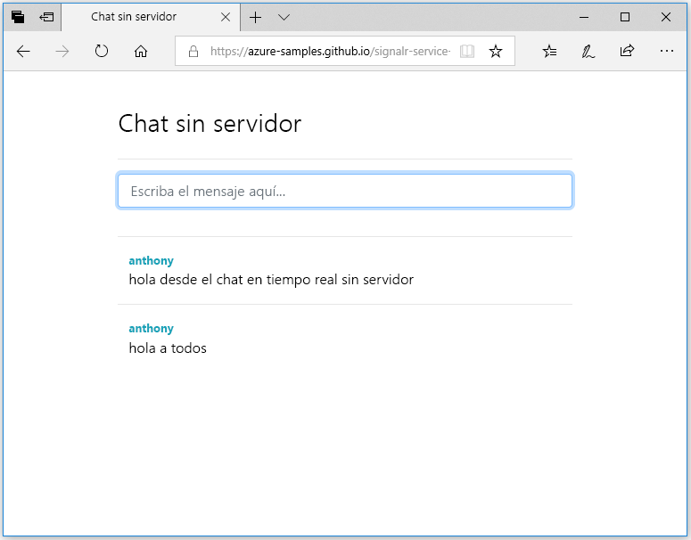

## Ejecución de la aplicación web

1. Hay una aplicación web de ejemplo de una sola página hospedada en GitHub para su comodidad. Abra [https://azure-samples.github.io/signalr-service-quickstart-serverless-chat/demo/chat/](https://azure-samples.github.io/signalr-service-quickstart-serverless-chat/demo/chat/) en el explorador.

    > [!NOTE]
    > El origen del archivo HTML se encuentra en [/docs/demo/chat/index.html](https://github.com/Azure-Samples/signalr-service-quickstart-serverless-chat/blob/master/docs/demo/chat/index.html).

1. Cuando se le pida la dirección URL base de la aplicación de función, escriba *http://localhost:7071*.

1. Escriba un nombre de usuario cuando se le solicite.

1. La aplicación web llama a la función *GetSignalRInfo* de la aplicación de función para recuperar la información de conexión y conectarse al servicio de Azure SignalR. Cuando se completa la conexión, aparece el cuadro de entrada de mensajes del chat.

1. Escriba un mensaje y presione ENTRAR. La aplicación envía el mensaje a la función *SendMessage* de la aplicación Azure Function que, a continuación, usa el enlace saliente de SignalR para difundir el mensaje a todos los clientes conectados. Si todo funciona correctamente, debería aparecer el mensaje en la aplicación.

    

1. Abra otra instancia de la aplicación web en otra ventana del explorador. Verá que los mensajes enviados aparecerán en todas las instancias de la aplicación.