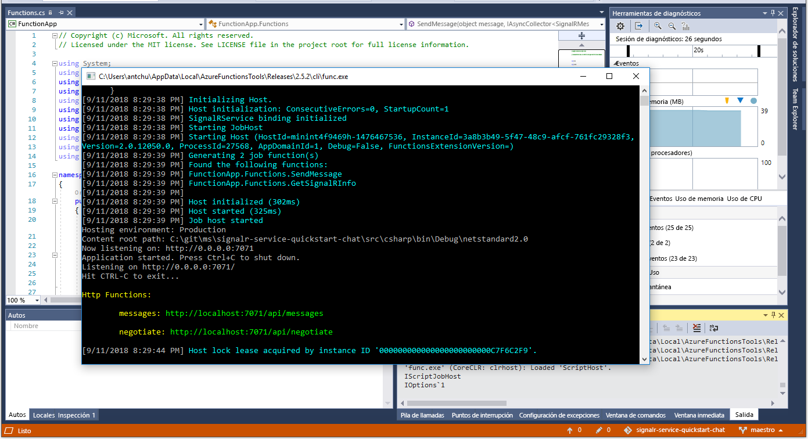

# Guía de inicio rápido: Creación de un salón de chat con Azure Functions y SignalR Service mediante C\#

El servicio Azure SignalR le permite agregar fácilmente funcionalidad en tiempo real a la aplicación. Azure Functions es una plataforma sin servidor que le permite ejecutar el código sin tener que administrar ninguna infraestructura. En esta guía de inicio rápido, obtenga información sobre cómo usar el servicio SignalR y Functions para crear una aplicación de chat sin servidor en tiempo real.

## Requisitos previos

Si aún no tiene Visual Studio de 2017 instalado, puede descargar y usar la versión **gratis** de [Visual Studio 2017 Community Edition](https://www.visualstudio.com/downloads/). Asegúrese de que habilita **Desarrollo de Azure** durante la instalación de Visual Studio.

[!INCLUDE [quickstarts-free-trial-note](../../includes/quickstarts-free-trial-note.md)]

## Inicio de sesión en Azure

Inicie sesión en Azure Portal en <https://portal.azure.com/> con su cuenta de Azure.

[!INCLUDE [Create instance](includes/signalr-quickstart-create-instance.md)]

[!INCLUDE [Clone application](includes/signalr-quickstart-clone-application.md)]

## Configuración y ejecución de la aplicación Azure Function

1. Inicie Visual Studio y abra la solución en la carpeta *chat\src\csharp* del repositorio clonado.

1. En el explorador que se muestra al abrir Azure Portal, confirme que la instancia del servicio SignalR que implementó anteriormente se ha creado correctamente buscando su nombre en el cuadro de búsqueda de la parte superior del portal. Seleccione la instancia para abrirla.

    

1. Seleccione **Claves** para ver las cadenas de conexión para la instancia del servicio SignalR.

1. Seleccione y copie la cadena de conexión principal.

1. En Visual Studio, en el Explorador de soluciones, cambie el nombre de *local.settings.sample.json* a *local.settings.json*.

1. En **local.settings.json**, pegue la cadena de conexión en el valor de la configuración **AzureSignalRConnectionString**. Guarde el archivo.

1. Abra **Functions.cs**. Hay dos funciones desencadenadas por HTTP en esta aplicación de función:

    - **GetSignalRInfo**: usa el enlace de entrada *SignalRConnectionInfo* para generar y devolver información de conexión válida.
    - **SendMessage**: recibe un mensaje de chat en el cuerpo de la solicitud y usa el enlace de salida *SignalR* para difundir el mensaje a todas las aplicaciones cliente conectadas.

1. En el menú **Depurar**, seleccione **Iniciar depuración** para ejecutar la aplicación.

    

[!INCLUDE [Run web application](includes/signalr-quickstart-run-web-application.md)]

[!INCLUDE [Cleanup](includes/signalr-quickstart-cleanup.md)]

## Pasos siguientes

En esta guía de inicio rápido, ha compilado y ejecutado una aplicación sin servidor en tiempo real en VS Code. A continuación, obtenga más información sobre cómo implementar Azure Functions desde VS Code.

> [!div class="nextstepaction"]
> [Implementación de Azure Functions con VS Code](https://code.visualstudio.com/tutorials/functions-extension/getting-started)