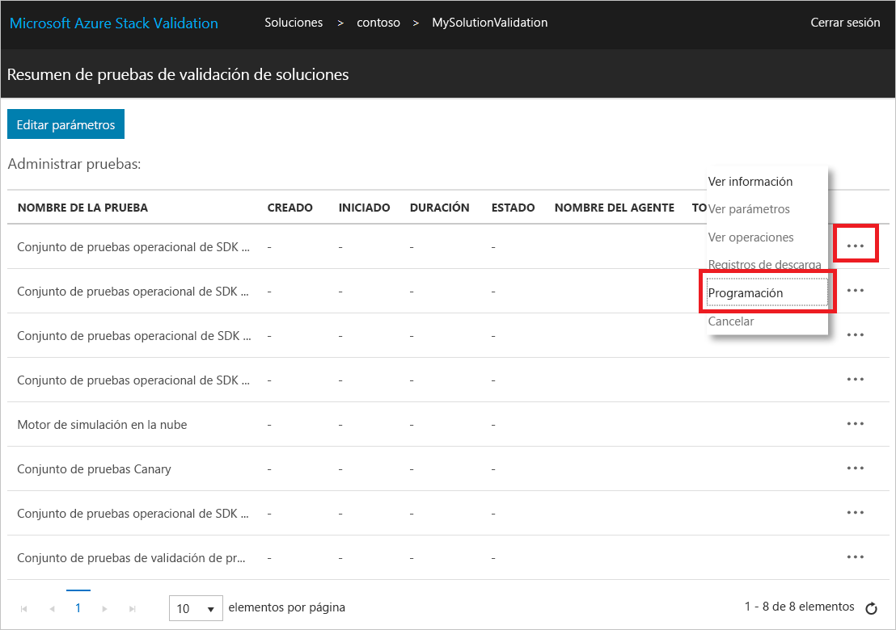

# Validación de una nueva solución de Azure Stack

[!INCLUDE [Azure_Stack_Partner](./includes/azure-stack-partner-appliesto.md)]

Aprenda a usar el flujo de trabajo de **validación de soluciones** para comprobar las nuevas soluciones de Azure Stack.

Una solución de Azure Stack es una lista de materiales de hardware que se ha acordado conjuntamente entre Microsoft y el asociado después de haber cubierto los requisitos de certificación del logotipo de Windows Server. Una solución se debe volver a certificar cuando ha habido un cambio en la lista de materiales de hardware. Si tiene preguntas adicionales sobre cuándo volver a certificar las soluciones, póngase en contacto con el equipo en [vaashelp@microsoft.com](mailto:vaashelp@microsoft.com).

Para certificar la solución, ejecute dos veces el flujo de trabajo de validación de soluciones. Ejecútelo una vez para la configuración *mínima* admitida. Ejecútelo una segunda vez para la configuración *máxima* admitida. Microsoft certifica la solución si ambas configuraciones superan todas las pruebas.

[!INCLUDE [azure-stack-vaas-workflow-validation-completion](includes/azure-stack-vaas-workflow-validation-completion.md)]

## Creación de un flujo de trabajo de validación de soluciones

1. [!INCLUDE [azure-stack-vaas-workflow-step_select-solution](includes/azure-stack-vaas-workflow-step_select-solution.md)]
2. Seleccione **Iniciar** en el icono **Solution Validations** (Validación de soluciones).

    

3. [!INCLUDE [azure-stack-vaas-workflow-step_naming](includes/azure-stack-vaas-workflow-step_naming.md)]
4. Seleccione la **configuración de la solución**.
    - **Minimum** (Mínima): la solución se configura con el número mínimo admitido de nodos.
    - **Maximum** (Máxima): la solución se configura con el número máximo admitido de nodos.
5. [!INCLUDE [azure-stack-vaas-workflow-step_upload-stampinfo](includes/azure-stack-vaas-workflow-step_upload-stampinfo.md)]

    

6. [!INCLUDE [azure-stack-vaas-workflow-step_test-params](includes/azure-stack-vaas-workflow-step_test-params.md)]

    > [!NOTE]
    > No se pueden modificar los parámetros de entorno después de crear un flujo de trabajo.

7. [!INCLUDE [azure-stack-vaas-workflow-step_tags](includes/azure-stack-vaas-workflow-step_tags.md)]
8. [!INCLUDE [azure-stack-vaas-workflow-step_submit](includes/azure-stack-vaas-workflow-step_submit.md)]
    Se le redirigirá a la página de resumen de las pruebas.

## Ejecución de pruebas de validación de soluciones

En la página **Solution validation tests summary** (Resumen de pruebas de validación de soluciones), verá una lista de las pruebas necesarias para realizar la validación.

[!INCLUDE [azure-stack-vaas-workflow-validation-section_schedule](includes/azure-stack-vaas-workflow-validation-section_schedule.md)]

## Pasos siguientes

- [Supervisión y administración de pruebas en el portal de VaaS](azure-stack-vaas-monitor-test.md)