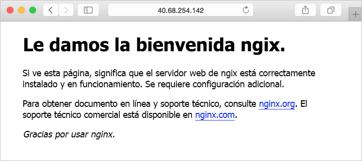

# <a name="quickstart-create-a-linux-server-virtual-machine-by-using-azure-cli-in-azure-stack"></a>Guía de inicio rápido: Creación de una máquina virtual de servidor Linux con la CLI de Azure en Azure Stack

*Se aplica a: sistemas integrados de Azure Stack y Kit de desarrollo de Azure Stack*

Puede crear una máquina virtual Ubuntu Server 16.04 LTS mediante la CLI de Azure. Siga los pasos descritos en este artículo para crear y usar una máquina virtual. Este artículo también proporciona los pasos para:

* Conectarse a la máquina virtual con un cliente remoto.
* Instalar al servidor web NGINX y ver la página principal predeterminada.
* Realizar la limpieza de los recursos no utilizados.

## <a name="prerequisites"></a>requisitos previos

* **Una imagen de Linux en el marketplace de Azure Stack**

   El marketplace de Azure Stack no contiene la imagen de Linux de forma predeterminada. Solicite al operador de Azure Stack que le proporcione la imagen de **Ubuntu Server 16.04 LTS** que necesita. El operador puede usar los pasos descritos en el artículo [Descarga de elementos de Marketplace desde Azure a Azure Stack](../azure-stack-download-azure-marketplace-item.md).

* Azure Stack requiere una versión específica de la CLI de Azure para crear y administrar los recursos. Si no tiene la CLI de Azure configurada para Azure Stack, inicie sesión en el [kit de desarrollo](azure-stack-connect-azure-stack.md#connect-to-azure-stack-with-remote-desktop) o en un cliente externo basado en Windows si está [conectado a través de VPN](azure-stack-connect-azure-stack.md#connect-to-azure-stack-with-vpn) y siga los pasos para [instalar y configurar la CLI de Azure](azure-stack-version-profiles-azurecli2.md).

* Una clave SSH pública con el nombre id_rsa.pub en el directorio .ssh del perfil de usuario de Windows. Para más información sobre la creación de claves SSH, consulte [Creación de claves SSH en Windows](../../virtual-machines/linux/ssh-from-windows.md).

## <a name="create-a-resource-group"></a>Crear un grupo de recursos

Un grupo de recursos es un contenedor lógico en el que puede implementar y administrar los recursos de Azure Stack. Desde el kit de desarrollo o el sistema integrado de Azure Stack, ejecute el comando [az group create](/cli/azure/group#az_group_create) para crear un grupo de recursos.

>[!NOTE]
 Se asignan valores para todas las variables en los ejemplos de código. Sin embargo, puede asignar nuevos valores si lo desea.

En el ejemplo siguiente, se crea un grupo de recursos denominado myResourceGroup en la ubicación local.

```cli
az group create --name myResourceGroup --location local
```

## <a name="create-a-virtual-machine"></a>de una máquina virtual

Cree una máquina virtual con el comando [az vm create](/cli/azure/vm#az_vm_create). En el ejemplo siguiente se crea una máquina virtual denominada myVM. En este ejemplo se usa Demouser como el nombre de usuario administrativo y Demouser@123 como la contraseña del usuario. Actualice estos valores a un valor apropiado para su entorno.

```cli
az vm create \
  --resource-group "myResourceGroup" \
  --name "myVM" \
  --image "UbuntuLTS" \
  --admin-username "Demouser" \
  --admin-password "Demouser@123" \
  --use-unmanaged-disk \
  --location local
```

La dirección IP pública se devuelve en el parámetro **PublicIpAddress**. Anote esta dirección porque la necesitará para acceder a la máquina virtual.

## <a name="open-port-80-for-web-traffic"></a>Apertura del puerto 80 para el tráfico web

Dado que en esta máquina virtual se va a ejecutar el servidor web IIS, debe abrir el puerto 80 para el tráfico de Internet. Use el comando [az vm open-port](/cli/azure/vm#open-port) para abrir el puerto deseado.

```cli
az vm open-port --port 80 --resource-group myResourceGroup --name myVM
```

## <a name="use-ssh-to-connect-to-the-virtual-machine"></a>Uso de SSH para conectarse a la máquina virtual

En un equipo cliente con SSH instalado, conéctese a la máquina virtual. Si está trabajando en un cliente Windows, puede usar [Putty](http://www.putty.org/) para crear la conexión. Para conectarse a la máquina virtual, use el comando siguiente:

```bash
ssh <publicIpAddress>
```

## <a name="install-the-nginx-web-server"></a>Instalación del servidor web NGINX

Ejecute el siguiente script para actualizar los recursos del paquete e instalar el paquete NGINX más reciente:

```bash
#!/bin/bash

# update package source
apt-get -y update

# install NGINX
apt-get -y install nginx
```

## <a name="view-the-nginx-welcome-page"></a>Visualización de la página de bienvenida de NGINX

Con NGINX instalado y el puerto 80 abierto en la máquina virtual, puede acceder al servidor web a través de la dirección IP pública de la máquina virtual. Abra un explorador web y vaya a ```http://<public IP address>```.



## <a name="clean-up-resources"></a>Limpieza de recursos

Realice a limpieza de los recursos que ya no necesita. Puede usar el comando [az group delete](/cli/azure/group#az_group_delete) para eliminar estos recursos. Ejecute el comando siguiente para eliminar el grupo de recursos y todos sus recursos:

```cli
az group delete --name myResourceGroup
```

## <a name="next-steps"></a>Pasos siguientes

En esta guía de inicio rápido ha implementado una máquina virtual de servidor Linux básica con un servidor web. Para aprender más sobre las máquina virtuales de Azure Stack, continúe con el artículo [Considerations for Virtual Machines in Azure Stack](azure-stack-vm-considerations.md) (Consideraciones acerca de máquinas virtuales de Azure Stack).
