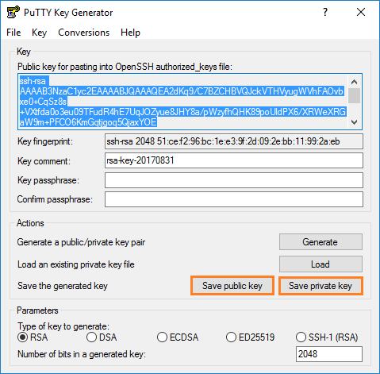
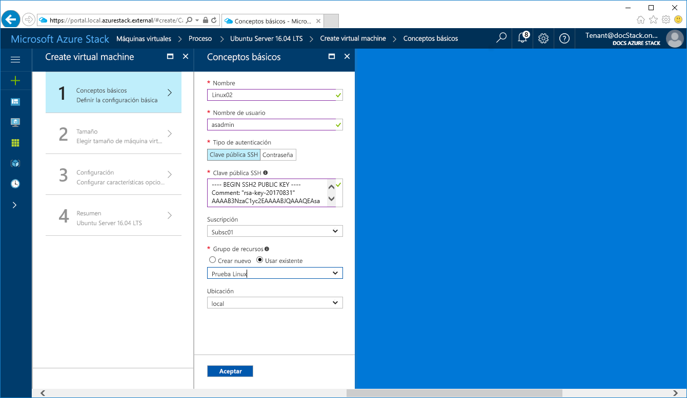
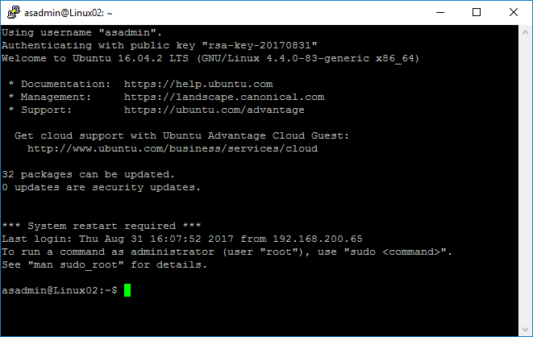

# <a name="quickstart-create-a-linux-server-virtual-machine-with-the-azure-stack-portal"></a>Guía de inicio rápido: Creación de una máquina virtual de servidor Linux con el portal de Azure Stack

*Se aplica a: sistemas integrados de Azure Stack y Kit de desarrollo de Azure Stack*

Puede crear una máquina virtual Ubuntu Server 16.04 LTS mediante el portal de Azure Stack. Siga los pasos descritos en este artículo para crear y usar una máquina virtual. En este artículo también se proporcionan los pasos para:

* Conectarse a la máquina virtual con un cliente remoto.
* Instalar a un servidor web NGINX.
* Realizar la limpieza de los recursos.

## <a name="prerequisites"></a>requisitos previos

* **Una imagen de Linux en el marketplace de Azure Stack**

   El marketplace de Azure Stack no contiene la imagen de Linux de forma predeterminada. Para poder crear una máquina virtual de servidor Linux, asegúrese de que el operador de Azure Stack proporciona la imagen de **Ubuntu Server 16.04 LTS** que necesita. El operador puede usar los pasos descritos en el artículo [Download marketplace items from Azure to Azure Stack](../azure-stack-download-azure-marketplace-item.md) (Descarga de productos de Marketplace de Azure a Azure Stack).

* **Acceso a un cliente SSH**

   Si está usando el Kit de desarrollo de Azure Stack (ASDK), es posible que no tenga acceso a un cliente SSH. Si necesita un cliente, hay varios paquetes que incluyen a un cliente SSH. Por ejemplo, PuTTY incluye un cliente SSH y el generador de claves SSH (puttygen.exe). Para más información acerca de los paquetes disponibles, consulte el siguiente artículo de Azure: [Uso de claves SSH con Windows en Azure](https://docs.microsoft.com/azure/virtual-machines/linux/ssh-from-windows#windows-packages-and-ssh-clients).

   Esta guía de inicio rápido usa PuTTY para generar las claves SSH y para conectarse a la máquina virtual de servidor Linux. Para descargar e instalar PuTTY, vaya a [http://www.putty.org/](http://www.putty.org).

## <a name="create-an-ssh-key-pair"></a>Creación de un par de claves SSH

Necesita un par de claves SSH para finalizar todos los pasos de este artículo. Si ya tiene un par de claves SSH, puede omitir este paso.

1. Navegue hasta la carpeta de instalación de PuTTY (la ubicación predeterminada es ```C:\Program Files\PuTTY```) y ejecute ```puttygen.exe```.
2. En la ventana del generador de claves de PuTTY, asegúrese de que **Type of key to generate** (Tipo de clave que se va a generar) esté establecido en **RSA** y de que **Number of bits in a generated key** (Número de bits de una clave generada) esté establecido en **2048**. Cuando esté listo, haga clic en **Generar**.

   

3. Para generar una clave, mueva el cursor del mouse al azar en la ventana del generador de claves de PuTTY.
4. Cuando finalice la generación de claves, haga clic en **Save public key** (Guardar clave pública) y en **Save private key** (Guardar clave privada) para guardar las claves en archivos.

   

## <a name="sign-in-to-the-azure-stack-portal"></a>Inicio de sesión en el portal de Azure Stack

Inicie sesión en el portal de Azure Stack. La dirección del portal de Azure Stack depende del producto de Azure Stack al que se vaya a conectar:

* Para obtener el Kit de desarrollo de Azure Stack (ASDK), vaya a: https://portal.local.azurestack.external.
* Para un sistema integrado de Azure Stack, vaya a la dirección URL que proporciona su operador de Azure Stack.

## <a name="create-the-virtual-machine"></a>Creación de la máquina virtual

1. Haga clic en **Crear un recurso** en la esquina superior izquierda del portal de Azure Stack.

2. Seleccione **Compute**y, después, seleccione **Ubuntu Server 16.04 LTS**.
3. Haga clic en **Create**(Crear).

4. Escriba la información de la máquina virtual. En **Tipo de autenticación**, seleccione **Clave pública SSH**. Pegue la clave pública SSH que ha guardado y, a continuación, haga clic en **Aceptar**.

   >[!NOTE]
 Asegúrese de eliminar los espacios en blanco iniciales y finales de la clave.

   

5. Seleccione **D1_V2** para la máquina virtual.

   

6. En la página **Configuración**, conserve los valores predeterminados y haga clic en **Aceptar**.

7. En la página **Resumen**, haga clic en **Aceptar** para iniciar la implementación de la máquina virtual.

## <a name="connect-to-the-virtual-machine"></a>Conexión a la máquina virtual

1. En la página de la máquina virtual, haga clic en **Conectar**. Se mostrará la cadena de conexión SSH que necesita para conectarse a la máquina virtual.

   

2. Abra PuTTY.
3. En la pantalla **PuTTY Configuration** (Configuración de PuTTY) usará la ventana **Category** (Categoría) para desplazarse hacia arriba o hacia abajo. Desplácese hacia abajo hasta **SSH**, expanda **SSH**y, a continuación, haga clic en **Auth**. Haga clic en **Browse** (Examinar) y seleccione el archivo de clave privada que guardó.

   

4. Desplácese hacia arriba en la ventana**Category** (Categoría) y, a continuación, haga clic en **Session** (Sesión).
5. En el cuadro de texto **Nombre de host (o dirección IP)**, pegue la cadena de conexión del portal de Azure Stack que vio anteriormente. En este ejemplo, la cadena es ```asadmin@192.168.102.34```.

   

6. Haga clic en **Open** (Abrir) para abrir una sesión en la máquina virtual.

   

## <a name="install-the-nginx-web-server"></a>Instalación del servidor web NGINX

Use los siguientes comandos de bash para actualizar los orígenes de paquetes e instalar el paquete de NGINX más reciente en la máquina virtual.

```bash
#!/bin/bash

# update package source
sudo apt-get -y update

# install NGINX
sudo apt-get -y install nginx
```

Cuando haya finalizado la instalación de NGINX, cierre la sesión SSH y abra la página de información general de la máquina virtual en el portal de Azure Stack.

## <a name="open-port-80-for-web-traffic"></a>Apertura del puerto 80 para el tráfico web

Los grupos de seguridad de red (NSG) protegen el tráfico entrante y saliente. Cuando se crea una máquina virtual en el portal de Azure Stack, se crea una regla de entrada en el puerto 22 para las conexiones SSH. Dado que esta máquina virtual hospeda un servidor web, es preciso crear una regla de NSG para permitir el tráfico web en el puerto 80.

1. En la página **Introducción** de la máquina virtual, haga clic en el nombre del **Grupo de recursos**.
2. Seleccione el **grupo de seguridad de red** de la máquina virtual. Los NSG pueden identificarse mediante la columna **Tipo**.
3. En el menú de la izquierda, en **Configuración**, haga clic en **Reglas de seguridad de entrada**.
4. Haga clic en **Agregar**.
5. En **Nombre**, escriba **http**. Asegúrese de que **Intervalo de puertos** esté establecido en 80 y **Acción** esté establecido en **Permitir**.
6. Haga clic en **Aceptar**

## <a name="view-the-nginx-welcome-page"></a>Visualización de la página de bienvenida de NGINX

Con NGINX instalado y el puerto 80 abierto en la máquina virtual, puede acceder al servidor web a través de la dirección IP pública de la máquina virtual. (La dirección IP pública se muestra en la página de información general de la máquina virtual).

Abra un explorador web y vaya a ```http://<public IP address>```.


## <a name="clean-up-resources"></a>Limpieza de recursos

Borre los recursos que ya no necesite. Para eliminar la máquina virtual y sus recursos, seleccione el grupo de recursos en la página de la máquina virtual y, a continuación, haga clic en **Eliminar**.

## <a name="next-steps"></a>Pasos siguientes

En esta guía de inicio rápido ha implementado una máquina virtual de servidor Linux básica con un servidor web. Para aprender más sobre las máquina virtuales de Azure Stack, continúe con el artículo [Considerations for Virtual Machines in Azure Stack](azure-stack-vm-considerations.md) (Consideraciones acerca de máquinas virtuales de Azure Stack).
