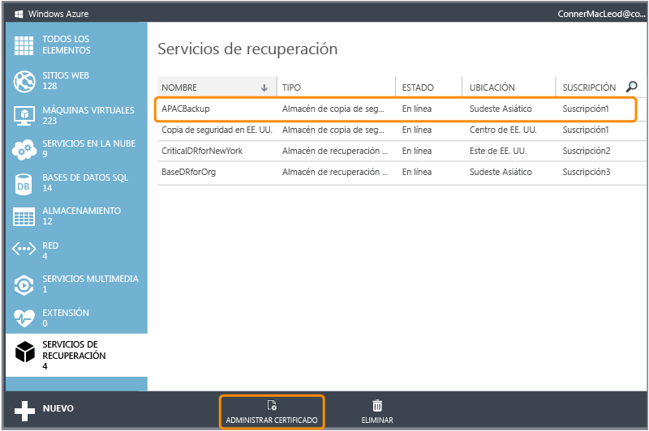
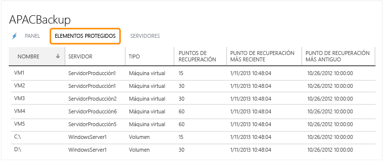

<properties linkid="manage-services-recovery-configure-backup-vault" urlDisplayName="Configure a Backup Vault" pageTitle="Configure Azure Recovery Services to quickly and easily back-up Windows Server" metaKeywords="disaster recovery" description="Use this tutorial to learn how to use the Backup service in Microsoft's Azure cloud offering to back up Windows Server to the cloud." metaCanonical="" services="recovery-services" documentationCenter="" title="Configure Azure Backup to quickly and easily back-up Windows Server" authors="starra" solutions="" manager="cynthn" editor="tysonn" />

Configuración de una copia de seguridad de Azure para hacer una copia de seguridad de Windows Server de manera rápida y fácil
=============================================================================================================================

**Nota:**

Para completar este tutorial, necesita una cuenta de Azure con la característica Copia de seguridad de Azure habilitada.

-   En caso de no tener ninguna, puede crear una cuenta de evaluación gratuita en tan solo unos minutos. Para obtener más información, consulte [Evaluación gratuita de Azure](/en-us/pricing/free-trial/).
-   Si tiene una cuenta existente pero necesita habilitar la vista previa de la Copia de seguridad de Azure, consulte [Habilitación de las características de vista previa de Azure](/es-es/develop/net/tutorials/create-a-windows-azure-account/#enable).

Después de solicitar unirse al programa de vista previa de la copia de seguridad, espere la activación de su estado. Estamos aprobando automáticamente a todos los clientes, por lo que esto no tardará en producirse.

Para hacer una copia de seguridad de los archivos y los datos desde Windows Server hasta Azure, debe crear un almacén para las copias de seguridad de credenciales en la región geográfica donde desea almacenar los datos. Este tutorial lo llevará a través de la creación del almacén que va a usar para almacenar copias de seguridad, la carga de un certificado en el almacén, la instalación de un agente de copia de seguridad y una introducción de las tareas de administración de las copias de seguridad disponibles a través del portal de administración.

**Antes de empezar**

Para completar correctamente este tutorial, debe tener un certificado X.509 v3 para registrar los servidores con los almacenes de credenciales de copia de seguridad. La longitud de la clave del certificado debe ser de al menos 2048 bits y debe encontrarse en el almacén de certificados Personal de su equipo local. Cuando el certificado se instala en el servidor, debe contener la clave privada del certificado. Para cargar el certificado al Portal de administración de Azure, debe exportar la clave pública como un archivo de formato .cer.

Puede usar:

-   Su propio certificado autofirmado que se creó usando la herramienta makecert, O BIEN
-   Cualquier certificado SSL válido emitido por una Entidad de certificación (CA) de confianza para Microsoft y cuyos certificados raíz se distribuyen mediante el Programa de certificados raíz de Microsoft. Para obtener más información sobre este programa, consulte [Miembros del programa de certificados raíz de Windows](http://go.microsoft.com/fwlink/p/?LinkId=294666).

Otros atributos que necesita asegurar en los certificados son:

-   Tiene una EKU de ClientAuthentication válida
-   Actualmente tiene un periodo de validez que no supera los 3 años

Para usar su propio certificado autofirmado, siga los siguientes pasos:

1.  Descargue la [herramienta de creación de certificados (MakeCert.exe)](http://go.microsoft.com/fwlink/p/?LinkID=294662).
2.  Abra el símbolo del sistema (cmd.exe) con privilegios de administrador y ejecute el siguiente comando, reemplazando *CertificateName* por el nombre de su certificado y especifique la fecha de caducidad real del certificado después de -e: `makecert.exe -r -pe -n CN=CertificateName -ss my -sr localmachine -eku 1.3.6.1.5.5.7.3.2 -len 2048 -e 01/01/2016 CertificateName.cer`

Si va a registrar un servidor diferente al que utilizó para crear el certificado, necesita exportar el archivo .pfx (que tiene la clave privada), copiarlo al otro servidor e importarlo en el almacén de certificados Personal de ese servidor.

Para obtener instrucciones paso a paso sobre el proceso de carga de certificados en el almacén y más información sobre la exportación y la importación de archivos .pfx, consulte [Administrar certificados de almacén](http://go.microsoft.com/fwlink/p/?LinkID=294662).

Creación de un almacén de credenciales de copia de seguridad
------------------------------------------------------------

1.  Inicie sesión en el [Portal de administración](https://manage.windowsazure.com).

    [WACOM.INCLUDE [disclaimer](../includes/disclaimer.md)]

2.  Haga clic en **Servicios de recuperación** y, a continuación, haga clic en **Create New**, apunte a **Backup Vault** y, a continuación, haga clic en **Quick Create**.

    

3.  En **Name**, escriba un nombre descriptivo para identificar el almacén de credenciales de copia de seguridad.

4.  En **Región**, seleccione la región geográfica para el almacén de credenciales de copia de seguridad.

5.  En **Suscripción**, escriba la suscripción de Azure con la cual desea usar el almacén de credenciales de copia de seguridad.

6.  Haga clic en **Create Backup vault**.

    La creación del almacén de credenciales de copia de seguridad puede tardar unos minutos. Para revisar el estado, puede supervisar las notificaciones en la parte inferior del portal. Después de que se haya creado el almacén de credenciales de copia de seguridad, un mensaje le indicará que el almacén se creó correctamente y que aparecerá en la lista de recursos para los Servicios de recuperación con el estado **Online**.

    

Carga de un certificado
-----------------------

1.  Inicie sesión en el [Portal de administración](https://manage.windowsazure.com).

2.  Haga clic en **Servicios de recuperación** y, a continuación, haga clic en el nombre del almacén de credenciales de copia de seguridad que se identificará con el certificado y haga clic en **Manage certificate**.

    

3.  En el cuadro de diálogo **Manage Certificate**, haga clic en Browse Your Computer para localizar el archivo .cer que se va a usar con este almacén de credenciales de copia de seguridad.

    Descarga e instalación de un agente de copia de seguridad
    ---------------------------------------------------------

4.  Inicie sesión en el [Portal de administración](https://manage.windowsazure.com).

5.  Haga clic en **Servicios de recuperación** y, a continuación, haga clic en el nombre del almacén de credenciales de copia de seguridad para ver el panel del almacén.

6.  Haga clic en **Install Agent**

    

7.  Aparecerá un cuadro de diálogo donde puede seleccionar el agente que va a descargar:
    -   Agente para Windows Server 2012 y System Center 2012 SP1 - Data Protection Manager
    -   Agente para Windows Server 2012 Essentials

8.  Seleccione el agente adecuado. Será redirigido al Centro de descarga de Microsoft para descargar el software del agente. Para obtener más información, consulte:

    -   [Instalar Azure Backup Agent](http://technet.microsoft.com/en-us/library/hh831761.aspx#BKMK_installagent)
    -   [Install Azure Backup Agent for Windows Server 2012 Essentials](http://technet.microsoft.com/en-us/library/jj884318.aspx)

Después de que se instala el agente, puede usar la interfaz de administración local adecuada (como el complemento de Microsoft Management Console, System Center Data Protection Manager Console o el Panel de Windows Server Essentials) para configurar la directiva de copia de seguridad del servidor.

Administración de almacenes de credenciales de copia de seguridad y servidores
------------------------------------------------------------------------------

1.  Inicie sesión en el [Portal de administración](https://manage.windowsazure.com).

2.  Haga clic en **Servicios de recuperación** y, a continuación, haga clic en el nombre del almacén de credenciales de copia de seguridad para ver el panel del almacén. Aquí puede realizar las siguientes tareas:
    -   **Manage certificate**. Se usa para actualizar el certificado que se cargó anteriormente.
    -   **Delete**. Elimina el almacén de credenciales de copia de seguridad actual. En caso de que ya no se use un almacén de credenciales de copia de seguridad, puede eliminarlo para liberar espacio de almacenamiento. **Delete** solo está habilitado después de que todos los servidores registrados se hayan eliminado del almacén.

3.  Haga clic en **Protected Items** para ver los elementos a los que se les ha hecho una copia de seguridad desde los servidores. Esta lista solo tiene propósitos informativos.
     

4.  Haga clic en **Servers** para ver los nombres de los servidores que se registraron en este almacén. Aquí puede realizar las siguientes tareas:
    -   **Allow Re-register**. Cuando se selecciona esta opción para un servidor, puede usar el Asistente para registro en el agente para registrar el servidor con el almacén de credenciales de copia de seguridad por segunda vez. Es posible que necesite volver a registrarse debido a un error en el certificado o si un servidor tuvo que reconstruirse. El nuevo registro se permite solo una vez por nombre de servidor.
    -   **Delete**. Elimina un servidor del almacén de credenciales de copias seguridad. Todos los datos almacenados asociados con el servidor se eliminan inmediatamente.

        

Pasos siguientes
----------------

-   Para obtener más información sobre la copia de seguridad de Azure, consulte [Información general sobre Azure Backup](http://go.microsoft.com/fwlink/p/?LinkId=222425).

-   Visite el [Foro de Azure Backup](http://go.microsoft.com/fwlink/p/?LinkId=290933).

