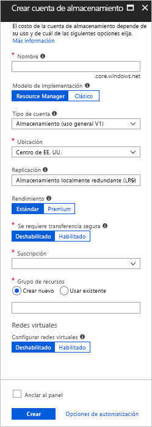
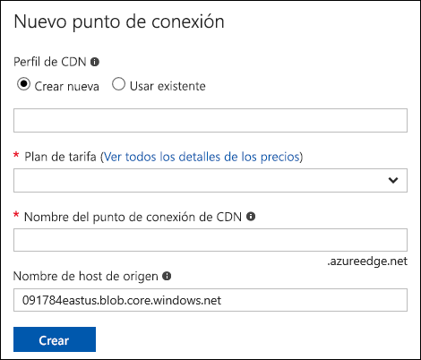
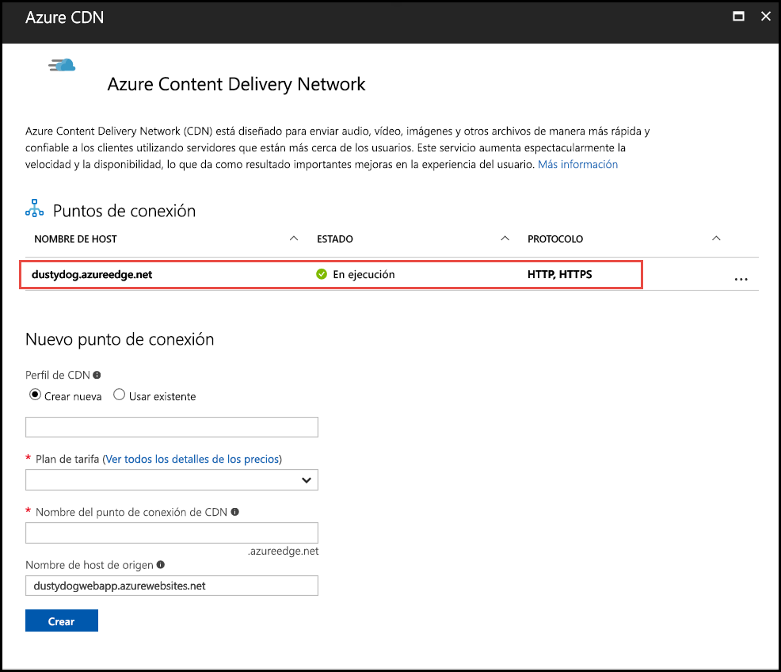
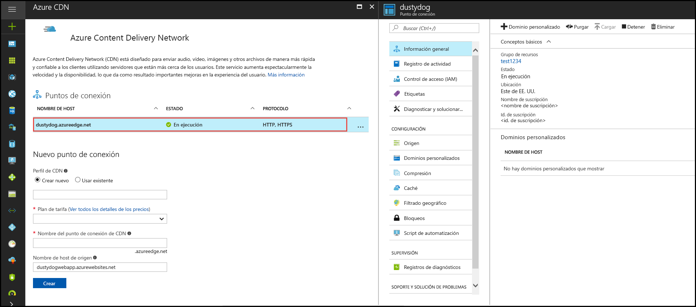

# Integración de una cuenta de una instancia de Azure Storage con la red CDN de Azure
Puede habilitar Azure Content Delivery Network (CDN) para almacenar en caché el contenido del almacenamiento de Azure. Azure CDN ofrece a los desarrolladores una solución global para entregar contenido con alto ancho de banda. Es posible almacenar en caché blobs y contenido estático de instancias de proceso en nodos físicos en los Estados Unidos, Europa, Asia, Australia y Sudamérica.

## Paso 1: Creación de una cuenta de almacenamiento
Use el siguiente procedimiento para crear una nueva cuenta de almacenamiento para una suscripción de Azure. Una cuenta de almacenamiento proporciona acceso a los servicios de Azure Storage. La cuenta de almacenamiento representa el máximo nivel del espacio de nombres para el acceso a todos los componentes del servicio Azure Storage: Azure Blob, Queue y Table Storage. Para más información, consulte [Introducción a Microsoft Azure Storage](../storage/common/storage-introduction.md).

Para crear una cuenta de almacenamiento, debe ser administrador del servicio o coadministrador de la suscripción asociada.

> [!NOTE]
> Se pueden usar varios métodos para crear una cuenta de almacenamiento, incluido Azure Portal y Powershell. En este tutorial se muestra cómo usar Azure Portal.   
> 

**Para crear una cuenta de almacenamiento para una suscripción de Azure**

1. Inicie sesión en el [Azure Portal](https://portal.azure.com).
2. En la esquina superior izquierda, seleccione **Crear un recurso**. En el panel **Nuevo**, seleccione **Almacenamiento** y luego **Cuenta de almacenamiento: blob, archivo, tabla, cola**.
    
    Aparece el panel **Crear cuenta de almacenamiento**.   

    

3. En el cuadro **Nombre**, escriba un nombre de subdominio. Esta entrada puede contener de 3 a 24 letras minúsculas y números.
   
    Este valor se convierte en el nombre del host dentro del URI que se ha usado para direccionar los recursos de blob, cola o tabla de la suscripción. Para direccionar un recurso de contenedor en Blob Storage, use un URI con el siguiente formato:
   
    http://*&lt;StorageAcountLabel&gt;*.blob.core.windows.net/*&lt;mycontainer&gt;*

    donde *&lt;StorageAccountLabel&gt;* hace referencia al valor especificado en el cuadro **Nombre**.
   
    > [!IMPORTANT]    
    > La etiqueta de URL forma el subdominio del URI de la cuenta de almacenamiento y debe ser único entre todos los servicios hospedados en Azure.
   
    Este valor también se usa como nombre de esta cuenta de almacenamiento en el portal o en el acceso a esta cuenta mediante programación.
    
4. Use los valores predeterminados de **Modelo de implementación**, **Tipo de cuenta**, **Rendimiento** y **Replicación**. 
    
5. En **Suscripción**, seleccione la suscripción que se usará con la cuenta de almacenamiento.
    
6. En **Grupo de recursos**, seleccione o cree un grupo de recursos. Para más información sobre los grupos de recursos, consulte [Información general sobre Azure Resource Manager](../azure-resource-manager/resource-group-overview.md#resource-groups).
    
7. En **Ubicación**, seleccione la ubicación para la cuenta de almacenamiento.
    
8. Seleccione **Crear**. El proceso de creación de la cuenta de almacenamiento podría tardar varios minutos en finalizar.

## Paso 2: Habilitación de la red CDN para la cuenta de almacenamiento

Puede habilitar CDN para su cuenta de almacenamiento directamente desde esta. 

1. Seleccione una cuenta de almacenamiento del panel y luego seleccione **Azure CDN** en el panel izquierdo. Si el botón **Azure CDN** no está visible inmediatamente, puede escribir CDN en el cuadro **Buscar** del panel izquierdo.
    
    Aparece el panel **Azure Content Delivery Network**.

    
    
2. Cree un nuevo punto de conexión con la siguiente información:
    - **Perfil de CDN**: cree un nuevo perfil de CDN o use uno existente.
    - **Plan de tarifa**: seleccione un plan de tarifa solo si va a crear un perfil de CDN.
    - **Nombre del punto de conexión de CDN**: escriba un nombre de punto de conexión de CDN.

    > [!TIP]
    > De forma predeterminada, un nuevo punto de conexión de CDN usa el nombre de host de la cuenta de almacenamiento como servidor de origen.

3. Seleccione **Crear**. Después de que se crea el punto de conexión, aparece en la lista de puntos de conexión.

    

> [!NOTE]
> Si desea especificar valores de configuración avanzada para el punto de conexión de CDN, como el tipo de optimización, puede usar en su lugar la [extensión de Azure CDN](cdn-create-new-endpoint.md#create-a-new-cdn-endpoint) para crear un punto de conexión de CDN o un perfil de CDN.

## Paso 3: Habilitación de características adicionales de CDN

En el panel de **Azure CDN**, seleccione el punto de conexión de CDN de la lista para abrir el panel de configuración de CDN. Puede habilitar características adicionales de CDN para la entrega como, por ejemplo, la compresión, la cadena de consulta y el filtrado geográfico. También puede agregar la asignación de dominios personalizada al punto de conexión de CDN y habilitar HTTPS de dominio personalizado.
    

## Paso 4: Acceso a su contenido de la red CDN
Para obtener acceso al contenido almacenado en la memoria caché de la red CDN, use la URL de la red CDN que se le ha proporcionado en el portal. La dirección de un blob en caché tiene el siguiente formato:

http://<*EndpointName*\>.azureedge.net/<*myPublicContainer*\>/<*BlobName*\>

> [!NOTE]
> Después de habilitar el acceso de la red CDN a una cuenta de almacenamiento, todos los objetos disponibles de forma pública se pueden almacenar en caché en el servidor perimetral de la red CDN. Si modifica un objeto que está almacenado actualmente en caché en la red CDN, el nuevo contenido no estará disponible a través de dicha red hasta que esta actualice su contenido al cumplir el período de vida del contenido almacenado en caché.

## Paso 5: Eliminación de su contenido de la red CDN
Si ya no desea almacenar en caché un objeto en Azure CDN, puede realizar uno de los siguientes pasos:

* Convierta el contenedor en privado en lugar de público. Para más información, consulte [Administración del acceso de lectura anónimo a contenedores y blobs](../storage/blobs/storage-manage-access-to-resources.md).
* Deshabilite o elimine el punto de conexión de CDN mediante Azure Portal.
* Modifique su servicio hospedado para no seguir respondiendo a las solicitudes del objeto.

Un objeto que ya está almacenado en caché en Azure CDN permanece en caché hasta que cumple el período de vida del objeto o hasta que se purgue el punto de conexión. Al cumplir el período de vida, Azure CDN comprueba si el punto de conexión de CDN sigue siendo válido y si el objeto sigue siendo accesible de forma anónima. En caso negativo, el objeto dejará de estar almacenado en caché.

## Recursos adicionales
* [Adición de un dominio personalizado al punto de conexión de CDN](cdn-map-content-to-custom-domain.md)
* [Configuración de HTTPS en un dominio personalizado de Azure CDN](cdn-custom-ssl.md)

