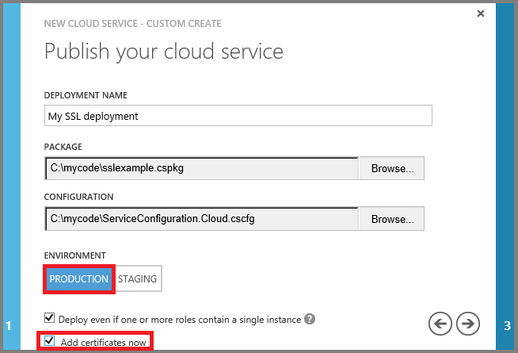
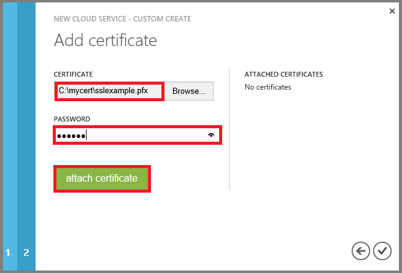
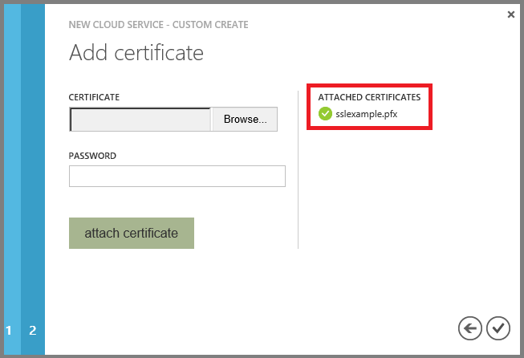
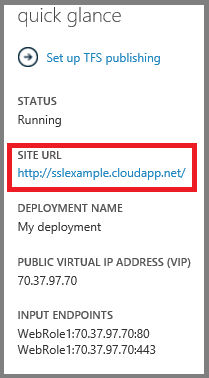
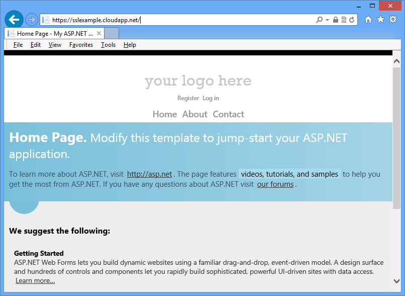

<properties linkid="dev-net-commons-tasks-enable-ssl" urlDisplayName="Enable SSL" pageTitle="Configure SSL for a cloud service - Azure" metaKeywords="Azure SSL, Azure HTTPS, Azure SSL, Azure HTTPS, .NET Azure SSL, .NET Azure HTTPS, C# Azure SSL, C# Azure HTTPS, VB Azure SSL, VB Azure HTTPS" description="Learn how to specify an HTTPS endpoint for a web role and how to upload an SSL certificate to secure your application." metaCanonical="" services="cloud-services" documentationCenter=".NET" title="Configuring SSL for an application in Azure" authors="" solutions="" manager="jeffreyg" editor="mollybos" />

Configuración de SSL para una aplicación en Azure
=================================================

El cifrado de Capa de sockets seguros (SSL) es el método más usado para proteger los datos que se envían por Internet. Esta tarea común analiza cómo especificar un extremo HTTPS para un rol web y cómo cargar un certificado SSL para proteger su aplicación.

### Nota:

Los procedimientos de esta tarea se aplican a los Servicios en la nube de Azure; para los Sitios web, consulte [Configuración de un certificado SSL para un sitio web de Azure](../web-sites-configure-ssl-certificate/).

Esta tarea incluye los siguientes pasos:

-   [Paso 1: Obtener un certificado SSL](#step1)
-   [Paso 2: Modificar la definición del servicio y los archivos de configuración](#step2)
-   [Paso 3: Cargar el paquete de implementación y el certificado](#step3)
-   [Paso 4: Conectarse a la instancia de rol con HTTPS](#step4)

Esta tarea utiliza una implementación de producción; al final de este tema se entrega información sobre el uso de una implementación de ensayo.

Obtener un certificado SSLPaso 1: Obtener un certificado SSL
------------------------------------------------------------

Para configurar SSL para una aplicación, necesita primero obtener un certificado SSL que haya sido firmado por una entidad de certificación (CA), un tercero de confianza que emite certificados para este propósito. Si todavía no tiene una de estas firmas, deberá obtenerla mediante una compañía que venda certificados SSL.

El certificado debe cumplir los siguientes requisitos de certificados SSL en Azure:

-   El certificado debe contener una clave privada.
-   El certificado debe crearse para el intercambio de claves, que se puedan exportar a un archivo Personal Information Exchange (.pfx).
-   El nombre de sujeto del certificado debe coincidir con el dominio usado para tener acceso al servicio en la nube. No puede obtener un certificado SSL de una entidad de certificación (CA) para el dominio cloudapp.net. Debe adquirir un nombre de dominio personalizado para usarlo cuando obtenga acceso a su servicio. Cuando solicite un certificado de una CA, el nombre de sujeto del certificado debe coincidir con el nombre de dominio personalizado que se usó para tener acceso a su aplicación. Por ejemplo, si su nombre de dominio personalizado es **contoso.com** debe solicitar un certificado de su CA para **\*.contoso.com** o **www.contoso.com**.
-   Este certificado debe usar un cifrado de 2048 bits como mínimo.

Para propósitos de prueba, puede crear y usar un certificado autofirmado. Un certificado autofirmado no está autenticado por una CA y puede usar el dominio cloudapp.net como la dirección URL del sitio web. Por ejemplo, la tarea a continuación usa un certificado autofirmado en el que el nombre común (CN) usado en el certificado es **sslexample.cloudapp.net**. Para obtener detalles sobre la creación de un certificado autofirmado con Administrador de IIS, consulte [Crear un certificado del servicio para Azure](http://msdn.microsoft.com/en-us/library/windowsazure/gg432987.aspx).

A continuación, debe incluir información sobre el certificado en su definición de servicio y los archivos de configuración del servicio.

Modificar archivos svc/configPaso 2: Modificar la definición del servicio y los archivos de configuración
---------------------------------------------------------------------------------------------------------

Su aplicación debe estar configurada para usar el certificado y se debe agregar un extremo HTTPS. Como resultado, se deben actualizar la definición de servicio y los archivos de configuración del servicio.

1.  En su entorno de desarrollo, abra el archivo de definición de servicio (CSDEF), agregue una sección de **Certificates** dentro de la sección **WebRole** e incluya la siguiente información sobre el certificado:

        <WebRole name="CertificateTesting" vmsize="Small">
        ...
            <Certificates>
                <Certificate name="SampleCertificate" 
                             storeLocation="LocalMachine" 
                             storeName="CA" />
            </Certificates>
        ...
        </WebRole>

    La sección **Certificates** define el nombre de nuestro certificado, su ubicación y el nombre de la tienda donde se encuentra. Hemos decidido guardar el certificado en la CA (entidad de certificación), pero puede elegir otras opciones también. Consulte [Associate a Certificate with a Service](http://msdn.microsoft.com/en-us/library/windowsazure/gg465718.aspx) para obtener más información.

2.  En su archivo de definición de servicio, agregue un elemento **InputEndpoint** en la sección **Endpoints** para habilitar HTTPS:

        <WebRole name="CertificateTesting" vmsize="Small">
        ...
            <Endpoints>
                <InputEndpoint name="HttpsIn" protocol="https" port="443" 
                    certificate="SampleCertificate" />
            </Endpoints>
        ...
        </WebRole>

3.  En su archivo de definición de servicio, agregue un elemento **Binding** en la sección **Sites**. Esto agrega un enlace de HTTPS para asignar el extremo a su sitio:

        <WebRole name="CertificateTesting" vmsize="Small">
        ...
            <Sites>
                <Site name="Web">
                    <Bindings>
                        <Binding name="HttpsIn" endpointName="HttpsIn" />
                    </Bindings>
                </Site>
            </Sites>
        ...
        </WebRole>

    Se han efectuado todos los cambios necesarios en el archivo de definición de servicio; sin embargo, todavía necesita agregar la información del certificado en el archivo de configuración del servicio.

4.  En su archivo de configuración de servicio (CSCFG), ServiceConfiguration.Cloud.cscfg, agregue una sección **Certificates** en la sección **Role** y reemplace el valor de la huella digital de muestra que se indica a continuación por el de su certificado:

        <Role name="Deployment">
        ...
            <Certificates>
                <Certificate name="SampleCertificate" 
                    thumbprint="9427befa18ec6865a9ebdc79d4c38de50e6316ff" 
                    thumbprintAlgorithm="sha1" />
            </Certificates>
        ...
        </Role>

(El ejemplo anterior usa **sha1** para el algoritmo de huella digital. Especifique el valor adecuado para el algoritmo de huella digital de su certificado).

Ahora que se actualizaron los archivos de definición del servicio y configuración del servicio, prepare su implementación para cargarla en Azure. Si va a usar **cspack**, asegúrese de no usar la etiqueta **/generateConfigurationFile**, puesto que así se sobrescribe la información del certificado que acaba de insertar.

Cargar en AzurePaso 3: Cargar el paquete de implementación y el certificado
---------------------------------------------------------------------------

Su paquete de implementación se actualizó para usar el certificado y se agregó un extremo HTTPS. Ahora podrá cargar el paquete y el certificado en Azure con el Portal de administración.

1.  Inicie sesión en el [Portal de administración de Azure](http://manage.windowsazure.com).
2.  Haga clic en **New**, haga clic en **Servicio en la nube** y, a continuación, haga clic en **Custom Create**.
3.  En el cuadro de diálogo **Create a cloud service**, escriba los valores de la dirección URL, la región/grupo de afinidad y la suscripción. Asegúrese de que **Deploy a cloud service package now** esté marcado y haga clic en el botón **Next**.
4.  En el cuadro de diálogo **Publish your cloud service**, escriba la información requerida para su servicio en la nube, seleccione **Production** para el entorno y asegúrese de que **Add certificates now** esté seleccionado. (Si cualquiera de sus roles contiene una sola instancia, asegúrese de que **Deploy even if one or more roles contain a single instance** esté seleccionado).

    

5.  Haga clic en el botón **Next**.
6.  En el cuadro de diálogo **Add Certificate**, escriba la ubicación del archivo .pfx del certificado SSL, la contraseña del certificado y haga clic en **attach certificate**.

    

7.  Asegúrese de que el certificado aparezca en la sección **Attached Certificates**.

    

8.  Haga clic en el botón **Complete** para crear su servicio en la nube. Cuando la implementación haya llegado al estado **Ready**, puede continuar con los pasos siguientes.

Conectarse mediante HTTPSPaso 4: Conectarse a la instancia de rol con HTTPS
---------------------------------------------------------------------------

Ahora que su implementación está funcionando en Azure, puede conectarse a ella con HTTPS.

1.  En el Portal de administración, seleccione su implementación y, a continuación, haga clic en vínculo en **Site URL**.

    

2.  En su explorador web, modifique el vínculo para usar **https** en vez de **http** y, a continuación, visite la página.

    **Nota:** si va a usar un certificado autofirmado, cuando examine a un extremo HTTPS que está asociado al certificado autofirmado, aparecerá un error de certificado en el explorador. El uso de un certificado firmado por una entidad de certificación de confianza elimina el problema; mientras tanto, puede ignorar el error. (Otra opción es agregar el certificado autofirmado a la tienda de certificados de la entidad de certificación de confianza para el usuario).

    

Si desea usar SSL para una implementación de ensayo en vez de una implementación de producción, tendrá que determinar primero la dirección URL que se usó para la implementación de ensayo. Implemente su servicio en la nube para el entorno de ensayo sin incluir un certificado ni ninguna información del certificado. Después de implementado, puede determinar la dirección URL basada en el GUID, que se menciona en el campo **Site URL** del Portal de administración. Cree un certificado con un nombre común (CN) igual a la URL basado en el GUID (por ejemplo, **32818777-6e77-4ced-a8fc-57609d404462.cloudapp.net**), use el Portal de administración para agregar el certificado a su servicio en la nube de ensayo, agregue la información del certificado a sus archivos CSDEF y CSCFG, vuelva a empaquetar la aplicación y actualice su implementación de ensayo a fin de usar el paquete y el archivo CSCFG nuevos.

Recursos adicionalesRecursos adicionales
----------------------------------------

-   [Asociación de un certificado con un servicio](http://msdn.microsoft.com/en-us/library/windowsazure/gg465718.aspx)

-   [Configurar un certificado SSL en un extremo HTTPS](http://msdn.microsoft.com/en-us/library/windowsazure/ff795779.aspx)

  [Paso 1: Obtener un certificado SSL]: #step1
  [Paso 2: Modificar la definición del servicio y los archivos de configuración]: #step2
  [Paso 3: Cargar el paquete de implementación y el certificado]: #step3
  [Paso 4: Conectarse a la instancia de rol con HTTPS]: #step4
  [Crear un certificado del servicio para Azure]: http://msdn.microsoft.com/en-us/library/windowsazure/gg432987.aspx
  [Asociación de un certificado con un servicio]: http://msdn.microsoft.com/en-us/library/windowsazure/gg465718.aspx
  [Azure Management Portal]: http://manage.windowsazure.com
  [0]: ./media/cloud-services-dotnet-configure-ssl-certificate/CreateCloudService.png
  [1]: ./media/cloud-services-dotnet-configure-ssl-certificate/AddCertificate.png
  [2]: ./media/cloud-services-dotnet-configure-ssl-certificate/CopyURL.png
  [3]: ./media/cloud-services-dotnet-configure-ssl-certificate/SSLCloudService.png
  [4]: ./media/cloud-services-dotnet-configure-ssl-certificate/AddCertificateComplete.png  
  [Configurar un certificado SSL en un extremo HTTPS]: http://msdn.microsoft.com/en-us/library/windowsazure/ff795779.aspx