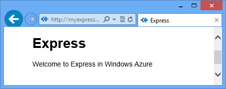

<properties  linkid="dev-nodejs-basic-web-app-with-express" urlDisplayName="Web App with Express" pageTitle="Web App with Express (Node.js) - Azure Tutorial" metaKeywords="Azure Node.js hello world tutorial, Azure Node.js hello world, Azure Node.js Getting Started tutorial, Azure Node.js tutorial, Azure Node.js Express tutorial" description="An tutorial that builds on the cloud service tutorial, and demonstrates how to use the Express module." metaCanonical="" services="cloud-services" documentationCenter="Node.js" title="Build a Node.js web application using Express on an Azure Cloud Service" authors="" solutions="" manager="" editor="" />

# Compilación de una aplicación web Node.js mediante Express en un servicio en la nube de Azure

Node.js incluye un conjunto mínimo de funcionalidad en el tiempo de ejecución del núcleo. Los desarrolladores suelen utilizar módulos de terceros para proporcionar funcionalidad adicional al desarrollar una aplicación Node.js. En este tutorial creará una nueva aplicación mediante el módulo [Express][1], que proporciona un marco MVC para la creación de aplicaciones web Node.js.

A continuación se muestra una captura de pantalla de la aplicación completada:

## Creación de un proyecto de servicio en la nube

Realice los siguientes pasos para crear un nuevo proyecto de servicio en la nube con nombre "expressapp":

1.  Desde el **menú Inicio** o la **pantalla Inicio**, busque **Azure  PowerShell**. Finalmente, haga clic en el botón secundario en **Azure PowerShell** y seleccione **Ejecutar como administrador**.
    
    
    
    [WACOM.INCLUDE [install-dev-tools](../includes/install-dev-tools.md)]

2.  Cambie los directorios por el directorio **c:\node** y, a continuación, escriba los siguientes comandos para crear una nueva solución llamada **expressapp** y un rol web llamado **WebRole1**:
    
         PS C:\node> New-AzureServiceProject expressapp
         PS C:\Node> Add-AzureNodeWebRole

## Instalación de Express

1.  Instale el módulo Express mediante el siguiente comando:
    
         PS C:\node\expressapp> npm install express -g
    
    La salida del comando npm debería parecerse a la siguiente.
    
    

2.  Cambie los directorios por el directorio **WebRole1** y utilice el comando express para generar una nueva aplicación:
    
         PS C:\node\expressapp\WebRole1> express
    
    Se le solicitará que sobrescriba la aplicación anterior. Escriba **y** o **yes** para continuar. Express generará el archivo app.js y una estructura de carpetas para compilar su aplicación.
    
    

3.  Elimine el archivo **server.js** y, a continuación, cambie el nombre del archivo **app.js** generado a **server.js**.
    
        PS C:\node\expressapp\WebRole1> del server.js
        PS C:\node\expressapp\WebRole1> ren app.js server.js

4.  Para instalar dependencias adicionales definidas en el archivo package.json, escriba el siguiente comando:
    
        PS C:\node\expressapp\WebRole1> npm install
    
    

5.  Utilice el siguiente comando para ejecutar la aplicación en el emulador de Azure:
    
        PS C:\node\expressapp\WebRole1> Start-AzureEmulator -launch
    
    

## Modificación de la vista

Modifique ahora la vista para visualizar el mensaje "Welcome to Express in Azure".

1.  Escriba el siguiente comando para abrir el archivo index.jade:
    
        PS C:\node\expressapp\WebRole1> notepad views/index.jade
    
    
    
    Jade es el motor de vistas predeterminado que utilizan las aplicaciones Express. Para obtener más información acerca del motor de vistas Jade, consulte [http://jade-lang.com][2].

2.  Modifique la última línea de texto para anexarla **en Azure**.
    
    

3.  Guarde el archivo y salga de la aplicación Bloc de notas.

4.  Actualice el explorador para ver los cambios.
    
    

Después de evaluar la aplicación, utilice el cmdlet **Stop-AzureEmulator** para detener el emulador.

## Publicación de la aplicación en Azure

En la ventana de Azure PowerShell, utilice el cmdlet **Publish-AzureServiceProject** para implementar la aplicación en un servicio en la nube.

    PS C:\node\expressapp\WebRole1> Publish-AzureServiceProject -ServiceName myexpressapp -Location "East US" -Launch

Una vez finalizada la operación de implementación, el explorador abrirá y mostrará la página web.

[1]: http://expressjs.com/
[2]: http://jade-lang.com