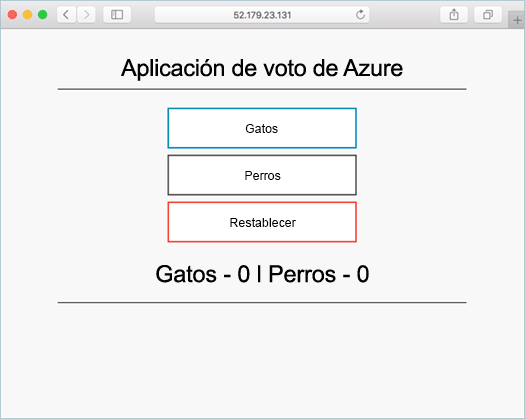

# <a name="deploy-docker-ce-cluster"></a>Implementación del clúster de Docker CE

En esta guía de inicio rápido, se implementa un clúster de Docker CE mediante la CLI de Azure. A continuación, se ejecuta e implementa en el clúster una aplicación de varios contenedores que consta de un front-end web y una instancia de Redis. Una vez finalizado el proceso, la aplicación es accesible a través de Internet.

Docker CE en Azure Container Service se encuentra en versión preliminar y **no se debe usar con cargas de trabajo de producción**.

Si no tiene una suscripción a Azure, cree una [cuenta gratuita](https://azure.microsoft.com/free/?WT.mc_id=A261C142F) antes de empezar.

Si decide instalar y usar la CLI localmente, para esta guía de inicio rápido es preciso que ejecute la CLI de Azure versión 2.0.4 o posterior. Ejecute `az --version` para encontrar la versión. Si necesita instalarla o actualizarla, consulte [Instalación de la CLI de Azure 2.0]( /cli/azure/install-azure-cli).

## <a name="create-a-resource-group"></a>Crear un grupo de recursos

Cree un grupo de recursos con el comando [az group create](/cli/azure/group#create). Un grupo de recursos de Azure es un grupo lógico en el que se implementan y se administran los recursos de Azure.

En el ejemplo siguiente, se crea un grupo de recursos denominado *myResourceGroup* en la ubicación *ukwest*.

```azurecli-interactive
az group create --name myResourceGroup --location ukwest
```

Salida:

```json
{
  "id": "/subscriptions/00000000-0000-0000-0000-000000000000/resourceGroups/myResourceGroup",
  "location": "westcentralus",
  "managedBy": null,
  "name": "myResourceGroup",
  "properties": {
    "provisioningState": "Succeeded"
  },
  "tags": null
}
```

## <a name="create-docker-swarm-cluster"></a>Creación de un clúster de Docker Swarm

Cree un clúster de Docker CE en Azure Container Service con el comando [az acs create](/cli/azure/acs#create). 

En el ejemplo siguiente, se crea un clúster denominado *mySwarmCluster* con un nodo maestro de Linux y tres nodos de agente de Linux.

```azurecli-interactive
az acs create --name mySwarmCluster --orchestrator-type dockerce --resource-group myResourceGroup --generate-ssh-keys
```

Después de varios minutos, el comando se completa y devuelve información en formato json sobre el clúster.

## <a name="connect-to-the-cluster"></a>Conexión al clúster

A lo largo de este tutorial de inicio rápido, necesitará el FQDN del maestro de Docker Swarm y del grupo de agentes de Docker. Ejecute el siguiente comando para devolver los FQDN del maestro y del agente.


```bash
az acs list --resource-group myResourceGroup --query '[*].{Master:masterProfile.fqdn,Agent:agentPoolProfiles[0].fqdn}' -o table
```

Salida:

```bash
Master                                                               Agent
-------------------------------------------------------------------  --------------------------------------------------------------------
myswarmcluster-myresourcegroup-d5b9d4mgmt.ukwest.cloudapp.azure.com  myswarmcluster-myresourcegroup-d5b9d4agent.ukwest.cloudapp.azure.com
```

Cree un túnel SSH al maestro de Swarm. Reemplace `MasterFQDN` por la dirección de FQDN del maestro de Swarm.

```bash
ssh -p 2200 -fNL localhost:2374:/var/run/docker.sock azureuser@MasterFQDN
```

Establezca la variable de entorno `DOCKER_HOST`. De esta forma podrá ejecutar comandos docker en Docker Swarm sin tener que especificar el nombre del host.

```bash
export DOCKER_HOST=localhost:2374
```

Ahora está listo para ejecutar servicios de Docker en Docker Swarm.


## <a name="run-the-application"></a>Ejecución de la aplicación

Cree un archivo llamado `azure-vote.yaml` y copie en él el siguiente contenido.


```yaml
version: '3'
services:
  azure-vote-back:
    image: redis
    ports:
        - "6379:6379"

  azure-vote-front:
    image: microsoft/azure-vote-front:redis-v1
    environment:
      REDIS: azure-vote-back
    ports:
        - "80:80"
```

Ejecute el comando [docker stack deploy](https://docs.docker.com/engine/reference/commandline/stack_deploy/) para crear el servicio Azure Vote.

```bash
docker stack deploy azure-vote --compose-file azure-vote.yaml
```

Salida:

```bash
Creating network azure-vote_default
Creating service azure-vote_azure-vote-back
Creating service azure-vote_azure-vote-front
```

Use el comando [docker stack ps](https://docs.docker.com/engine/reference/commandline/stack_ps/) para devolver el estado de implementación de la aplicación.

```bash
docker stack ps azure-vote
```

Cuando el valor de `CURRENT STATE` de cada servicio sea `Running`, la aplicación está lista.

```bash
ID                  NAME                            IMAGE                                 NODE                               DESIRED STATE       CURRENT STATE                ERROR               PORTS
tnklkv3ogu3i        azure-vote_azure-vote-front.1   microsoft/azure-vote-front:redis-v1   swarmm-agentpool0-66066781000004   Running             Running 5 seconds ago                            
lg99i4hy68r9        azure-vote_azure-vote-back.1    redis:latest                          swarmm-agentpool0-66066781000002   Running             Running about a minute ago
```

## <a name="test-the-application"></a>Prueba de la aplicación

Busque el FQDN del grupo de agentes de Swarm para probar la aplicación Azure Vote.



## <a name="delete-cluster"></a>Eliminación de clúster
Cuando un clúster ya no se necesite, puede usar el comando [az group delete](/cli/azure/group#delete) para quitar el grupo de recursos, el servicio de contenedor y todos los recursos relacionados.

```azurecli-interactive
az group delete --name myResourceGroup --yes --no-wait
```

## <a name="get-the-code"></a>Obtención del código

En este tutorial de inicio rápido, se han usado imágenes de un contenedor creado previamente para crear un servicio de Docker. El código de la aplicación relacionado, Dockerfile, y el archivo de Compose están disponibles en GitHub.

[https://github.com/Azure-Samples/azure-voting-app-redis](https://github.com/Azure-Samples/azure-voting-app-redis.git)

## <a name="next-steps"></a>Pasos siguientes

En este tutorial de inicio rápido, implementará un clúster de Docker Swarm y, en él, una aplicación de varios contenedores.

Para aprender sobre la integración de Docker Swarm con Visual Studio Team Services, consulte el artículo sobre CI/CD con Docker Swarm y VSTS.

> [!div class="nextstepaction"]
> [Integración y entrega continuas con Docker Swarm y VSTS](./container-service-docker-swarm-setup-ci-cd.md)
