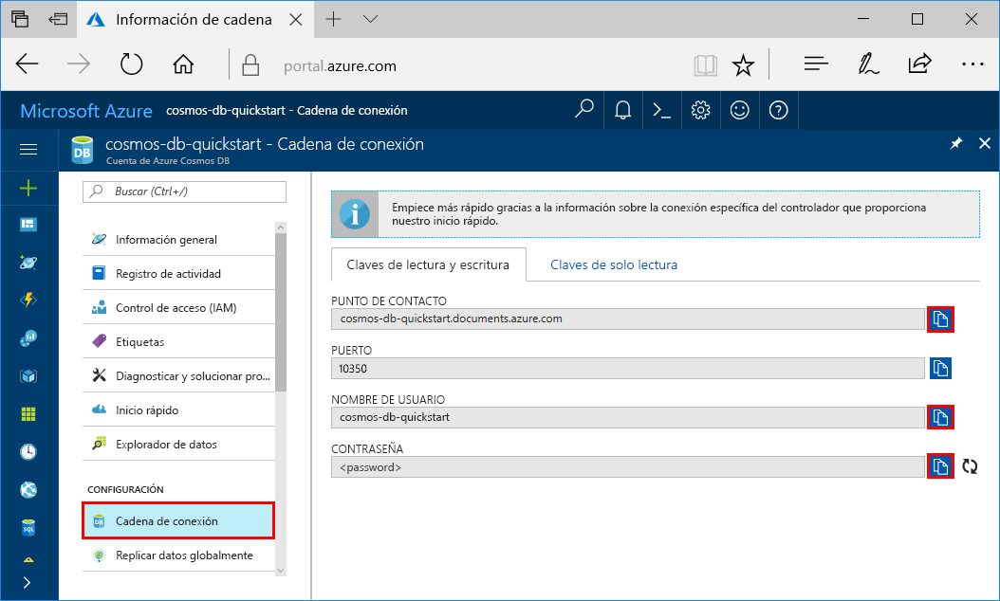
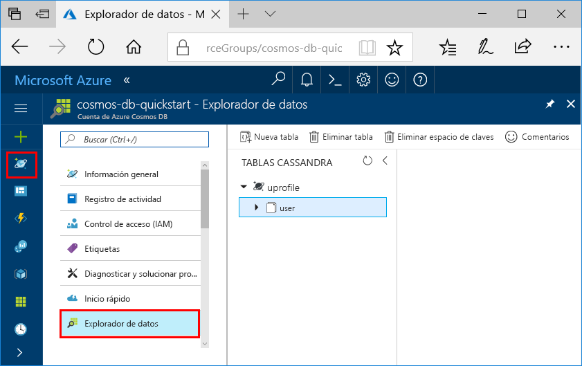

# <a name="quickstart-build-a-cassandra-app-with-net-and-azure-cosmos-db"></a>Guía de inicio rápido: compilación de una aplicación Cassandra con .NET y Azure Cosmos DB

Esta guía de inicio rápido muestra cómo se usan .NET y la [API de Cassandra](cassandra-introduction.md) de Azure Cosmos DB para compilar una aplicación de perfil mediante la clonación de un ejemplo de GitHub. Esta guía de inicio rápido también le guía a través de la creación de una cuenta de Azure Cosmos DB a través de Azure Portal en la web.   

Azure Cosmos DB es un servicio de base de datos con varios modelos y de distribución global de Microsoft. Puede crear rápidamente bases de datos de documentos, tablas, clave-valor y grafos, y realizar consultas en ellas. Todas las bases de datos se beneficiarán de las funcionalidades de distribución global y escalado horizontal en Azure Cosmos DB. 

## <a name="prerequisites"></a>Requisitos previos

Acceso a la versión preliminar del programa de la API de Cassandra de Azure Cosmos DB. Si no ha solicitado el acceso aún, [regístrese ahora](https://aka.ms/cosmosdb-cassandra-signup).

Si todavía no tiene instalado Visual Studio 2017, puede descargar y usar la versión **gratis** de [Visual Studio 2017 Community Edition](https://www.visualstudio.com/downloads/). Asegúrese de que habilita **Desarrollo de Azure** durante la instalación de Visual Studio.

[!INCLUDE [quickstarts-free-trial-note](../../includes/quickstarts-free-trial-note.md)] También puede [probar gratis Azure Cosmos DB](https://azure.microsoft.com/try/cosmosdb/) sin suscripción de Azure, sin cargos y sin compromiso.

Instale [Git](https://www.git-scm.com/) para clonar el ejemplo.

<a id="create-account"></a>
## <a name="create-a-database-account"></a>Creación de una cuenta de base de datos

[!INCLUDE [cosmos-db-create-dbaccount-cassandra](../../includes/cosmos-db-create-dbaccount-cassandra.md)]


## <a name="clone-the-sample-application"></a>Clonación de la aplicación de ejemplo

Ahora vamos a empezar a trabajar con el código. Vamos a clonar una aplicación de la API de Cassandra desde GitHub, establecer la cadena de conexión y ejecutarla. Verá lo fácil que es trabajar con datos mediante programación. 

1. Abra una ventana de terminal de Git, como git bash y utilice el comando `cd` para cambiar a una carpeta para instalar la aplicación de ejemplo. 

    ```bash
    cd "C:\git-samples"
    ```

2. Ejecute el comando siguiente para clonar el repositorio de ejemplo. Este comando crea una copia de la aplicación de ejemplo en el equipo.

    ```bash
    git clone https://github.com/Azure-Samples/azure-cosmos-db-cassandra-dotnet-getting-started.git
    ```

3. Luego abra el archivo de la solución CassandraQuickStartSample en Visual Studio. 

## <a name="review-the-code"></a>Revisar el código

Este paso es opcional. Si está interesado en aprender cómo se crean los recursos de base de datos en el código, puede revisar los siguientes fragmentos de código. Todos los fragmentos de código se toman del archivo `Program.cs` instalado en la carpeta C:\git-samples\azure-cosmos-db-cassandra-dotnet-getting-started\CassandraQuickStartSample. En caso contrario, puede ir directamente a [Actualización de la cadena de conexión](#update-your-connection-string).

* Inicialice la sesión mediante la conexión a un punto de conexión del clúster de Cassandra. La API de Cassandra API en Azure Cosmos DB solo admite TLSv1.2. 

  ```csharp
   var options = new Cassandra.SSLOptions(SslProtocols.Tls12, true, ValidateServerCertificate);
   options.SetHostNameResolver((ipAddress) => CassandraContactPoint);
   Cluster cluster = Cluster.Builder().WithCredentials(UserName, Password).WithPort(CassandraPort).AddContactPoint(CassandraContactPoint).WithSSL(options).Build();
   ISession session = cluster.Connect();
   ```

* Cree un nuevo espacio de claves.

    ```csharp
    session.Execute("CREATE KEYSPACE uprofile WITH REPLICATION = { 'class' : 'NetworkTopologyStrategy', 'datacenter1' : 1 };"); 
    ```

* Cree una nueva tabla.

   ```csharp
  session.Execute("CREATE TABLE IF NOT EXISTS uprofile.user (user_id int PRIMARY KEY, user_name text, user_bcity text)");
   ```

* Inserte las entidades de usuario mediante el uso del objeto IMapper con una sesión nueva que se conecta al espacio de claves del perfil.

    ```csharp
    mapper.Insert<User>(new User(1, "LyubovK", "Dubai"));
    ```
    
* Realice una consulta para obtener la información de todos los usuarios.

    ```csharp
   foreach (User user in mapper.Fetch<User>("Select * from user"))
   {
      Console.WriteLine(user);
   }
    ```
    
 * Realice una consulta para obtener la información de un único usuario.

    ```csharp
    mapper.FirstOrDefault<User>("Select * from user where user_id = ?", 3);
    ```

## <a name="update-your-connection-string"></a>Actualizar la cadena de conexión

Ahora vuelva a Azure Portal para obtener la información de la cadena de conexión y cópiela en la aplicación. La información de la cadena de conexión permite que la aplicación se comunique con la base de datos hospedada.

1. En [Azure Portal](http://portal.azure.com/), haga clic en **Cadena de conexión**. 

    Use el botón  Copiar en el lado derecho de la pantalla para copiar el valor de USERNAME.

    

2. En Visual Studio 2017, abra el archivo Program.cs. 

3. Pegue el valor de USERNAME del portal sobre `<FILLME>` en la línea 13.

    La línea 13 de Program.cs debe tener ahora un aspecto similar a 

    `private const string UserName = "cosmos-db-quickstart";`

3. Vuelva al portal y copie el valor de PASSWORD. Pegue el valor de PASSWORD del portal sobre `<FILLME>` en la línea 14.

    La línea 14 de Program.cs debe tener ahora un aspecto similar a 

    `private const string Password = "2Ggkr662ifxz2Mg...==";`

4. Vuelva al portal y copie el valor de CONTACT POINT. Pegue el valor de CONTACT POINT del portal en `<FILLME>` en la línea 15.

    La línea 15 de Program.cs debe tener ahora un aspecto similar a 

    `private const string CassandraContactPoint = "cosmos-db-quickstarts.documents.azure.com"; //  DnsName`

5. Guarde el archivo Program.cs.
    
## <a name="run-the-app"></a>Ejecución de la aplicación

1. En Visual Studio, haga clic en **Herramientas** > **Administrador de paquetes NuGet** > **Consola del administrador de paquetes**.

2. En el símbolo del sistema, use el comando siguiente para instalar el paquete NuGet del controlador .NET. 

    ```cmd
    Install-Package CassandraCSharpDriver
    ```
3. Presione Ctrl+F5 para ejecutar la aplicación. La aplicación aparece en la ventana de la consola. 

    

    Presione CTRL + C para detener la ejecución del programa y cerrar la ventana de consola. 
    
    Ahora puede volver al Explorador de datos de Azure Portal para ver, consultar, modificar estos nuevos datos y trabajar con ellos. 

    

## <a name="review-slas-in-the-azure-portal"></a>Revisar los SLA en Azure Portal

[!INCLUDE [cosmosdb-tutorial-review-slas](../../includes/cosmos-db-tutorial-review-slas.md)]

## <a name="clean-up-resources"></a>Limpieza de recursos

[!INCLUDE [cosmosdb-delete-resource-group](../../includes/cosmos-db-delete-resource-group.md)]

## <a name="next-steps"></a>Pasos siguientes

En esta guía de inicio rápido, ha aprendido a crear una cuenta de Azure Cosmos DB, crear una colección mediante el Explorador de datos y ejecutar una aplicación web. Ahora puede importar datos adicionales en la cuenta de Cosmos DB. 

> [!div class="nextstepaction"]
> [Importación de datos de Cassandra en Azure Cosmos DB](cassandra-import-data.md)
