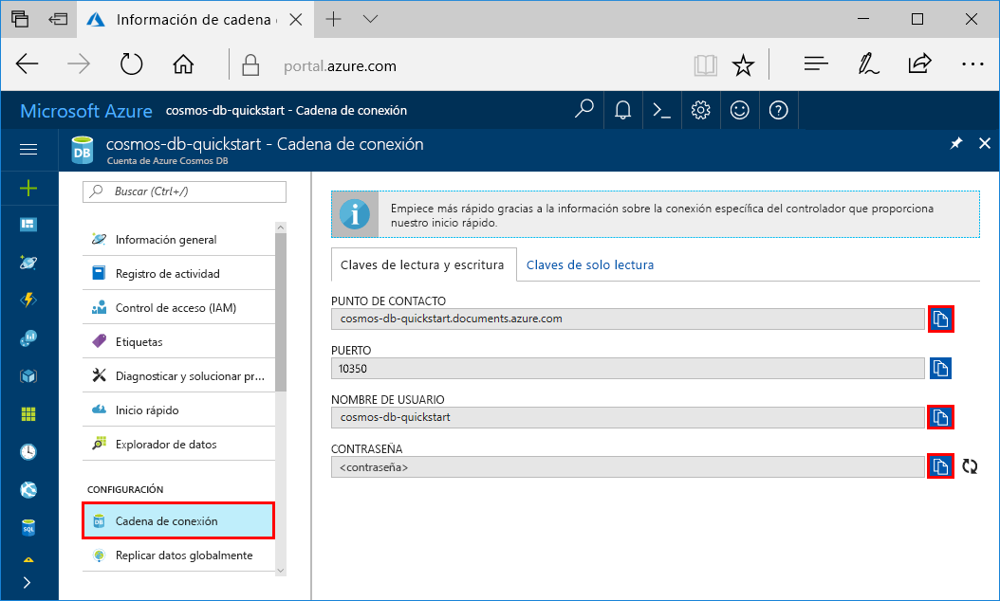
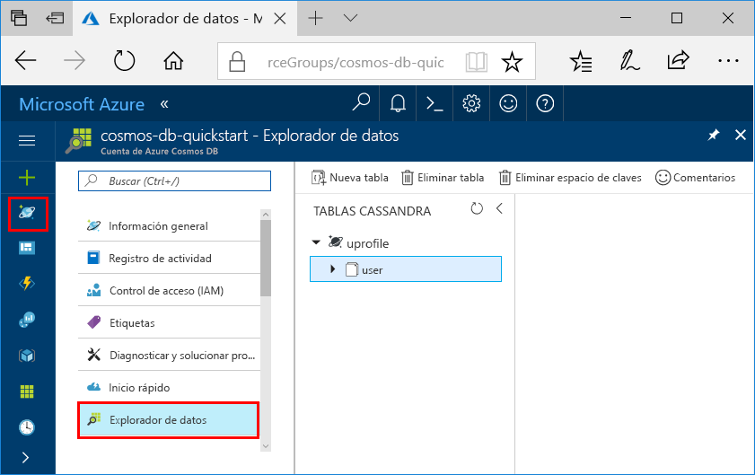

# <a name="quickstart-build-a-cassandra-app-with-python-and-azure-cosmos-db"></a>Guía de inicio rápido: compilación de una aplicación Cassandra con Python y Azure Cosmos DB

Esta guía de inicio rápido muestra cómo se usan Python y la [API de Cassandra](cassandra-introduction.md) de Azure Cosmos DB para compilar una aplicación de perfil mediante la clonación de un ejemplo de GitHub. Esta guía de inicio rápido también le guía a través de la creación de una cuenta de Azure Cosmos DB a través de Azure Portal en la web.

Azure Cosmos DB es un servicio de base de datos con varios modelos y de distribución global de Microsoft. Puede crear rápidamente bases de datos de documentos, tablas, clave-valor y grafos, y realizar consultas en ellas. Todas las bases de datos se beneficiarán de las funcionalidades de distribución global y escala horizontal en Azure Cosmos DB.   

## <a name="prerequisites"></a>requisitos previos

[!INCLUDE [quickstarts-free-trial-note](../../includes/quickstarts-free-trial-note.md)] También puede [probar gratis Azure Cosmos DB](https://azure.microsoft.com/try/cosmosdb/) sin suscripción de Azure, sin cargos y sin compromiso.

Acceda a la versión preliminar del programa de la API de Cassandra de Azure Cosmos DB. Si no ha solicitado el acceso aún, [regístrese ahora](cassandra-introduction.md#sign-up-now).

Además:
* Versión v2.7.14 de [Python](https://www.python.org/downloads/)
* [Git](http://git-scm.com/)
* [Controlador de Python para Apache Cassandra](https://github.com/datastax/python-driver)

## <a name="create-a-database-account"></a>Creación de una cuenta de base de datos

Para poder crear una base de datos de documentos, debe crear una cuenta de Cassandra con Azure Cosmos DB.

[!INCLUDE [cosmos-db-create-dbaccount-cassandra](../../includes/cosmos-db-create-dbaccount-cassandra.md)]

## <a name="clone-the-sample-application"></a>Clonación de la aplicación de ejemplo

Ahora vamos a clonar una aplicación de la API de Cassandra desde GitHub, establecer la cadena de conexión y ejecutarla. Verá lo fácil que es trabajar con datos mediante programación. 

1. Abra un símbolo del sistema, cree una carpeta nueva denominada ejemplos de GIT y, después, cierre el símbolo del sistema.

    ```bash
    md "C:\git-samples"
    ```

2. Abra una ventana de terminal de Git, como git bash y utilice el comando `cd` para cambiar a la nueva carpeta para instalar la aplicación de ejemplo.

    ```bash
    cd "C:\git-samples"
    ```

3. Ejecute el comando siguiente para clonar el repositorio de ejemplo. Este comando crea una copia de la aplicación de ejemplo en el equipo.

    ```bash
    git clone https://github.com/Azure-Samples/azure-cosmos-db-cassandra-python-getting-started.git
    ```

## <a name="review-the-code"></a>Revisión del código

Este paso es opcional. Si está interesado en aprender cómo se crean los recursos de base de datos en el código, puede revisar los siguientes fragmentos de código. Los fragmentos de código se han tomado del archivo pyquickstart.py. En caso contrario, puede ir directamente a [Actualización de la cadena de conexión](#update-your-connection-string). 

* El nombre de usuario y la contraseña se establecen en la página de la cadena de conexión de Azure Portal. Reemplace path\to\cert por la ruta de acceso a su certificado X509.

   ```python
    ssl_opts = {
            'ca_certs': 'path\to\cert',
            'ssl_version': ssl.PROTOCOL_TLSv1_2
            }
    auth_provider = PlainTextAuthProvider( username=cfg.config['username'], password=cfg.config['password'])
    cluster = Cluster([cfg.config['contactPoint']], port = cfg.config['port'], auth_provider=auth_provider, ssl_options=ssl_opts)
    session = cluster.connect()
   
   ```

* El objeto `cluster` se inicializa con la información de contactPoint. contactPoint se recupera de Azure Portal.

    ```python
   cluster = Cluster([cfg.config['contactPoint']], port = cfg.config['port'], auth_provider=auth_provider)
    ```

* El objeto `cluster` se conecta a la API de Cassandra de Azure Cosmos DB.

    ```python
    session = cluster.connect()
    ```

* Se crea un espacio de claves.

    ```python
   session.execute('CREATE KEYSPACE IF NOT EXISTS uprofile WITH replication = {\'class\': \'NetworkTopologyStrategy\', \'datacenter1\' : \'1\' }')
    ```

* Se crea una tabla.

   ```
   session.execute('CREATE TABLE IF NOT EXISTS uprofile.user (user_id int PRIMARY KEY, user_name text, user_bcity text)');
   ```

* Se insertan entidades de clave/valor.

    ```Python
    insert_data = session.prepare("INSERT INTO  uprofile.user  (user_id, user_name , user_bcity) VALUES (?,?,?)")
    batch = BatchStatement()
    batch.add(insert_data, (1, 'LyubovK', 'Dubai'))
    batch.add(insert_data, (2, 'JiriK', 'Toronto'))
    batch.add(insert_data, (3, 'IvanH', 'Mumbai'))
    batch.add(insert_data, (4, 'YuliaT', 'Seattle'))
    ....
    session.execute(batch)
    ```

* Realice una consulta para obtener todos los valores de clave.

    ```Python
    rows = session.execute('SELECT * FROM uprofile.user')
    ```  
    
* Realice una consulta para obtener un valor de clave.

    ```Python
    
    rows = session.execute('SELECT * FROM uprofile.user where user_id=1')
    ```  

## <a name="update-your-connection-string"></a>Actualización de la cadena de conexión

Ahora vuelva a Azure Portal para obtener la información de la cadena de conexión y cópiela en la aplicación. Esto permite que la aplicación se comunique con la base de datos hospedada.

1. En [Azure Portal](http://portal.azure.com/), haga clic en **Cadena de conexión**. 

    Use el botón  del lado derecho de la pantalla para copiar el valor superior, CONTACT POINT (Punto de contacto).

    

2. Abra el archivo `config.py` . 

3. Pegue el valor de CONTACT POINT (Punto de contacto) del portal en `<FILLME>` en la línea 10.

    La línea 10 ahora debe ser similar a 

    `'contactPoint': 'cosmos-db-quickstarts.documents.azure.com:10350'`

4. Copie el valor de NOMBRE DE USUARIO del portal y péguelo en `<FILLME>` en la línea 6.

    La línea 6 ahora debe ser similar a 

    `'username': 'cosmos-db-quickstart',`
    
5. Copie el valor de CONTRASEÑA del portal y péguelo en `<FILLME>` en la línea 8.

    La línea 8 ahora debe ser similar a

    `'password' = '2Ggkr662ifxz2Mg==`';`

6. Guarde el archivo config.py.
    
## <a name="use-the-x509-certificate"></a>Uso del certificado X509

1. Si necesita agregar Baltimore CyberTrust Root, tiene el número de serie 02:00:00:b9 y la huella digital SHA1 d4🇩🇪20:d0:5e:66:fc:53:fe:1a:50:88:2c:78:db:28:52:ca:e4:74. Se puede descargar desde https://cacert.omniroot.com/bc2025.crt y se guarda en un archivo local con la extensión .cer

2. Abra pyquickstart.py y cambie "path\to\cert" para que apunte al certificado nuevo.

3. Guarde pyquickstart.py.

## <a name="run-the-app"></a>Ejecución de la aplicación

1. Utilice el comando cd en el terminal git para cambiar a la carpeta azure-cosmos-db-cassandra-python-getting-started. 

2. Ejecute los comandos siguientes para instalar los módulos necesarios:

    ```python
    python -m pip install cassandra-driver
    python -m pip install prettytable
    python -m pip install requests
    python -m pip install pyopenssl
    ```

2. Ejecute el comando siguiente para iniciar la aplicación de nodo:

    ```
    python pyquickstart.py
    ```

3. Compruebe los resultados previstos desde la línea de comandos.

    Presione CTRL + C para detener la ejecución del programa y cerrar la ventana de consola. 

    
    
    Ahora puede volver al Explorador de datos de Azure Portal para ver, consultar, modificar estos nuevos datos y trabajar con ellos. 

    

## <a name="review-slas-in-the-azure-portal"></a>Revisión de los SLA en Azure Portal

[!INCLUDE [cosmosdb-tutorial-review-slas](../../includes/cosmos-db-tutorial-review-slas.md)]

## <a name="clean-up-resources"></a>Limpieza de recursos

[!INCLUDE [cosmosdb-delete-resource-group](../../includes/cosmos-db-delete-resource-group.md)]

## <a name="next-steps"></a>Pasos siguientes

En esta guía de inicio rápido, ha aprendido a crear una cuenta de Azure Cosmos DB, crear una colección mediante el Explorador de datos y ejecutar una aplicación. Ahora puede importar datos adicionales en la cuenta de Cosmos DB. 

> [!div class="nextstepaction"]
> [Importación de datos de Cassandra en Azure Cosmos DB](cassandra-import-data.md)

